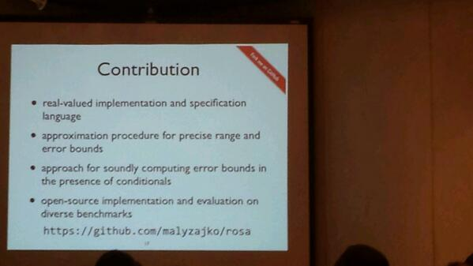

New blog post: http://blog.ezyang.com/2014/01/so-you-want-to-add-a-new-concurrency-primitive-to-ghc/

(Originally on Twitter: [Wed Jan 01 15:37:36 +0000 2014](https://twitter.com/ezyang/status/418405655842942976))
----
@mattmight "manpages, of course"

(Originally on Twitter: [Wed Jan 01 15:51:22 +0000 2014](https://twitter.com/ezyang/status/418409121940271104))
----
@jamie_allen For what it is, it's pretty good ;)

(Originally on Twitter: [Wed Jan 01 23:15:46 +0000 2014](https://twitter.com/ezyang/status/418520956798533632))
----
@ebroder That's not too surprising... it's a form of encapsulation (existential quantification)

(Originally on Twitter: [Fri Jan 03 12:18:00 +0000 2014](https://twitter.com/ezyang/status/419080200853651456))
----
I feel bad when I say "Haskell" and mean "GHC Haskell"

(Originally on Twitter: [Mon Jan 06 04:19:39 +0000 2014](https://twitter.com/ezyang/status/420046982703742976))
----
@mgomezch Not really :-(

(Originally on Twitter: [Mon Jan 06 04:22:36 +0000 2014](https://twitter.com/ezyang/status/420047723925344256))
----
@mgomezch But it still hurts.

(Originally on Twitter: [Mon Jan 06 04:22:42 +0000 2014](https://twitter.com/ezyang/status/420047750156521472))
----
@deech Yeah, I understand they exist, and may even be under active development, but...

(Originally on Twitter: [Mon Jan 06 04:29:11 +0000 2014](https://twitter.com/ezyang/status/420049380599943168))
----
@lindsey Oooh, I think I may just start doing that!

(Originally on Twitter: [Mon Jan 06 05:42:07 +0000 2014](https://twitter.com/ezyang/status/420067734974513152))
----
Well, I guess I'm going to POPL. It's so close by it'd be a waste not to...

(Originally on Twitter: [Tue Jan 07 04:26:46 +0000 2014](https://twitter.com/ezyang/status/420411160501166080))
----
The next Bitcoin will be low latency

(Originally on Twitter: [Tue Jan 07 05:35:37 +0000 2014](https://twitter.com/ezyang/status/420428488035041280))
----
Lambda-JS is pretty neat way of doing JS semantics http://cs.brown.edu/research/plt/dl/jssem/v1/

(Originally on Twitter: [Tue Jan 07 22:57:46 +0000 2014](https://twitter.com/ezyang/status/420690753426587648))
----
The fundamental data structure of distributed systems is the log http://engineering.linkedin.com/distributed-systems/log-what-every-software-engineer-should-know-about-real-time-datas-unifying

(Originally on Twitter: [Fri Jan 10 07:40:36 +0000 2014](https://twitter.com/ezyang/status/421547104763273216))
----
The fundamental data structure of the NSA is the log

(Originally on Twitter: [Fri Jan 10 07:40:44 +0000 2014](https://twitter.com/ezyang/status/421547140435804160))
----
Oh, this is cool http://www.cs.bham.ac.uk/~mhe/papers/negative-axioms.pdf

(Originally on Twitter: [Fri Jan 10 07:56:19 +0000 2014](https://twitter.com/ezyang/status/421551058507546624))
----
@psygnisfive The intuitive sense I get is that negated axioms are only useful for proving negative results (impossibility)

(Originally on Twitter: [Fri Jan 10 08:28:12 +0000 2014](https://twitter.com/ezyang/status/421559082173341696))
----
@psygnisfive So, of course you will have canonicity, because the axiom will never be used in a construction

(Originally on Twitter: [Fri Jan 10 08:28:33 +0000 2014](https://twitter.com/ezyang/status/421559171524608000))
----
It seems that chktex is a superior LaTeX lint than lacheck

(Originally on Twitter: [Fri Jan 10 23:31:59 +0000 2014](https://twitter.com/ezyang/status/421786526780227584))
----
Hey Twittersphere, how suitable is PLT Redex for making semantics which don't use evaluation contexts?

(Originally on Twitter: [Fri Jan 10 23:50:57 +0000 2014](https://twitter.com/ezyang/status/421791301429112833))
----
Semantics are source code for the brain

(Originally on Twitter: [Fri Jan 10 23:59:53 +0000 2014](https://twitter.com/ezyang/status/421793550981160960))
----
@psygnisfive Dammit, I did it again &gt;.&gt;

(Originally on Twitter: [Sat Jan 11 00:08:47 +0000 2014](https://twitter.com/ezyang/status/421795791377039360))
----
"Write a paper, and give a talk, about any idea, no matter how weedy and insignificant it may seem to you." -- SPJ

(Originally on Twitter: [Sat Jan 11 00:14:58 +0000 2014](https://twitter.com/ezyang/status/421797346100662272))
----
My family switched to T-Mobile over winter break for their international roaming. We visited China and Vietnam, and it worked *really well*

(Originally on Twitter: [Sat Jan 11 01:22:51 +0000 2014](https://twitter.com/ezyang/status/421814427546312704))
----
@InfinitNutshell Hm, do you have some characterization of the types of semantics that do poorly?

(Originally on Twitter: [Sat Jan 11 03:48:09 +0000 2014](https://twitter.com/ezyang/status/421850993723056129))
----
@InfinitNutshell In a nutshell, we want to take the LambdaS5 redex semantics and add an event loop to it

(Originally on Twitter: [Sat Jan 11 03:52:58 +0000 2014](https://twitter.com/ezyang/status/421852208913989633))
----
@InfinitNutshell So, modeling a list of tasks, and how they are scheduled, run, etc

(Originally on Twitter: [Sat Jan 11 03:53:37 +0000 2014](https://twitter.com/ezyang/status/421852371598450688))
----
@InfinitNutshell OK, I guess that's good to hear

(Originally on Twitter: [Sat Jan 11 04:14:46 +0000 2014](https://twitter.com/ezyang/status/421857694027632640))
----
@InfinitNutshell I have to admit, the manual is kind of confusing

(Originally on Twitter: [Sat Jan 11 04:15:01 +0000 2014](https://twitter.com/ezyang/status/421857754622754816))
----
@lindsey Neat, thanks :)

(Originally on Twitter: [Sat Jan 11 04:18:08 +0000 2014](https://twitter.com/ezyang/status/421858538647220224))
----
@lindsey Overall, how was your experience using PLT Redex?

(Originally on Twitter: [Sat Jan 11 04:18:22 +0000 2014](https://twitter.com/ezyang/status/421858600974557184))
----
"Our belief in clarity and elegance...is not the very best way to make videogames"  http://blog.brendanvance.com/2014/01/05/the-cult-of-the-peacock/ (via     @chrisamaphone)

(Originally on Twitter: [Sat Jan 11 21:28:18 +0000 2014](https://twitter.com/ezyang/status/422117792322572288))
----
RT @scottlynch78: Those chocolates courtesy of mad chocolate genius @asegall. She does dice, Daleks, companion cubes, frogs... !
http://t.c…

(Originally on Twitter: [Sun Jan 12 03:18:21 +0000 2014](https://twitter.com/ezyang/status/422205882542223360))
----
My PPA now has ott, along with other delectables https://launchpad.net/~ezyang/+archive/ppa

(Originally on Twitter: [Mon Jan 13 02:53:40 +0000 2014](https://twitter.com/ezyang/status/422562058702692352))
----
@ebroder What's wrong with symlink? Works pretty good for me (my .bashrc tells me if there are uncommitted dotfile changes)

(Originally on Twitter: [Mon Jan 13 21:27:54 +0000 2014](https://twitter.com/ezyang/status/422842467034361856))
----
@ebroder No, I guess I should. I cribbed the require_clean_work_tree from git-sh-setup

(Originally on Twitter: [Mon Jan 13 22:17:27 +0000 2014](https://twitter.com/ezyang/status/422854933902548992))
----
@ebroder I haven't versioned any config files that have programs that do that.

(Originally on Twitter: [Mon Jan 13 22:17:39 +0000 2014](https://twitter.com/ezyang/status/422854986721415168))
----
You know you're an emacs newbie when you use Dr. Racket's emacs shortcuts and don't notice a difference

(Originally on Twitter: [Tue Jan 14 00:32:42 +0000 2014](https://twitter.com/ezyang/status/422888972814409729))
----
@pigworker Pass!

(Originally on Twitter: [Tue Jan 14 00:56:46 +0000 2014](https://twitter.com/ezyang/status/422895028206596096))
----
Wow! Super speedy redex bugfix by @rfindler http://bugs.racket-lang.org/query/?cmd=view%20audit-trail&database=default&pr=14290

(Originally on Twitter: [Tue Jan 14 23:05:56 +0000 2014](https://twitter.com/ezyang/status/423229522545098752))
----
PLDI reviews are out!!

(Originally on Twitter: [Thu Jan 16 22:00:09 +0000 2014](https://twitter.com/ezyang/status/423937744616689664))
----
Something I missed: what are the models used for? (silly question, I know) #popl2014

(Originally on Twitter: [Wed Jan 22 17:18:01 +0000 2014](https://twitter.com/ezyang/status/426041070313431040))
----
RT @krismicinski: @ezyang first question you should ask for any logic. Specially anything based on modal logic, also what does the accessib…

(Originally on Twitter: [Wed Jan 22 17:26:35 +0000 2014](https://twitter.com/ezyang/status/426043225866895360))
----
RT @bentnib: The Cousots' paper in the #POPL proceedings is a tour de force of 'fuck page limits'.

(Originally on Twitter: [Wed Jan 22 17:31:03 +0000 2014](https://twitter.com/ezyang/status/426044349806166017))
----
@bentnib Yeah, I think a lot of Agda programmers would disagree with the extrinsic statement.

(Originally on Twitter: [Wed Jan 22 19:54:09 +0000 2014](https://twitter.com/ezyang/status/426080362498777090))
----
@jeanqasaur Thanks! Will check out.

(Originally on Twitter: [Thu Jan 23 01:00:33 +0000 2014](https://twitter.com/ezyang/status/426157470394761217))
----
RT @simrob: Fork me on GitHub at #popl2014! #yessss #thefuture #thefutureisgitohwell 

(Originally on Twitter: [Thu Jan 23 02:06:20 +0000 2014](https://twitter.com/ezyang/status/426174025274908673))
----
@krismicinski I guess what I was also wondering, is why do these models look a lot like logical relations?

(Originally on Twitter: [Thu Jan 23 07:31:35 +0000 2014](https://twitter.com/ezyang/status/426255877755002880))
----
RT @lambda_calculus: Masterfully designed and executed talk by @lindsey at #POPL.

(Originally on Twitter: [Thu Jan 23 19:16:13 +0000 2014](https://twitter.com/ezyang/status/426433206976405504))
----
Geo-replication is so hot, it's moved out of SOSP/OSDI and into POPL

(Originally on Twitter: [Thu Jan 23 19:18:35 +0000 2014](https://twitter.com/ezyang/status/426433800718278656))
----
Fly me to the moon!

(Originally on Twitter: [Fri Jan 24 22:09:57 +0000 2014](https://twitter.com/ezyang/status/426839314623115264))
----
"type and effect" : "cap and trade"

(Originally on Twitter: [Sat Jan 25 00:25:37 +0000 2014](https://twitter.com/ezyang/status/426873455951511553))
----
@lindsey Hmm, that makes sense! I tried to restate that in the post, I also linked to your tweets.

(Originally on Twitter: [Sat Jan 25 09:56:38 +0000 2014](https://twitter.com/ezyang/status/427017156409442304))
----
@InfinitNutshell You should Storify it

(Originally on Twitter: [Sun Jan 26 02:20:16 +0000 2014](https://twitter.com/ezyang/status/427264695343788032))
----
@InfinitNutshell You just drag and drop a bunch of tweets onto a canvas,  and then publish it.  http://storify.com/ezyang/why-are-lvar-threshold-sets-pairwise-incompatible

(Originally on Twitter: [Sun Jan 26 02:23:36 +0000 2014](https://twitter.com/ezyang/status/427265533797339136))
----
@InfinitNutshell It's pretty quick, but you will need to create an account

(Originally on Twitter: [Sun Jan 26 02:24:04 +0000 2014](https://twitter.com/ezyang/status/427265651452166144))
----
Wow, a lot of Tweeting about OBT! Sad I missed it.

(Originally on Twitter: [Sun Jan 26 03:33:15 +0000 2014](https://twitter.com/ezyang/status/427283061261492224))
----
@pigworker From the program, I thought it might be interesting, but I forgot that the discussion is the most interesting part!

(Originally on Twitter: [Sun Jan 26 03:39:23 +0000 2014](https://twitter.com/ezyang/status/427284606317264896))
----
I guess maybe I'll try to read all the Tweets and write a blog post about it instead...

(Originally on Twitter: [Sun Jan 26 03:39:58 +0000 2014](https://twitter.com/ezyang/status/427284753193402368))
----
If there are POPLers still in the SD area having a drink, we'd love to join you; msg me #popl2014

(Originally on Twitter: [Sun Jan 26 04:11:49 +0000 2014](https://twitter.com/ezyang/status/427292770181447681))
----
@sigfpe http://blog.ezyang.com/2010/05/name-conflicts-on-hackage/

(Originally on Twitter: [Mon Jan 27 02:51:30 +0000 2014](https://twitter.com/ezyang/status/427634942575915008))
----
"Didn't you write a thesis on how to solve it?" "Well, this is another way, and it's simpler." #popl2014

(Originally on Twitter: [Tue Jan 28 23:22:14 +0000 2014](https://twitter.com/ezyang/status/428307057918636032))
----
Quote from a class programming assignment: "DataflowObjects are mutable; when in doubt, copy them."

(Originally on Twitter: [Wed Jan 29 04:43:08 +0000 2014](https://twitter.com/ezyang/status/428387811780460544))
----
GHC 7.8 branch has been cut, RC is on its way! #ghc

(Originally on Twitter: [Wed Jan 29 10:29:15 +0000 2014](https://twitter.com/ezyang/status/428474915029671936))
----
"However, this relation is usually not a function. The way out of this impasse is to generalize homomorphisms from functions to relations."

(Originally on Twitter: [Thu Jan 30 00:01:17 +0000 2014](https://twitter.com/ezyang/status/428679271444279297))
----
So... the abstraction theorem gives you things like parametricity. What I don't understand is what the abstraction theorem is, itself...

(Originally on Twitter: [Thu Jan 30 06:32:06 +0000 2014](https://twitter.com/ezyang/status/428777622139449344))
----
@carloangiuli Oh, I know what the theorem statement is. But it's really hard for me to figure out what the statement is actually "saying".

(Originally on Twitter: [Thu Jan 30 21:56:29 +0000 2014](https://twitter.com/ezyang/status/429010253317812224))
----
@carloangiuli Analogy: I know the low-level (theorem statement) and high-level (parametricity, etc), but I don't have mid-level intuition

(Originally on Twitter: [Thu Jan 30 21:57:48 +0000 2014](https://twitter.com/ezyang/status/429010584600715264))
----
@existentialtype Does PFPL talk about it under a different name? An "abstraction theorem" isn't mentioned anywhere explicitly.

(Originally on Twitter: [Thu Jan 30 22:01:53 +0000 2014](https://twitter.com/ezyang/status/429011612448485377))
----
@diagram_chaser Mmm, I think a few papers do this. Maybe I just need to read the derivation several times...

(Originally on Twitter: [Thu Jan 30 22:10:36 +0000 2014](https://twitter.com/ezyang/status/429013806996402176))
----
@aaron_turon @carloangiuli Super cool! I will read these.

(Originally on Twitter: [Thu Jan 30 23:13:57 +0000 2014](https://twitter.com/ezyang/status/429029746756689920))
----
What is it called when someone murders a PL semantics, and gets away with it? "Scott free!"

(Originally on Twitter: [Thu Jan 30 23:38:32 +0000 2014](https://twitter.com/ezyang/status/429035934093287424))
----
RT @bentnib: @ezyang ...open terms, if they are provided with 'indistinguishable' input, the results ought to be indistinguishable up to ob…

(Originally on Twitter: [Fri Jan 31 07:09:53 +0000 2014](https://twitter.com/ezyang/status/429149521415655424))
----
Someone should explain to me (not on Twitter) what the difference between extensible effects and algebraic effects.

(Originally on Twitter: [Fri Jan 31 07:10:12 +0000 2014](https://twitter.com/ezyang/status/429149600386007040))
----
@carloangiuli @InfinitNutshell The mess of different names can be a bit confusing...

(Originally on Twitter: [Fri Jan 31 21:39:08 +0000 2014](https://twitter.com/ezyang/status/429368273088421888))
----
RT @carloangiuli: @ezyang The relational interpretation of types is that lambda/Lambda respect obs.eq./bisim. in their args, so reflexivity…

(Originally on Twitter: [Fri Jan 31 21:40:08 +0000 2014](https://twitter.com/ezyang/status/429368527670091776))
----
RT @carloangiuli: @ezyang ...says that all terms enjoy these properties. You can then cash in these properties in various ways (the corolla…

(Originally on Twitter: [Fri Jan 31 21:40:29 +0000 2014](https://twitter.com/ezyang/status/429368614668361728))
----
@carloangiuli @InfinitNutshell I think Reynolds calls it the "Abstraction Theorem"

(Originally on Twitter: [Fri Jan 31 21:46:42 +0000 2014](https://twitter.com/ezyang/status/429370179680628736))
----
An insightful CSOverflow answer by Uday: http://cstheory.stackexchange.com/a/10431

(Originally on Twitter: [Fri Jan 31 21:58:30 +0000 2014](https://twitter.com/ezyang/status/429373149986050049))
----
