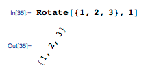

God dammit, I got so trolled on the Haskell mailing list #HappyAprilFools

(Originally on Twitter: [Tue Apr 01 05:58:52 +0000 2014](https://twitter.com/ezyang/status/450874920936148992))
----
RT @tomaspetricek: I'll be taking on Friday about "What can programming language research learn from the philosophy of science?" http://t.c…

(Originally on Twitter: [Tue Apr 01 08:46:52 +0000 2014](https://twitter.com/ezyang/status/450917199197515776))
----
@tomaspetricek I see the influence of Cambridge's HPS program :)

(Originally on Twitter: [Tue Apr 01 08:47:19 +0000 2014](https://twitter.com/ezyang/status/450917310698905600))
----
What is a good paper for getting up-to-speed with gradual typing research? cc @samth (nice bib, by the way http://samth.github.io/gradual-typing-bib/)

(Originally on Twitter: [Wed Apr 02 21:49:13 +0000 2014](https://twitter.com/ezyang/status/451476470859563008))
----
@samth Figures :)

(Originally on Twitter: [Wed Apr 02 21:59:16 +0000 2014](https://twitter.com/ezyang/status/451479001560002560))
----
@samth I'm working on something like a survey paper, so I'm primarily interested in identifying influential ideas and open problems

(Originally on Twitter: [Wed Apr 02 22:02:23 +0000 2014](https://twitter.com/ezyang/status/451479782967234560))
----
@samth "When in programming languages have we violated enshrined concepts (type safety, abstraction) in a principled fashion"

(Originally on Twitter: [Wed Apr 02 22:26:40 +0000 2014](https://twitter.com/ezyang/status/451485897075486720))
----
@samth I also have a hidden agenda but at this point it's not articulated clearly enough for me to tweet

(Originally on Twitter: [Wed Apr 02 22:28:17 +0000 2014](https://twitter.com/ezyang/status/451486304573071360))
----
@samth Yeah, violate is not the right word. "Taking things that were trampling enshrined concepts, and put them on better footing"

(Originally on Twitter: [Wed Apr 02 22:32:44 +0000 2014](https://twitter.com/ezyang/status/451487421549789184))
----
@samth Since one origin of gradual typing was studying FFI interoperability, which was something people were doing in an ad hoc way

(Originally on Twitter: [Wed Apr 02 22:33:18 +0000 2014](https://twitter.com/ezyang/status/451487565078867968))
----
@djspiewak Coercions may not be unique.

(Originally on Twitter: [Wed Apr 02 22:44:48 +0000 2014](https://twitter.com/ezyang/status/451490460528562176))
----
@djspiewak Alternately, under row typing, the subtyping does hold

(Originally on Twitter: [Wed Apr 02 22:48:22 +0000 2014](https://twitter.com/ezyang/status/451491355521740800))
----
@sigfpe Do you use Wordpress?

(Originally on Twitter: [Thu Apr 03 01:07:48 +0000 2014](https://twitter.com/ezyang/status/451526445299683329))
----
@sigfpe Oh, Blogger, isn't it. Can't help much there :/

(Originally on Twitter: [Thu Apr 03 01:08:14 +0000 2014](https://twitter.com/ezyang/status/451526556637474817))
----
I like small datasets, they are easier to visualize http://ezyang.tumblr.com/post/81629851928/heres-a-better-picture-of-the-emacs-dependency

(Originally on Twitter: [Fri Apr 04 00:12:18 +0000 2014](https://twitter.com/ezyang/status/451874866606903296))
----
@bitemyapp No, I haven't posted it anywhere, let me do that

(Originally on Twitter: [Fri Apr 04 00:20:03 +0000 2014](https://twitter.com/ezyang/status/451876817872629760))
----
@bitemyapp https://github.com/ezyang/breaking-barriers/tree/master/emacs

(Originally on Twitter: [Fri Apr 04 00:43:36 +0000 2014](https://twitter.com/ezyang/status/451882742352183296))
----
@bitemyapp http://web.mit.edu/~ezyang/Public/emacs/ but I probably won't keep this link up to date

(Originally on Twitter: [Fri Apr 04 00:44:26 +0000 2014](https://twitter.com/ezyang/status/451882954831437824))
----
@bitemyapp It is stupidly easy to make force-directed graphs in D3, as long as you don't have too many points...

(Originally on Twitter: [Fri Apr 04 00:48:38 +0000 2014](https://twitter.com/ezyang/status/451884011989000192))
----
I think I would quite like a version of Ashley &lt;http://jxnblk.com/ashley/&gt; for Wordpress

(Originally on Twitter: [Fri Apr 04 01:35:20 +0000 2014](https://twitter.com/ezyang/status/451895762096766976))
----
Never quite understood why radar charts are so popular

(Originally on Twitter: [Fri Apr 04 06:38:47 +0000 2014](https://twitter.com/ezyang/status/451972130817990656))
----
Impulse buy: bought some dance shoes

(Originally on Twitter: [Fri Apr 04 06:44:56 +0000 2014](https://twitter.com/ezyang/status/451973676171554816))
----
@jxnblk I wanted to say thank you for the lovely Ashley tumblr theme. Has anyone ported this theme to Wordpress?

(Originally on Twitter: [Fri Apr 04 07:44:59 +0000 2014](https://twitter.com/ezyang/status/451988788365910016))
----
Wow, Google web fonts really do make webpages look better http://ezyang.com/

(Originally on Twitter: [Fri Apr 04 11:01:24 +0000 2014](https://twitter.com/ezyang/status/452038217592999936))
----
@Looongi Wah, thanks a lot for the correction

(Originally on Twitter: [Fri Apr 04 18:51:09 +0000 2014](https://twitter.com/ezyang/status/452156437285056512))
----
@sbrandauer Aw, but I like that shade of blue!

(Originally on Twitter: [Fri Apr 04 18:51:22 +0000 2014](https://twitter.com/ezyang/status/452156489298628608))
----
Some times, I feel like I just want to make a big art project, disguised as a PhD thesis

(Originally on Twitter: [Sat Apr 05 11:02:17 +0000 2014](https://twitter.com/ezyang/status/452400830835326976))
----
"NB. strictness fixes a space leak. DO NOT REMOVE." Ah, the pleasure and pain of #haskell programming

(Originally on Twitter: [Mon Apr 07 10:25:07 +0000 2014](https://twitter.com/ezyang/status/453116250177404928))
----
RT @nelhage: Do we know why the distros didn't get advance notice for CVE-2014-0160? A whole lot of people would have appreciated that righ…

(Originally on Twitter: [Mon Apr 07 21:48:27 +0000 2014](https://twitter.com/ezyang/status/453288217178308610))
----
@djspiewak @dibblego @zooko @nuttycom Well, it's pretty well understood how to formulate memory safety

(Originally on Twitter: [Tue Apr 08 22:42:41 +0000 2014](https://twitter.com/ezyang/status/453664254550237184))
----
we don't understand anything!

(Originally on Twitter: [Wed Apr 09 01:01:27 +0000 2014](https://twitter.com/ezyang/status/453699174119538688))
----
@carloangiuli @chrisamaphone So... like Dominion?

(Originally on Twitter: [Wed Apr 09 02:00:54 +0000 2014](https://twitter.com/ezyang/status/453714137462607872))
----
@SCombinator For many people (myself included), it's their first exposure to higher-order functional programming

(Originally on Twitter: [Wed Apr 09 23:24:53 +0000 2014](https://twitter.com/ezyang/status/454037262372982784))
----
RT @sigfpe: Couldn't remember Mathematica function. to rotate vector. Guessed 'Rotate'. Here's result. 

(Originally on Twitter: [Thu Apr 10 00:12:33 +0000 2014](https://twitter.com/ezyang/status/454049256345567232))
----
RT @d3visualization: Heap profiles http://heap.ezyang.com/ by @ezyang

(Originally on Twitter: [Sun Apr 13 05:45:34 +0000 2014](https://twitter.com/ezyang/status/455220229422194688))
----
I really like this cross-step waltz mixer choreography: http://socialdance.stanford.edu/syllabi/crosstep.htm

(Originally on Twitter: [Mon Apr 14 02:35:46 +0000 2014](https://twitter.com/ezyang/status/455534851396210689))
----
@diagram_chaser It can have it if you CPS everything!

(Originally on Twitter: [Mon Apr 14 07:37:41 +0000 2014](https://twitter.com/ezyang/status/455610832614068224))
----
@diagram_chaser Aaand, I guess you have to implement a trampoline too, otherwise you'll run out of stack

(Originally on Twitter: [Mon Apr 14 07:38:19 +0000 2014](https://twitter.com/ezyang/status/455610990592548864))
----
It's always nice to see people working on a problem you had thought about a few years ago

(Originally on Twitter: [Mon Apr 14 08:40:19 +0000 2014](https://twitter.com/ezyang/status/455626594577842176))
----
Oh oh oh, this is so exciting!!! #reviews

(Originally on Twitter: [Mon Apr 14 09:05:13 +0000 2014](https://twitter.com/ezyang/status/455632859832016896))
----
About historians and blogs, but some of it seems familiar... http://theaporetic.com/?p=5068

(Originally on Twitter: [Mon Apr 14 10:01:47 +0000 2014](https://twitter.com/ezyang/status/455647093475254272))
----
cap and trade memory management

(Originally on Twitter: [Tue Apr 15 05:21:36 +0000 2014](https://twitter.com/ezyang/status/455938972653735936))
----
zomg this figure #icfp

(Originally on Twitter: [Wed Apr 16 07:52:04 +0000 2014](https://twitter.com/ezyang/status/456339227924377601))
----
What does the notation a#Γ mean?

(Originally on Twitter: [Wed Apr 16 08:57:30 +0000 2014](https://twitter.com/ezyang/status/456355690786062336))
----
Hm, seems to be, "a is not in the codomain of Γ"

(Originally on Twitter: [Wed Apr 16 09:01:05 +0000 2014](https://twitter.com/ezyang/status/456356594733690880))
----
@snoyberg evalStateT *evaluates* to a value, while execStateT merely *executes* a computation for its side effect (the new state)

(Originally on Twitter: [Wed Apr 16 18:58:55 +0000 2014](https://twitter.com/ezyang/status/456507044787277824))
----
@psygnisfive @samth Thanks for the discussion. @samth is right. Example use "Parametricity, Type Equality and Higher-order Polymorphism"

(Originally on Twitter: [Wed Apr 16 19:02:16 +0000 2014](https://twitter.com/ezyang/status/456507888249217024))
----
@bentnib The difference between upfront and deferred cost

(Originally on Twitter: [Wed Apr 16 21:19:07 +0000 2014](https://twitter.com/ezyang/status/456542325187960834))
----
"If a program segfaults on exit, did it really segfault?"

(Originally on Twitter: [Wed Apr 16 23:15:30 +0000 2014](https://twitter.com/ezyang/status/456571617565356033))
----
Has anyone used MathJax to render type system rules? How well does it work?

(Originally on Twitter: [Fri Apr 18 02:11:26 +0000 2014](https://twitter.com/ezyang/status/456978278256226304))
----
Oh, silly me, the answer is yes: http://lambda-the-ultimate.org/node/4928

(Originally on Twitter: [Fri Apr 18 02:12:34 +0000 2014](https://twitter.com/ezyang/status/456978564005756928))
----
I like how the TLS RFC has dependent types in it

(Originally on Twitter: [Fri Apr 18 10:00:03 +0000 2014](https://twitter.com/ezyang/status/457096211091431424))
----
Presented without comment: http://web.mit.edu/~ezyang/Public/squirrel.html

(Originally on Twitter: [Sat Apr 19 02:20:53 +0000 2014](https://twitter.com/ezyang/status/457343042526412800))
----
The symbols danced on the page http://web.mit.edu/~ezyang/Public/squirrel.html

(Originally on Twitter: [Sat Apr 19 02:28:23 +0000 2014](https://twitter.com/ezyang/status/457344931871588352))
----
.@Symbo1ics I'm working on an animation engine for MathJax. Enter two equations, animate from one to the other.

(Originally on Twitter: [Sat Apr 19 02:39:46 +0000 2014](https://twitter.com/ezyang/status/457347796987691008))
----
@jonsterling @puffnfresh That kind of statement is pretty misleading (due to differences in computability)

(Originally on Twitter: [Sat Apr 19 04:41:35 +0000 2014](https://twitter.com/ezyang/status/457378452195520512))
----
Hey Twittersphere: supposing I have two SVG trees in my browser, are there any JS libraries for diffing them?

(Originally on Twitter: [Sat Apr 19 05:24:40 +0000 2014](https://twitter.com/ezyang/status/457389295431876609))
----
@johnbender Yeah, react.js came up a bit. But it's totally unclear if the diffing part can be extracted and used standalone

(Originally on Twitter: [Sat Apr 19 06:07:28 +0000 2014](https://twitter.com/ezyang/status/457400064177356800))
----
@johnbender I have a list of projects that I've looked at, and don't really seem to work

(Originally on Twitter: [Sat Apr 19 06:34:36 +0000 2014](https://twitter.com/ezyang/status/457406896241385472))
----
@johnbender I'm hoping I missed something obvious

(Originally on Twitter: [Sat Apr 19 06:34:49 +0000 2014](https://twitter.com/ezyang/status/457406947357388800))
----
RT @geofft: @bcrypt also if you use PFS with 1-hour certs/keys, it's okay if the key is crackable in 2 hours. 512-bit RSA for everyone! cc …

(Originally on Twitter: [Sun Apr 20 02:52:33 +0000 2014](https://twitter.com/ezyang/status/457713399884185600))
----
No no no, this is not a monoid :( https://bitbucket.org/atlassian/kadai/src/1e5834bed6682534c2c9d6a095a924bc6ed9f545/hash/src/main/scala/kadai/hash/SHA1.scala?at=master

(Originally on Twitter: [Sun Apr 20 08:01:47 +0000 2014](https://twitter.com/ezyang/status/457791221017366528))
----
@pdxleif If you make the monoid pointed isn't this a real monoid?

(Originally on Twitter: [Sun Apr 20 20:30:06 +0000 2014](https://twitter.com/ezyang/status/457979540758069248))
----
If, in an inference rule, you saw 'somexpr =&gt; somexpr2' without =&gt; defined anywhere, what would you interpret this to mean?

(Originally on Twitter: [Sun Apr 20 20:30:54 +0000 2014](https://twitter.com/ezyang/status/457979742491537408))
----
@pdxleif Right, but in this case, the exception throwing obeys the monoid laws, I think

(Originally on Twitter: [Sun Apr 20 20:33:30 +0000 2014](https://twitter.com/ezyang/status/457980400309399552))
----
@sbrandauer OK, implication, that's what I would have thought

(Originally on Twitter: [Sun Apr 20 20:44:32 +0000 2014](https://twitter.com/ezyang/status/457983176213024768))
----
@alleynoir It's the premise, but it's clearly not evaluation

(Originally on Twitter: [Sun Apr 20 20:44:53 +0000 2014](https://twitter.com/ezyang/status/457983262926061568))
----
@alleynoir Also, conventional notation for big step would be a double down arrow

(Originally on Twitter: [Sun Apr 20 20:45:05 +0000 2014](https://twitter.com/ezyang/status/457983314042032128))
----
@zauspar @alleynoir ah, ok. I stand corrected :)

(Originally on Twitter: [Sun Apr 20 20:48:58 +0000 2014](https://twitter.com/ezyang/status/457984290916421632))
----
@psygnisfive Sorry, I can't distribute the draft at this time :-/

(Originally on Twitter: [Sun Apr 20 21:06:00 +0000 2014](https://twitter.com/ezyang/status/457988576580730881))
----
@jedws @pdxleif Oh, I was referring to treeify.

(Originally on Twitter: [Sun Apr 20 21:12:25 +0000 2014](https://twitter.com/ezyang/status/457990192226242560))
----
@jedws @pdxleif It's not, but my remark is that if he extended the type with another element bottom then it would probably be a monoid

(Originally on Twitter: [Sun Apr 20 21:17:23 +0000 2014](https://twitter.com/ezyang/status/457991441630121985))
----
@jedws scalaz-stream should probably work with things that are not monoids

(Originally on Twitter: [Sun Apr 20 21:31:33 +0000 2014](https://twitter.com/ezyang/status/457995006096453632))
----
@jedws I don't understand the ecosystem well enough to offer a more specific suggestion though

(Originally on Twitter: [Sun Apr 20 21:31:56 +0000 2014](https://twitter.com/ezyang/status/457995103135866880))
----
sha1() is an attractive nuisance (please HMAC instead)

(Originally on Twitter: [Mon Apr 21 00:09:51 +0000 2014](https://twitter.com/ezyang/status/458034846028537856))
----
@diagram_chaser Nice!

(Originally on Twitter: [Wed Apr 23 22:50:05 +0000 2014](https://twitter.com/ezyang/status/459101936156147712))
----
@zauspar You're just whipping through the classics aren't you

(Originally on Twitter: [Thu Apr 24 02:28:53 +0000 2014](https://twitter.com/ezyang/status/459156996428943360))
----
Preparing The Monad Reader Issue 23 for release

(Originally on Twitter: [Thu Apr 24 03:21:47 +0000 2014](https://twitter.com/ezyang/status/459170308063510528))
----
RT @lambdamix: "Supercompilation: Ideas and Methods" by @dnkrustev and me in the fresh issue of "The monad reader" http://themonadreader.wordpress.com/ c…

(Originally on Twitter: [Thu Apr 24 07:30:43 +0000 2014](https://twitter.com/ezyang/status/459232957694492672))
----
"A bad writer is akin to a person who gets on a stage with his back to the audience and mumbles for a while before leaving"

(Originally on Twitter: [Thu Apr 24 08:14:12 +0000 2014](https://twitter.com/ezyang/status/459243899870269440))
----
RT @acfoltzer: Cryptol version 2 is now available and open source! http://www.cryptol.net/ https://github.com/GaloisInc/cryptol

(Originally on Twitter: [Fri Apr 25 02:05:35 +0000 2014](https://twitter.com/ezyang/status/459513523278979073))
----
RT @lindsey: Standard advice for people who might want to do a Ph.D. in PL but don't know where to start: go to OPLSS this summer! http://t…

(Originally on Twitter: [Fri Apr 25 02:59:01 +0000 2014](https://twitter.com/ezyang/status/459526969143861248))
----
Folk wisdom says "don't roll your own crypto." But people often confuse writing the RFC with implementing it. One is easier...

(Originally on Twitter: [Fri Apr 25 06:48:41 +0000 2014](https://twitter.com/ezyang/status/459584767567355904))
----
Had some fun reading this essay about how the Putnam is written http://www.math.uiuc.edu/~reznick/putnam.pdf

(Originally on Twitter: [Mon Apr 28 08:52:02 +0000 2014](https://twitter.com/ezyang/status/460702971626790912))
----
@MosRobinson Looks congruence-closure'ish, with quantifiers.

(Originally on Twitter: [Mon Apr 28 10:59:09 +0000 2014](https://twitter.com/ezyang/status/460734962493173760))
----
@djspiewak Maybe your problem is more confusing than you thought it was!

(Originally on Twitter: [Mon Apr 28 21:44:32 +0000 2014](https://twitter.com/ezyang/status/460897377592041472))
----
Unexpected assigned reading for Social Dance 1 http://socialdance.stanford.edu/syllabi/missing_it.htm

(Originally on Twitter: [Tue Apr 29 02:02:12 +0000 2014](https://twitter.com/ezyang/status/460962219665391616))
----
GHC tickets: they're OVER NINE THOUSAND (OK, I guess I am a bit late to the party)

(Originally on Twitter: [Tue Apr 29 11:36:57 +0000 2014](https://twitter.com/ezyang/status/461106861358727168))
----
RT @shanley: Many people are aware that their software persistently violates their boundaries, but feel powerless to stop it. http://t.co/u…

(Originally on Twitter: [Tue Apr 29 23:53:52 +0000 2014](https://twitter.com/ezyang/status/461292315014098944))
----
RT @lindsey: Rejections. http://composition.al/blog/2014/04/29/rejections/ (for @palvaro)

(Originally on Twitter: [Wed Apr 30 01:30:53 +0000 2014](https://twitter.com/ezyang/status/461316727318773760))
----
