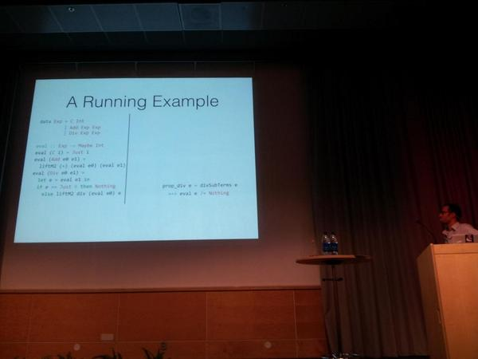

@skilpat You wanna respond? :)

(Originally on Twitter: [Mon Sep 01 12:00:58 +0000 2014](https://twitter.com/ezyang/status/506411389481943040))
----
@pigworker @tomaspetricek All we need now is the bourgeois and the proletariat.

(Originally on Twitter: [Mon Sep 01 15:10:10 +0000 2014](https://twitter.com/ezyang/status/506459004194013184))
----
holy shit, implicit parameters are coeffects. @tomaspetricek++ #icfp14

(Originally on Twitter: [Mon Sep 01 15:12:30 +0000 2014](https://twitter.com/ezyang/status/506459590301847552))
----
As usual, live-tumblring at http://ezyang.tumblr.com/ #icfp

(Originally on Twitter: [Mon Sep 01 15:23:58 +0000 2014](https://twitter.com/ezyang/status/506462477568442368))
----
Oohs and aahs as Haskell is declared the programming language of choice of discriminating hackers.

(Originally on Twitter: [Tue Sep 02 14:59:50 +0000 2014](https://twitter.com/ezyang/status/506818789162614784))
----
@afcowie Yeah! Do you know his name?

(Originally on Twitter: [Tue Sep 02 21:43:26 +0000 2014](https://twitter.com/ezyang/status/506920360726777856))
----
@d_christiansen dinner?!

(Originally on Twitter: [Wed Sep 03 17:20:33 +0000 2014](https://twitter.com/ezyang/status/507216589515542529))
----
"You shouldn't be a stand up comedian when you give a talk." "Nobody told me that!" @edwinbrady @pigworker

(Originally on Twitter: [Wed Sep 03 20:09:22 +0000 2014](https://twitter.com/ezyang/status/507259074602213378))
----
"What I really want is classless society, a revolution!" -- Andreas Rossberg @ ML

(Originally on Twitter: [Thu Sep 04 07:09:34 +0000 2014](https://twitter.com/ezyang/status/507425218609307648))
----
Hutton's razor strikes again! #icfp14 

(Originally on Twitter: [Thu Sep 04 12:31:26 +0000 2014](https://twitter.com/ezyang/status/507506221445042177))
----
Swing your razor wide, Hutton; raise it to the sky. Often flows the blood of those who normalize!

(Originally on Twitter: [Thu Sep 04 12:33:57 +0000 2014](https://twitter.com/ezyang/status/507506854852067328))
----
Open type families are not modular http://blog.ezyang.com/2014/09/open-type-families-are-not-modular/

(Originally on Twitter: [Thu Sep 04 22:31:12 +0000 2014](https://twitter.com/ezyang/status/507657157060608000))
----
@comerijn Yes, closed type families appear to be fine.

(Originally on Twitter: [Fri Sep 05 08:32:57 +0000 2014](https://twitter.com/ezyang/status/507808592779440128))
----
"Get rid of binding libraries!" @TacticalGrace at Haskell Symposium

(Originally on Twitter: [Fri Sep 05 12:22:33 +0000 2014](https://twitter.com/ezyang/status/507866372173348864))
----
@ClarissaAdjoint @acfoltzer @d_christiansen Please do, it would be great to see you there!

(Originally on Twitter: [Fri Sep 05 18:30:09 +0000 2014](https://twitter.com/ezyang/status/507958881654702080))
----
Strange, these diagrams look better when they are not constructed with a straightedge.

(Originally on Twitter: [Fri Sep 05 19:39:04 +0000 2014](https://twitter.com/ezyang/status/507976226024456192))
----
@skilpat I found out MirageOS uses module signatures to determine package compatibility. It's quite cool!

(Originally on Twitter: [Fri Sep 05 20:12:54 +0000 2014](https://twitter.com/ezyang/status/507984739027124224))
----
HiW room overflowing for SPJ's GHC status report!

(Originally on Twitter: [Sat Sep 06 09:42:38 +0000 2014](https://twitter.com/ezyang/status/508188515050721280))
----
"This is a complete type checker for Haskell; I've just omitted the unimportant parts." @Augustsson on his type checker slide

(Originally on Twitter: [Sat Sep 06 15:38:17 +0000 2014](https://twitter.com/ezyang/status/508278019187048448))
----
You've heard of LiquidHaskell, but what about LiquidCoq? 

(Originally on Twitter: [Tue Sep 09 16:24:00 +0000 2014](https://twitter.com/ezyang/status/509376684693684225))
----
TIL Go 1.3 will sometimes randomly try to garbage collect FFI memory. It's been broken for over a year!
https://code.google.com/p/go/issues/detail?id=7978

(Originally on Twitter: [Sun Sep 14 02:07:58 +0000 2014](https://twitter.com/ezyang/status/510973199409217536))
----
http://heap.ezyang.com now has instructions for how to upload from command line

(Originally on Twitter: [Fri Sep 19 09:42:02 +0000 2014](https://twitter.com/ezyang/status/512899406308192256))
----
Who are your teaching heroes: the people you look up to on the matter of educating students?

(Originally on Twitter: [Sat Sep 20 01:53:53 +0000 2014](https://twitter.com/ezyang/status/513143981178253312))
----
RT @aalevy: @ezyang @martystepp (taught the intro series at UW now at Stanford) &amp; Stuart Reges (teaches the intro series at UW)

(Originally on Twitter: [Sat Sep 20 17:33:42 +0000 2014](https://twitter.com/ezyang/status/513380492448509953))
----
RT @samth: @ezyang Matthias Felleisen, Laszlo Babai, great CS professors; my eighth grade math teacher Mr Aliberti; my parents, both great …

(Originally on Twitter: [Sat Sep 20 17:33:45 +0000 2014](https://twitter.com/ezyang/status/513380505765441536))
----
RT @mrb_bk: @ezyang my parents who were both NYC school teachers for their whole careers, Golan Levin who taught me how to think about tech…

(Originally on Twitter: [Sat Sep 20 17:33:48 +0000 2014](https://twitter.com/ezyang/status/513380516737732608))
----
In what sense does systems research have a statistics problem? http://ezyang.tumblr.com/post/98657237842/in-what-sense-does-systems-research-have-a-statistics (agree? disagree? I'm curious what you think)

(Originally on Twitter: [Sun Sep 28 19:08:18 +0000 2014](https://twitter.com/ezyang/status/516303401378783232))
----
@cfbolz Holy cow, I can't believe there's a benchmark which recommends taking the "best of" for official reporting

(Originally on Twitter: [Sun Sep 28 19:42:43 +0000 2014](https://twitter.com/ezyang/status/516312063644164096))
----
RT @pkhuong: @ezyang Argh, references on the phone is hard. Curtsinger and Berger: http://people.cs.umass.edu/~emery/pubs/stabilizer-asplos13.pdf

(Originally on Twitter: [Sun Sep 28 19:54:27 +0000 2014](https://twitter.com/ezyang/status/516315019454062592))
----
@cfbolz On the other hand, the statistical sophistication needed to prevent these problems is not very large...

(Originally on Twitter: [Sun Sep 28 19:56:45 +0000 2014](https://twitter.com/ezyang/status/516315595633991680))
----
RT @cfbolz: @ezyang or reviewers who reject the papers that are completely lacking in that area...

(Originally on Twitter: [Sun Sep 28 20:00:03 +0000 2014](https://twitter.com/ezyang/status/516316428299812864))
----
@pkhuong That's a pretty interesting paper. On the other hand, some of the things they do (e.g. stack padding) seem a bit goofy.

(Originally on Twitter: [Sun Sep 28 20:06:11 +0000 2014](https://twitter.com/ezyang/status/516317969584910336))
----
@cppcabrera Nope, not written by me!

(Originally on Twitter: [Sun Sep 28 22:13:12 +0000 2014](https://twitter.com/ezyang/status/516349933763317760))
----
RT @jlouis666: @cfbolz @ezyang I've been very upset about the lack of statistics courses at CS departments for a while now. UX, Systems Res…

(Originally on Twitter: [Sun Sep 28 22:13:25 +0000 2014](https://twitter.com/ezyang/status/516349989530779648))
----
