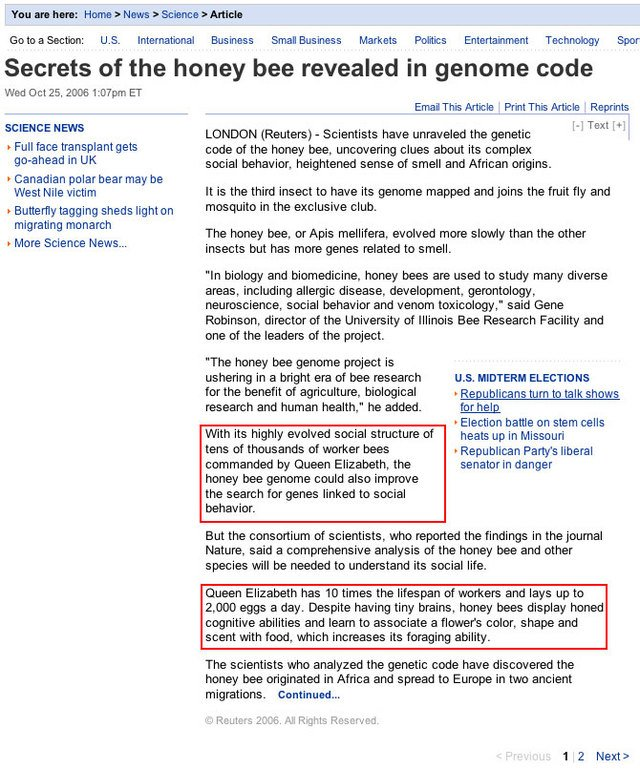

Moral of the story: although the syntax may seem trivial to you, it is like absolutely the most important thing to have explained first

(Originally on Twitter: [Tue Mar 01 07:08:22 +0000 2016](https://twitter.com/ezyang/status/704563915619901441))
----
RT @sclv: @ezyang see independence-friendly logic?

(Originally on Twitter: [Tue Mar 01 08:29:01 +0000 2016](https://twitter.com/ezyang/status/704584210770563072))
----
Good writing is fractal.

(Originally on Twitter: [Thu Mar 03 07:47:18 +0000 2016](https://twitter.com/ezyang/status/705298489643659265))
----
OK, now to spend two hours trying to figure what to name this damn thing.

(Originally on Twitter: [Sat Mar 05 05:16:43 +0000 2016](https://twitter.com/ezyang/status/705985369230061569))
----
PL theory inference rules are sometimes too declarative, can mask the underlying algorithmic content. Don't know of a more standard notation

(Originally on Twitter: [Mon Mar 07 21:50:52 +0000 2016](https://twitter.com/ezyang/status/706960331231207424))
----
@avibryant @sritchie Too difficult to discover dependencies and block. Many compilers will need more control, e.g. buildsome

(Originally on Twitter: [Mon Mar 07 21:53:07 +0000 2016](https://twitter.com/ezyang/status/706960899374854144))
----
Oppan lambda style. https://www.youtube.com/watch?v=Ci48kqp11F8

(Originally on Twitter: [Tue Mar 08 05:03:16 +0000 2016](https://twitter.com/ezyang/status/707069147251736576))
----
@kr__popo Hi hiiiii

(Originally on Twitter: [Tue Mar 08 05:09:48 +0000 2016](https://twitter.com/ezyang/status/707070793180520448))
----
.@DrDeeGlaze Josh's use of arrows to indicate information flow is a good idea!

(Originally on Twitter: [Tue Mar 08 05:12:06 +0000 2016](https://twitter.com/ezyang/status/707071371793162240))
----
@matthieubulte Many things one wants to do with inference rules, reasoning is just one; implementation and understanding are others

(Originally on Twitter: [Tue Mar 08 05:14:21 +0000 2016](https://twitter.com/ezyang/status/707071938095484929))
----
@rob_rix I definitely hate it when papers drop code on me for their algorithm.

(Originally on Twitter: [Tue Mar 08 05:42:46 +0000 2016](https://twitter.com/ezyang/status/707079089325101057))
----
What's in a name? That which we call a rose, by any other name would not be type equivalent. #nominaltyping

(Originally on Twitter: [Wed Mar 09 00:08:20 +0000 2016](https://twitter.com/ezyang/status/707357313548492801))
----
@pigworker I was hoping to be a bit incongruous :^)

(Originally on Twitter: [Wed Mar 09 00:16:58 +0000 2016](https://twitter.com/ezyang/status/707359485312905216))
----
Clearly, this abstract is begging to be written in iambic pentameter.

(Originally on Twitter: [Wed Mar 09 00:25:34 +0000 2016](https://twitter.com/ezyang/status/707361652430143488))
----
Seen on researchr's list of roles: "Chair", "Co-chair", "General Chair", ... "Comfy Chair"

(Originally on Twitter: [Wed Mar 16 23:43:24 +0000 2016](https://twitter.com/ezyang/status/710250141253378048))
----
"In the programming-language world, one rule of survival is simple: dance or die. [Reactive-banana] makes dancing easy." Simon Banana Jones

(Originally on Twitter: [Fri Mar 18 04:58:13 +0000 2016](https://twitter.com/ezyang/status/710691755868327936))
----
For those fretting about micropackages: could it be that you want microcomponents (modularity) in a single package (distribution)?

(Originally on Twitter: [Sun Mar 27 20:01:09 +0000 2016](https://twitter.com/ezyang/status/714180476836012032))
----
@sclv I don't think so, components also need handling for namespacing

(Originally on Twitter: [Sun Mar 27 23:20:54 +0000 2016](https://twitter.com/ezyang/status/714230745472978946))
----
@ongardie I've never understood the difference between tree shaking and dead code elimination.

(Originally on Twitter: [Sun Mar 27 23:22:59 +0000 2016](https://twitter.com/ezyang/status/714231270973149184))
----
RT @sclv: @ezyang are microcomponents like, just functions?

(Originally on Twitter: [Sun Mar 27 23:23:32 +0000 2016](https://twitter.com/ezyang/status/714231409301303296))
----
RT @DanGraur: Reuters &amp; its policy of replacing the terms "queen" &amp; "the queen" with "Queen Elizabeth." 

(Originally on Twitter: [Sun Mar 27 23:39:30 +0000 2016](https://twitter.com/ezyang/status/714235428971225089))
----
@ongardie That article is nonsense, dead code elimination applied at the module level would have the same effect.

(Originally on Twitter: [Sun Mar 27 23:43:40 +0000 2016](https://twitter.com/ezyang/status/714236478386089984))
----
RT @prakharsriv9: Bloomberg open-sources Bucklescript - a Javascript backend for the OCaml compiler! http://bloomberg.github.io/bucklescript/

(Originally on Twitter: [Mon Mar 28 00:48:09 +0000 2016](https://twitter.com/ezyang/status/714252703560388608))
----
