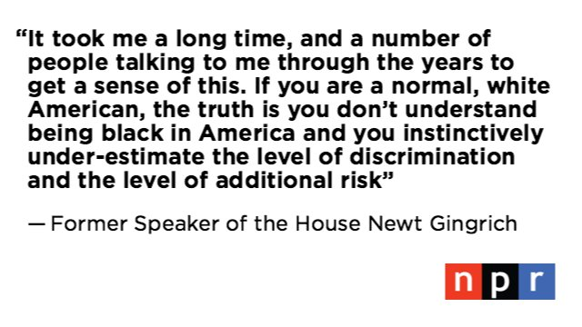
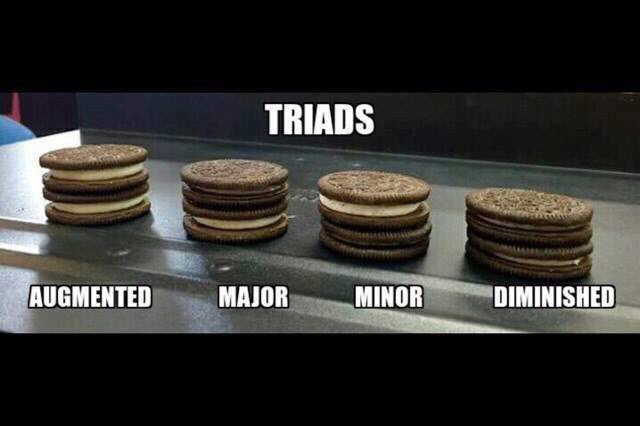

I wonder if the killer app for effect systems is tracking the interruptibility of code.

(Originally on Twitter: [Sat Jul 02 01:21:16 +0000 2016](https://twitter.com/ezyang/status/749050272656359425))
----
@yminsky Well, if you were to read the papers, you might get the impression that they are just a more compositional ver of monadic effects

(Originally on Twitter: [Sat Jul 02 01:32:48 +0000 2016](https://twitter.com/ezyang/status/749053174686814208))
----
@PLT_cheater @sjfloat @yminsky Monadic handling of throws?/interruptible? unwieldy; effect systems have polymorphism which improves things

(Originally on Twitter: [Sat Jul 02 03:27:31 +0000 2016](https://twitter.com/ezyang/status/749082046434316288))
----
Interruptibility: it's complicated. https://mail.haskell.org/pipermail/haskell-cafe/2016-July/124312.html

(Originally on Twitter: [Sat Jul 02 04:50:50 +0000 2016](https://twitter.com/ezyang/status/749103010547019777))
----
@PLT_cheater @sjfloat @yminsky Are you asking about free monad interpreter? I don't know much. But how to restrict operations?

(Originally on Twitter: [Sat Jul 02 04:52:20 +0000 2016](https://twitter.com/ezyang/status/749103390714503168))
----
@jonsterling @PerryWagle The real world is concurrent, need to tackle it head on.

(Originally on Twitter: [Sat Jul 02 05:02:21 +0000 2016](https://twitter.com/ezyang/status/749105911851917312))
----
@jonsterling @PerryWagle Why of course, when you have a bisimulation ;)

(Originally on Twitter: [Sat Jul 02 05:08:32 +0000 2016](https://twitter.com/ezyang/status/749107467607379968))
----
When an issue becomes too complicated for a blog post—write a paper instead.

(Originally on Twitter: [Sat Jul 02 17:22:07 +0000 2016](https://twitter.com/ezyang/status/749292080715927552))
----
@0x2ba22e11 Yep, but then Haskell code would need to be compiled differently, to handle relative addresses

(Originally on Twitter: [Sun Jul 03 22:16:14 +0000 2016](https://twitter.com/ezyang/status/749728485665542144))
----
@0x2ba22e11 Yes; this is essentially the approach that http://uscilab.github.io/cereal/ takes

(Originally on Twitter: [Mon Jul 04 02:06:41 +0000 2016](https://twitter.com/ezyang/status/749786477123502081))
----
Are there any well known typeclasses of the form class HasKey a k | a -&gt; k where getKey :: a -&gt; k? (Or perhaps using an associated type?)

(Originally on Twitter: [Mon Jul 04 21:00:22 +0000 2016](https://twitter.com/ezyang/status/750071777624264705))
----
@GabrielG439 True; but the semantic meaning is not quite right (think: get the identifier for a node in a graph)

(Originally on Twitter: [Mon Jul 04 21:27:00 +0000 2016](https://twitter.com/ezyang/status/750078481074155524))
----
Wow, is the time complexity of lazy functional dfs still unknown (but empirically appears to be O(V+E))?

(Originally on Twitter: [Tue Jul 05 14:26:19 +0000 2016](https://twitter.com/ezyang/status/750335000239828992))
----
I wonder if there is a way to avoid UndecidableInstances when writing instances for classes with associated types.

(Originally on Twitter: [Tue Jul 05 16:07:31 +0000 2016](https://twitter.com/ezyang/status/750360470050205696))
----
@kmett Thanks for the note (you know GHC and Cabal use K&amp;L extensively!) Consider ripping out replacements and publishing them?

(Originally on Twitter: [Tue Jul 05 16:11:00 +0000 2016](https://twitter.com/ezyang/status/750361345061687296))
----
@kmett Relatedly: for a type class associating graph nodes with keys and neighbor-keys, would you prefer fun deps or associated types?

(Originally on Twitter: [Tue Jul 05 16:24:31 +0000 2016](https://twitter.com/ezyang/status/750364746252165120))
----
RT @kmett: @ezyang I used associated types last time this came up for me. Mainly because not every use of the graph needs to know both v an…

(Originally on Twitter: [Tue Jul 05 16:35:56 +0000 2016](https://twitter.com/ezyang/status/750367620977815552))
----
RT @kmett: @ezyang Also, it is easy to go from TFs to fundeps, by using silly shim classes / constraint aliases but you can't go back the o…

(Originally on Twitter: [Tue Jul 05 16:36:05 +0000 2016](https://twitter.com/ezyang/status/750367658856644608))
----
This year's ICFP location: totally beautiful, and totally impractical to get to. #TryingToBookHotels

(Originally on Twitter: [Tue Jul 05 19:05:18 +0000 2016](https://twitter.com/ezyang/status/750405210883915776))
----
The greatest trepidation I have when writing QuickCheck tests is writing the Arbitrary instance

(Originally on Twitter: [Tue Jul 05 19:15:35 +0000 2016](https://twitter.com/ezyang/status/750407796777164800))
----
@Iceland_jack Interesting test data rarely is recursive ;) (In my case, need to generate random graphs!)

(Originally on Twitter: [Tue Jul 05 19:24:57 +0000 2016](https://twitter.com/ezyang/status/750410154307424256))
----
RT @shapr: @ezyang that's the part that matters, right?

(Originally on Twitter: [Tue Jul 05 21:23:02 +0000 2016](https://twitter.com/ezyang/status/750439872205381632))
----
@Blaisorblade @skilpat @smdiehl @GabrielG439 Unfortunately, Backpack doesn't solve this problem. But some ideas from my thesis might help.

(Originally on Twitter: [Tue Jul 05 23:47:11 +0000 2016](https://twitter.com/ezyang/status/750476146907705344))
----
@Blaisorblade @skilpat @smdiehl @GabrielG439 We need to decriminalize orphan instances. But to do so, the package manager needs to play ball

(Originally on Twitter: [Tue Jul 05 23:47:36 +0000 2016](https://twitter.com/ezyang/status/750476252117598208))
----
RT @ccshan: @ezyang Trains work in Japan.

(Originally on Twitter: [Wed Jul 06 01:57:16 +0000 2016](https://twitter.com/ezyang/status/750508883395895296))
----
@ccshan Good to hear!

(Originally on Twitter: [Wed Jul 06 01:57:27 +0000 2016](https://twitter.com/ezyang/status/750508932574089216))
----
New graph module I coded up, backed by Data.Graph. Maybe I'll try to upstream to containers. https://github.com/haskell/cabal/pull/3523/commits/3fff4a71d08fefa7fb642848ccc7113845a7f5ae

(Originally on Twitter: [Wed Jul 06 02:56:17 +0000 2016](https://twitter.com/ezyang/status/750523737896849408))
----
Cabal is TOO DAMN SLOW.

(Originally on Twitter: [Wed Jul 06 03:23:53 +0000 2016](https://twitter.com/ezyang/status/750530682212999169))
----
RT @Blaisorblade: @a_cowley The idea of using a solver is cool, and I keep thinking `cabal-install` is an ongoing research project on it.

(Originally on Twitter: [Thu Jul 07 15:10:40 +0000 2016](https://twitter.com/ezyang/status/751070936359632896))
----
@a_cowley @Blaisorblade It is definitely difficult to develop Cabal, but moreso due to BC? (Not that I am great about BC anyway...)

(Originally on Twitter: [Thu Jul 07 15:17:13 +0000 2016](https://twitter.com/ezyang/status/751072587501957120))
----
Abstraction versus Getting Things Done(TM).

(Originally on Twitter: [Fri Jul 08 20:55:08 +0000 2016](https://twitter.com/ezyang/status/751520013685821443))
----
RT @e1n: This is the America I want to live in 

(Originally on Twitter: [Fri Jul 08 23:08:11 +0000 2016](https://twitter.com/ezyang/status/751553496088997888))
----
RT @nprpolitics: Former Speaker Gingrich responds  to the events in TX, MN and LA: 

(Originally on Twitter: [Fri Jul 08 23:17:38 +0000 2016](https://twitter.com/ezyang/status/751555873164693505))
----
So... what *exactly* is the relationship between type classes and logic programming? I cannot believe no one has investigated this in detail

(Originally on Twitter: [Sat Jul 09 00:15:16 +0000 2016](https://twitter.com/ezyang/status/751570379332804608))
----
Best meditation I've seen on the subject is http://okmij.org/ftp/Haskell/fd-check.prl

(Originally on Twitter: [Sat Jul 09 00:24:57 +0000 2016](https://twitter.com/ezyang/status/751572815057391616))
----
@krismicinski Functional dependencies, drawing negative inferences, open/closed world assumption, https://ghc.haskell.org/trac/ghc/ticket/12240 ...

(Originally on Twitter: [Sat Jul 09 00:28:41 +0000 2016](https://twitter.com/ezyang/status/751573755978215424))
----
New proposal for handling GHC new features process from @bgamari https://github.com/ghc-proposals/ghc-proposals/pull/1/files?short_path=14d66cd#diff-14d66cda32248456a5f223b6333c6132

(Originally on Twitter: [Sat Jul 09 20:52:10 +0000 2016](https://twitter.com/ezyang/status/751881653677617152))
----
@ffee_machine DEERHOOF

(Originally on Twitter: [Sun Jul 10 03:29:43 +0000 2016](https://twitter.com/ezyang/status/751981701384007682))
----
@simonmar I think you're supposed to use cabal new-repl. But I too hanker for a cabal new-install, and it's just not implemented yet...

(Originally on Twitter: [Sun Jul 10 13:46:58 +0000 2016](https://twitter.com/ezyang/status/752137037382348800))
----
Seriously tempted to prototype the software proposed in http://aturon.github.io/blog/2016/07/05/rfc-refinement/

(Originally on Twitter: [Sun Jul 10 13:55:51 +0000 2016](https://twitter.com/ezyang/status/752139272958926848))
----
Can you build a forum system that supports after the fact summarization of threads? I have never seen a convincing UI model for this

(Originally on Twitter: [Sun Jul 10 13:57:40 +0000 2016](https://twitter.com/ezyang/status/752139728602951681))
----
@samth @discourse Eventually yes, but at the moment it is not clear if it even the right thing to do

(Originally on Twitter: [Sun Jul 10 14:02:10 +0000 2016](https://twitter.com/ezyang/status/752140863875256321))
----
@eu96ne Have you ever seen http://c2.com? ;)

(Originally on Twitter: [Sun Jul 10 23:22:07 +0000 2016](https://twitter.com/ezyang/status/752281779709566977))
----
Have you ever tried running a biweekly/monthly *open* GHangout for an open source project you run? How does it go?

(Originally on Twitter: [Mon Jul 11 04:22:01 +0000 2016](https://twitter.com/ezyang/status/752357251977867264))
----
@webyrd @samth Ouch! Do you do some sort of signup beforehand now?

(Originally on Twitter: [Mon Jul 11 04:32:40 +0000 2016](https://twitter.com/ezyang/status/752359932939210752))
----
RT @webyrd: @samth @ezyang I did this for several months, and am going to start it again soon for miniKanren.

(Originally on Twitter: [Mon Jul 11 04:34:05 +0000 2016](https://twitter.com/ezyang/status/752360288964325376))
----
@webyrd @samth How do you handle timezone issues?

(Originally on Twitter: [Mon Jul 11 04:35:50 +0000 2016](https://twitter.com/ezyang/status/752360729320124416))
----
RT @webyrd: @ezyang @samth We've tried different approaches.  Usually I set up a Doodle Poll based on my schedule, and see what time works…

(Originally on Twitter: [Mon Jul 11 04:42:24 +0000 2016](https://twitter.com/ezyang/status/752362382597378048))
----
@webyrd @samth That sounds ambitious and totally awesome.

(Originally on Twitter: [Mon Jul 11 04:46:47 +0000 2016](https://twitter.com/ezyang/status/752363483610570752))
----
RT @webyrd: @ezyang @samth It's really fun!  So many creative and talented people who will find *you*.  That's the great part.

(Originally on Twitter: [Mon Jul 11 04:49:22 +0000 2016](https://twitter.com/ezyang/status/752364135535357957))
----
The pain of a *purely* lazy language is the inability to control sharing--specifically, the inability to STOP sharing from occurring.

(Originally on Twitter: [Mon Jul 11 04:54:47 +0000 2016](https://twitter.com/ezyang/status/752365498147311616))
----
Ult this is highly embarrassing, because what is the point of laziness-by-default than to make it easy to write algorithms on infinite trees

(Originally on Twitter: [Mon Jul 11 04:57:54 +0000 2016](https://twitter.com/ezyang/status/752366282100486144))
----
@zooko @vu3rdd @lotharrr Yeah, I'd be game to listen in on one. How are they scheduled?

(Originally on Twitter: [Mon Jul 11 04:58:31 +0000 2016](https://twitter.com/ezyang/status/752366437390389248))
----
Record field names: it's not just a good idea, it's the (Haddock syntax) law.

(Originally on Twitter: [Mon Jul 11 06:14:44 +0000 2016](https://twitter.com/ezyang/status/752385618160660481))
----
@flippac make thunks not war

(Originally on Twitter: [Mon Jul 11 06:17:18 +0000 2016](https://twitter.com/ezyang/status/752386262225477632))
----
@sclv @jonsterling I skimmed. Perhaps this is the KILLER APP for first class continuations.

(Originally on Twitter: [Mon Jul 11 06:26:05 +0000 2016](https://twitter.com/ezyang/status/752388475115102208))
----
@sclv @jonsterling SPJ has stated it's easy to add first-class continuations to GHC but he never knew what they were good for

(Originally on Twitter: [Mon Jul 11 06:26:55 +0000 2016](https://twitter.com/ezyang/status/752388684255604736))
----
@a_cowley @hvrgnu Are you referring to https://www.reddit.com/r/haskell/comments/4isua9/ghc_development_outsidein/d310ov7 ? The intent was "I respect you quite a bit"

(Originally on Twitter: [Tue Jul 12 19:02:18 +0000 2016](https://twitter.com/ezyang/status/752941168615231488))
----
@a_cowley @hvrgnu HUGE apologies if it was misinterpreted.

(Originally on Twitter: [Tue Jul 12 19:02:38 +0000 2016](https://twitter.com/ezyang/status/752941251889025024))
----
@a_cowley @hvrgnu Yes, I remember reading your response and MitchellSalad's and being puzzled. Now I understand why! Glad we cleared it up.

(Originally on Twitter: [Tue Jul 12 19:05:34 +0000 2016](https://twitter.com/ezyang/status/752941992590487552))
----
Hate always having to type foldl'. Sigh.

(Originally on Twitter: [Tue Jul 12 20:20:56 +0000 2016](https://twitter.com/ezyang/status/752960959216427009))
----
People using Travis CI for Haskell: do you upload the generated Haddock docs for commits/PRs anywhere? How?

(Originally on Twitter: [Tue Jul 12 23:41:08 +0000 2016](https://twitter.com/ezyang/status/753011340743208960))
----
I have an awful hack for generating Haddock docs with cabal new-build. The lack of incremental Haddock is truly awful :(

(Originally on Twitter: [Wed Jul 13 00:12:32 +0000 2016](https://twitter.com/ezyang/status/753019241947926529))
----
RT @Blaisorblade: @ezyang @krismicinski Extra Q: How do functional dependencies relate to Twelf modes (declaring input/output of a logic pr…

(Originally on Twitter: [Wed Jul 13 00:48:17 +0000 2016](https://twitter.com/ezyang/status/753028237475786752))
----
@chrisamaphone In cryptography proofs there are a lot of methods, e.g. game-based and simulation (http://crypto.stackexchange.com/questions/3814/simulation-based-security)

(Originally on Twitter: [Wed Jul 13 20:42:34 +0000 2016](https://twitter.com/ezyang/status/753328789292142592))
----
@chrisamaphone Big difficulty: what is the difference between "I don't know" and "I'll guess correctly 1/52 of the time"?

(Originally on Twitter: [Wed Jul 13 20:43:49 +0000 2016](https://twitter.com/ezyang/status/753329105152552960))
----
Need a mapAccumM in Data.Traversable, I think.

(Originally on Twitter: [Wed Jul 13 22:19:54 +0000 2016](https://twitter.com/ezyang/status/753353284367163392))
----
@pigworker (Monad m, Traversable t) =&gt; (a -&gt; b -&gt; m (a, c)) -&gt; a -&gt; t b -&gt; m (a, t c)

(Originally on Twitter: [Wed Jul 13 22:23:18 +0000 2016](https://twitter.com/ezyang/status/753354140739178496))
----
@Blaisorblade I would guess "insufficient process for project scale." No triage process, no tests, no documentation.

(Originally on Twitter: [Wed Jul 13 22:27:32 +0000 2016](https://twitter.com/ezyang/status/753355206348247040))
----
@pigworker Ah yes, you are right! And Control.Newtype looks very interesting.

(Originally on Twitter: [Wed Jul 13 22:31:59 +0000 2016](https://twitter.com/ezyang/status/753356326156152832))
----
@Blaisorblade Never set out to be a Cabal dev. But Backpack needs Cabal—I spent two years on-and-off building infra I needed (needs more!)

(Originally on Twitter: [Wed Jul 13 22:35:23 +0000 2016](https://twitter.com/ezyang/status/753357180024172548))
----
@pigworker I am perplexed. Why is Monad m inferred?!

(Originally on Twitter: [Wed Jul 13 22:44:19 +0000 2016](https://twitter.com/ezyang/status/753359429530071040))
----
@pigworker Ghastly. Shouldn't applicative functors compose.

(Originally on Twitter: [Wed Jul 13 22:46:49 +0000 2016](https://twitter.com/ezyang/status/753360059296419840))
----
@freebroccolo @Blaisorblade Example: test infra. Can't accept patches without them. Solution? More tests. But that's work someone has to do

(Originally on Twitter: [Wed Jul 13 22:49:23 +0000 2016](https://twitter.com/ezyang/status/753360704179089408))
----
Dare I say it? Yes I do. Perhaps a rewrite is in order.

(Originally on Twitter: [Wed Jul 13 22:56:46 +0000 2016](https://twitter.com/ezyang/status/753362561823748096))
----
@Blaisorblade @freebroccolo Ex: nix-local-build https://github.com/haskell/cabal/issues/3322 Still not enough tests.

(Originally on Twitter: [Wed Jul 13 22:58:47 +0000 2016](https://twitter.com/ezyang/status/753363070429171712))
----
@Blaisorblade @freebroccolo I try to add tests. The problem is I keep finding bugs when I add them :(

(Originally on Twitter: [Wed Jul 13 22:59:48 +0000 2016](https://twitter.com/ezyang/status/753363325040205824))
----
@Blaisorblade @freebroccolo I will say: less complaining, more action. Here is my action: https://mail.haskell.org/pipermail/cabal-devel/2016-July/010358.html

(Originally on Twitter: [Wed Jul 13 23:33:40 +0000 2016](https://twitter.com/ezyang/status/753371848004415488))
----
@flippac @chrisamaphone Classic philosophical p: flip hidden coin. I believe it is heads. If it is actually heads, do I have knowledge?

(Originally on Twitter: [Thu Jul 14 00:19:44 +0000 2016](https://twitter.com/ezyang/status/753383443543633921))
----
@flippac @chrisamaphone Yeah. (I still like the p, since it is a nice take down of knowledge = I believe X, X is true)

(Originally on Twitter: [Thu Jul 14 00:28:38 +0000 2016](https://twitter.com/ezyang/status/753385680865075200))
----
@Iceland_jack @pigworker I think this is too weak to implement mapAccumA

(Originally on Twitter: [Thu Jul 14 03:51:00 +0000 2016](https://twitter.com/ezyang/status/753436608817311746))
----
RT @icfp_conference: ICFP registration is now open!  Early registration ends on 17 August.  http://conf.researchr.org/attending/icfp-2016/Registration

(Originally on Twitter: [Fri Jul 15 05:34:28 +0000 2016](https://twitter.com/ezyang/status/753825035287040002))
----
Backwards compatibility code is business logic. Treat it accordingly.

(Originally on Twitter: [Sat Jul 16 15:03:09 +0000 2016](https://twitter.com/ezyang/status/754330538039660545))
----
I guess I should write a blog post "What Template Haskell gets wrong and Racket gets right"

(Originally on Twitter: [Sat Jul 16 21:19:35 +0000 2016](https://twitter.com/ezyang/status/754425269234995200))
----
@spazm @gnusosa But you haven't read it yet...

(Originally on Twitter: [Sat Jul 16 22:38:11 +0000 2016](https://twitter.com/ezyang/status/754445049010622464))
----
RT @Blaisorblade: @ezyang @mattskala You forget Smalltalk's Monticello (http://www.wiresong.ca/monticello/), though that's really special.

(Originally on Twitter: [Sat Jul 16 23:53:54 +0000 2016](https://twitter.com/ezyang/status/754464102873915393))
----
RT @geofft: Although data is flowing, the buffer may not inflate. Make sure to secure your open ports before helping others. https://t.co/R…

(Originally on Twitter: [Sun Jul 17 20:15:25 +0000 2016](https://twitter.com/ezyang/status/754771510162710528))
----
As promised: What Template Haskell gets wrong and Racket gets right http://blog.ezyang.com/2016/07/what-template-haskell-gets-wrong-and-racket-gets-right/

(Originally on Twitter: [Mon Jul 18 15:20:55 +0000 2016](https://twitter.com/ezyang/status/755059782512291840))
----
RT @samth: In which I persuade @ezyang over breakfast. https://twitter.com/ezyang/status/755059782512291840

(Originally on Twitter: [Mon Jul 18 15:22:53 +0000 2016](https://twitter.com/ezyang/status/755060277146628096))
----
@simonmar Yes it's not trivial for GHC. I think problem is we cannot change target at runtime.

(Originally on Twitter: [Mon Jul 18 18:58:46 +0000 2016](https://twitter.com/ezyang/status/755114606024986624))
----
RT @simonmar: @ezyang doing both local compilation and execution for TH and cross compilation in the same compiler doesn't seem "trivial" t…

(Originally on Twitter: [Mon Jul 18 19:03:05 +0000 2016](https://twitter.com/ezyang/status/755115694652391425))
----
@simonmar Easier problem is profiling amd we *did* do it this way to support TH

(Originally on Twitter: [Mon Jul 18 19:04:50 +0000 2016](https://twitter.com/ezyang/status/755116133724790784))
----
@simonmar No way around it for compiler plugins.

(Originally on Twitter: [Mon Jul 18 19:11:51 +0000 2016](https://twitter.com/ezyang/status/755117899753197570))
----
RT @samth: @ezyang @simonmar Yeah, multi-stage programming makes multi-stage implementations non-optional.

(Originally on Twitter: [Mon Jul 18 19:22:22 +0000 2016](https://twitter.com/ezyang/status/755120545734066176))
----
I actually feel a bit of sympathy for people who don't want to Google things. Hard to tell when advice/instructions are Right(TM)

(Originally on Twitter: [Tue Jul 19 04:46:20 +0000 2016](https://twitter.com/ezyang/status/755262472366415872))
----
I don't know what it is about Thinkpad X61s but I'm two for two on replacing their fans (the rest is great!)

(Originally on Twitter: [Tue Jul 19 04:50:00 +0000 2016](https://twitter.com/ezyang/status/755263394639323136))
----
@ireneista And then "skip the first three results, you don't actually want those"

(Originally on Twitter: [Tue Jul 19 04:50:50 +0000 2016](https://twitter.com/ezyang/status/755263606439108608))
----
@alt_kia My X61 is way waaay out of warranty :)

(Originally on Twitter: [Tue Jul 19 04:58:59 +0000 2016](https://twitter.com/ezyang/status/755265659299258368))
----
@ccshan Look for the Hardware Maintenance Manual for your model. E.g., Thinkpad X61T uses https://support.lenovo.com/us/en/docs/MIGR-66749

(Originally on Twitter: [Tue Jul 19 05:04:35 +0000 2016](https://twitter.com/ezyang/status/755267068262440962))
----
RT @bgamari: #GHC compiler allocations have fallen by nearly avg 8% across nofib in the last two weeks. Our optimization is finally startin…

(Originally on Twitter: [Tue Jul 19 19:36:13 +0000 2016](https://twitter.com/ezyang/status/755486418357542912))
----
Haskell encourages breaking backwards-compatibility by making it easy to refactor function types. Double edged sword!

(Originally on Twitter: [Tue Jul 19 20:38:42 +0000 2016](https://twitter.com/ezyang/status/755502144619327488))
----
I just had the best idea: LiveGrep https://livegrep.com/search/linux (via @nelhage) instance for Hackage

(Originally on Twitter: [Tue Jul 19 23:26:19 +0000 2016](https://twitter.com/ezyang/status/755544325828730880))
----
I'll probably take this down at some point but here is livegrep on a slightly out of date set of Hackage packages http://hs01.scs.stanford.edu:8910/search/?q=SimpleUnitId

(Originally on Twitter: [Wed Jul 20 00:23:05 +0000 2016](https://twitter.com/ezyang/status/755558610558607360))
----
So, apparently, you should expunge all references to setuid from your source or Travis won't like it https://travis-ci.org/travis-ci/apt-whitelist-checker/builds/145134956

(Originally on Twitter: [Wed Jul 20 03:00:29 +0000 2016](https://twitter.com/ezyang/status/755598223692013568))
----
Also, what the hell, does this whitelist process make *any* sense at all? https://github.com/travis-ci/apt-source-whitelist https://github.com/travis-ci/apt-package-whitelist

(Originally on Twitter: [Wed Jul 20 03:03:27 +0000 2016](https://twitter.com/ezyang/status/755598970219405314))
----
I like how Travis's 'language: haskell' support doesn't actually work; it's so busted that all three examples in their docs don't use it

(Originally on Twitter: [Wed Jul 20 04:31:47 +0000 2016](https://twitter.com/ezyang/status/755621199053545472))
----
@Blaisorblade @oxnrtr At a guess, we do too many major releases

(Originally on Twitter: [Wed Jul 20 18:12:23 +0000 2016](https://twitter.com/ezyang/status/755827708966219776))
----
RT @avsm: @Edgemaster @ezyang I use the travis Docker container functionality directly these days -- can test multiple distros too

(Originally on Twitter: [Wed Jul 20 22:35:00 +0000 2016](https://twitter.com/ezyang/status/755893801843957760))
----
Pro-tip: if cabal new-build is existing without any indication of what went wrong, try passing `-j1` (multithread error reporting broken!)

(Originally on Twitter: [Wed Jul 20 23:56:30 +0000 2016](https://twitter.com/ezyang/status/755914309075558400))
----
$ should be a macro. (I've said it before, I'll say it again.)

(Originally on Twitter: [Thu Jul 21 20:48:35 +0000 2016](https://twitter.com/ezyang/status/756229409720315904))
----
You need Racket-strength macros. Try (define-syntax $ (syntax-id-rules () [($ f x) (f x)] [$ (lambda (f x) (f x))]))

(Originally on Twitter: [Thu Jul 21 21:06:06 +0000 2016](https://twitter.com/ezyang/status/756233817594163200))
----
@maximkulkin If you see ($ f x) in code, macro expand it to (f x). Otherwise, macro expand $ to (lambda (f x) (f x)). Solves (flip $)!

(Originally on Twitter: [Thu Jul 21 21:13:21 +0000 2016](https://twitter.com/ezyang/status/756235638651879427))
----
@tacticalfowl @maximkulkin People with impoverished macro systems don't believe $ and ($ a b) could be macro expanded differently.

(Originally on Twitter: [Thu Jul 21 21:38:56 +0000 2016](https://twitter.com/ezyang/status/756242079643111424))
----
@maximkulkin @tacticalfowl Macro expansion is a simple and easy to explain way to make higher rank type inference work.

(Originally on Twitter: [Thu Jul 21 21:41:05 +0000 2016](https://twitter.com/ezyang/status/756242618120441856))
----
@leppie Well, but you do need syntax-id-rules/identifier-syntax. True not Racket specific.

(Originally on Twitter: [Thu Jul 21 21:56:50 +0000 2016](https://twitter.com/ezyang/status/756246583587409921))
----
@deech Yes, I guess to say Racket-strength is wrong! More like syntax-id-rules convenient

(Originally on Twitter: [Thu Jul 21 22:09:26 +0000 2016](https://twitter.com/ezyang/status/756249752396636160))
----
RT @Kasparov63: I’ve heard this sort of speech a lot in the last 15 years and trust me, it doesn’t sound any better in Russian.

(Originally on Twitter: [Fri Jul 22 04:11:11 +0000 2016](https://twitter.com/ezyang/status/756340793565065217))
----
That feeling when the ridiculous refactoring yak pays off on the thing you actually wanted to do.

(Originally on Twitter: [Fri Jul 22 06:25:57 +0000 2016](https://twitter.com/ezyang/status/756374705473323009))
----
I wonder if there is a technical principle that answers how to write backwards compatible software. (Modularity? But surely there's more...)

(Originally on Twitter: [Fri Jul 22 20:23:43 +0000 2016](https://twitter.com/ezyang/status/756585538157678598))
----
@acfoltzer But surely not just structural subtyping.

(Originally on Twitter: [Fri Jul 22 20:30:24 +0000 2016](https://twitter.com/ezyang/status/756587221394698240))
----
@acfoltzer It is true subtyping has the right flavor; it is all about information loss

(Originally on Twitter: [Fri Jul 22 20:33:14 +0000 2016](https://twitter.com/ezyang/status/756587931402244096))
----
@andreasdotorg If only we all could have Google's ability to rebuild the world :)

(Originally on Twitter: [Fri Jul 22 20:33:59 +0000 2016](https://twitter.com/ezyang/status/756588120863281153))
----
@psygnisfive @acfoltzer But when I refine the type all my code breaks?

(Originally on Twitter: [Fri Jul 22 20:38:42 +0000 2016](https://twitter.com/ezyang/status/756589309533224961))
----
@suhailshergill Expression problem is only one facet.

(Originally on Twitter: [Sat Jul 23 15:22:00 +0000 2016](https://twitter.com/ezyang/status/756871994742669312))
----
That feeling when you accidentally fix a bug that was masking another bug and now your shit is broken

(Originally on Twitter: [Sat Jul 23 17:11:07 +0000 2016](https://twitter.com/ezyang/status/756899455119396864))
----
RT @jeanqasaur: Great post on why junior PhD students are often miserable. Also applicable to other people/career paths! https://t.co/GrKvb…

(Originally on Twitter: [Sun Jul 24 19:21:33 +0000 2016](https://twitter.com/ezyang/status/757294669424238592))
----
I wonder if any one has written a survey paper for type error localization in Hindley-Milner. Too many papers.

(Originally on Twitter: [Mon Jul 25 17:29:10 +0000 2016](https://twitter.com/ezyang/status/757628775517401089))
----
@DrDeeGlaze Well, not /necessarily/ right? You are refactoring and change a type: you want to fix all use sites now.

(Originally on Twitter: [Mon Jul 25 17:31:56 +0000 2016](https://twitter.com/ezyang/status/757629469104283648))
----
@wilbowma But yes, seems worth investigating! Many frameworks try to factor out decision like this into some heuristic metric

(Originally on Twitter: [Mon Jul 25 17:40:45 +0000 2016](https://twitter.com/ezyang/status/757631690038611968))
----
Anyway, the point is I have a way simpler unification problem than full on HM, I want to give good errors, no idea what paper to use.

(Originally on Twitter: [Mon Jul 25 17:46:33 +0000 2016](https://twitter.com/ezyang/status/757633149434159106))
----
RT @SFSTimHiggins: Music theory teaching win. 

(Originally on Twitter: [Mon Jul 25 17:59:47 +0000 2016](https://twitter.com/ezyang/status/757636481183657984))
----
@acfoltzer I'm surprised Stack needs a GC story; isn't there just one copy of any given package you ever want?

(Originally on Twitter: [Tue Jul 26 03:19:43 +0000 2016](https://twitter.com/ezyang/status/757777390848253952))
----
Is there a way to dynamically construct dictionaries in Haskell, so I can pack them up in dictionaries

(Originally on Twitter: [Tue Jul 26 07:41:38 +0000 2016](https://twitter.com/ezyang/status/757843305598111744))
----
@luqui Say dictionary is integer. I want to use runtime provided integers as dictionaries.

(Originally on Twitter: [Tue Jul 26 08:49:23 +0000 2016](https://twitter.com/ezyang/status/757860352461643776))
----
@ezyang Oops, pack them up in existential packages, I mean

(Originally on Twitter: [Tue Jul 26 08:51:18 +0000 2016](https://twitter.com/ezyang/status/757860837302210560))
----
"How do you write fast code?" I asked. "Do less."

(Originally on Twitter: [Thu Jul 28 03:31:53 +0000 2016](https://twitter.com/ezyang/status/758505226831704068))
----
RT @kamatsu8: Rust seems determined to repeat Haskell's mistakes. First type classes, then the platform.

(Originally on Twitter: [Thu Jul 28 04:22:35 +0000 2016](https://twitter.com/ezyang/status/758517987506696192))
----
@kamatsu8 The onus on us is to articulately explain how to do better. By in large we have failed.

(Originally on Twitter: [Thu Jul 28 04:23:28 +0000 2016](https://twitter.com/ezyang/status/758518211700666368))
----
@yminsky @kamatsu8 It's too early to say ;)

(Originally on Twitter: [Thu Jul 28 16:55:23 +0000 2016](https://twitter.com/ezyang/status/758707434663751681))
----
Free monads: more practical than you might think.

(Originally on Twitter: [Thu Jul 28 22:01:50 +0000 2016](https://twitter.com/ezyang/status/758784558049341440))
----
@mvanier42 @yminsky @kamatsu8 The next ML should have an effects system.

(Originally on Twitter: [Thu Jul 28 22:05:51 +0000 2016](https://twitter.com/ezyang/status/758785565873451008))
----
I'm wondering: are algebraic effects equivalent to a codensity free monad over an a la carte functor? If not, where is the difference?

(Originally on Twitter: [Thu Jul 28 22:10:28 +0000 2016](https://twitter.com/ezyang/status/758786728098344960))
----
@pigworker For that matter, what's the best presentation in this vein?

(Originally on Twitter: [Thu Jul 28 22:16:36 +0000 2016](https://twitter.com/ezyang/status/758788274638852096))
----
RT @kmett: @ezyang It is one common encoding. Each encoding has various issues. For this, Codensity ((-&gt;)s) ~ State s and there are asympto…

(Originally on Twitter: [Thu Jul 28 23:00:28 +0000 2016](https://twitter.com/ezyang/status/758799312268558336))
----
RT @kmett: @ezyang If your effect system is big enough to encode Cont, then you get law issues re: Writer -- callCC/pass/listen/local arent…

(Originally on Twitter: [Thu Jul 28 23:00:34 +0000 2016](https://twitter.com/ezyang/status/758799336465588224))
----
RT @kmett: @ezyang In the true algebraic subset then Codensity is more limited than reflection w/out remorse if you partially handle then &gt;…

(Originally on Twitter: [Thu Jul 28 23:00:40 +0000 2016](https://twitter.com/ezyang/status/758799362822508546))
----
RT @tropicalsteve: MEN: Talk less
HRC: What
MEN: Smile more 
HRC: Huh
MEN: Don't let them know what you're against or what you're for
HRC:…

(Originally on Twitter: [Fri Jul 29 03:47:15 +0000 2016](https://twitter.com/ezyang/status/758871483808526336))
----
OH compiler error: "I can't compile this! Go away!"

(Originally on Twitter: [Fri Jul 29 21:17:13 +0000 2016](https://twitter.com/ezyang/status/759135716748038144))
----
We have RFCs, but we should also have RFAs: Request for Abstraction

(Originally on Twitter: [Fri Jul 29 21:17:53 +0000 2016](https://twitter.com/ezyang/status/759135883912024064))
----
Componentized Cabal proposal. https://github.com/ghc-proposals/ghc-proposals/pull/4 H/T to @snoyberg for proposing this first; I just filled in the details.

(Originally on Twitter: [Sat Jul 30 05:07:31 +0000 2016](https://twitter.com/ezyang/status/759254070926438405))
----
RT @InternetHippo: doctor: your wife has gone into labour

me: oh no

wife (yelling from a distance): RAISE THE MINIMUM WAGE

(Originally on Twitter: [Sat Jul 30 09:45:33 +0000 2016](https://twitter.com/ezyang/status/759324039240294400))
----
@kmett Do you know if there is a "final, current best known" encoding one should use? E.g. here what should be used https://github.com/haskell/cabal/issues/3640

(Originally on Twitter: [Sat Jul 30 21:42:23 +0000 2016](https://twitter.com/ezyang/status/759504436632752128))
----
RT @kmett: @ezyang 
Naive: strictly pos., bad (&gt;&gt;=) cost
Codensity: good constants, Cont works, bad multiple inspections
Rw/oR: No Cont, ba…

(Originally on Twitter: [Sun Jul 31 03:53:50 +0000 2016](https://twitter.com/ezyang/status/759597916327600129))
----
RT @kmett: @ezyang Pick your poison based on what functionality you need. There is no one-size-fits-all solution. Hoped a T-M deque would f…

(Originally on Twitter: [Sun Jul 31 03:53:54 +0000 2016](https://twitter.com/ezyang/status/759597932257476609))
----
RT @kmett: @ezyang But WIDE branching complexity trumped the true O(1) worst-case cost of all operations in practice.

(Originally on Twitter: [Sun Jul 31 03:54:02 +0000 2016](https://twitter.com/ezyang/status/759597964956307456))
----
RT @kmett: @ezyang I'm still waiting for an effect system (other than the MTL) that doesn't classify readily into one of those three bins.

(Originally on Twitter: [Sun Jul 31 03:56:57 +0000 2016](https://twitter.com/ezyang/status/759598700381351936))
----
@kmett Just to doublecheck, is church encoding an instance of codensity?

(Originally on Twitter: [Sun Jul 31 04:01:40 +0000 2016](https://twitter.com/ezyang/status/759599886018842624))
----
RT @kmett: @a_cowley @ezyang That is pretty much what I do. Use naive, and call 'improve' as needed.

(Originally on Twitter: [Sun Jul 31 05:05:45 +0000 2016](https://twitter.com/ezyang/status/759616013163868161))
----
No matter how much I design, I always end up regretting it later.

(Originally on Twitter: [Sun Jul 31 05:07:51 +0000 2016](https://twitter.com/ezyang/status/759616543210680320))
----
Protip: if people keep reporting bugs which are hard to reproduce, compensate with extra logging. #AdviceForPastMe

(Originally on Twitter: [Sun Jul 31 08:06:23 +0000 2016](https://twitter.com/ezyang/status/759661473824067584))
----
