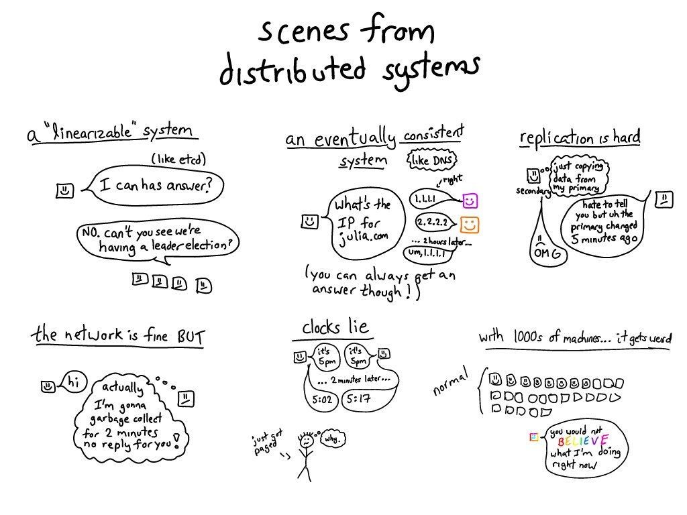
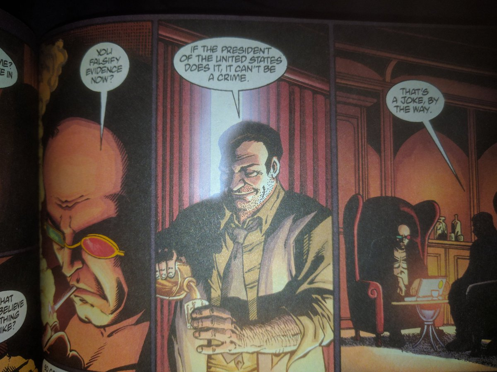

RT @b0rk: slowly learning a few things about distributed systems 

(Originally on Twitter: [Tue Nov 01 04:12:19 +0000 2016](https://twitter.com/ezyang/status/793304640217415680))
----
Union find has clear visual interpretation; has anyone used that interp to describe UF based algos (unification)

(Originally on Twitter: [Tue Nov 01 17:10:55 +0000 2016](https://twitter.com/ezyang/status/793500580144566272))
----
I have found some lit on type inference, but they are obsessed with type error explanation rather than visual language

(Originally on Twitter: [Tue Nov 01 17:14:59 +0000 2016](https://twitter.com/ezyang/status/793501603890274304))
----
@nbspnbsp Was looking at Duggan/Bent "Explaining type inference", and Chopella/Haynes "Source-tracking Unification"

(Originally on Twitter: [Wed Nov 02 03:36:59 +0000 2016](https://twitter.com/ezyang/status/793658136959733760))
----
@flippac Actually, no! (As far as I can tell.)

(Originally on Twitter: [Wed Nov 02 03:37:28 +0000 2016](https://twitter.com/ezyang/status/793658257311019010))
----
Branch of Xournal now has support for pre-slicing out figures from your pages https://github.com/ezyang/xournal/tree/rexournal

(Originally on Twitter: [Wed Nov 02 03:40:45 +0000 2016](https://twitter.com/ezyang/status/793659084746596352))
----
Type-directed deserialization of untrusted input constitutes a DOS vulnerability

(Originally on Twitter: [Wed Nov 02 08:38:52 +0000 2016](https://twitter.com/ezyang/status/793734107226189825))
----
I should clarify it as "a possible source of vulnerability" since there are plenty of parsers which don't have this property

(Originally on Twitter: [Wed Nov 02 09:09:53 +0000 2016](https://twitter.com/ezyang/status/793741911471173632))
----
RT @nelhage: Business Insider was hacked this morning … because we continue to victim-blame instead of admitting we have a huge collective…

(Originally on Twitter: [Wed Nov 02 19:05:55 +0000 2016](https://twitter.com/ezyang/status/793891908107980800))
----
RT @nelhage: No. Technical questions of security exist within a larger social context and affect real people. We can't ignore that context.…

(Originally on Twitter: [Thu Nov 03 21:09:06 +0000 2016](https://twitter.com/ezyang/status/794285294665093120))
----
Are there any pre-existing algorithms/packages for automatically generating diagrams like those drawn here: https://github.com/ezyang/ghc-proposals/blob/backpack/proposals/0000-backpack.rst#pictorial-language ?

(Originally on Twitter: [Fri Nov 04 04:43:55 +0000 2016](https://twitter.com/ezyang/status/794399754121715712))
----
So... are capsules, like, "letrec" values? https://ecommons.cornell.edu/bitstream/handle/1813/22082/Capsules.pdf?sequence=2&isAllowed=y

(Originally on Twitter: [Fri Nov 04 07:15:41 +0000 2016](https://twitter.com/ezyang/status/794437947135180800))
----
@k_gadek With tikz, don't you have to manually do layout? (Or maybe I underestimate the sophistication of tikz?)

(Originally on Twitter: [Fri Nov 04 08:47:46 +0000 2016](https://twitter.com/ezyang/status/794461122057252864))
----
@krismicinski Stylus and tablet, yep :)

(Originally on Twitter: [Fri Nov 04 20:11:46 +0000 2016](https://twitter.com/ezyang/status/794633255643332608))
----
AHA! They're not DFAs, they're Moore machines! (unit identity minimization)

(Originally on Twitter: [Fri Nov 04 23:44:24 +0000 2016](https://twitter.com/ezyang/status/794686765508345858))
----
Put GraphViz on the list of "software everyone uses, and which really needs to be rewritten"

(Originally on Twitter: [Sat Nov 05 05:01:45 +0000 2016](https://twitter.com/ezyang/status/794766630215483392))
----
The transition from "too embarrassed to ask the question" to "horrifying realization that no one else knows the answer either"

(Originally on Twitter: [Sat Nov 05 06:58:35 +0000 2016](https://twitter.com/ezyang/status/794796033200918528))
----
@Graphviz @gleber Hard to say, you'd know much better ;) Is "a toolkit for doing automatic layout" better description of successor?

(Originally on Twitter: [Sat Nov 05 17:37:14 +0000 2016](https://twitter.com/ezyang/status/794956753221734400))
----
@krismicinski I was recently trying to get it to lay out those Backpack component duagrams

(Originally on Twitter: [Sun Nov 06 03:43:30 +0000 2016](https://twitter.com/ezyang/status/795109327249883137))
----
@krismicinski Force directed layout is nice but it is not perfect ;)

(Originally on Twitter: [Sun Nov 06 07:23:25 +0000 2016](https://twitter.com/ezyang/status/795164668335525888))
----
RT @bcrypt: git revert https://twitter.com/ap_politics/status/796253849451429888

(Originally on Twitter: [Wed Nov 09 09:16:40 +0000 2016](https://twitter.com/ezyang/status/796280334396424192))
----
Do not normalize. The current state of affairs is not normal. http://www2.nybooks.com/daily/s3/nov/10/trump-election-autocracy-rules-for-survival.html

(Originally on Twitter: [Fri Nov 11 20:33:19 +0000 2016](https://twitter.com/ezyang/status/797175394453569537))
----
RT @GreatDismal: If Marsha Gessen's understanding of our situation seems extreme to you, that's a symptom of concussion https://t.co/ghc5hn…

(Originally on Twitter: [Fri Nov 11 20:42:49 +0000 2016](https://twitter.com/ezyang/status/797177785525698561))
----
RT @JoshuaGuess: If you read and share nothing else today, let it be this @brianbeutler piece. We can't let the media blow it again. https:…

(Originally on Twitter: [Sat Nov 12 23:31:39 +0000 2016](https://twitter.com/ezyang/status/797582662621917184))
----
@MarisaVeryMoe http://worrydream.com/EarlyHistoryOfSmalltalk/

(Originally on Twitter: [Mon Nov 14 05:13:03 +0000 2016](https://twitter.com/ezyang/status/798030966786641920))
----
RT @nelhage: Thread. A perspective I hadn't quite put together on the ongoing normalization and acceptance of The Orange One by our leaders…

(Originally on Twitter: [Mon Nov 14 05:27:40 +0000 2016](https://twitter.com/ezyang/status/798034643656155137))
----
RT @RojaBandari: Some things about what it was like to live in Iran under a religious dictatorship: 1) It felt normal. People had jobs, fri…

(Originally on Twitter: [Mon Nov 14 17:18:52 +0000 2016](https://twitter.com/ezyang/status/798213624787369984))
----
The session types people and the mockist testers should talk to each other

(Originally on Twitter: [Mon Nov 14 17:44:29 +0000 2016](https://twitter.com/ezyang/status/798220067791982592))
----
RT @dorchard: Interested in thinking differently about programming languages &amp; PL  research? This new workshop may be of interest! https://…

(Originally on Twitter: [Fri Nov 18 21:38:08 +0000 2016](https://twitter.com/ezyang/status/799728423094493186))
----
RT @polemic: Open Source software developer https://twitter.com/mcquillanatorz/status/799429591194447872

(Originally on Twitter: [Sat Nov 19 20:21:52 +0000 2016](https://twitter.com/ezyang/status/800071617007255552))
----
RT @kiniry: Here is our argument for why conducting an evidence-based audit of this year’s presidential election is critical. https://t.co/…

(Originally on Twitter: [Wed Nov 23 17:52:19 +0000 2016](https://twitter.com/ezyang/status/801483533076299777))
----
RT @WI_Elections: The Commission has received the Stein and Del La Fuente recount petitions. Details and news release posted soon at https:…

(Originally on Twitter: [Fri Nov 25 21:47:14 +0000 2016](https://twitter.com/ezyang/status/802267427916709888))
----
RT @zeynep: From my forthcoming book on attention &amp; censorship in the 21st century. Yes I'm rushing as much as I can. Pre-order: https://t.…

(Originally on Twitter: [Fri Nov 25 22:17:19 +0000 2016](https://twitter.com/ezyang/status/802274998794780672))
----
RT @saronyitbarek: I just published “I don’t belong in tech” https://medium.com/p/i-dont-belong-in-tech-3d73d8fd6f34

(Originally on Twitter: [Sat Nov 26 08:39:33 +0000 2016](https://twitter.com/ezyang/status/802431586666807296))
----
@TacticalGrace @kamatsu8 Well, as the paper mentions, there are formalizations of basically all of Java... except null pointers (easy ext?!)

(Originally on Twitter: [Sat Nov 26 17:38:34 +0000 2016](https://twitter.com/ezyang/status/802567234002374656))
----
RT @leyawn: it's basically impossible for someone to have done both good things and bad things. You have to pick one and argue about it for…

(Originally on Twitter: [Sat Nov 26 17:39:09 +0000 2016](https://twitter.com/ezyang/status/802567381461499905))
----
RT @nelhage: "If the president of the United States does it, it can't be a crime" #Transmetropolitan 

(Originally on Twitter: [Sun Nov 27 07:07:25 +0000 2016](https://twitter.com/ezyang/status/802770790382899200))
----
RT @SLJuniorDoctors: "Immigrants" aren't the problem. "Privatisation" not the answer. You trust us with your life at 3am but not on this? W…

(Originally on Twitter: [Sun Nov 27 21:15:02 +0000 2016](https://twitter.com/ezyang/status/802984099640020992))
----
Would any Haskeller interested in yet another test runner; main diff is that tests are hs files discovered and interpreted at runtime?

(Originally on Twitter: [Mon Nov 28 01:36:10 +0000 2016](https://twitter.com/ezyang/status/803049813851787264))
----
@jfischoff hspec-discover uses preprocessor, so you have to recompile when you add new test. Interpreter = no recompiles

(Originally on Twitter: [Mon Nov 28 06:09:16 +0000 2016](https://twitter.com/ezyang/status/803118544837709824))
----
@shebang I was going to, originally, but I couldn't figure out how to impose my own job control (need to run an interpreter per core)

(Originally on Twitter: [Mon Nov 28 06:10:23 +0000 2016](https://twitter.com/ezyang/status/803118821833773056))
----
@justusadam_ hspec discover requires recompilation; an interpreter does not!

(Originally on Twitter: [Mon Nov 28 17:13:20 +0000 2016](https://twitter.com/ezyang/status/803285662694682624))
----
@shebang Here you go! https://github.com/feuerbach/tasty/issues/153

(Originally on Twitter: [Mon Nov 28 17:53:01 +0000 2016](https://twitter.com/ezyang/status/803295648040644608))
----
@kamatsu8 Try the 8.0.2 rc? It should have a fix for the problem

(Originally on Twitter: [Tue Nov 29 07:32:25 +0000 2016](https://twitter.com/ezyang/status/803501857234526209))
----
RT @paulkrugman: Millions of working-class Trump voters are about to discover what they did to themselves http://www.vox.com/2016/11/28/13772342/trump-tom-price-obamacare

(Originally on Twitter: [Tue Nov 29 17:15:51 +0000 2016](https://twitter.com/ezyang/status/803648682855800833))
----
Went to a lovely talk by James Cowling about durability and availability at Dropbox.

(Originally on Twitter: [Wed Nov 30 02:43:38 +0000 2016](https://twitter.com/ezyang/status/803791571330043904))
----
@chrisbiscardi Haha, no, the talk was at Stanford ;)

(Originally on Twitter: [Wed Nov 30 04:46:44 +0000 2016](https://twitter.com/ezyang/status/803822549574545408))
----
RT @AcademicsSay: 

(Originally on Twitter: [Wed Nov 30 19:52:27 +0000 2016](https://twitter.com/ezyang/status/804050481316130816))
----
TLS 4, TLS XP, TLS Vista

(Originally on Twitter: [Wed Nov 30 21:06:09 +0000 2016](https://twitter.com/ezyang/status/804069028159311872))
----
I wonder if the lessons here are applicable to open source code review too https://hypothes.is/blog/code-review-in-remote-teams/

(Originally on Twitter: [Wed Nov 30 22:14:51 +0000 2016](https://twitter.com/ezyang/status/804086317202051072))
----
RT @StephanieKelton: I do declare. This little insight appears to be spreading. There may be hope for humanity. https://twitter.com/davidkaib/status/803768458257330177

(Originally on Twitter: [Wed Nov 30 23:15:19 +0000 2016](https://twitter.com/ezyang/status/804101530584395776))
----
