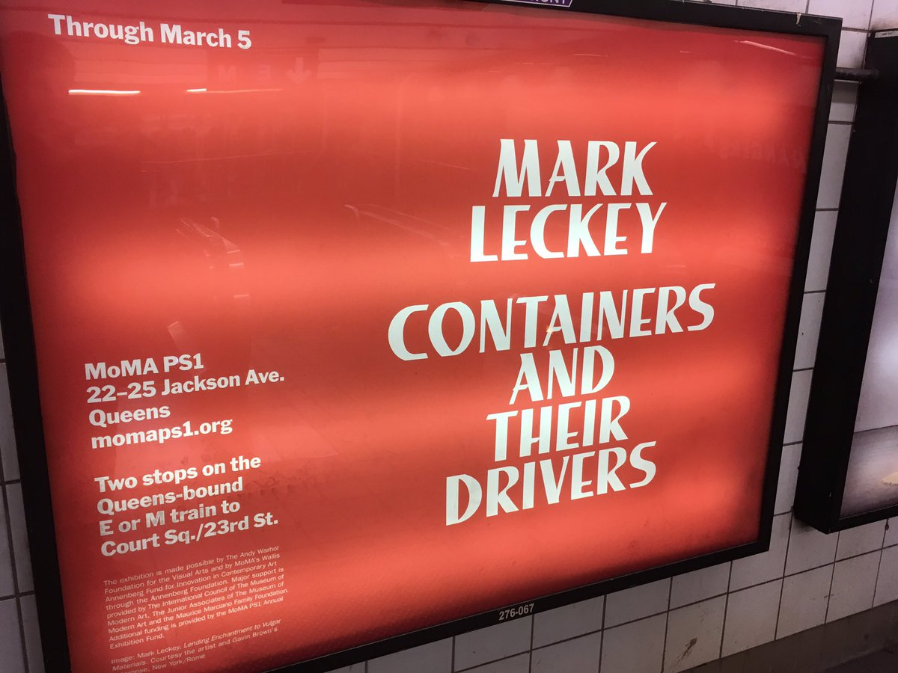
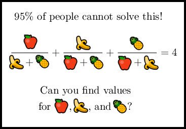

I wonder if anyone would be in interested in a blog post stepping through the OutsideIn(X) constraint solving process for a simple program

(Originally on Twitter: [Thu Mar 02 01:43:00 +0000 2017](https://twitter.com/ezyang/status/837115995416244225))
----
@ShriramKMurthi @yminsky An art class specified by paint type? :)

(Originally on Twitter: [Fri Mar 03 00:40:32 +0000 2017](https://twitter.com/ezyang/status/837462662044758016))
----
This thesis should be on the airwaves https://www.cl.cam.ac.uk/~sd601/thesis.pdf

(Originally on Twitter: [Fri Mar 03 05:47:19 +0000 2017](https://twitter.com/ezyang/status/837539864417460225))
----
@dackdel @Flexi23 Important unsolved problem solved in elegant way.

(Originally on Twitter: [Fri Mar 03 19:02:18 +0000 2017](https://twitter.com/ezyang/status/837739928704307200))
----
@blast_hardchese @rabbitonweb Yes, it's been a bit busy. I'll try and put out a call for copy after my defense!

(Originally on Twitter: [Mon Mar 06 21:22:55 +0000 2017](https://twitter.com/ezyang/status/838862479987912704))
----
Useless trivia: if your Haskell commands have unbuffered stderr, AppVeyor might silently drop it from log output. https://github.com/appveyor/ci/issues/1364

(Originally on Twitter: [Mon Mar 06 21:31:13 +0000 2017](https://twitter.com/ezyang/status/838864571062333442))
----
RT @geofft: MoMA exhibit or Linux kernel mailing list thread? 

(Originally on Twitter: [Mon Mar 06 23:16:49 +0000 2017](https://twitter.com/ezyang/status/838891145186795520))
----
TIL that U+FDD0 to U+FDEF are parse errors in HTML5 (they're not in XML, if I'm reading the specs correctly...)

(Originally on Twitter: [Tue Mar 07 00:02:02 +0000 2017](https://twitter.com/ezyang/status/838902526145605638))
----
@chrisamaphone @wirehead2501 The best I've found is putting them into a Google Spreadsheet. Takes a little setup time, but if it's a hard crossword worth it.

(Originally on Twitter: [Tue Mar 07 03:33:13 +0000 2017](https://twitter.com/ezyang/status/838955668446953474))
----
@chrisamaphone @wirehead2501 Pro-tip: use C-c C-v to copy paste black squares; it's faster than clicking the paint button (which doesn't remember the last color)

(Originally on Twitter: [Tue Mar 07 03:45:00 +0000 2017](https://twitter.com/ezyang/status/838958635753484288))
----
Useless trivia of the day: If you use HTML 4 Strict doctype with libxml 2.9.1, it will lose spaces between inline elements inside &lt;body&gt;

(Originally on Twitter: [Tue Mar 07 05:10:28 +0000 2017](https://twitter.com/ezyang/status/838980143683002368))
----
HTML Purifier 4.9.1 released. Hide your children. http://htmlpurifier.org/

(Originally on Twitter: [Wed Mar 08 08:42:39 +0000 2017](https://twitter.com/ezyang/status/839395931527114752))
----
RT @qntm: 

(Originally on Twitter: [Thu Mar 09 20:51:25 +0000 2017](https://twitter.com/ezyang/status/839941717772001280))
----
New blog: Designing the Backpack signature ecosystem http://blog.ezyang.com/2017/03/designing-the-backpack-signature-ecosystem/

(Originally on Twitter: [Sat Mar 11 11:43:17 +0000 2017](https://twitter.com/ezyang/status/840528551522648067))
----
@mmport80 yep

(Originally on Twitter: [Sat Mar 11 20:14:53 +0000 2017](https://twitter.com/ezyang/status/840657300004077568))
----
@jeremiahg Do you think cyber-insurance is mispriced, or the new reality is that it is cheaper to insure than it is to secure?

(Originally on Twitter: [Thu Mar 16 00:48:53 +0000 2017](https://twitter.com/ezyang/status/842175803282481152))
----
Dr. Edward Z. Yang (March 16, 2017)

(Originally on Twitter: [Thu Mar 16 21:53:05 +0000 2017](https://twitter.com/ezyang/status/842493949923139584))
----
@chrisamaphone I know right!! How time flys.

(Originally on Twitter: [Thu Mar 16 22:11:44 +0000 2017](https://twitter.com/ezyang/status/842498644360097793))
----
@CoBuddha Facebook, NY!

(Originally on Twitter: [Thu Mar 16 22:43:57 +0000 2017](https://twitter.com/ezyang/status/842506753992400896))
----
New blog on some cool work by @henrycogi on private, robust and scalable computation of aggregate statistics http://blog.ezyang.com/2017/03/prio-private-robust-and-scalable-computation-of-aggregate-statistics/

(Originally on Twitter: [Sat Mar 18 19:37:27 +0000 2017](https://twitter.com/ezyang/status/843184595205943296))
----
@sigfpe Irrational fear of compilers making network requests to figure out what the SO link is :/

(Originally on Twitter: [Mon Mar 20 00:43:13 +0000 2017](https://twitter.com/ezyang/status/843623932615774209))
----
Hey web security peeps; if you have an XSS on a HTTP digest authenticated web site, can you steal the authorization credentials?

(Originally on Twitter: [Tue Mar 21 03:14:38 +0000 2017](https://twitter.com/ezyang/status/844024422277120000))
----
This is probably what signature packages will look like when Hackage supports 'em: http://next.hackage.haskell.org:8080/package/str-sig-0.1.0.0

(Originally on Twitter: [Tue Mar 21 08:21:12 +0000 2017](https://twitter.com/ezyang/status/844101571960946688))
----
Don't Repeat Yourself versus Error-Correcting Codes

(Originally on Twitter: [Wed Mar 22 00:11:12 +0000 2017](https://twitter.com/ezyang/status/844340647251214336))
----
@flippacpub I don't quite understand; could you say it again but in a different way? :)

(Originally on Twitter: [Wed Mar 22 00:22:45 +0000 2017](https://twitter.com/ezyang/status/844343557548785664))
----
@flippacpub Put another way, module boundaries are where we decide to enshrine redundancy? :)

(Originally on Twitter: [Wed Mar 22 00:34:54 +0000 2017](https://twitter.com/ezyang/status/844346612889530368))
----
@contextualdev I kicked the server, should work now.

(Originally on Twitter: [Wed Mar 22 00:37:32 +0000 2017](https://twitter.com/ezyang/status/844347278030614528))
----
@cocreature Ah, good point. Perhaps changing the title to be "Str (signature)" would be sufficient?

(Originally on Twitter: [Wed Mar 22 07:19:50 +0000 2017](https://twitter.com/ezyang/status/844448517418569728))
----
@DRMacIver Not stupid. The point is strict strings can't implement this function as per the spec, so they shouldn't give a "fake" impl with the type

(Originally on Twitter: [Wed Mar 22 07:44:03 +0000 2017](https://twitter.com/ezyang/status/844454612719538176))
----
@DRMacIver Then "matching" fails: GHC will tell you that you required somefun, but it wasn't implemented by the instantiating fails. Sig = requirements

(Originally on Twitter: [Wed Mar 22 07:52:25 +0000 2017](https://twitter.com/ezyang/status/844456716918030336))
----
@DRMacIver Well, the signature is a "proto-signature" that contains lots of functions, not all of which will be implemented by each module.

(Originally on Twitter: [Wed Mar 22 07:57:16 +0000 2017](https://twitter.com/ezyang/status/844457940413284352))
----
@DRMacIver That's right! You can always write the sig from scratch but reusing subsets is helpful.

(Originally on Twitter: [Wed Mar 22 08:10:55 +0000 2017](https://twitter.com/ezyang/status/844461372150829057))
----
@cocreature Hmm... for now, maybe let us rely on the writer of the signature (me in this case) putting some explanation in the module header...

(Originally on Twitter: [Wed Mar 22 20:23:19 +0000 2017](https://twitter.com/ezyang/status/844645689787277312))
----
You have a splitting function split(char x, string s). When run an empty string, it returns:

(Originally on Twitter: [Mon Mar 27 01:20:47 +0000 2017](https://twitter.com/ezyang/status/846170099224522752))
----
@XiaogangLiu Haskell's not that great an example because ByteString returns [] (special cased, no less!) But I think people here like Text's beh better.

(Originally on Twitter: [Mon Mar 27 04:45:04 +0000 2017](https://twitter.com/ezyang/status/846221511098712064))
----
RT @nelhage: @ezyang Huh, there's more contention on this than I expected. https://gist.github.com/nelhage/13d160fa4d956d989862ed9c28735ddb

(Originally on Twitter: [Mon Mar 27 04:45:28 +0000 2017](https://twitter.com/ezyang/status/846221609346068481))
----
@kr__popo FWIW, I think the second option is the right one :)

(Originally on Twitter: [Mon Mar 27 21:20:32 +0000 2017](https://twitter.com/ezyang/status/846472025363431426))
----
@chrisamaphone Tower defense?

(Originally on Twitter: [Tue Mar 28 00:35:28 +0000 2017](https://twitter.com/ezyang/status/846521084551811074))
----
@chrisamaphone Yes, though most people think of Starcraft as more PvP than PvE.

(Originally on Twitter: [Tue Mar 28 01:01:38 +0000 2017](https://twitter.com/ezyang/status/846527668908691457))
----
@nelhage I would call this sound, because the most important correctness criterion for build system is "rebuilds when a true dep changes".

(Originally on Twitter: [Tue Mar 28 19:47:31 +0000 2017](https://twitter.com/ezyang/status/846811006852648964))
----
