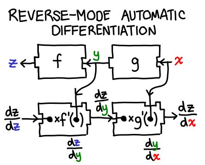

The venerable @angerman_io added doctest support to Cabal library; if you use doctest please try it out https://github.com/haskell/cabal/pull/4480

(Originally on Twitter: [Mon May 01 13:48:35 +0000 2017](https://twitter.com/ezyang/status/859041864107864066))
----
Perversely, the harder it is to refactor in a programming language, the more backwards-compatible the libraries tend to be.

(Originally on Twitter: [Tue May 02 03:24:37 +0000 2017](https://twitter.com/ezyang/status/859247228157927424))
----
@bentnib Thanks for posting! The obvious question: can you handle matrix multiply? :)

(Originally on Twitter: [Tue May 02 14:10:29 +0000 2017](https://twitter.com/ezyang/status/859409763905527808))
----
RT @PyTorch: Sparse CUDA Tensors, new layers, performance and bug fixes: v0.1.12 is out, our last 0.1 release. Read more here:
https://t.co…

(Originally on Twitter: [Wed May 03 13:55:36 +0000 2017](https://twitter.com/ezyang/status/859768408350523392))
----
New to Haskell? Want to contribute to OS? We've been working on newcomer tasks in Cabal. Here's an example: https://github.com/haskell/cabal/issues/4496

(Originally on Twitter: [Fri May 05 03:27:03 +0000 2017](https://twitter.com/ezyang/status/860335002109849600))
----
RT @b_apothecary: my exploration of the evaporation of wealth concept: 
https://www.bostonapothecary.com/the-evaporation-of-wealth/

(Originally on Twitter: [Sat May 06 17:07:38 +0000 2017](https://twitter.com/ezyang/status/860903897719877634))
----
Was writing up a newcomer ticket for a one line fix... but I ended up writing an essay instead https://github.com/haskell/cabal/issues/4443

(Originally on Twitter: [Sun May 07 19:52:31 +0000 2017](https://twitter.com/ezyang/status/861307778371072000))
----
I wrote up a few more newcomer tickets this weekend: https://github.com/haskell/cabal/issues/4444 https://github.com/haskell/cabal/issues/4452 https://github.com/haskell/cabal/issues/4449

(Originally on Twitter: [Sun May 07 19:53:29 +0000 2017](https://twitter.com/ezyang/status/861308022395678720))
----
@TaliaRinger This is not what you are thinking of, but there's super-Turing models of computation...

(Originally on Twitter: [Mon May 08 03:16:13 +0000 2017](https://twitter.com/ezyang/status/861419438553346048))
----
@el33th4xor ...but no bugs were found in the protocols! It reminds me of @johnregehr's findings re CompCert.

(Originally on Twitter: [Tue May 09 01:27:26 +0000 2017](https://twitter.com/ezyang/status/861754449378914305))
----
General purpose partial evaluation never took off, but maybe with the deep learning craze it can have second wings...

(Originally on Twitter: [Wed May 10 21:56:20 +0000 2017](https://twitter.com/ezyang/status/862426102551109632))
----
@glaebhoerl model :: Data -&gt; Parameters -&gt; Loss. Training is differentiating on the partial application 'model training_data'.

(Originally on Twitter: [Fri May 12 03:01:40 +0000 2017](https://twitter.com/ezyang/status/862865330355437568))
----
@chrisamaphone Noninterference from information flow control famously can be done with parametricity (http://www.ccs.neu.edu/home/amal/papers/nifree.pdf)

(Originally on Twitter: [Sat May 13 14:39:57 +0000 2017](https://twitter.com/ezyang/status/863403446782881792))
----
JIT to optimize out-of-place updates into in-place updates. Anyone done this before?

(Originally on Twitter: [Tue May 16 14:57:18 +0000 2017](https://twitter.com/ezyang/status/864494977157652480))
----
Is there a list of "Things functional programmers like" anywhere

(Originally on Twitter: [Tue May 16 16:05:46 +0000 2017](https://twitter.com/ezyang/status/864512204795768836))
----
Forward vs reverse mode automatic differentiation specifies whether you right or left associate the multiplies of the chain rule

(Originally on Twitter: [Tue May 16 16:11:29 +0000 2017](https://twitter.com/ezyang/status/864513646545838080))
----
@luqui Apparently, there is an optimal Jacobian accumulation problem.

(Originally on Twitter: [Tue May 16 17:19:41 +0000 2017](https://twitter.com/ezyang/status/864530806357843968))
----
RT @sigfpe: @ezyang It's a special case of https://en.m.wikipedia.org/wiki/Matrix_chain_multiplication

(Originally on Twitter: [Tue May 16 17:36:04 +0000 2017](https://twitter.com/ezyang/status/864534932072353792))
----
RT @kmett: @ezyang @luqui Sadly. You can make local improvements in the reduction order though.

(Originally on Twitter: [Tue May 16 17:36:07 +0000 2017](https://twitter.com/ezyang/status/864534945313812480))
----
RT @apaszke: @sigfpe @ezyang Except that in many AD systems you never construct the matrices, but use formulas to compute the jacobian prod…

(Originally on Twitter: [Wed May 17 00:06:44 +0000 2017](https://twitter.com/ezyang/status/864633243693441024))
----
Usually an AST is like data Expr = Plus Expr Expr | ... What do you call the equiv with all the pointers flipped (zipper-like)?

(Originally on Twitter: [Wed May 17 21:35:19 +0000 2017](https://twitter.com/ezyang/status/864957528039452673))
----
RT @qcar_: @ezyang A context.

(Originally on Twitter: [Thu May 18 00:50:42 +0000 2017](https://twitter.com/ezyang/status/865006697336537092))
----
@qcar_ Upon further reflection, is it really? They are usually defined inductively in the same direction as expressions (zipper red herring)

(Originally on Twitter: [Thu May 18 13:20:39 +0000 2017](https://twitter.com/ezyang/status/865195427238486016))
----
FP land: inductively defined data types, let's use ASTs for everything. ML land: graphs! Graphs for eeeeverything!

(Originally on Twitter: [Thu May 18 13:42:41 +0000 2017](https://twitter.com/ezyang/status/865200973979021313))
----
RT @gneubig: Paper here: https://arxiv.org/abs/1705.07860
Big speed gains on complicated tasks with minimal effort. Fun project with @yoavgo and @re…

(Originally on Twitter: [Tue May 23 16:59:09 +0000 2017](https://twitter.com/ezyang/status/867062354261004288))
----
The beautiful thing about types instead of tests is that you get to write less code.

(Originally on Twitter: [Thu May 25 02:32:22 +0000 2017](https://twitter.com/ezyang/status/867568999391006720))
----
Reverse mode automatic differentation in a single picture. 

(Originally on Twitter: [Thu May 25 03:46:00 +0000 2017](https://twitter.com/ezyang/status/867587527955415040))
----
@porges Thanks, I fixed it :)

(Originally on Twitter: [Thu May 25 03:46:34 +0000 2017](https://twitter.com/ezyang/status/867587672411394048))
----
Is partial evaluation in the degenerate case of no control flow trivial? Or is there something interesting in this case.

(Originally on Twitter: [Fri May 26 18:59:36 +0000 2017](https://twitter.com/ezyang/status/868179831254593536))
----
RT @cfbolz: @ezyang If there's no control flow (ie just linear sequence of operations) pe is indeed trivial.

(Originally on Twitter: [Fri May 26 20:59:44 +0000 2017](https://twitter.com/ezyang/status/868210064422838272))
----
RT @jjcarett2: @ezyang It is not trivial because you still have to worry about computation duplication. Inlining like crazy can make everyt…

(Originally on Twitter: [Sat May 27 01:23:49 +0000 2017](https://twitter.com/ezyang/status/868276520938352644))
----
TIL You can change vim editor behavior by turning on syntax highlighting. https://github.com/Valloric/YouCompleteMe/issues/2664#issuecomment-304401505

(Originally on Twitter: [Sat May 27 01:25:08 +0000 2017](https://twitter.com/ezyang/status/868276853223690240))
----
Thinking about partial evaluation again. Look! Me four years ago: https://plus.google.com/100791238593914710520/posts/31xjBmE3aj1

(Originally on Twitter: [Sat May 27 02:51:06 +0000 2017](https://twitter.com/ezyang/status/868298487938547712))
----
@cfbolz Have a circuit where not all inputs are immediately known; factor it into two circuits by stage. Simple stuff!

(Originally on Twitter: [Sat May 27 04:40:42 +0000 2017](https://twitter.com/ezyang/status/868326068289142784))
----
Now that Downen et al have taught us how to compile without continuations, maybe we should try reimplementing LLVM's opt passes in System FJ

(Originally on Twitter: [Sun May 28 01:36:07 +0000 2017](https://twitter.com/ezyang/status/868642006909714434))
----
Whenever I feel frustrated about a complex paper with no proofs... I think of my thesis &gt;.&gt;

(Originally on Twitter: [Sun May 28 16:42:29 +0000 2017](https://twitter.com/ezyang/status/868870099654115328))
----
Takeaway from Song Han's work: NNs are so plastic: you can impose constraints (e.g. for more efficient inference) without giving up accuracy

(Originally on Twitter: [Tue May 30 17:54:50 +0000 2017](https://twitter.com/ezyang/status/869613083567824898))
----
The point of a standard library is not that it is good (in the early days, it often is not), but that it removes the need to make a choice.

(Originally on Twitter: [Wed May 31 01:26:30 +0000 2017](https://twitter.com/ezyang/status/869726749516591104))
----
