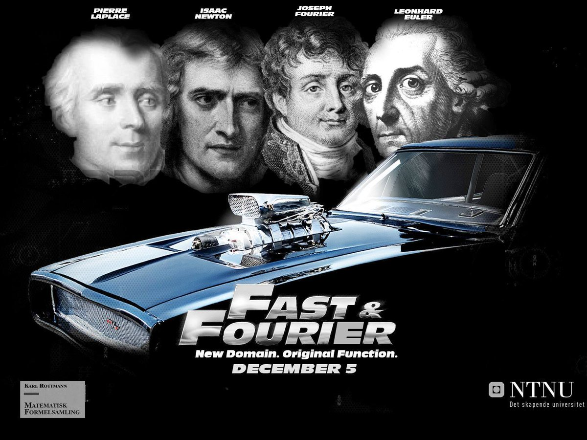

RT @Smerity: If you're ever in the mood to write your own deep learning framework (education or otherwise) / GPU code, CuPy is a drop in ma…

(Originally on Twitter: [Thu Jun 01 17:23:45 +0000 2017](https://twitter.com/ezyang/status/870330036947234816))
----
C++ for Haskell programmers

(Originally on Twitter: [Thu Jun 01 17:36:01 +0000 2017](https://twitter.com/ezyang/status/870333125750128643))
----
RT @lindsey: Proving that safety-critical neural networks do what they're supposed to: http://composition.al/blog/2017/05/30/proving-that-safety-critical-neural-networks-do-what-theyre-supposed-to-where-we-are-where-were-going-part-1-of-2/ (part 1), https://t.co/IIjQC…

(Originally on Twitter: [Fri Jun 02 03:02:41 +0000 2017](https://twitter.com/ezyang/status/870475732526477313))
----
RT @MylesBorins: This is what you get when you google "Dank Fast Fourier Transform" 

(Originally on Twitter: [Sat Jun 03 01:23:11 +0000 2017](https://twitter.com/ezyang/status/870813076613890048))
----
RT @samth: As a card carrying member of this group (at least sometimes) this post really resonated with me. https://twitter.com/Noahpinion/status/870796808762540032

(Originally on Twitter: [Sat Jun 03 02:31:00 +0000 2017](https://twitter.com/ezyang/status/870830145799585792))
----
The fact that reflect-reify could refer to Filinski's monadic reflection or Kmett's reflection library is quite confusing.

(Originally on Twitter: [Sat Jun 03 03:03:10 +0000 2017](https://twitter.com/ezyang/status/870838239007039488))
----
@ccshan I agree there is a common overarching idea. What is confusing when people use r/r to refer to a specific instantiation of the concept

(Originally on Twitter: [Sat Jun 03 12:58:38 +0000 2017](https://twitter.com/ezyang/status/870988095537246209))
----
@ccshan Well, you wouldn't call a library that implements the list monad, "monads", would you?

(Originally on Twitter: [Sat Jun 03 14:24:37 +0000 2017](https://twitter.com/ezyang/status/871009732164812801))
----
@ccshan That is all I ask :)

(Originally on Twitter: [Sat Jun 03 14:59:57 +0000 2017](https://twitter.com/ezyang/status/871018623674052608))
----
@emeryberger @chobarlobie Was the SQLite optimization you uncovered with Coz ever upstreamed?

(Originally on Twitter: [Tue Jun 06 19:33:44 +0000 2017](https://twitter.com/ezyang/status/872174688809742337))
----
RT @sigfpe: I wrote something about a technique to automatically differentiate stochastic expressions http://blog.sigfpe.com/2017/06/a-relaxation-technique.html 🎲 📈

(Originally on Twitter: [Wed Jun 07 11:43:52 +0000 2017](https://twitter.com/ezyang/status/872418828067774465))
----
RT @wallingf: "You've spent all that time cooking your idea, why not spend an extra few moments plating it?" -- http://www.eugenewei.com/blog/2017/5/11/jpeg-your-ideas

(Originally on Twitter: [Wed Jun 07 13:54:11 +0000 2017](https://twitter.com/ezyang/status/872451626933645312))
----
ThreadScope and Trace Event Profiling Tool are two open source event trace viewers that I know of. Are there any others?

(Originally on Twitter: [Wed Jun 07 21:26:42 +0000 2017](https://twitter.com/ezyang/status/872565505000910848))
----
@nelhage Nice catch! Looks like it's Chrome Event Viewer based (Catapult)

(Originally on Twitter: [Wed Jun 07 23:53:35 +0000 2017](https://twitter.com/ezyang/status/872602470933045249))
----
Have you ever thought nvvp is too slow? Give nvprof2json a try: https://github.com/ezyang/nvprof2json

(Originally on Twitter: [Fri Jun 09 18:32:33 +0000 2017](https://twitter.com/ezyang/status/873246452541161473))
----
RT @whereistanya: I've been doing unix nerdery for 18 years and I just found out that dmesg -T will display human readable timestamps. OMG.

(Originally on Twitter: [Sun Jun 11 21:16:42 +0000 2017](https://twitter.com/ezyang/status/874012537993482240))
----
Hey Twitterwebs: what term refers to type systems that let you check that your matrix multiplies are correctly lined up (dimensional types?)

(Originally on Twitter: [Tue Jun 13 03:38:37 +0000 2017](https://twitter.com/ezyang/status/874471039308369920))
----
@superfunc One hopes for a decidable equational theory so you don't have to prove theorems...

(Originally on Twitter: [Tue Jun 13 03:45:09 +0000 2017](https://twitter.com/ezyang/status/874472682603130880))
----
RT @wilbowma: @ezyang There is some work on types for languages like APL and J that formalizes this sort of thing: http://www.ccs.neu.edu/home/jrslepak/typed-j.pdf

(Originally on Twitter: [Tue Jun 13 04:25:49 +0000 2017](https://twitter.com/ezyang/status/874482919120809984))
----
Dependent types easy(?) if type computation only flows one direction. Name for this phenomenon? (Abstract interpretation?!)

(Originally on Twitter: [Tue Jun 13 04:40:25 +0000 2017](https://twitter.com/ezyang/status/874486591686930432))
----
@psygnisfive If you just need to do "type computation", things are easy. Hardness comes from having to prove equality, i.e. when types join up?

(Originally on Twitter: [Tue Jun 13 13:07:06 +0000 2017](https://twitter.com/ezyang/status/874614101640654849))
----
@psygnisfive Apologies if this is a horrible simplification, Twitter is a bit short for this... but I am not quite sure what I'm asking about

(Originally on Twitter: [Tue Jun 13 13:07:50 +0000 2017](https://twitter.com/ezyang/status/874614289621028864))
----
@wilbowma Thank you, this is excellent!

(Originally on Twitter: [Tue Jun 13 13:33:38 +0000 2017](https://twitter.com/ezyang/status/874620780503597057))
----
After being coddled with Haskell's excellent multithreading support, working with multiprocessing in Python is positively rage inducing

(Originally on Twitter: [Tue Jun 13 23:40:42 +0000 2017](https://twitter.com/ezyang/status/874773556219052033))
----
RT @Blaisorblade: @ezyang ... but only once you check user-proposed equations are legal (HARD: https://github.com/Blaisorblade/Agda-playground/blob/master/SoundnessOpenTermsXiRule.agda#L12-L62)
or make them legal:…

(Originally on Twitter: [Fri Jun 16 20:38:37 +0000 2017](https://twitter.com/ezyang/status/875814893622091777))
----
RT @Blaisorblade: @ezyang I'm assuming easy/hard is about the Agda user. For the implementor, OTOH, definitional equality is a "simple" rew…

(Originally on Twitter: [Fri Jun 16 20:38:39 +0000 2017](https://twitter.com/ezyang/status/875814902203645952))
----
RT @Blaisorblade: @ezyang When applying a Pi-type, computing the result is indeed easy—but checking the application is well-typed itself ne…

(Originally on Twitter: [Fri Jun 16 20:38:43 +0000 2017](https://twitter.com/ezyang/status/875814919651897344))
----
RT @Blaisorblade: @ezyang I hear types *are* abstract interpretations—see Cousot, http://lambda-the-ultimate.org/node/2208, and Oleg, https://t.co/qyadsNlgL…

(Originally on Twitter: [Fri Jun 16 20:38:45 +0000 2017](https://twitter.com/ezyang/status/875814929256906752))
----
Should a type system for inplace operations on arrays use linear types or uniqueness types? The obvious answer is uniqueness types?

(Originally on Twitter: [Fri Jun 16 20:40:32 +0000 2017](https://twitter.com/ezyang/status/875815377346940930))
----
@d_christiansen Uniqueness types in Idris work pretty well, right? Any notable downsides?

(Originally on Twitter: [Fri Jun 16 20:42:15 +0000 2017](https://twitter.com/ezyang/status/875815808148131842))
----
RT @conal: @ezyang Generalize/simplify matrices to linear maps built with functor id, prod, compose. Parametrize by domain and codomain typ…

(Originally on Twitter: [Fri Jun 16 21:09:04 +0000 2017](https://twitter.com/ezyang/status/875822560059023360))
----
RT @conal: @ezyang See http://conal.net/papers/generic-parallel-functional/. Matrices feel like Fortran to me.

(Originally on Twitter: [Fri Jun 16 21:09:46 +0000 2017](https://twitter.com/ezyang/status/875822735959752704))
----
RT @conal: @ezyang More flexible, and no fancy types needed. See also http://conal.net/papers/beautiful-differentiation/ for another formulation of linear maps.

(Originally on Twitter: [Fri Jun 16 21:09:47 +0000 2017](https://twitter.com/ezyang/status/875822736777650176))
----
RT @donsbot: @ezyang See stencil types in High Performance Fortran and similar in Fortress and X10

(Originally on Twitter: [Fri Jun 16 21:09:55 +0000 2017](https://twitter.com/ezyang/status/875822772756377601))
----
RT @edwinbrady: @d_christiansen @ezyang I’ve played around with them, and they kind of work, but they feel like a bit of a hack. Especially…

(Originally on Twitter: [Sat Jun 17 09:22:16 +0000 2017](https://twitter.com/ezyang/status/876007074307612673))
----
It's like MOST ADVANCED YET ACCEPTABLE for PROGRAMMING LANGUAGES.

(Originally on Twitter: [Sat Jun 17 21:28:59 +0000 2017](https://twitter.com/ezyang/status/876189958121242624))
----
RT @kmett: @ezyang uniqueness types are a better fit. what do you care about if the result is used? just that it doesn't get concurrently m…

(Originally on Twitter: [Sun Jun 18 00:54:55 +0000 2017](https://twitter.com/ezyang/status/876241780869521409))
----
@bblum0 "If you don't innovate, you are dead."

(Originally on Twitter: [Mon Jun 19 05:41:51 +0000 2017](https://twitter.com/ezyang/status/876676380489994240))
----
Under what circumstances does an "open" (as opposed to traditional-style closed) AST make sense?

(Originally on Twitter: [Thu Jun 22 01:25:57 +0000 2017](https://twitter.com/ezyang/status/877699145838014469))
----
@andygocke Sure. In FP, ADTs default closed: you can't (easily) add new variants. In OO, class hierarchies default open. For ASTs, when is open good?

(Originally on Twitter: [Thu Jun 22 01:42:13 +0000 2017](https://twitter.com/ezyang/status/877703237998174210))
----
@abrocat I can't think of any, but that's mostly ignorance speaking.

(Originally on Twitter: [Thu Jun 22 02:20:31 +0000 2017](https://twitter.com/ezyang/status/877712875619528705))
----
RT @a_cowley: @ezyang I use open ASTs to support differing backends that expose unique capabilities of target hardware.

(Originally on Twitter: [Thu Jun 22 03:15:23 +0000 2017](https://twitter.com/ezyang/status/877726682366529536))
----
RT @lindsey: Aside from @stenoknight and @stanographer, who are the best CART captioners for programming conferences?

(Originally on Twitter: [Thu Jun 22 03:15:58 +0000 2017](https://twitter.com/ezyang/status/877726831188746241))
----
@athan__ The expression problem!

(Originally on Twitter: [Thu Jun 22 13:18:30 +0000 2017](https://twitter.com/ezyang/status/877878464082100225))
----
@savannidgerinel Have you heard of Takt?

(Originally on Twitter: [Fri Jun 23 00:35:29 +0000 2017](https://twitter.com/ezyang/status/878048832449376257))
----
RT @jessitron: The real secret of the 10x developer
http://blog.jessitron.com/2017/06/the-most-productive-circumstances-for.html

(Originally on Twitter: [Sun Jun 25 21:40:54 +0000 2017](https://twitter.com/ezyang/status/879092058060935173))
----
Appel's "SSA is Functional Programming" states FPers often lost in FP notation. But perhaps notation is resp for a great deal of FP's charm

(Originally on Twitter: [Tue Jun 27 19:13:30 +0000 2017](https://twitter.com/ezyang/status/879779742399987715))
----
Often, what you need is simply a graph. But FP obsession with trees surely has also paid off in its own ways.

(Originally on Twitter: [Tue Jun 27 19:16:05 +0000 2017](https://twitter.com/ezyang/status/879780391510573056))
----
RT @nelhage: I recall some famous quote along the lines of "pick the right data structures, and the code is trivial". Anyone know what I'm…

(Originally on Twitter: [Wed Jun 28 00:49:49 +0000 2017](https://twitter.com/ezyang/status/879864379419840516))
----
RT @nelhage: I wrote up some musings on systems design and the end-to-end principle. https://blog.nelhage.com/post/end-to-end-principle/

(Originally on Twitter: [Wed Jun 28 00:52:52 +0000 2017](https://twitter.com/ezyang/status/879865146012819458))
----
The best way to be informed enough about what framework to choose is to build a version yourself. Unfortunately, once you have done so...

(Originally on Twitter: [Wed Jun 28 01:24:53 +0000 2017](https://twitter.com/ezyang/status/879873205053390848))
----
RT @DaveCTurner: @ezyang The trick seems to be to build just enough of your own to discover where the hard bits are, then evaluate others o…

(Originally on Twitter: [Wed Jun 28 12:42:31 +0000 2017](https://twitter.com/ezyang/status/880043733689008128))
----
Fire across from FBNY. Looks pretty serious. 

<video controls><source src="media/880185225975922688-_knC42wrSJfYhQSz.mp4">Your browser does not support the video tag.</video>
media/880185225975922688-_knC42wrSJfYhQSz.mp4

(Originally on Twitter: [Wed Jun 28 22:04:45 +0000 2017](https://twitter.com/ezyang/status/880185225975922688))
----
RT @FDNYAlerts: FDNYalerts MAN 3-ALARM 60 E 9 ST, MULTIPLE DWELLING FIRE IN 2 APTS ON TOP FL AND COCKLOFT,

(Originally on Twitter: [Wed Jun 28 22:14:18 +0000 2017](https://twitter.com/ezyang/status/880187629840609281))
----
RT @FDNYAlerts: FDNYalerts MAN 5-ALARM 60 E 9 ST, MULTIPLE DWELLING FIRE IN 2 APTS ON TOP FL AND COCKLOFT,

(Originally on Twitter: [Wed Jun 28 22:45:51 +0000 2017](https://twitter.com/ezyang/status/880195568819109888))
----
RT @icfp_conference: Exciting news: ICFP 2017 will feature keynote talks from @chrisamaphone and @richhickey! http://icfp17.sigplan.org/track/icfp-2017-Keynote-Talks#event-overview

(Originally on Twitter: [Wed Jun 28 23:34:52 +0000 2017](https://twitter.com/ezyang/status/880207903239622656))
----
