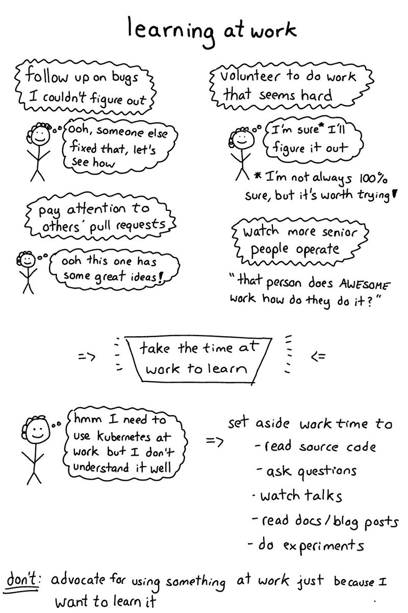

@ttuegel FWIW, we used Go as justification that this wouldn't be totally crazy.

(Originally on Twitter: [Thu Aug 03 18:48:17 +0000 2017](https://twitter.com/ezyang/status/893181746010869760))
----
RT @PyTorch: PyTorch v0.2 is out: Higher order gradients, Distributed PyTorch, Broadcasting, Advanced Indexing, New Layers, more!
https://t…

(Originally on Twitter: [Sun Aug 06 22:01:28 +0000 2017](https://twitter.com/ezyang/status/894317528075423744))
----
@snoyberg See http://ghc.haskell.org/trac/ghc/ticket/14057

(Originally on Twitter: [Mon Aug 07 14:54:46 +0000 2017](https://twitter.com/ezyang/status/894572531671347200))
----
@chris__martin Unfortunately yes :( Here are the two times I've proposed to relax this: https://github.com/haskell/cabal/issues/2716 and https://github.com/haskell/cabal/issues/4206

(Originally on Twitter: [Wed Aug 16 01:52:35 +0000 2017](https://twitter.com/ezyang/status/897637179941421056))
----
RT @chris__martin: Adding a readme and other comments to @ezyang's regex example in attempt to turn it into a concise Backpack tutorial htt…

(Originally on Twitter: [Thu Aug 17 01:22:25 +0000 2017](https://twitter.com/ezyang/status/897991975441387521))
----
@richardthepeace Your Backpack post http://blog.rcook.org/blog/2017/backpack-with-stack/ surfaced on Reddit today. Do you remember the problem you had?

(Originally on Twitter: [Thu Aug 17 01:46:15 +0000 2017](https://twitter.com/ezyang/status/897997974181203968))
----
Backpacking tips by @danidiaz! https://medium.com/@danidiaz/backpacking-tips-3adb727bb8f7

(Originally on Twitter: [Thu Aug 17 01:48:25 +0000 2017](https://twitter.com/ezyang/status/897998519054848000))
----
@Profpatsch @chris__martin Yes. See https://github.com/danidiaz/streamy and https://github.com/ezyang/reflex-backpack and https://github.com/ezyang/tagstream-conduit/commit/de314fd0fc32110c0ca2a64bfeb2a5def5806c5d and Chapter 8 of my thesis

(Originally on Twitter: [Thu Aug 17 01:52:02 +0000 2017](https://twitter.com/ezyang/status/897999430196101120))
----
@Blaisorblade @Profpatsch @chris__martin It's fair :) Although Backpack is even more wordy than ML modules (ha!) so you might not want to use it for your Maps and Sets (classics!)

(Originally on Twitter: [Thu Aug 17 02:21:22 +0000 2017](https://twitter.com/ezyang/status/898006811432890368))
----
@Blaisorblade @Profpatsch @chris__martin Worse than Java :) (But not too much worse :)

(Originally on Twitter: [Thu Aug 17 02:29:23 +0000 2017](https://twitter.com/ezyang/status/898008827743748096))
----
RT @astronomolly: Let's discuss postdoctoral mentoring. Namely: suggestions on resources for how to be a good / helpful / effective / suppo…

(Originally on Twitter: [Thu Aug 17 12:07:50 +0000 2017](https://twitter.com/ezyang/status/898154397833859072))
----
RT @bcrypt: a friend of a friend was a medic in Charlottesville. here's their account: https://pastebin.com/7HZEA9zU

(Originally on Twitter: [Thu Aug 17 13:41:32 +0000 2017](https://twitter.com/ezyang/status/898177980161290244))
----
Fun guest blog from @kr__popo about deep learning with Backpack http://blog.ezyang.com/2017/08/backpack-for-deep-learning/

(Originally on Twitter: [Fri Aug 18 02:08:48 +0000 2017](https://twitter.com/ezyang/status/898366037963546624))
----
RT @soumithchintala: TVM: A powerful low-level IR Stack for Tensor code generation. You'll keep hearing about it in the next few months!
ht…

(Originally on Twitter: [Sat Aug 19 13:26:32 +0000 2017](https://twitter.com/ezyang/status/898898980578500608))
----
RT @b0rk: learning at work (blog post: https://jvns.ca/blog/2017/08/06/learning-at-work/) 

(Originally on Twitter: [Sun Aug 20 17:14:31 +0000 2017](https://twitter.com/ezyang/status/899318743859441665))
----
RT @alastair_d_reid: I wrote an article "Are natural language specifications useful?" https://alastairreid.github.io/natural-specs/ based on my OOPSLA paper http…

(Originally on Twitter: [Sun Aug 20 17:51:07 +0000 2017](https://twitter.com/ezyang/status/899327954810961920))
----
RT @int_index: Today I tried Backpack by @ezyang and it's great. At first I was skeptical about its benefits over type classes, but not any…

(Originally on Twitter: [Wed Aug 23 23:03:38 +0000 2017](https://twitter.com/ezyang/status/900493762635452416))
----
@int_index I hope you can share the code you are writing!

(Originally on Twitter: [Wed Aug 23 23:30:53 +0000 2017](https://twitter.com/ezyang/status/900500624030281729))
----
RT @int_index: @ezyang Sure, here it is https://github.com/int-index/slay/pull/12/files — I used Backpack to abstract over numeric types in a layouting engine.

(Originally on Twitter: [Wed Aug 23 23:46:33 +0000 2017](https://twitter.com/ezyang/status/900504566814429188))
----
@psygnisfive Forward or reverse mode AD?

(Originally on Twitter: [Thu Aug 24 12:57:44 +0000 2017](https://twitter.com/ezyang/status/900703673671667712))
----
@evanborden Hmm! It should work. Got a small repro?

(Originally on Twitter: [Thu Aug 24 16:22:28 +0000 2017](https://twitter.com/ezyang/status/900755194929131520))
----
@evanborden Thanks! I'll try to take a look soon.

(Originally on Twitter: [Fri Aug 25 01:34:32 +0000 2017](https://twitter.com/ezyang/status/900894127033913345))
----
@evanborden OK, now I remember why: we never implemented compaction on functions, since free variables are a bit tricky to grab. Possible in principle.

(Originally on Twitter: [Fri Aug 25 02:07:13 +0000 2017](https://twitter.com/ezyang/status/900902351401357314))
----
@evanborden Probably. If you have a source build of GHC handy you can check pretty easily. Maybe FUN_STATIC automatically works!

(Originally on Twitter: [Fri Aug 25 02:27:03 +0000 2017](https://twitter.com/ezyang/status/900907342040092672))
----
RT @jacobinmag: Tech workers’ high pay doesn’t mean they’re not workers — and it won’t always protect them from their bosses. https://t.co/…

(Originally on Twitter: [Sat Aug 26 15:09:05 +0000 2017](https://twitter.com/ezyang/status/901461504238780416))
----
@wilbowma Look at Compiling without continuations.

(Originally on Twitter: [Mon Aug 28 15:23:17 +0000 2017](https://twitter.com/ezyang/status/902189851986063360))
----
