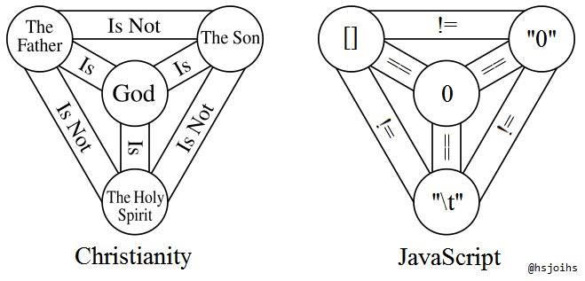

@evanborden @cdparx I think it is doable, and I think it would be useful!

(Originally on Twitter: [Fri Oct 06 03:05:02 +0000 2017](https://twitter.com/ezyang/status/916137194452148226))
----
RT @bcrypt: holy crap, @adafruit bought radioshack??? https://twitter.com/adafruit/status/916473322203992064

(Originally on Twitter: [Sat Oct 07 21:15:04 +0000 2017](https://twitter.com/ezyang/status/916773895742640129))
----
@acfoltzer @stdlib Intern code: the gift that keeps giving :) (Though, I though y'all rewrote big chunks of it after I left haha)

(Originally on Twitter: [Tue Oct 17 03:46:37 +0000 2017](https://twitter.com/ezyang/status/920133924025663489))
----
@jfischoff Well, I may be a bit biased, but if you just want to tinker, I think PyTorch is a pretty good choice. Depends on what you want to do.

(Originally on Twitter: [Sun Oct 22 22:45:30 +0000 2017](https://twitter.com/ezyang/status/922232473160908800))
----
You are writing a PL with simple dynamic semantics, but are not sure what the type system should be. Should you make the tc pluggable?

(Originally on Twitter: [Sun Oct 29 01:21:45 +0000 2017](https://twitter.com/ezyang/status/924446122764046337))
----
@flippac It's first-order and pure, but all proposals for type systems on it are "complicated" (think intersection types with bounded polymorphism)

(Originally on Twitter: [Sun Oct 29 02:59:05 +0000 2017](https://twitter.com/ezyang/status/924470618506055681))
----
What's the difference between "a PL with a type system" and "a PL with a static analysis." What if they both live in the compiler.

(Originally on Twitter: [Sun Oct 29 03:00:35 +0000 2017](https://twitter.com/ezyang/status/924470995620106240))
----
@neurocy I like this response. But surely one can have "stuck" terms regardless of whether or not one has a type system or not?

(Originally on Twitter: [Sun Oct 29 03:12:58 +0000 2017](https://twitter.com/ezyang/status/924474110394224645))
----
@flippac Right. So you'd have to have some sort of extensible syntax. Which isn't the worst thing in the world...

(Originally on Twitter: [Sun Oct 29 14:45:16 +0000 2017](https://twitter.com/ezyang/status/924648331833470982))
----
@jakzale Many static analyses are global, but they don't have to be.

(Originally on Twitter: [Sun Oct 29 14:55:25 +0000 2017](https://twitter.com/ezyang/status/924650887280300032))
----
Maybe what I am wondering is, if your language is simple enough, can it have multiple "type systems"? What if some of these live externally?

(Originally on Twitter: [Sun Oct 29 15:03:38 +0000 2017](https://twitter.com/ezyang/status/924652956632408064))
----
RT @BrandonBloom: @ezyang http://lambda-the-ultimate.org/node/1311

(Originally on Twitter: [Sun Oct 29 19:03:53 +0000 2017](https://twitter.com/ezyang/status/924713417449099264))
----
@stdlib The way NVIDIA does this for their docs also drives me crazy

(Originally on Twitter: [Sun Oct 29 22:10:35 +0000 2017](https://twitter.com/ezyang/status/924760400331268097))
----
RT @YrB1rd: 

(Originally on Twitter: [Sun Oct 29 23:17:23 +0000 2017](https://twitter.com/ezyang/status/924777213127462912))
----
