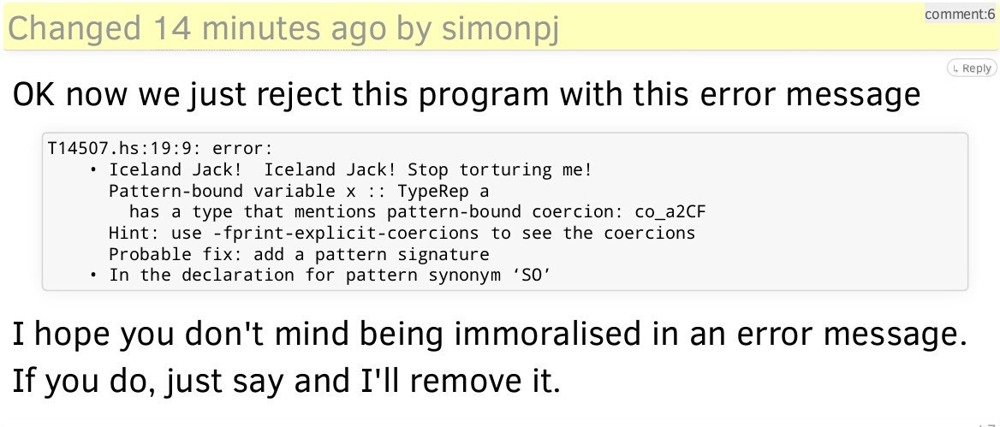

RT @geofft: @b0rk even weirder: `b malloc` and then do that.

also if you compile with -ggdb3 then gdb can eval #define'd macros which is t…

(Originally on Twitter: [Tue Jan 02 14:17:44 +0000 2018](https://twitter.com/ezyang/status/948196614681907200))
----
How do you debug print data structures in Haskell?

(Originally on Twitter: [Thu Jan 04 04:26:52 +0000 2018](https://twitter.com/ezyang/status/948772693637246976))
----
@jonsterling I love the smell of (segmentation fault) in the morning

(Originally on Twitter: [Thu Jan 04 04:37:19 +0000 2018](https://twitter.com/ezyang/status/948775326682886151))
----
RT @PLT_cheater: Hey everyone, I'm looking for work! I'm good with FP, Haskell, cryptocurrencies, infosec, stats, ML, Python, etc. I care l…

(Originally on Twitter: [Fri Jan 05 18:27:34 +0000 2018](https://twitter.com/ezyang/status/949346650312626177))
----
RT @Iceland_jack: Omg I'm an error message now? 

(Originally on Twitter: [Fri Jan 05 18:28:29 +0000 2018](https://twitter.com/ezyang/status/949346883981393920))
----
RT @reaktorplayer: Musical Hexagons : http://bit.ly/2lXufsg  A two-dimensional spatial arrangement of the chromatic musical notes. https:…

(Originally on Twitter: [Sat Jan 06 02:48:46 +0000 2018](https://twitter.com/ezyang/status/949472783024775168))
----
"Ownership: responsibility to do the work to get it done" versus "Ownership: responsibility to make sure it gets done, somehow"

(Originally on Twitter: [Mon Jan 08 04:59:28 +0000 2018](https://twitter.com/ezyang/status/950230449292537856))
----
RT @AnneWHilborn: Reupping this for anyone who is teaching intro stats this week or next and struggles to remember which one is a Type I er…

(Originally on Twitter: [Wed Jan 10 02:17:58 +0000 2018](https://twitter.com/ezyang/status/950914583820210176))
----
I don't understand how anyone writes robust async JavaScript, even with all of the new features. Too easy to accidentally forget an await.

(Originally on Twitter: [Wed Jan 10 04:44:49 +0000 2018](https://twitter.com/ezyang/status/950951537454600192))
----
@jomsdev The trouble is forgetting an await results in nondeterministic bugs, where most of the time, the timing works out "just right" and it works OK (until it doesn't)

(Originally on Twitter: [Wed Jan 10 15:11:23 +0000 2018](https://twitter.com/ezyang/status/951109221050920960))
----
@damassi What linters do you use?

(Originally on Twitter: [Wed Jan 10 15:13:06 +0000 2018](https://twitter.com/ezyang/status/951109651113930752))
----
@githubstatus https://github.com/pytorch/pytorch/pull/4593 is hard erroring

(Originally on Twitter: [Thu Jan 11 15:20:12 +0000 2018](https://twitter.com/ezyang/status/951473825136463872))
----
@alexeyraga I find it amusing to see this juxtaposed with TC concluding that they will not advocate for a programming style that can only be done safely with linting (re ASI)

(Originally on Twitter: [Fri Jan 12 02:05:20 +0000 2018](https://twitter.com/ezyang/status/951636181657309184))
----
Happy Birthday Simon! https://mail.haskell.org/pipermail/haskell-cafe/2018-January/128447.html

(Originally on Twitter: [Thu Jan 18 18:01:46 +0000 2018](https://twitter.com/ezyang/status/954051202295058434))
----
Has anyone studied automatic differentiation in a linear/affine type system?

(Originally on Twitter: [Tue Jan 23 03:47:15 +0000 2018](https://twitter.com/ezyang/status/955648095626424320))
----
@acid2 We think we fixed this once and for all in GHC 8.4

(Originally on Twitter: [Wed Jan 24 15:06:14 +0000 2018](https://twitter.com/ezyang/status/956181355104268288))
----
RT @snoyberg: My comments on the SLURP proposal https://www.snoyman.com/blog/2018/01/slurp

(Originally on Twitter: [Wed Jan 24 15:29:45 +0000 2018](https://twitter.com/ezyang/status/956187271455223814))
----
@psygnisfive Gradient descent

(Originally on Twitter: [Thu Jan 25 06:12:02 +0000 2018](https://twitter.com/ezyang/status/956409305422581760))
----
cmake install(DIRECTORY ${CMAKE_CURRENT_LIST_DIR} ...) is an antipattern; it will pick up your build directory and all sorts of other goo. Use a file(GLOB ...) and install(FILE ...) instead.

(Originally on Twitter: [Thu Jan 25 21:31:05 +0000 2018](https://twitter.com/ezyang/status/956640593584803841))
----
@vektorweg @shapr At least GHC doesn't drop you into the guys of your standard library because a template expansion didn't work out

(Originally on Twitter: [Sat Jan 27 00:21:59 +0000 2018](https://twitter.com/ezyang/status/957045987591311360))
----
RT @ebetica: Torchcraft 1.4 is released! https://github.com/TorchCraft/TorchCraft/tree/master

PS: You don't need a windows box to do StarCraft research anymore. Just f…

(Originally on Twitter: [Sat Jan 27 14:37:40 +0000 2018](https://twitter.com/ezyang/status/957261329328496640))
----
