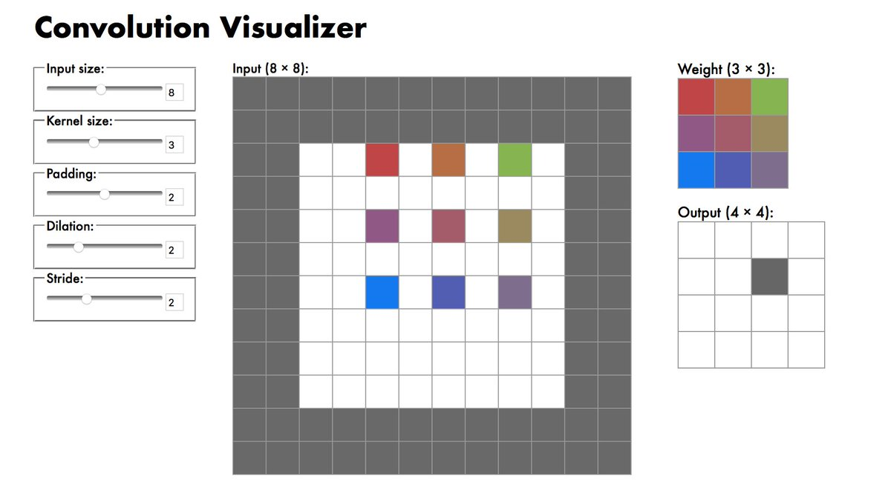

RT @gerrttttt: haha @2AvSagas 

(Originally on Twitter: [Fri Feb 02 03:49:26 +0000 2018](https://twitter.com/ezyang/status/959272522511519744))
----
RT @SimplyDop3: Whoever made this please reveal yourself so we can honor you the right way 

(Originally on Twitter: [Mon Feb 05 23:57:55 +0000 2018](https://twitter.com/ezyang/status/960663813107351552))
----
Worked example of TrieMap fusion using techniques from "Haskell Programming with Nested Types: A Principled Approach" (Neil and Patricia) https://stackoverflow.com/a/48636074/23845

(Originally on Twitter: [Tue Feb 06 05:37:17 +0000 2018](https://twitter.com/ezyang/status/960749216866951169))
----
RT @plutoniumpage: 

(Originally on Twitter: [Sun Feb 11 19:31:22 +0000 2018](https://twitter.com/ezyang/status/962771057844326406))
----
Aren't Ur/Web sources and signals way better than React "controlled components" and "state lifting"?

(Originally on Twitter: [Mon Feb 12 00:38:19 +0000 2018](https://twitter.com/ezyang/status/962848303305121792))
----
I made a thing: Convolution Visualizer https://ezyang.github.io/convolution-visualizer/index.html (basically, it's http://deeplearning.net/software/theano/tutorial/conv_arithmetic.html but you can twiddle the parameters as you like)

(Originally on Twitter: [Mon Feb 12 10:53:25 +0000 2018](https://twitter.com/ezyang/status/963003101304176640))
----
@dorchard Does deep learning count as an example? ;)

(Originally on Twitter: [Mon Feb 12 16:30:08 +0000 2018](https://twitter.com/ezyang/status/963087839209517056))
----
@yminsky It's not full on SAC, but the signal monad gives me the impression you could give the recompute engine SAC like smarts

(Originally on Twitter: [Mon Feb 12 16:31:14 +0000 2018](https://twitter.com/ezyang/status/963088116557914113))
----
RT @hardmaru: Nice little interactive convolution visualizer made by @ezyang https://ezyang.github.io/convolution-visualizer/index.html 

(Originally on Twitter: [Tue Feb 13 04:11:28 +0000 2018](https://twitter.com/ezyang/status/963264332527149056))
----
Like visualizations AND machine learning, but don't know where to start when making one? Try your hand at the starter tasks at https://github.com/ezyang/convolution-visualizer; all you need is a willingness to learn a little React.

(Originally on Twitter: [Tue Feb 13 05:39:33 +0000 2018](https://twitter.com/ezyang/status/963286499834974208))
----
RT @ChariseeChiw: From Tensor Calculus to C https://arxiv.org/abs/1802.06504

(Originally on Twitter: [Wed Feb 21 02:56:25 +0000 2018](https://twitter.com/ezyang/status/966144551298756609))
----
RT @jcreed: Anyone know a snappier way of describing the following categorical construction? 

(Originally on Twitter: [Thu Feb 22 05:02:45 +0000 2018](https://twitter.com/ezyang/status/966538732756242432))
----
An extremely clear articulation of how to do versioning when there is no such thing as a BC-breaking change. I wish Go luck. https://research.swtch.com/vgo

(Originally on Twitter: [Thu Feb 22 05:50:18 +0000 2018](https://twitter.com/ezyang/status/966550698472148993))
----
@Profpatsch Yeah, you are instead supposed to release a package with a new name when you break BC

(Originally on Twitter: [Thu Feb 22 15:23:20 +0000 2018](https://twitter.com/ezyang/status/966694904050143233))
----
HTML Purifier 4.10.0 released http://htmlpurifier.org/

(Originally on Twitter: [Fri Feb 23 03:18:44 +0000 2018](https://twitter.com/ezyang/status/966874942636781568))
----
New blog: Semantic Import Versioning in the wild http://blog.ezyang.com/2018/02/semantic-import-versioning-in-the-wild/

(Originally on Twitter: [Fri Feb 23 05:06:31 +0000 2018](https://twitter.com/ezyang/status/966902064604303361))
----
RT @lirael_abhorsen: What if they're suspended protesting something else? What if the protest is labeled not "peaceful" (one of many possib…

(Originally on Twitter: [Sat Feb 24 21:17:36 +0000 2018](https://twitter.com/ezyang/status/967508836734132226))
----
@nbspnbsp It seems to me that the complaint about Perl was never portability, but readability.

(Originally on Twitter: [Sun Feb 25 00:33:25 +0000 2018](https://twitter.com/ezyang/status/967558116245155841))
----
@nbspnbsp @PLT_cheater The problem with Perl is not the symbol-soup per se, but extensive use of hidden state in common idioms. Bash has this to a degree (e.g., $?, shift) but Perl takes it to another level ($_, I'm looking at you)

(Originally on Twitter: [Sun Feb 25 06:09:08 +0000 2018](https://twitter.com/ezyang/status/967642601229836288))
----
