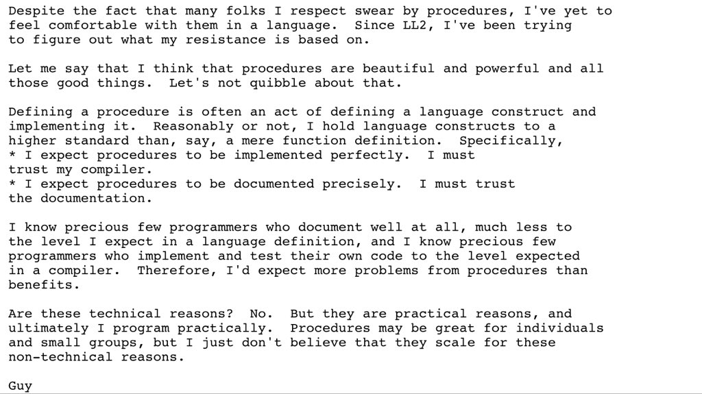

RT @spdegabrielle: @samth https://people.csail.mit.edu/gregs/ll1-discuss-archive-html/msg02069.html. 

(Originally on Twitter: [Mon Sep 03 13:07:51 +0000 2018](https://twitter.com/ezyang/status/1036601666198491136))
----
RT @kowainik: This Thursday (September, 6) our team member @ChShersh will talk about Backpack at the Haskell Singapore meetup 🇸🇬 Don't miss…

(Originally on Twitter: [Mon Sep 03 14:50:38 +0000 2018](https://twitter.com/ezyang/status/1036627535893856256))
----
@vamchale I feel like every year or so I see another paper about pretty printing at ICFP. This is the most recent one I can remember: http://jyp.github.io/pdf/Prettiest.pdf

(Originally on Twitter: [Tue Sep 04 00:14:29 +0000 2018](https://twitter.com/ezyang/status/1036769430833901573))
----
@jjcarett2 Err... Is this a dig against prolog?

(Originally on Twitter: [Tue Sep 04 00:53:54 +0000 2018](https://twitter.com/ezyang/status/1036779350648127488))
----
@chrisamaphone Had not heard of Talespin before. What fascinating reading!

(Originally on Twitter: [Thu Sep 06 02:45:04 +0000 2018](https://twitter.com/ezyang/status/1037532104370913280))
----
@modernserf @rtfeldman @steveklabnik Test your error messages. E.g., use expect tests, and inspect the output when it changes. Did it get better or worse?

(Originally on Twitter: [Thu Sep 06 16:15:51 +0000 2018](https://twitter.com/ezyang/status/1037736143939424259))
----
@justinesherry @chrisamaphone @rubengmartins Ucambridge.

(Originally on Twitter: [Sat Sep 08 18:15:32 +0000 2018](https://twitter.com/ezyang/status/1038491039345123329))
----
However bad indexitis is in C, CUDA C has it worse.

(Originally on Twitter: [Sun Sep 09 19:39:32 +0000 2018](https://twitter.com/ezyang/status/1038874565789724672))
----
@jcreed @sigfpe Wait, I read it as the latter haha. Isn't the domain in question 0 &lt; X, Y &lt; 1 and Y &lt; X, and we're uniform over that?

(Originally on Twitter: [Sun Sep 09 22:08:38 +0000 2018](https://twitter.com/ezyang/status/1038912089077690368))
----
Hi PL Twitter. One of my students wants to get into gradual typing. What papers should I recommend him?

(Originally on Twitter: [Mon Sep 10 23:41:54 +0000 2018](https://twitter.com/ezyang/status/1039297948880982018))
----
@tazjin Misheard "Haskell" as "Pascal"

(Originally on Twitter: [Tue Sep 11 01:37:22 +0000 2018](https://twitter.com/ezyang/status/1039327006524100608))
----
RT @jeremysiek: @ezyang http://drops.dagstuhl.de/opus/volltexte/2015/5031/
https://dl.acm.org/citation.cfm?id=2737968

(Originally on Twitter: [Wed Sep 12 13:26:49 +0000 2018](https://twitter.com/ezyang/status/1039867930299826177))
----
RT @jeremysiek: @ezyang And one more paper:
https://dl.acm.org/citation.cfm?id=2837670
Here's a little rationale for this choice of 3 papers:
https://t.co/1ku…

(Originally on Twitter: [Wed Sep 12 17:11:06 +0000 2018](https://twitter.com/ezyang/status/1039924373560483840))
----
Engineer, Heal Thyself

(Originally on Twitter: [Thu Sep 13 04:21:17 +0000 2018](https://twitter.com/ezyang/status/1040093031368675328))
----
It's a week into lectures and my students haven't posted a single question to Piazza and now I'm freaking out

(Originally on Twitter: [Fri Sep 14 03:21:38 +0000 2018](https://twitter.com/ezyang/status/1040440409154113537))
----
RT @whitecoatcapxg: So today was slightly frustrating. The presentation that @stenoknight was captioning so incredibly beautifully was ...…

(Originally on Twitter: [Fri Sep 14 22:19:48 +0000 2018](https://twitter.com/ezyang/status/1040726836869844992))
----
RT @cedillelang: Public release of Cedille 1.0 (a dependently typed language)! https://cedille.github.io/

(Originally on Twitter: [Fri Sep 14 22:24:14 +0000 2018](https://twitter.com/ezyang/status/1040727951459999744))
----
RT @uberpreeya: Today I want to talk about an awkward topic: how tech work expectations uniquely disadvantage women, esp women of color, in…

(Originally on Twitter: [Sun Sep 16 01:23:28 +0000 2018](https://twitter.com/ezyang/status/1041135447731257344))
----
Git rebases are easier for developers to use, but they throw away history.  Is there a way to get the best of both worlds: can an arbitrary (interactive) rebase be written as a series of merges? (1/6)

(Originally on Twitter: [Sun Sep 16 22:39:13 +0000 2018](https://twitter.com/ezyang/status/1041456498868740099))
----
If this were possible, one could imagine an alternative frontend for looking at merges which *hides* merge history (and presents the simplified "rebased history) when it is not desired. (2/6)

(Originally on Twitter: [Sun Sep 16 22:39:20 +0000 2018](https://twitter.com/ezyang/status/1041456528337850368))
----
An easy example: rebasing a stack of commits onto a newer base corresponds exactly to successively merging each individual commit into the newest HEAD.  (3/6)

(Originally on Twitter: [Sun Sep 16 22:39:29 +0000 2018](https://twitter.com/ezyang/status/1041456568536125441))
----
Not everything is easy.  Consider a commit on base A; if you rebase (cherry-pick) it onto an earlier base B, a subsequent 'git merge A' will recover the commits in A that you had "removed" when you did a rebase. (4/6)

(Originally on Twitter: [Sun Sep 16 22:40:31 +0000 2018](https://twitter.com/ezyang/status/1041456825521135616))
----
If you replace this with a merge into base B, A is *still* an ancestor of your commit (it wasn't an ancestor of the rebased commit), and Git will say that 'git merge A' is a no-op. (5/6)

(Originally on Twitter: [Sun Sep 16 22:40:53 +0000 2018](https://twitter.com/ezyang/status/1041456920614367232))
----
So, for such a scheme to work, we need a way of "hiding" parents from merge-base calculation.  Is there any VCS that supports this?  Could Git be convinced to add this? Thanks for reading. (6/6)

(Originally on Twitter: [Sun Sep 16 22:41:03 +0000 2018](https://twitter.com/ezyang/status/1041456962993569792))
----
RT @geofft: @ezyang I still miss SVN, although they never quite figured out the UX: each branch has metadata "mergeinfo" which tracked whic…

(Originally on Twitter: [Sun Sep 16 23:06:31 +0000 2018](https://twitter.com/ezyang/status/1041463371625885697))
----
RT @yminsky: @ezyang Iron kinda supports this workflow. The underlying hg graph is merge-oriented, but Iron maintains enough metadata about…

(Originally on Twitter: [Sun Sep 16 23:38:26 +0000 2018](https://twitter.com/ezyang/status/1041471402367508480))
----
@yminsky Yeah, this is how we do it at Facebook. Phabricator has a metadata overlay for tracking versions of diffs as they're under development, but it all goes away when you actually land.

(Originally on Twitter: [Sun Sep 16 23:49:43 +0000 2018](https://twitter.com/ezyang/status/1041474241152122880))
----
@geofft Well, I think you don't *really* care about cross-author merges, except maybe limited circumstances, like cherry-picking someone elses changes into your branch...

(Originally on Twitter: [Sun Sep 16 23:51:54 +0000 2018](https://twitter.com/ezyang/status/1041474792988266497))
----
@yminsky Right. We don't "throw" it away, but it's certainly not accessible from hg; you have to go to some other store to get it.

(Originally on Twitter: [Sun Sep 16 23:52:43 +0000 2018](https://twitter.com/ezyang/status/1041474997410246664))
----
Premature optimization versus don't do dumb shit

(Originally on Twitter: [Tue Sep 18 00:32:43 +0000 2018](https://twitter.com/ezyang/status/1041847452456890368))
----
@johnregehr @samth At least in GHC Haskell, you can use unsafeCoerce# to manufacture a new pointer, but you basically have to understand all of the internal implementation details to do this safety.

(Originally on Twitter: [Tue Sep 18 14:42:31 +0000 2018](https://twitter.com/ezyang/status/1042061311499223041))
----
@MarisaVeryMoe Why specifically System F?

(Originally on Twitter: [Tue Sep 18 16:53:34 +0000 2018](https://twitter.com/ezyang/status/1042094288652390401))
----
Type system versus static analysis

(Originally on Twitter: [Fri Sep 21 02:00:54 +0000 2018](https://twitter.com/ezyang/status/1042956806170075141))
----
At ICFP, but will only be here for HIW. (Proceeds to cram as many interactions as humanly possible in one day)

(Originally on Twitter: [Sat Sep 22 21:42:12 +0000 2018](https://twitter.com/ezyang/status/1043616476450705410))
----
On mac keyboard, key in middle of r and y is broken. 'is very hard ceasing inscribing words which involve broken key....

(Originally on Twitter: [Sun Sep 23 01:59:16 +0000 2018](https://twitter.com/ezyang/status/1043681170507083776))
----
RT @ulysses4ever: Simon PJ: Microsoft acquiring GitHub is actually a good thing because GitHub uses Haskell — now I can tell the management…

(Originally on Twitter: [Wed Sep 26 13:02:12 +0000 2018](https://twitter.com/ezyang/status/1044935168212049920))
----
RT @Vjeux: We just open sourced Skip, a general-purpose programming language that tracks side effects to provide caching with reactive inva…

(Originally on Twitter: [Wed Sep 26 19:51:05 +0000 2018](https://twitter.com/ezyang/status/1045038065495019521))
----
PINCH ME

(Originally on Twitter: [Wed Sep 26 22:04:42 +0000 2018](https://twitter.com/ezyang/status/1045071689997066240))
----
Haven't done this in a long time... a relaxing evening implementing some interpreters for category theory.

(Originally on Twitter: [Sat Sep 29 03:26:06 +0000 2018](https://twitter.com/ezyang/status/1045877348799840257))
----
RT @ewzucker: THREAD: You may be wondering why only people on the left are worked up about Kavanaugh’s obvious lies. I mean, do people on t…

(Originally on Twitter: [Sun Sep 30 21:56:13 +0000 2018](https://twitter.com/ezyang/status/1046519107695386624))
----
Closing bugs as DUPE; what awful user experience

(Originally on Twitter: [Mon Oct 01 01:05:58 +0000 2018](https://twitter.com/ezyang/status/1046566859779305472))
----
