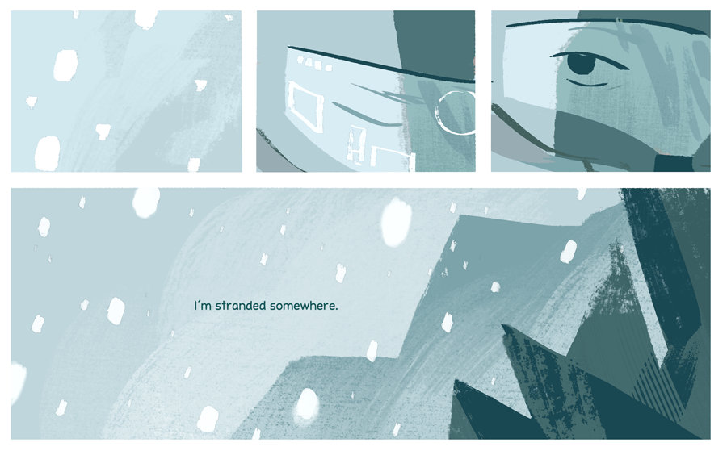

That moment when you use "homo" and "hetero" as shorthand for "homogenous" and "heterogenous"

(Originally on Twitter: [Wed Jun 05 20:15:29 +0000 2019](https://twitter.com/ezyang/status/1136365946841513984))
----
That moment when you realize that the reason your Pixel 3a call volume is so low is because you didn't take the screen protector off

(Originally on Twitter: [Thu Jun 06 00:32:52 +0000 2019](https://twitter.com/ezyang/status/1136430722871414784))
----
RT @gregyoung: Who wants to play? 

(Originally on Twitter: [Thu Jun 06 13:13:42 +0000 2019](https://twitter.com/ezyang/status/1136622189627809793))
----
RT @ThomasViehmann: If you enjoyed @ezyang 's presentation on @PyTorch internals, take it a step further by fixing your a PyTorch bug. Here…

(Originally on Twitter: [Mon Jun 10 12:49:12 +0000 2019](https://twitter.com/ezyang/status/1138065578244149248))
----
Brew Python and an unknown renegade are locked in an epic struggle for control over /usr/local/bin/python3 on my Mac

(Originally on Twitter: [Mon Jun 10 21:41:14 +0000 2019](https://twitter.com/ezyang/status/1138199466551517187))
----
That moment when you decide you're going to fix this problem... by reading the documentation

(Originally on Twitter: [Wed Jun 12 19:43:57 +0000 2019](https://twitter.com/ezyang/status/1138894727930032128))
----
Interwebs please help. How am I supposed to write a PkgConfig.cmake file that supports both static and dynamic linking. https://stackoverflow.com/questions/56569652/how-to-provide-a-cmake-package-aka-config-cmake-that-supports-static-linking

(Originally on Twitter: [Wed Jun 12 20:08:15 +0000 2019](https://twitter.com/ezyang/status/1138900844617879553))
----
That feeling when you're reading some code and you think, "That can't possibly work", and then you check the bug tracker and find out, yes, you're right, it doesn't work

(Originally on Twitter: [Thu Jun 13 21:07:46 +0000 2019](https://twitter.com/ezyang/status/1139278208925405186))
----
RT @gigideegee: i made a comic about samus 

(Originally on Twitter: [Fri Jun 14 20:24:42 +0000 2019](https://twitter.com/ezyang/status/1139629759095349249))
----
Donated blood! First time I've done it since grad school.

(Originally on Twitter: [Thu Jun 20 15:45:35 +0000 2019](https://twitter.com/ezyang/status/1141733842312732672))
----
@nelhage Congrats on open sourcing Sorbet!

(Originally on Twitter: [Fri Jun 21 02:57:27 +0000 2019](https://twitter.com/ezyang/status/1141902923984789505))
----
Can Linear Algebra Be Liberated From The Transpose Style? (2019)

(Originally on Twitter: [Sun Jun 23 03:22:14 +0000 2019](https://twitter.com/ezyang/status/1142633936507547648))
----
@0nifr We are thinking about adding forward AD to PyTorch. We’d like to do this without having to redo all of our derivative formulas. Transposition of functions is the key to unlock the door to a secret paradise...

(Originally on Twitter: [Sun Jun 23 18:18:48 +0000 2019](https://twitter.com/ezyang/status/1142859565303836674))
----
Reverse mode automatic differentiation is just the transpose of the linear approximation of a function at some point, what’s the problem?

(Originally on Twitter: [Sun Jun 23 18:20:41 +0000 2019](https://twitter.com/ezyang/status/1142860039373361152))
----
@shachaf That’s the transpose! If A -&gt; B is your linear approximation, the RAD is the transposed linear map, B -&gt; A (At this point a mathematician breaks down my door and says, “No no no, that’s in the duuuual space sir!”)

(Originally on Twitter: [Sun Jun 23 18:29:27 +0000 2019](https://twitter.com/ezyang/status/1142862248119013376))
----
@shachaf @sigkill_dk I doubt you would say that the linear map A -&gt; B is the same thing as the linear map B -&gt; A? We can talk about the domain and range of a linear map without referring to computational concerns

(Originally on Twitter: [Sun Jun 23 18:55:25 +0000 2019](https://twitter.com/ezyang/status/1142868778994360327))
----
@shachaf This is what the Wikipedia article says but it’s very misleading because at the end of the day you want to take a vector product with the Jacobian. And in forward mode it’s a jvp, but in backwards it’s a vjp, and if you consider the linear map on v it transposes.

(Originally on Twitter: [Sun Jun 23 19:29:43 +0000 2019](https://twitter.com/ezyang/status/1142877412113473539))
----
@shachaf @sigkill_dk I mean sure, there’s a dual space involved, but most practitioners don’t consider it at all. We don’t pass around nx1 column tensors, after all

(Originally on Twitter: [Sun Jun 23 19:32:50 +0000 2019](https://twitter.com/ezyang/status/1142878195227799560))
----
@johnzabroski Fortunately Alexander Rush has already written this essay so I don’t have to ;) http://nlp.seas.harvard.edu/NamedTensor

(Originally on Twitter: [Sun Jun 23 19:34:51 +0000 2019](https://twitter.com/ezyang/status/1142878705922007040))
----
RT @sigfpe: @ezyang @shachaf I actually wrote a paper on this in the context of graphics. Transposition really is a not-quite-trivial progr…

(Originally on Twitter: [Sun Jun 23 19:44:57 +0000 2019](https://twitter.com/ezyang/status/1142881245325668353))
----
@sigfpe @shachaf Or you can just make your input program linear :)

(Originally on Twitter: [Sun Jun 23 20:10:51 +0000 2019](https://twitter.com/ezyang/status/1142887765794799616))
----
RT @conal: @ezyang You can express AD very simply using an abstract interface to linear maps (and beyond). Instantiating with different con…

(Originally on Twitter: [Sun Jun 23 20:40:50 +0000 2019](https://twitter.com/ezyang/status/1142895311964266497))
----
RT @conal: @sigfpe @ezyang @shachaf Whenever I see an algorithm with a "forward pass" and a "reverse pass", I suspect that it's really a si…

(Originally on Twitter: [Sun Jun 23 21:02:05 +0000 2019](https://twitter.com/ezyang/status/1142900658732961792))
----
Hot take: function transposition is CPS conversion(?)

(Originally on Twitter: [Sun Jun 23 21:51:42 +0000 2019](https://twitter.com/ezyang/status/1142913146115579905))
----
Not exactly; it’s only half a CPS transform (A to A -&gt; R)

(Originally on Twitter: [Sun Jun 23 22:00:43 +0000 2019](https://twitter.com/ezyang/status/1142915415112323073))
----
@PerryWagle Mm, I don't think so. When I say dual is "half CPS", it's because you have to dualize a type twice to get the CPS form (A -&gt; R) -&gt; R

(Originally on Twitter: [Mon Jun 24 01:58:12 +0000 2019](https://twitter.com/ezyang/status/1142975179745890305))
----
@krismicinski In linear algebra, the transpose of a linear map A -&gt; B, is the induced map (B -&gt; R) -&gt; (A -&gt; R) (A -&gt; R being the dual space of A). I think of CPS as taking A to (A -&gt; R) -&gt; R, thus "half" a CPS (come to think of it, we call A -&gt; R the dual functor in Haskell too)

(Originally on Twitter: [Mon Jun 24 02:02:10 +0000 2019](https://twitter.com/ezyang/status/1142976174026608640))
----
@PerryWagle The question mark means I don't really know the answer to the question :)

(Originally on Twitter: [Mon Jun 24 02:02:34 +0000 2019](https://twitter.com/ezyang/status/1142976275113320448))
----
@johnzabroski I have perennially been unable to log into my LtU account; if you want to share it be my guest :)

(Originally on Twitter: [Mon Jun 24 13:53:31 +0000 2019](https://twitter.com/ezyang/status/1143155192629796865))
----
@Deran44525300 The major components are: (1) you need to know how to write fast CPU/CUDA kernels for operations, (2) you need to design your tensor data structure, (3) for an eager mode framework, you need to implement automatic differentiation. http://blog.ezyang.com/2019/05/pytorch-internals/ might be helpful

(Originally on Twitter: [Mon Jun 24 13:55:09 +0000 2019](https://twitter.com/ezyang/status/1143155602203598848))
----
RT @sigfpe: My entire lifetime's career planning:
8: I wanna be a fireman
12: nuclear physicist sounds cool
16: fantasising about jobs is s…

(Originally on Twitter: [Mon Jun 24 13:58:56 +0000 2019](https://twitter.com/ezyang/status/1143156555124236291))
----
RT @ccshan: @ezyang Can spreadsheets be liberated from the Sheet1!A1 style? https://www.youtube.com/watch?v=TbsfvdZXE7s

(Originally on Twitter: [Tue Jun 25 17:38:28 +0000 2019](https://twitter.com/ezyang/status/1143574189850419200))
----
RT @aaron_turon: Short personal post for my Rust tweeps: I'm baaaaack! http://aturon.github.io/tech/2019/06/25/back-in-the-saddle/

(Originally on Twitter: [Wed Jun 26 02:43:51 +0000 2019](https://twitter.com/ezyang/status/1143711439703674880))
----
@b0rk Backtrace!

(Originally on Twitter: [Wed Jun 26 21:43:03 +0000 2019](https://twitter.com/ezyang/status/1143998130033168384))
----
RT @dasingleton: Interesting thread/comments, but I think it misses something important. It is of course true that science criticisms shoul…

(Originally on Twitter: [Fri Jun 28 20:01:54 +0000 2019](https://twitter.com/ezyang/status/1144697449673629706))
----
