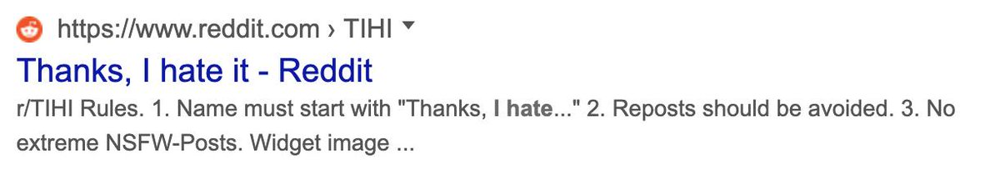

That moment when you want to pay X for a service, but they literally will not take your money.

(Originally on Twitter: [Tue Aug 06 13:15:18 +0000 2019](https://twitter.com/ezyang/status/1158728254301319168))
----
God help me, I think I am reinventing debhelper.

(Originally on Twitter: [Wed Aug 07 01:02:07 +0000 2019](https://twitter.com/ezyang/status/1158906128056684550))
----
Discord's "emoji for role" is such a good UI hack and I can't do it on GitHub because there's no webhook notifications for reactoins T.T

(Originally on Twitter: [Tue Aug 13 20:59:31 +0000 2019](https://twitter.com/ezyang/status/1161381791816699904))
----
It's like an ABLATION STUDY but for a BUILD SYSTEM

(Originally on Twitter: [Wed Aug 14 19:02:25 +0000 2019](https://twitter.com/ezyang/status/1161714711907491841))
----
T/F: if you want to write fast code, write down a list of what morally should happen, and then make sure the actual code only does that

(Originally on Twitter: [Sat Aug 17 01:42:36 +0000 2019](https://twitter.com/ezyang/status/1162540197885685763))
----
@sigkill_dk But even in this domain, the way to write fast kernels is to figure how fast you can morally go (roofline model) and hold yourself to it

(Originally on Twitter: [Sat Aug 17 04:23:58 +0000 2019](https://twitter.com/ezyang/status/1162580805002178560))
----
You want to write the loop `for (int i = base; i &lt; bound; i += block)` but bound may be close to MAX_INT. How do you write this without overflow?

(Originally on Twitter: [Tue Aug 20 21:36:31 +0000 2019](https://twitter.com/ezyang/status/1163927819304472576))
----
@cbarrett This would not work if `bound == MAX_INT`

(Originally on Twitter: [Tue Aug 20 21:42:35 +0000 2019](https://twitter.com/ezyang/status/1163929348031811585))
----
@cbarrett Hmm, actually, maybe it would, but only because I said `i &lt; bound` and not `i &lt;= bound`

(Originally on Twitter: [Tue Aug 20 21:43:39 +0000 2019](https://twitter.com/ezyang/status/1163929612772098049))
----
@cbarrett It also results in different assembly https://godbolt.org/z/Qc7yl1

(Originally on Twitter: [Tue Aug 20 21:45:21 +0000 2019](https://twitter.com/ezyang/status/1163930043611041794))
----
@mihaimaruseac Signed overflow is UB in C/C++

(Originally on Twitter: [Tue Aug 20 21:46:35 +0000 2019](https://twitter.com/ezyang/status/1163930350722191360))
----
@cbarrett Though requiring the assembly be the same in both cases might be unrealistic...

(Originally on Twitter: [Tue Aug 20 21:47:54 +0000 2019](https://twitter.com/ezyang/status/1163930684903309313))
----
RT @kccqzy: @ezyang bool did_overflow = false;
for (int i = base; i &lt; bound &amp;&amp; !did_overflow; did_overflow = __builtin_add_overflow(i, bloc…

(Originally on Twitter: [Wed Aug 21 11:22:29 +0000 2019](https://twitter.com/ezyang/status/1164135681058332673))
----
RT @samth: @laurencetratt @ShriramKMurthi This is a drawback of collaborative research: having to self cite everyone else's papers.

(Originally on Twitter: [Wed Aug 21 12:04:07 +0000 2019](https://twitter.com/ezyang/status/1164146156051546118))
----
RT @HerrDreyer: Pro tip #1 for future general chairs of ICFP: Get lucky.  The biggest comment I received was that the food this year was re…

(Originally on Twitter: [Fri Aug 23 12:05:07 +0000 2019](https://twitter.com/ezyang/status/1164871186960044032))
----
Is there a way to tell a C/C++ optimizer "assume X is true for the body of this code", without having it actually generate code to test X is true

(Originally on Twitter: [Fri Aug 23 21:06:35 +0000 2019](https://twitter.com/ezyang/status/1165007448916353024))
----
RT @shachaf: @ezyang It depends on X, but you can often use something like "if (!X) unreachable();".

(Originally on Twitter: [Fri Aug 23 21:09:45 +0000 2019](https://twitter.com/ezyang/status/1165008246698123266))
----
RT @wmobit: @ezyang __builtin_assume

(Originally on Twitter: [Fri Aug 23 21:12:38 +0000 2019](https://twitter.com/ezyang/status/1165008971104706560))
----
@cbarrett Isn't that the one you use for likely/unlikely macros

(Originally on Twitter: [Fri Aug 23 21:12:57 +0000 2019](https://twitter.com/ezyang/status/1165009051857674243))
----
Google added me to some experiment where they put the URLs on top of the search bars and I HATE IT 

(Originally on Twitter: [Fri Aug 23 21:13:48 +0000 2019](https://twitter.com/ezyang/status/1165009265637167104))
----
Hi Twitter-sphere. Have you ever setup recurring cachegrind profiling for a program you worked on? Can you share the setup? https://www.sqlite.org/cpu.html is the only setup I'm aware of (one interesting thing: they have some TCL scripts for processing cachegrind outputs)

(Originally on Twitter: [Mon Aug 26 15:35:33 +0000 2019](https://twitter.com/ezyang/status/1166011305838428161))
----
RT @mihaimaruseac: @ezyang I think people are now using perf instead

(Originally on Twitter: [Tue Aug 27 14:18:18 +0000 2019](https://twitter.com/ezyang/status/1166354252014526464))
----
@mihaimaruseac Perf isn't deterministic though? Is the situation that it's deterministic enough?

(Originally on Twitter: [Tue Aug 27 14:19:20 +0000 2019](https://twitter.com/ezyang/status/1166354515605561344))
----
@jjcarett2 @andrejbauer @andrasKovacs6 @mietek Distinguish between variables and labels. E.g. as seen in F-ing modules

(Originally on Twitter: [Fri Aug 30 00:31:36 +0000 2019](https://twitter.com/ezyang/status/1167233369140277248))
----
Oh happy day, there's a new Caravan Palace album

(Originally on Twitter: [Fri Aug 30 14:46:23 +0000 2019](https://twitter.com/ezyang/status/1167448482677833729))
----
I think my favorite new tracks are Waterguns and Supersonics. But that opening riff on April, oh man.

(Originally on Twitter: [Fri Aug 30 19:52:49 +0000 2019](https://twitter.com/ezyang/status/1167525600443060224))
----
When changing the semantics of code, turn what would be runtime errors into compile time errors through whatever means necessary.

(Originally on Twitter: [Fri Aug 30 21:13:35 +0000 2019](https://twitter.com/ezyang/status/1167545927923466240))
----
