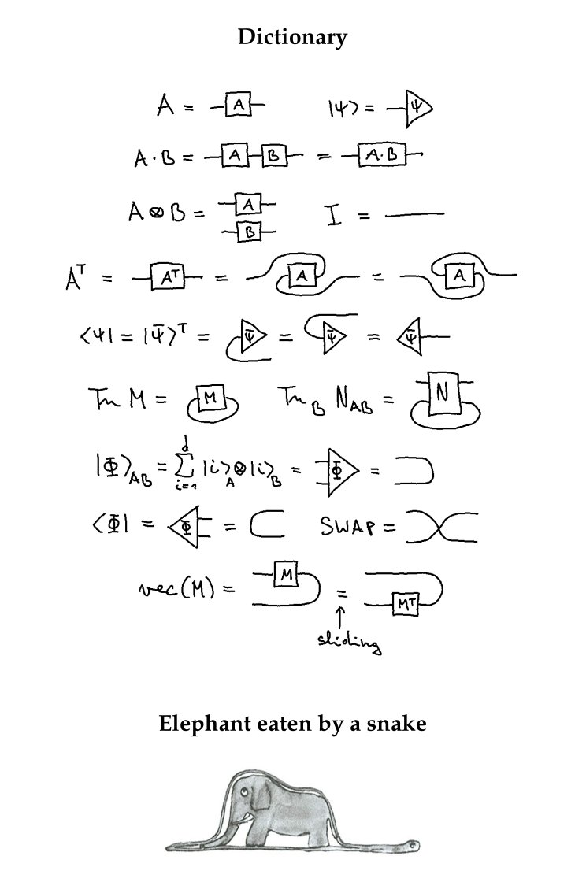

@deech Yes, standalone deriving

(Originally on Twitter: [Wed Dec 04 23:54:36 +0000 2019](https://twitter.com/ezyang/status/1202375684766781440))
----
RT @simrob: Been awhile since I shared the Official Sorting Algorithm Alignment Chart, my most important contribution to computer science e…

(Originally on Twitter: [Fri Dec 06 01:45:57 +0000 2019](https://twitter.com/ezyang/status/1202766090968928256))
----
I get a little thrill writing my course page in plain HTML

(Originally on Twitter: [Fri Dec 06 02:37:53 +0000 2019](https://twitter.com/ezyang/status/1202779160579657729))
----
Complete with &lt;font color="red"&gt; and a shitty stylesheet

(Originally on Twitter: [Fri Dec 06 02:38:16 +0000 2019](https://twitter.com/ezyang/status/1202779260370468865))
----
RT @soumithchintala: The first full paper on @pytorch after 3 years of development.
It describes our goals, design principles, technical de…

(Originally on Twitter: [Fri Dec 06 16:33:52 +0000 2019](https://twitter.com/ezyang/status/1202989545123405824))
----
@chipro CircleCI supports gpus on ci if you pay ;) (PyTorch uses them for ci)

(Originally on Twitter: [Fri Dec 06 19:06:54 +0000 2019](https://twitter.com/ezyang/status/1203028056463597573))
----
RT @polynoamial: 6 months ago we showed with #Pluribus that search was the key to beating top humans in poker. Today @adamlerer, Hengyuan H…

(Originally on Twitter: [Sat Dec 07 03:45:56 +0000 2019](https://twitter.com/ezyang/status/1203158674702815234))
----
RT @adamlikesai: I have some great Friday news for all @PreferredNet #CuPy and @PyTorch users. Thanks to this merged PR: https://t.co/XOaYx…

(Originally on Twitter: [Sat Dec 07 03:47:42 +0000 2019](https://twitter.com/ezyang/status/1203159119198375936))
----
RT @jix_: I'm super excited to announce a new result: sorting 11 inputs using a sorting network requires 35 comparisons and sorting 12 inpu…

(Originally on Twitter: [Sat Dec 07 21:04:42 +0000 2019](https://twitter.com/ezyang/status/1203420088994545665))
----
RT @bascule: Current San Francisco status: Market Street is now known as Lake Market Street 

<video controls><source src="media/1203470550955429888-kLSg6egbcWKaNwCy.mp4">Your browser does not support the video tag.</video>
media/1203470550955429888-kLSg6egbcWKaNwCy.mp4

(Originally on Twitter: [Sun Dec 08 00:25:13 +0000 2019](https://twitter.com/ezyang/status/1203470550955429888))
----
That moment when you spend a few hours researching the info behind one slide, just so that feel that you are presenting it with some "weight" behind it

(Originally on Twitter: [Sun Dec 08 02:06:11 +0000 2019](https://twitter.com/ezyang/status/1203495958656561152))
----
@deech It’s also like how the Windows API isn’t bad either XD

(Originally on Twitter: [Sun Dec 08 17:29:31 +0000 2019](https://twitter.com/ezyang/status/1203728325518254080))
----
RT @whitequark: fuel is such an amazingly powerful technique for debugging optimizing compilers

(Originally on Twitter: [Wed Dec 11 01:38:45 +0000 2019](https://twitter.com/ezyang/status/1204576221255716864))
----
Is there a word for a, uh, non-injective permutation? Like, a permutation, but I can also insert dummy sentinels where ever I want in the result

(Originally on Twitter: [Wed Dec 11 03:18:29 +0000 2019](https://twitter.com/ezyang/status/1204601320717438976))
----
RT @enclanglement: Helping my students to see beyond equations. 

(Originally on Twitter: [Wed Dec 11 23:28:39 +0000 2019](https://twitter.com/ezyang/status/1204905867910377474))
----
RT @nonphotorealist: @ezyang "Transformation", or perhaps "partial transformation" if the purpose of the sentinels is to indicate elements…

(Originally on Twitter: [Thu Dec 12 02:16:01 +0000 2019](https://twitter.com/ezyang/status/1204947986964344832))
----
RT @pcwalton: I missed this post on modern GCs from Mike Hearn. A must-read to understand the state of the art in low-latency GC: https://t…

(Originally on Twitter: [Thu Dec 12 04:06:26 +0000 2019](https://twitter.com/ezyang/status/1204975773762744320))
----
RT @UrcherAus: @janellekz How do we solve the problem of communication breakdown between management and engineering?

In business loans are…

(Originally on Twitter: [Thu Dec 12 04:06:52 +0000 2019](https://twitter.com/ezyang/status/1204975882613317632))
----
@eevee Having to wait for the Internet to collectively figure out how to solve the puzzle because it’s too hard

(Originally on Twitter: [Thu Dec 12 04:12:12 +0000 2019](https://twitter.com/ezyang/status/1204977226199863298))
----
I'm trying to debug an RTLD_LOCAL related UBSAN problem. Is there a way to get LD_DEBUG to print the addresses of symbols after it binds them?

(Originally on Twitter: [Thu Dec 12 05:35:33 +0000 2019](https://twitter.com/ezyang/status/1204998198999171072))
----
RT @gereedy: @ezyang You can maybe use LD_AUDIT facility (https://linux.die.net/man/7/rtld-audit) if it doesn’t interfere with what you want to measure. T…

(Originally on Twitter: [Fri Dec 13 00:27:02 +0000 2019](https://twitter.com/ezyang/status/1205282948783558657))
----
UBSAN is complaining that an object passed between two dynamic libraries is not the same because you didn't load with RTLD_GLOBAL and so they got distinct typeinfo

(Originally on Twitter: [Fri Dec 13 02:29:37 +0000 2019](https://twitter.com/ezyang/status/1205313795662331904))
----
Fuck weak symbols

(Originally on Twitter: [Fri Dec 13 02:33:22 +0000 2019](https://twitter.com/ezyang/status/1205314740148293632))
----
What about if your program does not use RTTI at all?

(Originally on Twitter: [Fri Dec 13 03:24:14 +0000 2019](https://twitter.com/ezyang/status/1205327542980210694))
----
RT @pkhuong: @ezyang I believe that's a known issue with ubsan, and the correctness depends on the stdlibc++'s implementation of type compa…

(Originally on Twitter: [Fri Dec 13 04:06:46 +0000 2019](https://twitter.com/ezyang/status/1205338244113502209))
----
RT @pkhuong: @ezyang There are many opaque ways local bindings can mess with C++ programs that rely on symbol merging for correctness. RTTI…

(Originally on Twitter: [Fri Dec 13 04:06:55 +0000 2019](https://twitter.com/ezyang/status/1205338284924125184))
----
