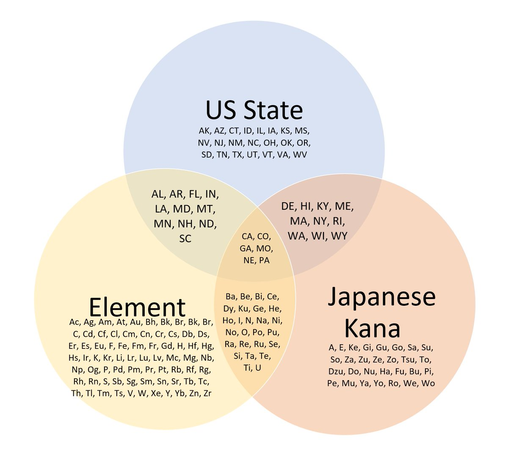

In Racket, is it more idiomatic to use empty?/first/rest or pattern match on lists

(Originally on Twitter: [Mon May 04 22:08:51 +0000 2020](https://twitter.com/ezyang/status/1257432026749247489))
----
Playing around with cKanren for shape checking right now

(Originally on Twitter: [Tue May 05 02:56:27 +0000 2020](https://twitter.com/ezyang/status/1257504402199515137))
----
Hot take: reverso is one of the great unsolved problems of relational programming

(Originally on Twitter: [Tue May 05 17:38:12 +0000 2020](https://twitter.com/ezyang/status/1257726301538062337))
----
So I was thinking to myself, "How the heck do you define logic programs that are guaranteed to terminate even when there are no solutions" and it turns out that this is pretty hard and you can write papers about it, e.g. http://okmij.org/ftp/Prolog/Arithm/arithm.pdf

(Originally on Twitter: [Wed May 06 14:09:43 +0000 2020](https://twitter.com/ezyang/status/1258036222838145024))
----
In this paper, the general recipe is "computing bidirectional bounds from arguments of unknown instantiatedness...the key to decidable multiplication is to limit the search using bounds that the inputs place on each other, without testing whether any input is instantiated."

(Originally on Twitter: [Wed May 06 14:12:04 +0000 2020](https://twitter.com/ezyang/status/1258036813471637505))
----
Satisfiability versus quantifier instantiation

(Originally on Twitter: [Wed May 06 14:41:57 +0000 2020](https://twitter.com/ezyang/status/1258044333514797056))
----
"Finite domain propagation" is a lot more similar to how humans do logic puzzles than SAT solving (which is way more brute force)

(Originally on Twitter: [Wed May 06 15:08:17 +0000 2020](https://twitter.com/ezyang/status/1258050963383951361))
----
RT @lindsey: @ezyang When teaching SAT, I started by talking about Boolean constraint propagation, showed a solver that only did that, and…

(Originally on Twitter: [Wed May 06 15:46:18 +0000 2020](https://twitter.com/ezyang/status/1258060527856730112))
----
Too much code is a heavy burden

(Originally on Twitter: [Wed May 06 17:49:57 +0000 2020](https://twitter.com/ezyang/status/1258091648120172550))
----
Engineers think we can solve anything because we're very good at deciding not to work on unsolvable problems

(Originally on Twitter: [Wed May 06 21:15:57 +0000 2020](https://twitter.com/ezyang/status/1258143487947608071))
----
Writing a type checker in 30 lines of miniKanren is a great parlor trick. And then you have a program that can synthesize a term given a type!

(Originally on Twitter: [Fri May 08 02:54:07 +0000 2020](https://twitter.com/ezyang/status/1258590980107796481))
----
Right now, I am SO ANNOYED that mypy appears to have special cased "list of types" solely for Callable. Come on!!

(Originally on Twitter: [Sun May 10 03:23:35 +0000 2020](https://twitter.com/ezyang/status/1259323168424108033))
----
I could sure use some F-bounded polymorphism right about now...

(Originally on Twitter: [Sun May 10 04:25:26 +0000 2020](https://twitter.com/ezyang/status/1259338734669086720))
----
CUDA block and grid arithmetic is like indexing off-by-one interview question from hell

(Originally on Twitter: [Mon May 11 02:46:15 +0000 2020](https://twitter.com/ezyang/status/1259676161258504192))
----
RT @_fuurei: ngl i am very pleased with myself right now

#AnimalCrossing #ACNH 

(Originally on Twitter: [Tue May 12 01:28:06 +0000 2020](https://twitter.com/ezyang/status/1260018882485469184))
----
So you know how companies are supposed to post an LCA notice in two conspicuous locations at the workplace when they seek an H-1B visa for their employee? Well, there's a pandemic now, so the lawyers are telling H-1B applicants to post these in their home office.🤦

(Originally on Twitter: [Tue May 12 15:46:09 +0000 2020](https://twitter.com/ezyang/status/1260234817544826880))
----
You're distributing a few Windows DLLs and want to explain to your users how to link against it. You keep getting bug reports from users who are manually filling in library and include paths into MSVC GUI. What is the right playbook here?

(Originally on Twitter: [Tue May 12 16:31:13 +0000 2020](https://twitter.com/ezyang/status/1260246159831990278))
----
RT @kushashwa: @ezyang Have faced this issue myself as well. Video tutorials are better when it comes to explaining things with MSVC GUI. S…

(Originally on Twitter: [Tue May 12 17:02:20 +0000 2020](https://twitter.com/ezyang/status/1260253991017078784))
----
@smdiehl I have a marvelous solution to this problem but alas it is too long to contain within this tweet

(Originally on Twitter: [Wed May 13 17:02:24 +0000 2020](https://twitter.com/ezyang/status/1260616395861229570))
----
Writing down many options in the brainstorming phase vs. presenting one option when communicating to others

(Originally on Twitter: [Wed May 13 19:04:34 +0000 2020](https://twitter.com/ezyang/status/1260647139341774849))
----
RT @blockwonkel: 

(Originally on Twitter: [Thu May 14 12:58:30 +0000 2020](https://twitter.com/ezyang/status/1260917404261126144))
----
I feel a bit bad when I tell people to split up their PRs because it is hard to review, and then after they split it up I find more problems. (Like, this was the /point/, but it feels like I'm punishing them for doing the right thing)

(Originally on Twitter: [Thu May 14 14:10:32 +0000 2020](https://twitter.com/ezyang/status/1260935532646772741))
----
Does Sphinx have support for more complicated testing? E.g., testing if a tutorial works end to end?

(Originally on Twitter: [Thu May 14 16:20:48 +0000 2020](https://twitter.com/ezyang/status/1260968315603816455))
----
It seems that the way people tend to do this is by abusing sphinx-gallery

(Originally on Twitter: [Fri May 15 17:07:35 +0000 2020](https://twitter.com/ezyang/status/1261342477161644034))
----
RT @OhSoPrecious16: I recreated the "Who Broke It?" scene from Parks and Rec with my Animal Crossing villagers 

<video controls><source src="media/1261478639448842240-UwxMhehwhM9a6IQC.mp4">Your browser does not support the video tag.</video>
media/1261478639448842240-UwxMhehwhM9a6IQC.mp4

(Originally on Twitter: [Sat May 16 02:08:39 +0000 2020](https://twitter.com/ezyang/status/1261478639448842240))
----
Compiler is able to optimize 1.0 * x + 0.0 into x (assume float)

(Originally on Twitter: [Mon May 18 19:57:51 +0000 2020](https://twitter.com/ezyang/status/1262472489436880896))
----
@nelhage @pozorvlak This is what I would consider the model answer :)

(Originally on Twitter: [Mon May 18 20:31:29 +0000 2020](https://twitter.com/ezyang/status/1262480953622040576))
----
Woe is me: do I invent a new term to describe a concept X' which is very similar to X, or do I just reuse the name and say "which one I mean is clear from context"

(Originally on Twitter: [Thu May 21 15:13:32 +0000 2020](https://twitter.com/ezyang/status/1263488101894295557))
----
TIL you can use partial template specializations to do pattern matching on types in C++. template&lt;... variables bound by pattern ...&gt; class A&lt;... the pattern ...&gt; { ... payload ... }. You can do as many parameter packs as you want.

(Originally on Twitter: [Thu May 21 20:53:26 +0000 2020](https://twitter.com/ezyang/status/1263573638776852481))
----
RT @nelhage: A month later, I just want to report that, as usual, I tried a bunch of tools and then gave up and used https://poormansprofiler.org/

(Originally on Twitter: [Fri May 22 23:35:29 +0000 2020](https://twitter.com/ezyang/status/1263976807109459986))
----
@mjsottile You can be like Facebook and write a compiler for Python :)

(Originally on Twitter: [Mon May 25 15:10:03 +0000 2020](https://twitter.com/ezyang/status/1264936776336097281))
----
