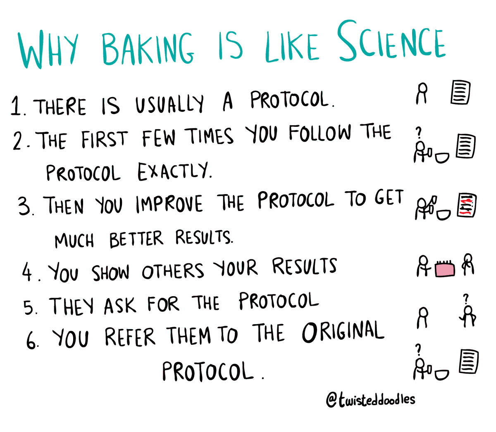

RT @EricaJoy: it happened!!

in an unprecedented move, the news side of the times would like you to know that the opinion side cannot sit w…

(Originally on Twitter: [Thu Jun 04 03:46:04 +0000 2020](https://twitter.com/ezyang/status/1268388523310223362))
----
Drat, constant propagation thwarted by inlining of function https://godbolt.org/z/bV9PpW

(Originally on Twitter: [Fri Jun 05 15:39:21 +0000 2020](https://twitter.com/ezyang/status/1268930417182347265))
----
tfw can't refactor a function to forward to another function with *args, **kwargs because it breaks inspect.signature (implicit APIs arrrrgh)

(Originally on Twitter: [Sun Jun 07 03:07:04 +0000 2020](https://twitter.com/ezyang/status/1269465873376595975))
----
@CatalogScanner 

<video controls><source src="media/1269468148811497473-dP9cuLnakbAk2Tjp.mp4">Your browser does not support the video tag.</video>
media/1269468148811497473-dP9cuLnakbAk2Tjp.mp4

(Originally on Twitter: [Sun Jun 07 03:16:06 +0000 2020](https://twitter.com/ezyang/status/1269468148811497473))
----
Forget gradual dependent typing, can I just get gradual generics please?

(Originally on Twitter: [Sun Jun 07 03:59:13 +0000 2020](https://twitter.com/ezyang/status/1269478997894868992))
----
@cursecompiler Does it count if the DSL is literally SQL? Ur/Web fits the bill then.

(Originally on Twitter: [Tue Jun 09 14:00:07 +0000 2020](https://twitter.com/ezyang/status/1270354996958236672))
----
@ttuegel At least at work, it feels like VS Code is the future

(Originally on Twitter: [Wed Jun 10 21:49:24 +0000 2020](https://twitter.com/ezyang/status/1270835482700795906))
----
@ttuegel IDK, I'm still coding in vim with no language server... just don't write any errors, what's the big deal 😂

(Originally on Twitter: [Wed Jun 10 22:12:06 +0000 2020](https://twitter.com/ezyang/status/1270841192419340289))
----
@ttuegel No, but that's more C++'s fault than my editors...

(Originally on Twitter: [Wed Jun 10 22:16:21 +0000 2020](https://twitter.com/ezyang/status/1270842262956670976))
----
RT @tesseralis: My suggestion is we name the main branch "canon". Consider:

* "we'll add it to the canon"
* "we've updated the canon"
* "o…

(Originally on Twitter: [Fri Jun 12 04:54:22 +0000 2020](https://twitter.com/ezyang/status/1271304815067480064))
----
The bar for "how would you test this function" in technical interviews is so incredibly low

(Originally on Twitter: [Fri Jun 12 18:04:53 +0000 2020](https://twitter.com/ezyang/status/1271503755184308225))
----
@whitequark Can you just use TBB instead?

(Originally on Twitter: [Mon Jun 15 03:54:27 +0000 2020](https://twitter.com/ezyang/status/1272376901651304449))
----
@whitequark RIP

(Originally on Twitter: [Mon Jun 15 04:25:28 +0000 2020](https://twitter.com/ezyang/status/1272384708798791682))
----
Is there ever a case you would compute a unit vector by going through atan2/sin/cos as opposed to dividing by the norm?

(Originally on Twitter: [Mon Jun 15 15:44:17 +0000 2020](https://twitter.com/ezyang/status/1272555534999306243))
----
RT @pavpanchekha: @ezyang Dividing by the norm is more accurate, especially if you use hypot in computing the norm (in which case there's b…

(Originally on Twitter: [Mon Jun 15 17:26:17 +0000 2020](https://twitter.com/ezyang/status/1272581204928274435))
----
sigh... why is purging old linux kernels an O(n^2) operation

(Originally on Twitter: [Mon Jun 15 20:32:08 +0000 2020](https://twitter.com/ezyang/status/1272627978191753218))
----
Make things worse to make them easier to change

(Originally on Twitter: [Tue Jun 16 17:38:51 +0000 2020](https://twitter.com/ezyang/status/1272946756926439430))
----
It's so weird when you go from real to complex and then conjugates randomly pop up in places there wasn't anything before

(Originally on Twitter: [Fri Jun 19 17:26:22 +0000 2020](https://twitter.com/ezyang/status/1274030777806786564))
----
RT @HeinrichKuttler: @ezyang Actually, it was always in you, formula.

(Originally on Twitter: [Fri Jun 19 19:36:10 +0000 2020](https://twitter.com/ezyang/status/1274063443264442372))
----
@samth Err, what's HEY?

(Originally on Twitter: [Fri Jun 19 19:36:38 +0000 2020](https://twitter.com/ezyang/status/1274063560411426822))
----
@HeinrichKuttler God damn fucking dual spaces

(Originally on Twitter: [Fri Jun 19 22:08:38 +0000 2020](https://twitter.com/ezyang/status/1274101812090585088))
----
RT @twisteddoodles: Why baking is like science (a cartoon for @newscientist)  #science #phdchat #baking 

(Originally on Twitter: [Fri Jun 19 22:24:38 +0000 2020](https://twitter.com/ezyang/status/1274105837502582786))
----
Baby's first Fourier decomposition

(Originally on Twitter: [Sun Jun 21 21:47:46 +0000 2020](https://twitter.com/ezyang/status/1274821335320072193))
----
@PLT_cheater @sigfpe @fermatslibrary Dan is referring to Godel numbering, I think

(Originally on Twitter: [Wed Jun 24 02:51:01 +0000 2020](https://twitter.com/ezyang/status/1275622429155643392))
----
What's the minimal amount of mathematical structure you need to define a concept of JVP and VJP on both R and C?

(Originally on Twitter: [Wed Jun 24 20:47:57 +0000 2020](https://twitter.com/ezyang/status/1275893446872567808))
----
@MarisaVeryMoe It's not just R^2; when computing VJP you have to conjugate the vector (which is actually why I'm asking the question!) More at https://jax.readthedocs.io/en/latest/notebooks/autodiff_cookbook.html#Complex-numbers-and-differentiation

(Originally on Twitter: [Wed Jun 24 21:48:52 +0000 2020](https://twitter.com/ezyang/status/1275908776974041088))
----
@MarisaVeryMoe @cHHillee Yeah, so the "trash" output you get when a function is not holomorphic is you'll only get some of the derivatives (e.g., you'll get the derivative with respect to changes in the real component, but not the imaginary component).

(Originally on Twitter: [Wed Jun 24 21:59:47 +0000 2020](https://twitter.com/ezyang/status/1275911523144290307))
----
RT @Blaisorblade: @kc_srk @whitequark PSA help welcome: Xavier Leroy plans to port OCaml to macOS-ARM in ~10 days, but would love (access t…

(Originally on Twitter: [Thu Jun 25 01:15:29 +0000 2020](https://twitter.com/ezyang/status/1275960775908233216))
----
RT @facebookai: We are sharing the NetHack Learning Environment, a fast research environment based on the procedurally generated single-pla…

(Originally on Twitter: [Thu Jun 25 16:07:04 +0000 2020](https://twitter.com/ezyang/status/1276185150246830080))
----
@Raisharmashivam Hi Shivam, there's someone already looking into this issue! Maybe you'd be interested in this one? https://github.com/pytorch/pytorch/issues/33501 I'm not too familiar with development on Windows, but one possibility is to use WSL to get a Linux dev environment and develop there.

(Originally on Twitter: [Mon Jun 29 14:31:58 +0000 2020](https://twitter.com/ezyang/status/1277610765533446144))
----
