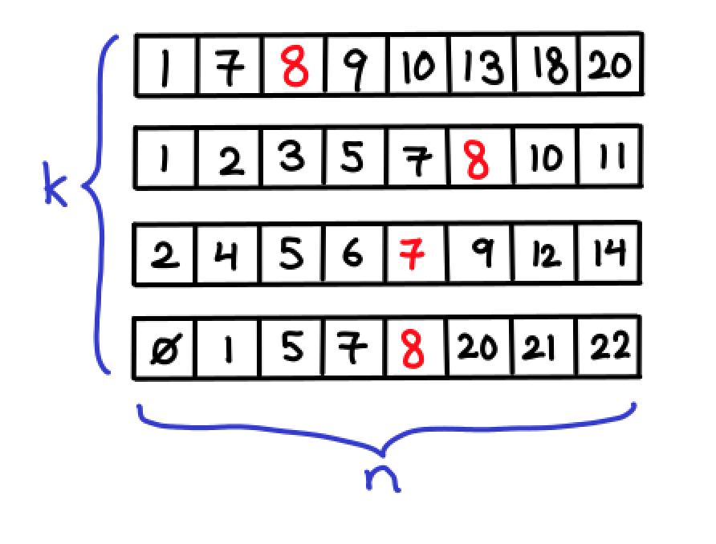

@ClarissaAdjoint Animal Crossing Discord may be able to hook you up

(Originally on Twitter: [Thu Jul 02 18:20:45 +0000 2020](https://twitter.com/ezyang/status/1278755505226297344))
----
RT @redblobgames: Blog post about "fractional cascading": http://blog.ezyang.com/2012/03/you-could-have-invented-fractional-cascading/ — from @ezyang 

(Originally on Twitter: [Tue Jul 07 17:31:58 +0000 2020](https://twitter.com/ezyang/status/1280555170812825601))
----
Writing good docs is pretty time consuming. Like most writing, I suppose.

(Originally on Twitter: [Thu Jul 09 15:28:03 +0000 2020](https://twitter.com/ezyang/status/1281248758815211523))
----
Time travel as a perceptual phenomenon, rather than a physical one

(Originally on Twitter: [Thu Jul 09 16:42:19 +0000 2020](https://twitter.com/ezyang/status/1281267447790817285))
----
Nothing worse than a build tool that doesn't do incremental recompilation

(Originally on Twitter: [Sat Jul 11 03:37:09 +0000 2020](https://twitter.com/ezyang/status/1281794630435176451))
----
@pkhuong should just call it santa locking instead

(Originally on Twitter: [Fri Jul 17 03:22:02 +0000 2020](https://twitter.com/ezyang/status/1283965153986437121))
----
@MarisaVeryMoe Gets a lot simpler when there isn't mutation :)

(Originally on Twitter: [Fri Jul 17 15:19:45 +0000 2020](https://twitter.com/ezyang/status/1284145773488283648))
----
That feeling when you suggest how to fix a problem, and then you don't even need to be a code reviewer for the resulting diff :&gt;

(Originally on Twitter: [Sat Jul 18 03:56:36 +0000 2020](https://twitter.com/ezyang/status/1284336242965000193))
----
Gradual typing has a superficial resemblance to subtyping, in that people might say that int &lt;: Any. But typing rules for Any are different than rules for Top. Can you "gradually type" the entire subtyping hierarchy; e.g., have a concept of AnyInt? Has this been explored?

(Originally on Twitter: [Wed Jul 22 17:31:46 +0000 2020](https://twitter.com/ezyang/status/1285990937286651907))
----
Here is a sketch. Superimpose two type systems. First is conventional int &lt;: object system with gradually typed Any. Second applies only to ints, and adds the refinement Literal[n] &lt;: int with gradually typed IntAny.

(Originally on Twitter: [Wed Jul 22 17:57:09 +0000 2020](https://twitter.com/ezyang/status/1285997326184652800))
----
@samth Thanks, it seems relevant. The context: machine learning community interested in explicitly size-indexing their tensor types (Tensor[n, m]), but don't want to do it all in one go, want it gradually typed.

(Originally on Twitter: [Wed Jul 22 19:20:15 +0000 2020](https://twitter.com/ezyang/status/1286018236144918534))
----
@dimvar The interaction is pretty weird though. Shouldn't allow AnyInt to be used as bool. Maybe it all works out in the end? I would love to see it worked out somewhere though

(Originally on Twitter: [Wed Jul 22 19:28:00 +0000 2020](https://twitter.com/ezyang/status/1286020187741880322))
----
@TaReven Imagine you have overlaid two type systems on your program. You first do normal typechecking with any and int. Once you're all done, you do second typechecking with IntAny, but only on the int fragments of the program.

(Originally on Twitter: [Wed Jul 22 19:29:01 +0000 2020](https://twitter.com/ezyang/status/1286020444735381508))
----
"NB: It is mandatory to NOT use os.path.join here" lol

(Originally on Twitter: [Tue Jul 28 15:18:11 +0000 2020](https://twitter.com/ezyang/status/1288131648496828416))
----
