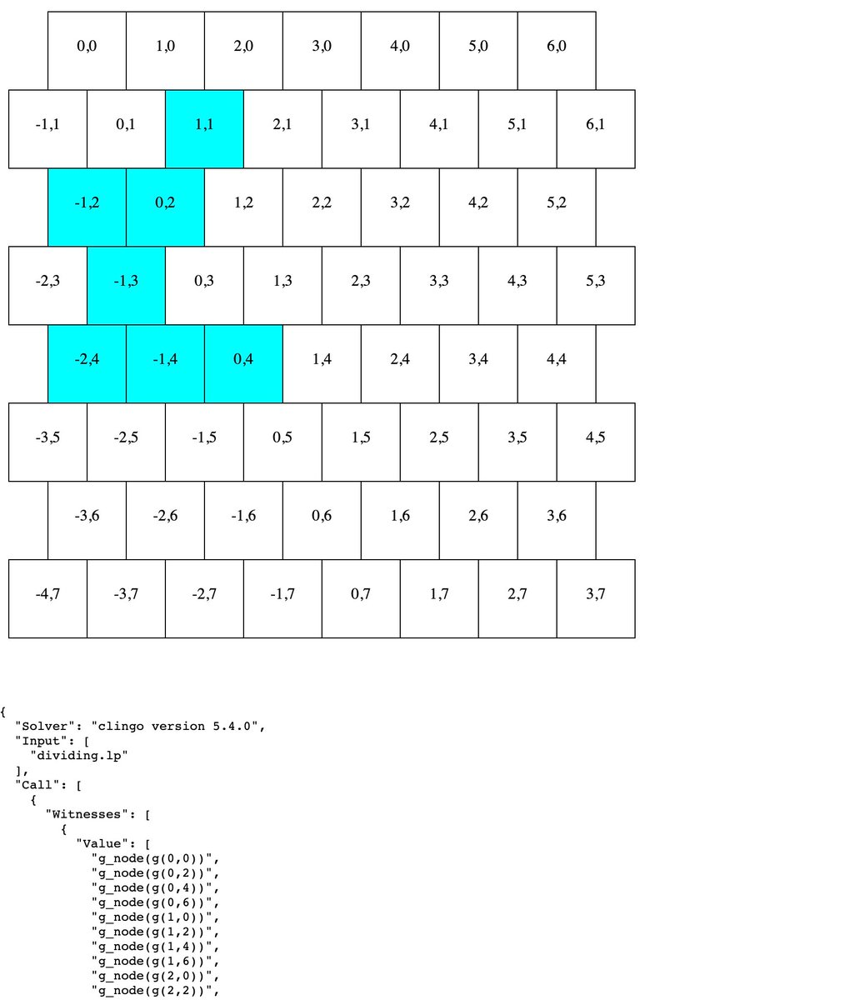
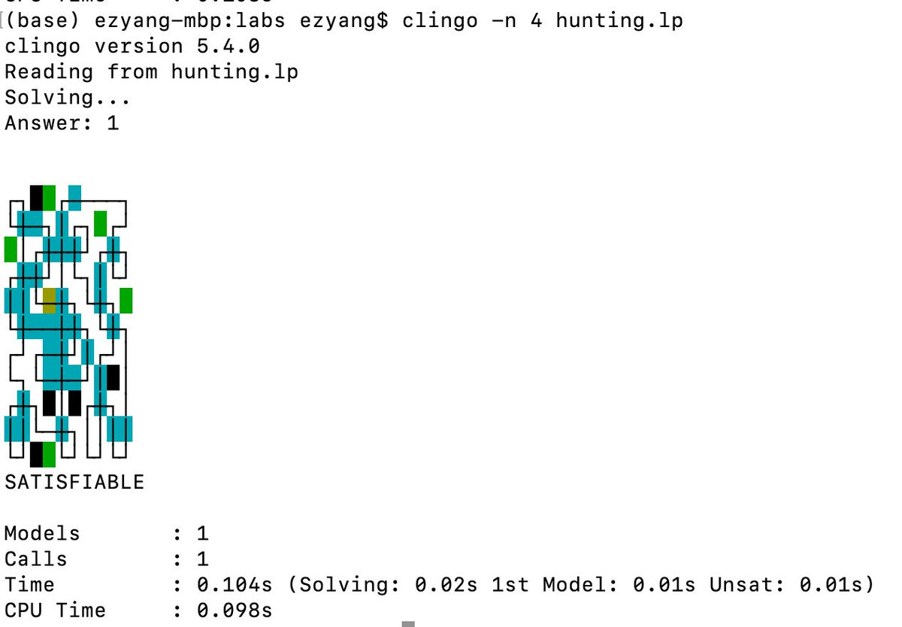

RT @welltyped: Tomorrow, 4 Nov at 1200 UTC, Simon Peyton Jones will announce the launch of the Haskell Foundation, an independent non-profi…

(Originally on Twitter: [Tue Nov 03 23:47:06 +0000 2020](https://twitter.com/ezyang/status/1323773730691158017))
----
RT @RealTimeWWII: In American Congressional elections, the Republican party have made major &amp; unexpected gains, defying polls. Voters may h…

(Originally on Twitter: [Wed Nov 04 19:52:21 +0000 2020](https://twitter.com/ezyang/status/1324077042921541632))
----
They tell you, write the script, but what they don’t tell you, is that this takes reaaally fing long

(Originally on Twitter: [Wed Nov 04 22:20:58 +0000 2020](https://twitter.com/ezyang/status/1324114443899457540))
----
Can someone explain to me why de Blasio is so popular

(Originally on Twitter: [Thu Nov 05 03:04:42 +0000 2020](https://twitter.com/ezyang/status/1324185846057213954))
----
@haoformayor Death of local media sucks. No idea how to fix it :(

(Originally on Twitter: [Thu Nov 05 03:44:09 +0000 2020](https://twitter.com/ezyang/status/1324195772645126145))
----
RT @nelhage: Periodic plug: I now have a newsletter! I write about software performance, testing, and whatever else I'm thinking about, onc…

(Originally on Twitter: [Thu Nov 05 23:37:43 +0000 2020](https://twitter.com/ezyang/status/1324496142986551296))
----
@sigfpe I busted out my RNG for thissss

(Originally on Twitter: [Fri Nov 06 15:26:48 +0000 2020](https://twitter.com/ezyang/status/1324734988303126530))
----
Companies paying contractors to work on open source can be a pretty successful model, and it would be great to see more of it

(Originally on Twitter: [Mon Nov 09 20:29:43 +0000 2020](https://twitter.com/ezyang/status/1325898384541163520))
----
Arithmetic operations are basically free versus your kernel is compute bound

(Originally on Twitter: [Tue Nov 10 20:23:16 +0000 2020](https://twitter.com/ezyang/status/1326259150247108614))
----
RT @nelhage: This week's newsletter is about the challenges of stable benchmarks, and my fear that our sophisticated high-performance syste…

(Originally on Twitter: [Fri Nov 13 02:58:12 +0000 2020](https://twitter.com/ezyang/status/1327083314126200832))
----
@vamchale Compared to what my C++ compiler will do for me, it is magic!

(Originally on Twitter: [Fri Nov 13 04:48:33 +0000 2020](https://twitter.com/ezyang/status/1327111085531557888))
----
Is there an explicit way to say, "just for this section of the code, don't use fused multiply-add", without disabling FMA for the rest of the file? Context: https://github.com/pytorch/pytorch/issues/47043

(Originally on Twitter: [Fri Nov 13 18:44:21 +0000 2020](https://twitter.com/ezyang/status/1327321419089317890))
----
RT @colesbury: @ezyang Yes (per function) in GCC and clang: https://gcc.godbolt.org/z/7aP6qK

(Originally on Twitter: [Fri Nov 13 22:56:24 +0000 2020](https://twitter.com/ezyang/status/1327384849431269377))
----
RT @stephenroller: I'm looking for a PhD intern to join me summer 2021 at FAIR NY to work on Conversational AI. Interests include chit chat…

(Originally on Twitter: [Sat Nov 14 02:56:40 +0000 2020](https://twitter.com/ezyang/status/1327445315226644483))
----
@DMassingoNunes Hi Dionisio, Joe Spisak helped put this slide together using the contents of https://pytorch.org/ecosystem/ I checked my deck and actually it's pretty pixelly there too, so probably best to recreate it XD

(Originally on Twitter: [Sat Nov 14 04:12:41 +0000 2020](https://twitter.com/ezyang/status/1327464443610095616))
----
RT @kyoki: I don't usually use Twitter, but I have to give a shout out to the incredible Technology team that helped elect @JoeBiden presid…

(Originally on Twitter: [Sun Nov 15 01:01:32 +0000 2020](https://twitter.com/ezyang/status/1327778729746161665))
----
Putting nested implications on the right hand side of the turnstile in ASP feels so naughty

(Originally on Twitter: [Mon Nov 16 04:37:59 +0000 2020](https://twitter.com/ezyang/status/1328195587473367040))
----
People who used to not set three year out goals but now do, what changed?

(Originally on Twitter: [Mon Nov 16 21:14:03 +0000 2020](https://twitter.com/ezyang/status/1328446257275293702))
----
It's like COLAB but for PROLOG programs

(Originally on Twitter: [Mon Nov 16 21:42:49 +0000 2020](https://twitter.com/ezyang/status/1328453497709277185))
----
RT @mattmight: Since y’all asked: in collab with @kharrodscience, we saw loperamide is antiviral in vitro. Then my PhD student found protec…

(Originally on Twitter: [Tue Nov 17 18:22:03 +0000 2020](https://twitter.com/ezyang/status/1328765359415992321))
----
RT @Blaisorblade: @ezyang We gave students an hexagonal-grid game, that didn't go well...

There's a great solution that works well, but an…

(Originally on Twitter: [Wed Nov 18 17:52:59 +0000 2020](https://twitter.com/ezyang/status/1329120433753501697))
----
@OndrejSlamecka @Hexfray This is what I've been using but I still get a lot of the handedness wrong.

(Originally on Twitter: [Wed Nov 18 17:55:18 +0000 2020](https://twitter.com/ezyang/status/1329121016430407686))
----
"Reeee" is an ableist slur referring to the sounds a distressed autistic person would make. I won't be using it in the future. (Sorry about this!)

(Originally on Twitter: [Wed Nov 18 18:45:03 +0000 2020](https://twitter.com/ezyang/status/1329133533303107586))
----
RT @nelhage: Newsletter this week: Why we cannot benchmark software without a theory that tells us what experiments to run and what we expe…

(Originally on Twitter: [Thu Nov 19 23:38:31 +0000 2020](https://twitter.com/ezyang/status/1329569777656926214))
----
RT @skamille: @HenryR Look I even wrote a blog inspired by this just now because... I dunno, Friday energy
https://skamille.medium.com/driving-cultural-change-through-software-choices-bf69d2db6539

(Originally on Twitter: [Fri Nov 20 22:57:35 +0000 2020](https://twitter.com/ezyang/status/1329921861984129026))
----
@hillelogram How to print a debug string and then view it

(Originally on Twitter: [Sat Nov 21 00:54:49 +0000 2020](https://twitter.com/ezyang/status/1329951366316511233))
----
RT @_Dave__White_: @skamille I'd summarize this as "you can either change incentives or change affordances."

Basically going after the two…

(Originally on Twitter: [Sat Nov 21 02:52:40 +0000 2020](https://twitter.com/ezyang/status/1329981022415491072))
----
@shanodin P.T.

(Originally on Twitter: [Tue Nov 24 00:04:58 +0000 2020](https://twitter.com/ezyang/status/1331025982061502464))
----
on vacation and kind of bored. kind of want to write some fiction but it sounds super time consuming......

(Originally on Twitter: [Tue Nov 24 01:55:39 +0000 2020](https://twitter.com/ezyang/status/1331053840016302087))
----
@boarders__ @Iceland_jack by past experience I also happen to know that comics are suuuuper time consuming 🤣🤣🤣

(Originally on Twitter: [Tue Nov 24 02:23:50 +0000 2020](https://twitter.com/ezyang/status/1331060930264911872))
----
did anyone do this yet https://ezyang.tumblr.com/post/85102227427/more-clicking-games-sysadmin-version

(Originally on Twitter: [Tue Nov 24 02:26:33 +0000 2020](https://twitter.com/ezyang/status/1331061612980170753))
----
@bilal2vec Wait, I thought in the ML version you click to make your loss go down, then you start buying gpus... then tpus......

(Originally on Twitter: [Tue Nov 24 02:39:08 +0000 2020](https://twitter.com/ezyang/status/1331064781244129280))
----
“The generation of random numbers is too important to be left to chance” – Robert Coveyou

(Originally on Twitter: [Tue Nov 24 02:45:22 +0000 2020](https://twitter.com/ezyang/status/1331066350312304641))
----
Which coordinate ordering is more natural to you?

(Originally on Twitter: [Tue Nov 24 04:08:28 +0000 2020](https://twitter.com/ezyang/status/1331087261262376967))
----
I probably don't have enough video game devs in my follows list to get a nice vote distribution lol

(Originally on Twitter: [Tue Nov 24 04:11:24 +0000 2020](https://twitter.com/ezyang/status/1331087999485030400))
----
@ScottWolchok @patio11 was a big nethack/crawl fan in college, so maybe I should check this out :)

(Originally on Twitter: [Tue Nov 24 04:14:59 +0000 2020](https://twitter.com/ezyang/status/1331088904641015809))
----
@ScottWolchok @patio11 I always just spoiled myself through all the puzzles hahaha

(Originally on Twitter: [Tue Nov 24 04:21:20 +0000 2020](https://twitter.com/ezyang/status/1331090498753269761))
----
@AChourdia an author friend of mine once used to complain that short stories took even longer to write than serials hahaha

(Originally on Twitter: [Tue Nov 24 05:03:11 +0000 2020](https://twitter.com/ezyang/status/1331101034035417088))
----
sooooooo is answer set programming just like, intuitionistic satisfiability solving

(Originally on Twitter: [Tue Nov 24 05:03:54 +0000 2020](https://twitter.com/ezyang/status/1331101215049003009))
----
It is kind of incredible how quickly you can go from "I have no idea what's going on" to "Oh yeah, that makes sense" after reading a little bit on the underlying theory (this particular case re: grounding and ASP)

(Originally on Twitter: [Tue Nov 24 18:32:57 +0000 2020](https://twitter.com/ezyang/status/1331304819013931017))
----
no i don't want a god damned platform i just want this one gadget and move on with my life

(Originally on Twitter: [Tue Nov 24 21:19:39 +0000 2020](https://twitter.com/ezyang/status/1331346769192624128))
----
This is what I got so far. clingo fed into d3js to render the results 

(Originally on Twitter: [Tue Nov 24 23:25:56 +0000 2020](https://twitter.com/ezyang/status/1331378547718549509))
----
RT @dmetaxak: 🎓 I'm on the faculty job market this year! If your department (or one you know) is interested in an interdisciplinary/computa…

(Originally on Twitter: [Wed Nov 25 00:20:02 +0000 2020](https://twitter.com/ezyang/status/1331392164555845633))
----
@krismicinski Tbh, if you have an appropriate stand for it, video quality on a smartphone will be good enough

(Originally on Twitter: [Wed Nov 25 00:24:45 +0000 2020](https://twitter.com/ezyang/status/1331393349782212609))
----
@krismicinski @josecalderon I do think, though, that a nice mic does make a difference

(Originally on Twitter: [Wed Nov 25 01:55:13 +0000 2020](https://twitter.com/ezyang/status/1331416116493774848))
----
@josecalderon @jeanqasaur @krismicinski It worked for me!

(Originally on Twitter: [Wed Nov 25 02:30:50 +0000 2020](https://twitter.com/ezyang/status/1331425082120474624))
----
Brute forcing a metapuzzle using ASP. It was pretty pleasant and I hope I can get fast enough to use this in real hunts. https://ezyang.github.io/dividing-the-land/

(Originally on Twitter: [Wed Nov 25 02:58:06 +0000 2020](https://twitter.com/ezyang/status/1331431942290612225))
----
@JulesJacobs5 @andywingo @leastfixedpoint Your AST being non-mutable solves many of the "local" rewrite problems, since you're usually rebuilding the AST anyway. I wrote recently about this at http://blog.ezyang.com/2020/10/the-hidden-problem-with-basic-block-procedures-in-ssa/

(Originally on Twitter: [Wed Nov 25 03:28:26 +0000 2020](https://twitter.com/ezyang/status/1331439576540385281))
----
@wilbowma @leastfixedpoint What's wrong with join points?!!!!

(Originally on Twitter: [Wed Nov 25 03:29:01 +0000 2020](https://twitter.com/ezyang/status/1331439723596959745))
----
Is there an easy way to get clingo to sort atoms that it prints? It seems to print them in a random order which means I have to invariably write another postprocessing step on top.

(Originally on Twitter: [Wed Nov 25 04:32:53 +0000 2020](https://twitter.com/ezyang/status/1331455793305104384))
----
@shachaf Although it certainly can be metaprogrammed via whatever is generating your SAT clauses, I appreciated having a datalog-like grounding language for specifying facts to be solving over

(Originally on Twitter: [Wed Nov 25 04:59:25 +0000 2020](https://twitter.com/ezyang/status/1331462472293904384))
----
Moral of the story seems to be, use the Python bindings for clingo to run it, so you can control how to print terms in the end.

(Originally on Twitter: [Wed Nov 25 18:18:55 +0000 2020](https://twitter.com/ezyang/status/1331663673669120000))
----
The bad thing about learning a new obscure language is you write these programs and you wish you could show them to people for style and improvements but there's no one to show them to hahahaha

(Originally on Twitter: [Thu Nov 26 01:35:24 +0000 2020](https://twitter.com/ezyang/status/1331773519525515264))
----
tfw you have to write a little dynamic program to solve the puzzle. https://gist.github.com/ezyang/f52619f2635324efa9e9f0be41767300 solves https://puzzlehunt.club.cc.cmu.edu/puzzle/15026/

(Originally on Twitter: [Thu Nov 26 03:37:30 +0000 2020](https://twitter.com/ezyang/status/1331804246124220417))
----
@geofft Does sticking a headless browser in front of the official client count?

(Originally on Twitter: [Thu Nov 26 07:00:46 +0000 2020](https://twitter.com/ezyang/status/1331855397171449856))
----
@geofft Hosted on colab ofc

(Originally on Twitter: [Thu Nov 26 07:30:11 +0000 2020](https://twitter.com/ezyang/status/1331862802651373568))
----
Is there a name for the graph construction where given a graph (V, E), you form a new graph (E, E2) where E2 says which edges you're allowed to go to at vertex V from an edge E?

(Originally on Twitter: [Thu Nov 26 21:18:34 +0000 2020](https://twitter.com/ezyang/status/1332071271522312193))
----
Alternately, vertex : edge :: edge : ???

(Originally on Twitter: [Thu Nov 26 21:19:50 +0000 2020](https://twitter.com/ezyang/status/1332071591916744707))
----
@SingularMattrix That's it, thank you!

(Originally on Twitter: [Thu Nov 26 21:30:01 +0000 2020](https://twitter.com/ezyang/status/1332074153705418945))
----
RT @SingularMattrix: @ezyang Like graph?

https://en.wikipedia.org/wiki/Line_graph

(Originally on Twitter: [Thu Nov 26 21:35:59 +0000 2020](https://twitter.com/ezyang/status/1332075655878553608))
----
the urge to code golf in logic programming languages is UNREAL

(Originally on Twitter: [Thu Nov 26 21:46:13 +0000 2020](https://twitter.com/ezyang/status/1332078230686281728))
----
Maybe someone knows the trick for this (related to the line graph question earlier) https://stackoverflow.com/questions/65029912/symmetry-breaking-edges-of-a-line-graph-on-a-coordinate-grid

(Originally on Twitter: [Thu Nov 26 22:23:46 +0000 2020](https://twitter.com/ezyang/status/1332087681090809863))
----
Oh yeah, I'm dumb, the answer is literally one line (use a total order)

(Originally on Twitter: [Thu Nov 26 22:47:36 +0000 2020](https://twitter.com/ezyang/status/1332093679000055808))
----
Logic puzzle constructors, how do you design puzzles that don't require backtracking? Do you have a computer help you out?

(Originally on Twitter: [Fri Nov 27 03:36:59 +0000 2020](https://twitter.com/ezyang/status/1332166502653587458))
----
This logic puzzle was a bear to debug. "Unsat. Well fuck, now what do I do?" (read your program veeeery carefully) https://gist.github.com/ezyang/677cfeab607cea44433ea0f0a099ea2d

(Originally on Twitter: [Fri Nov 27 04:39:14 +0000 2020](https://twitter.com/ezyang/status/1332182168265744385))
----
Oh SATISFIABLE, how you please me so!!! 

(Originally on Twitter: [Fri Nov 27 04:41:33 +0000 2020](https://twitter.com/ezyang/status/1332182752922394628))
----
oof need some sort of modal logic programming language. I guess I'll just encode it in a normal logic program...

(Originally on Twitter: [Sun Nov 29 03:26:31 +0000 2020](https://twitter.com/ezyang/status/1332888646471520256))
----
latest problem: how to encode A, B, C, D and E are all distinct without having to generate combinatorially many facts specifying distinctness

(Originally on Twitter: [Sun Nov 29 04:00:54 +0000 2020](https://twitter.com/ezyang/status/1332897299471724544))
----
@dancherp i'm solving a logic puzzle where some statements are lies

(Originally on Twitter: [Sun Nov 29 04:03:54 +0000 2020](https://twitter.com/ezyang/status/1332898051430756355))
----
@_Dave__White_ Currently working in potassco clingo. The shitty solution is distinct(P1, P2) :- person(P1), person(P2), P1 != P2.
distinct(P1, P2, P3) :- distinct(P1, P2), person(P3), P1 != P3, P2 != P3. et cetera

(Originally on Twitter: [Sun Nov 29 04:22:31 +0000 2020](https://twitter.com/ezyang/status/1332902736292089865))
----
@hipsterelectron @_Dave__White_ @spackpm IIUC, this says "at most one of P1, P2, P3, P4 and P5" are true. But in my case P is representing some atoms and I just want to make sure they get instantiated to distinct atoms

(Originally on Twitter: [Sun Nov 29 04:29:18 +0000 2020](https://twitter.com/ezyang/status/1332904445374582786))
----
@hipsterelectron @_Dave__White_ @spackpm ASP book is good highly recommended. Wish they had more examples though.

(Originally on Twitter: [Sun Nov 29 04:36:48 +0000 2020](https://twitter.com/ezyang/status/1332906332794531845))
----
@codydroux This is an interesting formulation of the problem, although in my particular case, I'm OK with saying that I do have a total ordering available (which suggests I should be using the sorting methods others suggested)

(Originally on Twitter: [Sun Nov 29 20:40:56 +0000 2020](https://twitter.com/ezyang/status/1333148963336298505))
----
@jcreed Sounds like a lot of encoding to define non-trivial permutations! XD

(Originally on Twitter: [Sun Nov 29 20:48:00 +0000 2020](https://twitter.com/ezyang/status/1333150744422338561))
----
@ipvkyte This works! https://gist.github.com/ezyang/dcd5ab74d07797c3119beb0a20dcf68f Though it reminded me that actually you could probably just FFI the distinctness test

(Originally on Twitter: [Sun Nov 29 20:54:06 +0000 2020](https://twitter.com/ezyang/status/1333152276966477826))
----
@dancherp Well, ASP has a semantics for negation, and that semantics will tell you that `p :- not p` is unsatisfiable 😅

(Originally on Twitter: [Sun Nov 29 20:59:17 +0000 2020](https://twitter.com/ezyang/status/1333153582632357893))
----
@hipsterelectron @_Dave__White_ @spackpm As I see it, ASP is literally just bolting datalog (grounding) on top of SAT (+ cardinality constraints). The datalog makes ASP nice, though it also means you gotta be careful not to blow up the grounding output

(Originally on Twitter: [Sun Nov 29 21:15:58 +0000 2020](https://twitter.com/ezyang/status/1333157782858723331))
----
only 92 github notifications after a week of vacation, incredible!

(Originally on Twitter: [Sun Nov 29 21:19:48 +0000 2020](https://twitter.com/ezyang/status/1333158745149480960))
----
@ipvkyte One trouble with this formulation in ASP is that it still grounds into factorially many ground facts (so it is source code small but not internal rep small); this has nothing to do with the primes but is the trouble with having a distinct fact at all

(Originally on Twitter: [Sun Nov 29 23:10:46 +0000 2020](https://twitter.com/ezyang/status/1333186671613972480))
----
RT @JulesJacobs5: @ezyang If you're encoding it into SAT then doing all pairwise disequalities is not bad. Fewer constraints is not necessa…

(Originally on Twitter: [Sun Nov 29 23:29:05 +0000 2020](https://twitter.com/ezyang/status/1333191282248847366))
----
@vamchale No worries just invent your own fortran-like language

(Originally on Twitter: [Mon Nov 30 01:35:48 +0000 2020](https://twitter.com/ezyang/status/1333223170069958656))
----
Every once in a while, I run into programming problems that remind why OOP legitimately became extremely popular

(Originally on Twitter: [Tue Dec 01 03:49:26 +0000 2020](https://twitter.com/ezyang/status/1333619187097415685))
----
