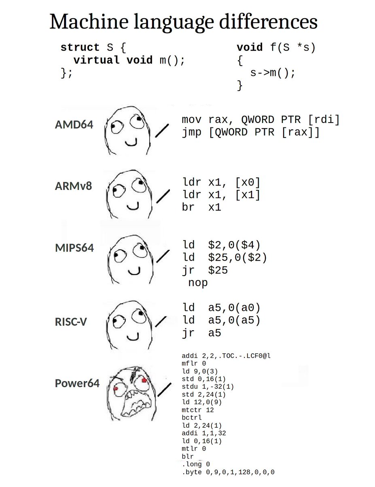

@Blaisorblade @jonathanccast "Tracks." When you force push, all of the previous commits disappear from the PR page; so even though I would believe that GitHub keeps the info somewhere, it's no longer easily accessible

(Originally on Twitter: [Mon Mar 01 15:03:57 +0000 2021](https://twitter.com/ezyang/status/1366403841743282177))
----
@Blaisorblade @jonathanccast Yeah. But what you can see from your linked PR, there are only actually a string of commits for the last force push. This is very problematic because maybe there were comments on specific commits from earlier force pushes!

(Originally on Twitter: [Mon Mar 01 15:53:38 +0000 2021](https://twitter.com/ezyang/status/1366416348306358279))
----
@TaliaRinger Re Twitter specifically, a private alt with trusted followers is a good place to vent

(Originally on Twitter: [Mon Mar 01 18:14:52 +0000 2021](https://twitter.com/ezyang/status/1366451889689214977))
----
The trouble with abstract interpretation is that there are too many interpretations to pick from

(Originally on Twitter: [Tue Mar 02 15:54:07 +0000 2021](https://twitter.com/ezyang/status/1366778855059558405))
----
api design greatest hits: you only got one shot

(Originally on Twitter: [Tue Mar 02 22:50:44 +0000 2021](https://twitter.com/ezyang/status/1366883701095870466))
----
@sclv @cristalopes Simulations are pretty expensive...

(Originally on Twitter: [Wed Mar 03 21:18:43 +0000 2021](https://twitter.com/ezyang/status/1367222933551276036))
----
RT @PyTorch: PyTorch 1.8 is here! 

Highlights include updates for compiler, code optimization, frontend APIs for scientific computing, lar…

(Originally on Twitter: [Fri Mar 05 04:00:24 +0000 2021](https://twitter.com/ezyang/status/1367686406764695554))
----
Minimum Viable Legal Compliance

(Originally on Twitter: [Fri Mar 05 17:51:34 +0000 2021](https://twitter.com/ezyang/status/1367895575170064386))
----
RT @nelhage: I've been scaling a webapp lately, and I took some time to write up a taxonomy that's been floating around in the back of my h…

(Originally on Twitter: [Fri Mar 05 23:08:00 +0000 2021](https://twitter.com/ezyang/status/1367975209312149510))
----
@lexi_lambda It's because there is one language that matters and it's Python...

(Originally on Twitter: [Sun Mar 07 03:16:01 +0000 2021](https://twitter.com/ezyang/status/1368400014377123843))
----
virtual methods are just poor man's tagless initial encoding don't at me

(Originally on Twitter: [Sun Mar 07 03:25:01 +0000 2021](https://twitter.com/ezyang/status/1368402279632695296))
----
@ScottWolchok nah, it's more like a meta burrito, a general framework for describing burrito like things (less flip answer: it's basically liskov substitution principle but with a very abstract superclass)

(Originally on Twitter: [Sun Mar 07 17:01:07 +0000 2021](https://twitter.com/ezyang/status/1368607656643067912))
----
RT @lambda_calculus: What is subject reduction, if not types preserving?

(Originally on Twitter: [Mon Mar 08 01:01:27 +0000 2021](https://twitter.com/ezyang/status/1368728535553163264))
----
RT @_monoid: Expressive POWER 

(Originally on Twitter: [Tue Mar 09 22:45:21 +0000 2021](https://twitter.com/ezyang/status/1369419062997090308))
----
RT @nelhage: After a whole lot of performance work -- including a custom tracing framework -- llama is starting to really work! I can get a…

(Originally on Twitter: [Wed Mar 10 22:33:04 +0000 2021](https://twitter.com/ezyang/status/1369778358083612674))
----
INTERSECTIONALITY

(Originally on Twitter: [Fri Mar 12 16:29:08 +0000 2021](https://twitter.com/ezyang/status/1370411545361022983))
----
@deech -fdefer-type-errors would like to have a word with you!!!

(Originally on Twitter: [Fri Mar 12 19:51:12 +0000 2021](https://twitter.com/ezyang/status/1370462397668978696))
----
@danclien @deech Well l personally mostly use it to make a data model change and then see what the implications are. Idk about others

(Originally on Twitter: [Fri Mar 12 20:00:18 +0000 2021](https://twitter.com/ezyang/status/1370464690191622151))
----
@hillelogram This and then grep

(Originally on Twitter: [Sun Mar 14 00:08:10 +0000 2021](https://twitter.com/ezyang/status/1370889452990701573))
----
Manage NAMESPACES not DEPENDENCIES

(Originally on Twitter: [Mon Mar 15 17:09:48 +0000 2021](https://twitter.com/ezyang/status/1371508943911063552))
----
Years after we added multiple dispatch to PyTorch's internals, the original use case is dead but we've ended continually using it in other cases in surprising ways

(Originally on Twitter: [Wed Mar 17 15:57:47 +0000 2021](https://twitter.com/ezyang/status/1372215596604088322))
----
@MarisaVeryMoe Lazy tensor. The particular implementation we were working on is dead although I'd say the concept is alive and kicking

(Originally on Twitter: [Wed Mar 17 16:55:02 +0000 2021](https://twitter.com/ezyang/status/1372230005296599044))
----
@f_aezs @MarisaVeryMoe The most compelling use case has always been for targeting graph-mode only backends via the eager API (without forcing something like TorchScript)

(Originally on Twitter: [Wed Mar 17 18:05:33 +0000 2021](https://twitter.com/ezyang/status/1372247752529358848))
----
@HeinrichKuttler @f_aezs @MarisaVeryMoe It's a very limited form of laziness (prior to CUDA graphs becoming a thing), since you immediately queue the kernels on the stream, instead of waiting to accumulate a bunch. This is really helpful constraint, because otherwise there are too many design choices

(Originally on Twitter: [Wed Mar 17 21:15:28 +0000 2021](https://twitter.com/ezyang/status/1372295545788727299))
----
tfw reciting wikipedia facts from memory until your baby falls asleep

(Originally on Twitter: [Fri Mar 19 00:34:51 +0000 2021](https://twitter.com/ezyang/status/1372708108473098242))
----
@ScottWolchok the page is IN MY BRAAAAIN

(Originally on Twitter: [Fri Mar 19 02:19:06 +0000 2021](https://twitter.com/ezyang/status/1372734342846418944))
----
RT @FalseKnees: A bit of a different comic this week! I made this working with Bird Safe Guelph to help spread some information about birds…

(Originally on Twitter: [Sat Mar 20 00:56:11 +0000 2021](https://twitter.com/ezyang/status/1373075866272604163))
----
@johnregehr don't you see the vaccine was inside you all along

(Originally on Twitter: [Sat Mar 20 01:54:09 +0000 2021](https://twitter.com/ezyang/status/1373090454640680961))
----
Twitter help me. I've never done browser extension development, and I want to make a simple extension that just makes some DOM changes to some pages. Should I target Chrome Manifest V3 or V2?

(Originally on Twitter: [Sat Mar 20 03:39:13 +0000 2021](https://twitter.com/ezyang/status/1373116895277289479))
----
(Yes, I know, hypothetically GreaseMonkey fits this niche, but I'm also curious about how to write a browser extension at all)

(Originally on Twitter: [Sat Mar 20 03:39:53 +0000 2021](https://twitter.com/ezyang/status/1373117060440543233))
----
I have the dumbest problem how to resize my screenshot to exactly 640x400 google whyyyyy

(Originally on Twitter: [Sun Mar 21 04:51:29 +0000 2021](https://twitter.com/ezyang/status/1373497469577887745))
----
@jimmykoppel Maybe one reason it sounds great is because there is a similar sounding variant that does work (though it might take some time): learn a component/subsystem by rewriting it with bug-for-bug parity

(Originally on Twitter: [Sun Mar 21 20:09:08 +0000 2021](https://twitter.com/ezyang/status/1373728401773711360))
----
this was literally the hardest step for uploading the extension to web store (ok, maybe passing the approval process will be the hardest step)

(Originally on Twitter: [Sun Mar 21 20:12:29 +0000 2021](https://twitter.com/ezyang/status/1373729244212305921))
----
@thingskatedid Egg it!

(Originally on Twitter: [Sun Mar 21 22:57:53 +0000 2021](https://twitter.com/ezyang/status/1373770871387664390))
----
@jimmykoppel Pretty rarely, because it's hard to tell if you actually succeeded 100%. But I feel it's one of the big motivators behind rewrites in the large, and I've seen it a few times in super well defined cases (e.g. the program takes literally no user specified inputs)

(Originally on Twitter: [Mon Mar 22 00:50:43 +0000 2021](https://twitter.com/ezyang/status/1373799265970098176))
----
@jimmykoppel Even if it's not actually bad/complicated, the understanding at the end may still be worth it!

(Originally on Twitter: [Mon Mar 22 02:39:29 +0000 2021](https://twitter.com/ezyang/status/1373826636479614979))
----
HIW'2021 call for talks is up! https://icfp21.sigplan.org/home/hiw-2021#Call-for-Talks

(Originally on Twitter: [Mon Mar 22 13:28:03 +0000 2021](https://twitter.com/ezyang/status/1373989852706967553))
----
Days since I last needed to write down a proof of correctness for an algorithm at work: 0

(Originally on Twitter: [Wed Mar 24 01:37:44 +0000 2021](https://twitter.com/ezyang/status/1374535871945342986))
----
@johnbender It could just mean we're trying to do things that are too complicated 🤡

(Originally on Twitter: [Wed Mar 24 01:55:50 +0000 2021](https://twitter.com/ezyang/status/1374540427844493316))
----
@hillelogram It's also a sign of bad system design if you have too many questions in your binder; e.g., designing an API in C++ involves a way fatter binder of questions than designing an API in a simpler language

(Originally on Twitter: [Wed Mar 24 14:57:17 +0000 2021](https://twitter.com/ezyang/status/1374737085202984967))
----
RT @DragaliaLostApp: It's the 2.5-Year Anniversary of #DragaliaLost! Follow and retweet this post for a chance to win the following. All pl…

(Originally on Twitter: [Thu Mar 25 12:36:26 +0000 2021](https://twitter.com/ezyang/status/1375064027915812870))
----
@adoemon Not that I know of... (also this was a pencil and paper proof)

(Originally on Twitter: [Fri Mar 26 17:44:16 +0000 2021](https://twitter.com/ezyang/status/1375503884790075392))
----
the "inline" in "inline function with static local" is such a scam

(Originally on Twitter: [Sat Mar 27 02:11:29 +0000 2021](https://twitter.com/ezyang/status/1375631528835739648))
----
@kamatsu8 @chrislpenner 👆 The real problem is speaking to the community. If you used to publish in a venue and just happen to be unaffiliated later, I can’t imagine there’d be many roadblocks at all

(Originally on Twitter: [Sun Mar 28 17:51:03 +0000 2021](https://twitter.com/ezyang/status/1376230369360539651))
----
@pcwalton Aka Backpack? :)

(Originally on Twitter: [Sun Mar 28 20:07:33 +0000 2021](https://twitter.com/ezyang/status/1376264718403297280))
----
It’s time to do the math and math how to get it done

(Originally on Twitter: [Mon Mar 29 04:48:51 +0000 2021](https://twitter.com/ezyang/status/1376395910293377026))
----
@ttuegel Yeah, you put in a thing that should be there, and then everyone starts using it because obviously

(Originally on Twitter: [Mon Mar 29 22:40:00 +0000 2021](https://twitter.com/ezyang/status/1376665474356932608))
----
i am an OCTOPUS

(Originally on Twitter: [Tue Mar 30 15:43:35 +0000 2021](https://twitter.com/ezyang/status/1376923063745269764))
----
GitHub's hidden items is so infuriating. Why oh why do you expand EARLIEST first rather than LATEST first

(Originally on Twitter: [Wed Mar 31 14:37:57 +0000 2021](https://twitter.com/ezyang/status/1377268935792332806))
----
