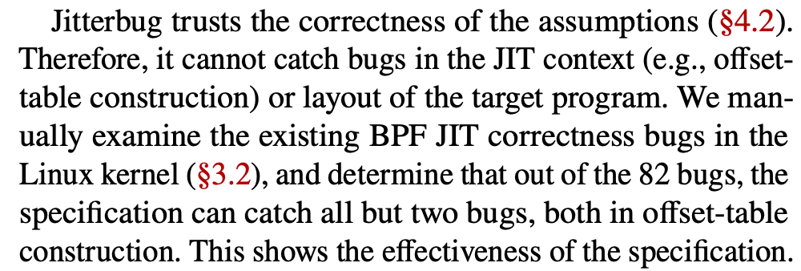
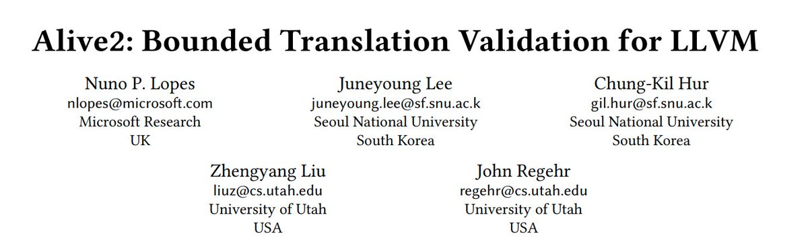
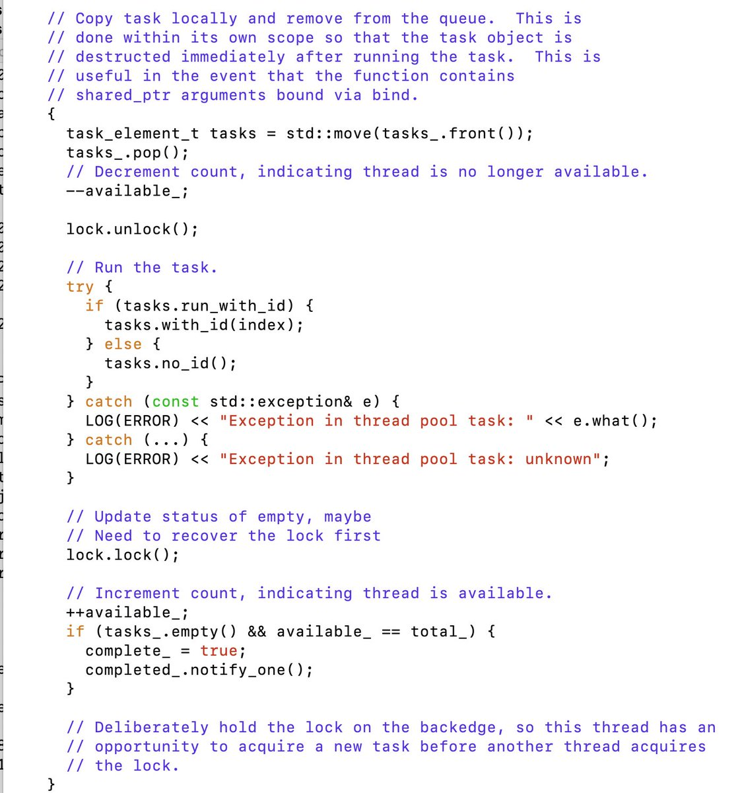
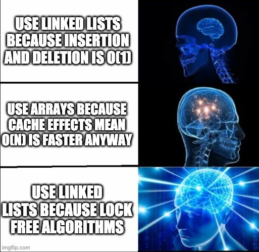

Do you believe that every problem in software engineering is soluble by a GOOD IDEA in computer science

(Originally on Twitter: [Fri Apr 02 03:25:10 +0000 2021](https://twitter.com/ezyang/status/1377824399458439172))
----
RT @soumithchintala: We have a small and growing team. We are hiring engineers with a passion for robotics, interested?
Email resumes to st…

(Originally on Twitter: [Fri Apr 02 16:24:19 +0000 2021](https://twitter.com/ezyang/status/1378020479471136777))
----
As a types kind of guy, talking to static analysis people is so trippy

(Originally on Twitter: [Fri Apr 02 18:20:40 +0000 2021](https://twitter.com/ezyang/status/1378049759374675969))
----
@n1nj4 "I have no idea how to do this, in X simpler situation we have to work so hard to maintain inference." "Oh it's fine, we'll just mark it as don't know in the transfer function"

(Originally on Twitter: [Fri Apr 02 18:24:42 +0000 2021](https://twitter.com/ezyang/status/1378050775654498305))
----
RT @sheevink: Hey @github, I got mentioned in a commit message and now I keep getting notification spam when people update their forks. Is…

(Originally on Twitter: [Sat Apr 03 00:14:43 +0000 2021](https://twitter.com/ezyang/status/1378138858492207114))
----
In Python, is there a way to opt into BC breaking changes on methods within a single module? https://stackoverflow.com/questions/66927362/way-to-opt-into-bc-breaking-changes-on-methods-within-a-single-module

(Originally on Twitter: [Sat Apr 03 03:07:58 +0000 2021](https://twitter.com/ezyang/status/1378182461314764801))
----
@Blaisorblade @github As a courtesy, I always am careful not to at people when I mention their usernames in commit messages

(Originally on Twitter: [Sat Apr 03 14:49:15 +0000 2021](https://twitter.com/ezyang/status/1378358943039303681))
----
@nj_snav_lin Method calls. You might not even have imported the module in the first place!

(Originally on Twitter: [Mon Apr 05 00:39:30 +0000 2021](https://twitter.com/ezyang/status/1378869872042643456))
----
This ONE WEIRD TRICK will make your binaries run 30% faster! LD_PRELOADers hate it!!! https://bugs.python.org/issue38980

(Originally on Twitter: [Mon Apr 05 03:46:16 +0000 2021](https://twitter.com/ezyang/status/1378916874717659137))
----
If you gonna ask people to migrate themselves, the post migration benefits better be pretty dang compelling

(Originally on Twitter: [Mon Apr 05 18:03:50 +0000 2021](https://twitter.com/ezyang/status/1379132687231950858))
----
If you have a pair of separately refcounted objects that reference each other and you want them to only die together if both refcounts go to zero, how would you implement this?

(Originally on Twitter: [Mon Apr 05 22:06:35 +0000 2021](https://twitter.com/ezyang/status/1379193776015618051))
----
@flippac One of the objects is refcounted by Python and the other is a shared_ptr in C++, say

(Originally on Twitter: [Mon Apr 05 22:58:47 +0000 2021](https://twitter.com/ezyang/status/1379206913116749834))
----
@eleganesh The follow up is how many refcounting systems let you run a finalizer at refcount 1 ;)

(Originally on Twitter: [Mon Apr 05 22:59:32 +0000 2021](https://twitter.com/ezyang/status/1379207105220124672))
----
@rob_rix Hmm. Do I get a shared reference that I can clone after I vending? Most client code assumes that they can take extra references as they like. How would the pair help?

(Originally on Twitter: [Mon Apr 05 23:20:45 +0000 2021](https://twitter.com/ezyang/status/1379212440999768064))
----
@arplynn Say A to B is weak. If B refcount goes to zero it does, but we wanted to keep it live. (This is ok if you can just construct another B when you need it, but not if B has unique data)

(Originally on Twitter: [Tue Apr 06 00:50:55 +0000 2021](https://twitter.com/ezyang/status/1379235133799157761))
----
@neurosp1ke If I can indirect (law: indirection solves everything) this indeed works. What if I don't want to indirect, so I can devirtualize my methods?

(Originally on Twitter: [Tue Apr 06 00:52:50 +0000 2021](https://twitter.com/ezyang/status/1379235617872216065))
----
RT @colesbury: @ezyang https://github.com/colesbury/refcount/blob/master/refcount.c

You can do a similar scheme if you roll your own refcounting in C++. Would not attempt with…

(Originally on Twitter: [Tue Apr 06 00:54:02 +0000 2021](https://twitter.com/ezyang/status/1379235920197660673))
----
@colesbury Oh my god you can cancel dealloc wuuuut

(Originally on Twitter: [Tue Apr 06 00:55:50 +0000 2021](https://twitter.com/ezyang/status/1379236372754599936))
----
@anitasvasu I mean, you could argue that for pairs it's just a very degenerate mark and sweep :)

(Originally on Twitter: [Tue Apr 06 03:40:19 +0000 2021](https://twitter.com/ezyang/status/1379277766693126145))
----
One of the troubles with defining types is that there is no way to easily switch between precision; e.g., you could do Tensor, FloatTensor, Tensor[2, 4, 5, 6], but these are all noncompositional different choices. Refinement types help; are there other techniques?

(Originally on Twitter: [Wed Apr 07 23:46:54 +0000 2021](https://twitter.com/ezyang/status/1379943800102121477))
----
@samth Oh, that's fair enough, although subtyping is often inextricably linked with object orientation (which is terrible at this sort of thing)

(Originally on Twitter: [Wed Apr 07 23:48:44 +0000 2021](https://twitter.com/ezyang/status/1379944259864920074))
----
@PatrickKidger Cool stuff. Reading your code made me realized that Annotated is a thing, which might be enough leverage to actually get this going in PyTorch core. I wonder if we can get Annotated to be ignored pre Python 3.9...

(Originally on Twitter: [Thu Apr 08 00:01:06 +0000 2021](https://twitter.com/ezyang/status/1379947372378267652))
----
@bmabsout Right, so Haskell style you'd have some number of type arguments for the precision you want. But what if don't care about the sizes? Or if you do care about the memory layout? Hard to add/subtract

(Originally on Twitter: [Thu Apr 08 00:03:23 +0000 2021](https://twitter.com/ezyang/status/1379947946767233028))
----
@bmabsout I would hate to be forced to use Backpack as a poor man's refinement type system :P

(Originally on Twitter: [Thu Apr 08 00:20:51 +0000 2021](https://twitter.com/ezyang/status/1379952341944836097))
----
@PatrickKidger Py3.6 no big deal, we're dumping support for it very soon now. TBH I prefer Annotated; a conjunction of annotations more closely resembles refinement type system in the liquid style. Some syntax concerns; would like both Tensor[float] and Tensor["batch"] to work directly

(Originally on Twitter: [Thu Apr 08 00:31:57 +0000 2021](https://twitter.com/ezyang/status/1379955134894071810))
----
@PatrickKidger I cited you in https://github.com/pytorch/pytorch/issues/26889 I won't personally be working on this but can help shepherd an RFC and implementation in core, if you are interested.

(Originally on Twitter: [Thu Apr 08 00:32:34 +0000 2021](https://twitter.com/ezyang/status/1379955292046233606))
----
Liquid Python, lets goooooooo

(Originally on Twitter: [Thu Apr 08 00:33:56 +0000 2021](https://twitter.com/ezyang/status/1379955634418880512))
----
@jeremysiek INORITE!!!!

(Originally on Twitter: [Thu Apr 08 01:22:52 +0000 2021](https://twitter.com/ezyang/status/1379967949671399425))
----
@jeremysiek As far as syntax goes, how does gradual typing like to handle tons of knobs, though?

(Originally on Twitter: [Thu Apr 08 01:23:50 +0000 2021](https://twitter.com/ezyang/status/1379968192530030592))
----
so like undertale fandom is kind of like touhou fandom amirite

(Originally on Twitter: [Thu Apr 08 04:16:27 +0000 2021](https://twitter.com/ezyang/status/1380011632584237057))
----
@alcides I'm not, but if it existed I have some users who'd like to talk to you

(Originally on Twitter: [Thu Apr 08 15:10:03 +0000 2021](https://twitter.com/ezyang/status/1380176115982086144))
----
Is it true that for both float16 and bfloat16, you can emulate them by converting to float32 first, doing the operation, and then converting back?

(Originally on Twitter: [Fri Apr 09 02:30:11 +0000 2021](https://twitter.com/ezyang/status/1380347278750322688))
----
RT @pavpanchekha: @ezyang Depends on the operation. For the field operations—plus and sub and times work this way (think about how many of…

(Originally on Twitter: [Fri Apr 09 02:48:55 +0000 2021](https://twitter.com/ezyang/status/1380351994171383810))
----
RT @pavpanchekha: @ezyang This is how Herbie is supporting float32, by the way, now that Racket does not have native support. And we take t…

(Originally on Twitter: [Fri Apr 09 02:48:58 +0000 2021](https://twitter.com/ezyang/status/1380352004531367936))
----
@pavpanchekha Got any counterexamples handy?

(Originally on Twitter: [Fri Apr 09 02:50:48 +0000 2021](https://twitter.com/ezyang/status/1380352465367920645))
----
RT @pavpanchekha: @ezyang You mean for other operations? Suppose you've got some complex function f(x) whose output is 1.&lt;seven ones&gt;0&lt;16 o…

(Originally on Twitter: [Fri Apr 09 03:53:02 +0000 2021](https://twitter.com/ezyang/status/1380368127716900868))
----
Vaccine GET!

(Originally on Twitter: [Fri Apr 09 14:32:25 +0000 2021](https://twitter.com/ezyang/status/1380529034069688327))
----
RT @pavpanchekha: @ezyang Ok @ezyang realized this morning that 16 is not a lot of bits and I should give you an example. For bfloat16: sin…

(Originally on Twitter: [Fri Apr 09 16:37:37 +0000 2021](https://twitter.com/ezyang/status/1380560542046294018))
----
RT @pavpanchekha: @neurosp1ke @ezyang Oh sorry, yes, there's a minus sign, my bad. I randomly sampled bfloat16 bit-patterns, evaluated sin…

(Originally on Twitter: [Fri Apr 09 17:18:28 +0000 2021](https://twitter.com/ezyang/status/1380570822079881219))
----
ChannelShuffle versus Chanel(TM) Shuffle

(Originally on Twitter: [Fri Apr 09 17:24:55 +0000 2021](https://twitter.com/ezyang/status/1380572447167160324))
----
@pcwalton Time to formally verify the BPF JIT compiler

(Originally on Twitter: [Sat Apr 10 00:24:29 +0000 2021](https://twitter.com/ezyang/status/1380678031119953923))
----
@samth @danrkports @johnregehr @pcwalton I suppose it's a rite of passing to find bugs in a formally verified system because they were outside of the spec somehow

(Originally on Twitter: [Sat Apr 10 01:25:49 +0000 2021](https://twitter.com/ezyang/status/1380693467345645570))
----
@samth @danrkports @johnregehr @pcwalton 

(Originally on Twitter: [Sat Apr 10 01:27:05 +0000 2021](https://twitter.com/ezyang/status/1380693786834169868))
----
Don't half ass your load bearing abstractions

(Originally on Twitter: [Sat Apr 10 02:12:24 +0000 2021](https://twitter.com/ezyang/status/1380705192019165186))
----
@francoisfleuret @PyTorch A similar concept we've talked about but never implemented is an "async CPU" device, where the CPU computation is offloaded to another thread. The reason we never did it is because we didn't have a good way of pre-running shape computation... until now https://github.com/pytorch/rfcs/blob/rfc-0005/RFC-0005-structured-kernel-definitions.md

(Originally on Twitter: [Sat Apr 10 13:21:53 +0000 2021](https://twitter.com/ezyang/status/1380873671598878721))
----
What would a PL look like if first you wrote the package manager, and then designed the PL to make the package manager's job as easy as possible

(Originally on Twitter: [Sat Apr 10 18:24:20 +0000 2021](https://twitter.com/ezyang/status/1380949784211636225))
----
@sigkill_dk I mean, that plus whatever features you want your package manager to support :) (the same way people write PLs because there is some mode of expression they want)

(Originally on Twitter: [Sat Apr 10 19:25:33 +0000 2021](https://twitter.com/ezyang/status/1380965189852532740))
----
PyTorch dispatcher is basically aspect oriented programming change my mind

(Originally on Twitter: [Sun Apr 11 00:17:35 +0000 2021](https://twitter.com/ezyang/status/1381038684636651522))
----
Is the Alive2 paper publicly available anywhere yet?

(Originally on Twitter: [Sun Apr 11 00:42:07 +0000 2021](https://twitter.com/ezyang/status/1381044859289665538))
----
Compiler Twitter: If We decided to make a formal semantics of PyTorch operators (add, conv, etc), what tool should we use to write it? Are we forced to build our own?

(Originally on Twitter: [Sun Apr 11 00:53:35 +0000 2021](https://twitter.com/ezyang/status/1381047742294806529))
----
@pasiphae_goals Is this what the cool kids are using?

(Originally on Twitter: [Sun Apr 11 01:00:00 +0000 2021](https://twitter.com/ezyang/status/1381049356917354496))
----
@wilbowma I was recently inspired while reading https://arxiv.org/abs/1809.02161

(Originally on Twitter: [Sun Apr 11 01:07:57 +0000 2021](https://twitter.com/ezyang/status/1381051357973643266))
----
@wilbowma Not... quite? The paper is talking about compiler writers and we /do/ have a compiler and we are doing all the bad things the paper says we shouldn't do, and it seems like a formal semantics is a good start to turning things around

(Originally on Twitter: [Sun Apr 11 01:21:19 +0000 2021](https://twitter.com/ezyang/status/1381054723986448387))
----
@SCombinator IDK. I don't even know how I'd approach the problem of setting up acceptable refinements for floating point precision. We're not even deterministic sometimes...

(Originally on Twitter: [Sun Apr 11 01:22:46 +0000 2021](https://twitter.com/ezyang/status/1381055087318077443))
----
@wilbowma I guess I should take your compilers course!

(Originally on Twitter: [Sun Apr 11 01:27:44 +0000 2021](https://twitter.com/ezyang/status/1381056338185310210))
----
@wilbowma Thanks, reading the book :)

(Originally on Twitter: [Sun Apr 11 01:31:40 +0000 2021](https://twitter.com/ezyang/status/1381057329949466624))
----
@wilbowma I wonder if K's FAQ (https://kframework.org/faq/) enumerates the list of all semantics tools, ha! Although having dug in a little, these tools don't seem /quite/ what I'd necessarily want in my context, since the emphasis would be less on "language" and more on "primops"

(Originally on Twitter: [Sun Apr 11 01:41:04 +0000 2021](https://twitter.com/ezyang/status/1381059692634460160))
----
@pasiphae_goals I wonder what it means when K has all these "archived" semantics. https://kframework.org/projects/ Does it mean they are bitrotten, or that they're just complete? 🤔

(Originally on Twitter: [Sun Apr 11 01:43:07 +0000 2021](https://twitter.com/ezyang/status/1381060207674023937))
----
@wilbowma This is fair... but I feel there is a qualitative difference between formalizing flavors of lambda calculus versus formalizing a large and complicated CISC-y instruction set (though I see K has an x86 semantics)

(Originally on Twitter: [Sun Apr 11 01:49:13 +0000 2021](https://twitter.com/ezyang/status/1381061744928432129))
----
@wilbowma As an example of a qualitative difference, the K formalization of x86 https://dl.acm.org/doi/pdf/10.1145/3314221.3314601 was based off of work that tried to automatically synthesize the rules (before they gave up and manually specified the rest)

(Originally on Twitter: [Sun Apr 11 01:56:54 +0000 2021](https://twitter.com/ezyang/status/1381063677617537029))
----
As evidence that people often end up "having to build their own", I cite https://alastairreid.github.io/specification_languages/

(Originally on Twitter: [Sun Apr 11 02:01:35 +0000 2021](https://twitter.com/ezyang/status/1381064858834243587))
----
RT @etanter: My AOSD'10 paper (which won the Best Paper Award in 2010) got the 10-year Most Influential Paper Award. Second such award in t…

(Originally on Twitter: [Sun Apr 11 02:25:22 +0000 2021](https://twitter.com/ezyang/status/1381070842713550850))
----
@johnregehr I'm super interested in this! Especially because MLIR is all about dialects (https://mlir.llvm.org/docs/Dialects/) and so even if you are not an MLIR user, work on semantics may still be generally useful (see also my other Twitter threads tonight)

(Originally on Twitter: [Sun Apr 11 02:44:11 +0000 2021](https://twitter.com/ezyang/status/1381075576702832648))
----
RT @johnregehr: @ezyang hey we don't have anything whatsoever yet, but we're going to be working towards something like Alive2 for MLIR, wi…

(Originally on Twitter: [Sun Apr 11 02:44:19 +0000 2021](https://twitter.com/ezyang/status/1381075609300959245))
----
@johnregehr Also, because there's so many companies working on hardware in this space, there's a decent chance the investment might actually be worth it

(Originally on Twitter: [Sun Apr 11 02:48:32 +0000 2021](https://twitter.com/ezyang/status/1381076670539513862))
----
@johnregehr In my other thread, people keep recommending K framework for doing semantics. What's your opinion on it? (AFAICT, Alive2 doesn't use it, is that right?)

(Originally on Twitter: [Sun Apr 11 03:07:10 +0000 2021](https://twitter.com/ezyang/status/1381081361260425216))
----
RT @johnregehr: @ezyang right-- alive2 is tied closely to Z3, but I really want to add a thin abstraction layer so we can use other solvers…

(Originally on Twitter: [Sun Apr 11 03:21:33 +0000 2021](https://twitter.com/ezyang/status/1381084981519323136))
----
RT @johnregehr: @ezyang I have no direct experience with K, and also I've resisted the mental shift required to do everything using term re…

(Originally on Twitter: [Sun Apr 11 03:21:42 +0000 2021](https://twitter.com/ezyang/status/1381085020442476544))
----
RT @johnregehr: @samth @ezyang here's "signed add with overflow" which returns a pair containing the two's complement result and a boolean…

(Originally on Twitter: [Sun Apr 11 03:21:51 +0000 2021](https://twitter.com/ezyang/status/1381085058296115200))
----
RT @johnregehr: @samth @ezyang so the prev one is easy because it has no particular interactions with undefined behavior. here's the code f…

(Originally on Twitter: [Sun Apr 11 03:23:20 +0000 2021](https://twitter.com/ezyang/status/1381085428254711808))
----
@johnregehr Another argument for an abstraction layer: executing your specs fast (though it seems to me the theme in translation validation is that it is OK for the spec to not also be the implementation. IDK if you would force llvm to do it differently if you were also compiler author)

(Originally on Twitter: [Sun Apr 11 03:27:44 +0000 2021](https://twitter.com/ezyang/status/1381086539049005058))
----
@samth @johnregehr IIUC, Flags is not going into the z3, it’s just a little bit of staging to compactly write 3/4 rules (which matters!)

(Originally on Twitter: [Sun Apr 11 03:30:50 +0000 2021](https://twitter.com/ezyang/status/1381087317247545344))
----
@samth @johnregehr I've just recently managed to convince everyone to replace C++ with Python and a transpiler, how does that make you feel 🤣

(Originally on Twitter: [Sun Apr 11 03:34:20 +0000 2021](https://twitter.com/ezyang/status/1381088200152715265))
----
@samth @johnregehr Gotta use the T word and not the C word so the people carrying the purse strings don't get scared

(Originally on Twitter: [Sun Apr 11 03:36:59 +0000 2021](https://twitter.com/ezyang/status/1381088864916357123))
----
RT @johnregehr: @samth @ezyang I go back and forth on stuff like this. at some level of course you're right. on the other hand, what if we…

(Originally on Twitter: [Sun Apr 11 03:37:13 +0000 2021](https://twitter.com/ezyang/status/1381088924626513921))
----
@samth @johnregehr "first prototype" ... implying that it isn't in Redex now?

(Originally on Twitter: [Sun Apr 11 03:39:41 +0000 2021](https://twitter.com/ezyang/status/1381089544460718080))
----
RT @johnregehr: @samth @ezyang I hear you, but I think if you read the alive2 memory model you'd probably be forced to agree that the DSL f…

(Originally on Twitter: [Sun Apr 11 03:40:41 +0000 2021](https://twitter.com/ezyang/status/1381089798081875976))
----
RT @johnregehr: @samth @ezyang similarly, it's tempting to just use e.g. Rosette instead of hand-rolling lots of synthesis stuff in Souper.…

(Originally on Twitter: [Sun Apr 11 03:40:43 +0000 2021](https://twitter.com/ezyang/status/1381089805501673472))
----
I permanently put my phone on DND and I don't regret it

(Originally on Twitter: [Sun Apr 11 04:06:36 +0000 2021](https://twitter.com/ezyang/status/1381096317049577479))
----
RT @taylorjohnson: @ezyang Depending on abstraction level, you may be interested in ongoing work within VNN-LIB and VNN-COMP. Currently a s…

(Originally on Twitter: [Sun Apr 11 04:32:15 +0000 2021](https://twitter.com/ezyang/status/1381102775149420545))
----
RT @peter_sewell_: @ezyang Depends what you want it for: paper docs, executable as test oracle to compare impl behaviour against, paper pro…

(Originally on Twitter: [Sun Apr 11 13:36:06 +0000 2021](https://twitter.com/ezyang/status/1381239637042204672))
----
@TotherAlistair A more faithful rendition of the exercise is to force someone to do it in C (no libraries) or a similarly low level language

(Originally on Twitter: [Sun Apr 11 13:45:56 +0000 2021](https://twitter.com/ezyang/status/1381242112256192513))
----
Apparently it's way easier to write a staged interpreter than it is to write a compiler pass; functional IRs get their revenge!!!

(Originally on Twitter: [Mon Apr 12 18:50:47 +0000 2021](https://twitter.com/ezyang/status/1381681218035539973))
----
Incredible, I made a giant refcounting change and it hasn't segfaulted yet

(Originally on Twitter: [Mon Apr 12 21:21:02 +0000 2021](https://twitter.com/ezyang/status/1381719030961160200))
----
Update: it failed on the 200th test and doesn't repro when I run that test individually. Time to bust out ASAN...

(Originally on Twitter: [Mon Apr 12 21:24:39 +0000 2021](https://twitter.com/ezyang/status/1381719939854303239))
----
RT @MarisaVeryMoe: @jjcarett2 @codydroux @ezyang @andrasKovacs6 what will be a good place to read on modern PE?

(Originally on Twitter: [Mon Apr 12 22:53:13 +0000 2021](https://twitter.com/ezyang/status/1381742228532563976))
----
in grad school used to shower and then continue hacking with no clothes on until I got too cold and therefore had to go to bed don't at me

(Originally on Twitter: [Tue Apr 13 04:43:50 +0000 2021](https://twitter.com/ezyang/status/1381830462985879555))
----
How to define a Python metaclass from a C extension https://stackoverflow.com/q/67077317/23845

(Originally on Twitter: [Tue Apr 13 15:07:19 +0000 2021](https://twitter.com/ezyang/status/1381987369889497091))
----
RT @apaszke: Curious what we think the future of array computing can look like? Check out our new Dex preprint to see how we’re designing a…

(Originally on Twitter: [Tue Apr 13 15:09:32 +0000 2021](https://twitter.com/ezyang/status/1381987925148241922))
----
debug_printf("yoloooooooo");

(Originally on Twitter: [Tue Apr 13 17:26:47 +0000 2021](https://twitter.com/ezyang/status/1382022466583805961))
----
@wilbowma Did you hear about mold

(Originally on Twitter: [Tue Apr 13 21:03:43 +0000 2021](https://twitter.com/ezyang/status/1382077061993496580))
----
RT @santoshgnag: Preprint of our PLDI 2021 paper on generating correctly rounded high performance libraries for 32-bit floats and posits: h…

(Originally on Twitter: [Wed Apr 14 03:41:49 +0000 2021](https://twitter.com/ezyang/status/1382177244379025408))
----
@santoshgnag I guess we don’t have any excuse for not putting these in now haha

(Originally on Twitter: [Wed Apr 14 03:42:20 +0000 2021](https://twitter.com/ezyang/status/1382177374704431105))
----
@santoshgnag What is your current thinking on extending these results further? E.g. for complex numbers (where existing implementations are very low quality) or for more functions (e.g., sqrt)

(Originally on Twitter: [Wed Apr 14 15:58:52 +0000 2021](https://twitter.com/ezyang/status/1382362728875094017))
----
@santoshgnag Here's our current list: https://github.com/pytorch/pytorch/issues/52310

(Originally on Twitter: [Wed Apr 14 16:20:33 +0000 2021](https://twitter.com/ezyang/status/1382368187312975881))
----
@santoshgnag Wait but is it accurate 🤣

(Originally on Twitter: [Wed Apr 14 16:24:54 +0000 2021](https://twitter.com/ezyang/status/1382369281988558848))
----
@pavpanchekha @santoshgnag @PFY_Ian Oh is this the Satire paper? I'll shamefully admit to having not read it yet

(Originally on Twitter: [Wed Apr 14 16:36:12 +0000 2021](https://twitter.com/ezyang/status/1382372125915369481))
----
RT @steveklabnik: "We are finally here, with an RFC that adds support
for Rust to the Linux kernel." https://lkml.org/lkml/2021/4/14/1023

(Originally on Twitter: [Wed Apr 14 20:27:07 +0000 2021](https://twitter.com/ezyang/status/1382430235963105292))
----
@Blaisorblade @taktoa1 Yeah I wouldn't trust my compiler to figure this out (and even if it could I am not sure I want to spend my compile time budget on this)

(Originally on Twitter: [Thu Apr 15 01:27:59 +0000 2021](https://twitter.com/ezyang/status/1382505952868503556))
----
@krismicinski @johnregehr @samth @wilbowma It doesn't seem like forcing students to run their binaries under an emulator is all that bad. More portable too anyway.

(Originally on Twitter: [Thu Apr 15 01:58:25 +0000 2021](https://twitter.com/ezyang/status/1382513611495604224))
----
Orderly program shutdown at termination would be a great use case for program synthesis

(Originally on Twitter: [Fri Apr 16 02:56:56 +0000 2021](https://twitter.com/ezyang/status/1382890727269601282))
----
"Collect final garbage.  This disposes of cycles created by class definitions, for example. XXX This is disabled because it caused too many problems."

(Originally on Twitter: [Fri Apr 16 03:03:05 +0000 2021](https://twitter.com/ezyang/status/1382892271343915008))
----
tfw grumpy about deadlocks. deadlocks everywhere

(Originally on Twitter: [Thu Apr 22 15:25:02 +0000 2021](https://twitter.com/ezyang/status/1385253318314893313))
----
when i was in college i had a http://del.icio.us with all of my saved recipe links and i didn't save them when the website went down and now i don't have any recipes anymore

(Originally on Twitter: [Sat Apr 24 02:05:56 +0000 2021](https://twitter.com/ezyang/status/1385776994365759489))
----
@samth @Pinboard oooooooh last time I checked around the 2020 elections it wasn't working but it's back now!!

(Originally on Twitter: [Sat Apr 24 03:34:37 +0000 2021](https://twitter.com/ezyang/status/1385799312970502144))
----
doc fix in 2015 🤣 

(Originally on Twitter: [Sat Apr 24 15:40:28 +0000 2021](https://twitter.com/ezyang/status/1385981976012861444))
----
In other personal Internet history archeology news, I have no idea where I put my Google Reader backups

(Originally on Twitter: [Sun Apr 25 03:09:09 +0000 2021](https://twitter.com/ezyang/status/1386155292359020550))
----
I used to check up on my RSS feeds in browser, but my 2014 browser backups don't have any feeds in them, while my 2012 backups do, so I must have deleted them at some point.

(Originally on Twitter: [Sun Apr 25 03:10:31 +0000 2021](https://twitter.com/ezyang/status/1386155634152939520))
----
Aha! It turns out I imported them into Feedly and then proceeded to never check Feedly ever again. Losing export to Kindle really sucked...

(Originally on Twitter: [Sun Apr 25 03:15:36 +0000 2021](https://twitter.com/ezyang/status/1386156915424641027))
----
New blog: Rage bug reporting http://blog.ezyang.com/2021/04/rage-bug-reporting/

(Originally on Twitter: [Sun Apr 25 04:23:41 +0000 2021](https://twitter.com/ezyang/status/1386174048510660608))
----
somehow Ubuntu always manages to bust my Windows boot partition and I don't know why

(Originally on Twitter: [Sun Apr 25 19:49:01 +0000 2021](https://twitter.com/ezyang/status/1386406916440477697))
----
What's the shortest path to getting a podcast playable on a Google Home via something like "OK Google, play XXXXX"? Do you have to put it on Spotify?

(Originally on Twitter: [Sun Apr 25 19:51:22 +0000 2021](https://twitter.com/ezyang/status/1386407507128590336))
----
OK Y'ALL recommend me podcasts to listen to while bottlefeeding

(Originally on Twitter: [Sun Apr 25 21:59:40 +0000 2021](https://twitter.com/ezyang/status/1386439794012549121))
----
@Kludgy Once I fix it, I am able to boot into grub and then chain load the Windows UEFI thingymajigger. But when it's porked I have to get Windows to repair it, which kills grub, and then I have to reinstall grub

(Originally on Twitter: [Mon Apr 26 00:23:13 +0000 2021](https://twitter.com/ezyang/status/1386475921222275075))
----
RT @johnregehr: new paper!
https://www.cs.utah.edu/~regehr/alive2-pldi21.pdf 

(Originally on Twitter: [Mon Apr 26 15:47:03 +0000 2021](https://twitter.com/ezyang/status/1386708412143181828))
----
@johnregehr Yay, it's finally out!

(Originally on Twitter: [Mon Apr 26 15:47:21 +0000 2021](https://twitter.com/ezyang/status/1386708484914388994))
----
two separate projects specialized for their use cases versus one project that generalizes

(Originally on Twitter: [Mon Apr 26 20:03:13 +0000 2021](https://twitter.com/ezyang/status/1386772876867551233))
----
@MarisaVeryMoe nah, not that one. Also, for the record, I was on the side of "two specialized projects"

(Originally on Twitter: [Mon Apr 26 20:11:02 +0000 2021](https://twitter.com/ezyang/status/1386774843375357954))
----
@schemeprincess was it a workshop on side chanel attacks

(Originally on Twitter: [Tue Apr 27 02:58:59 +0000 2021](https://twitter.com/ezyang/status/1386877507333468166))
----
spot the bug 

(Originally on Twitter: [Tue Apr 27 15:49:53 +0000 2021](https://twitter.com/ezyang/status/1387071512352632835))
----
@ScottWolchok Destructor is run too late is correct!

(Originally on Twitter: [Tue Apr 27 16:20:17 +0000 2021](https://twitter.com/ezyang/status/1387079163388076040))
----
@ScottWolchok This is valid giving the fragment I gave here, although in reality there's a test for that above.

(Originally on Twitter: [Tue Apr 27 16:20:38 +0000 2021](https://twitter.com/ezyang/status/1387079247785832450))
----
@uncatherio @natural_hazard Not better than Conor McBride can :) I personally found this paper easier to understand knowing what a zipper is first; then d/dx List(x) = d/dx (1 + x + x^2 + ...) = 1 + 2 x + 3 x^2 + ... which is a one hole context

(Originally on Twitter: [Wed Apr 28 01:39:47 +0000 2021](https://twitter.com/ezyang/status/1387219966248853505))
----
How many years do you think Google Photos will last

(Originally on Twitter: [Wed Apr 28 02:18:28 +0000 2021](https://twitter.com/ezyang/status/1387229700641132546))
----
For reference, it is currently five years old. Free Google Photos tier is ending on June 1, 2021. Google itself is 22 years old.

(Originally on Twitter: [Wed Apr 28 02:23:20 +0000 2021](https://twitter.com/ezyang/status/1387230923947757568))
----
An alternate formulation: if you want to store your photos for 30+ years, how would you do it?

(Originally on Twitter: [Wed Apr 28 02:26:57 +0000 2021](https://twitter.com/ezyang/status/1387231835172835332))
----
@nelhage Would you actually, personally, do this though? 😛

(Originally on Twitter: [Wed Apr 28 02:57:33 +0000 2021](https://twitter.com/ezyang/status/1387239536913174528))
----
@DaTwinkDaddy My HDD backup strategy has been something goofy like buy a new hard drive every five years and copy everything over

(Originally on Twitter: [Wed Apr 28 03:14:36 +0000 2021](https://twitter.com/ezyang/status/1387243826511851521))
----
whelp. quantization team decided they're going to stop doing property based testing, because it's too gfd hard to configure it correctly to be deterministic and not flaky (this is sad and also entirely predictable)

(Originally on Twitter: [Wed Apr 28 14:37:15 +0000 2021](https://twitter.com/ezyang/status/1387415622452121600))
----
@samth hypothesis seems to make it hard to force people to do this. It also introduces other forms of flakiness, e.g., as timing deadlines. I think if you spent enough time configuring it you could get it to work, but no one on that team has the interest. So it ded.

(Originally on Twitter: [Wed Apr 28 15:24:33 +0000 2021](https://twitter.com/ezyang/status/1387427525673033731))
----

(Originally on Twitter: [Wed Apr 28 17:21:31 +0000 2021](https://twitter.com/ezyang/status/1387456959822041092))
----
Caption: Man sweating trying to decide between two buttons labeled "Use arrays because cache locality is better" and "Use linked lists because multithreading"

(Originally on Twitter: [Wed Apr 28 17:22:13 +0000 2021](https://twitter.com/ezyang/status/1387457136750366722))
----
@sigkill_dk All your lock free algorithms are going to operate on linked lists. Not possible to do with array.

(Originally on Twitter: [Wed Apr 28 17:29:14 +0000 2021](https://twitter.com/ezyang/status/1387458900614696966))
----
@sigkill_dk 

(Originally on Twitter: [Wed Apr 28 17:31:30 +0000 2021](https://twitter.com/ezyang/status/1387459469932744711))
----
@noteed You wish! In practice, more than half of all of our Hypothesis failures were "Deadline was exceeded" or "Test seems to be flaky, when we reran it the property passed"

(Originally on Twitter: [Wed Apr 28 17:53:32 +0000 2021](https://twitter.com/ezyang/status/1387465018502000649))
----
@jaredweakly @sigkill_dk I'm not too qualified to generalize here, but my general observation is that lock free algorithms rely a lot on the indirection afforded by pointers. You can have a reader chase a pointer and continue to work with the result while you shunt the pointer to go somewhere else.

(Originally on Twitter: [Wed Apr 28 19:25:00 +0000 2021](https://twitter.com/ezyang/status/1387488034468290563))
----
RT @MSpondee: @BodunHu @ezyang @sigkill_dk Lock free algorithms are not supposed to be effecient. The goal is to ensure progress not effeci…

(Originally on Twitter: [Wed Apr 28 21:46:26 +0000 2021](https://twitter.com/ezyang/status/1387523627541741569))
----
RT @dmetaxak: 🎉I'll be joining @Penn as an assistant professor in computing &amp; information science (+ secondary in @AnnenbergPenn) in 2022!…

(Originally on Twitter: [Wed Apr 28 23:24:33 +0000 2021](https://twitter.com/ezyang/status/1387548318193029122))
----
ok yo i recorded a 12min mini podcast trial run how do i edit it

(Originally on Twitter: [Thu Apr 29 02:15:35 +0000 2021](https://twitter.com/ezyang/status/1387591359708778496))
----
@n1nj4 I'm listening to the track and it doesn't seem to need noise reduction, there is a little clipping every once and a while, not sure if that is fixable without rerecording.

(Originally on Twitter: [Thu Apr 29 02:38:44 +0000 2021](https://twitter.com/ezyang/status/1387597186532319234))
----
...... how much do I care about editing out all the "you knows" and "uhhhs" from my audio LOL

(Originally on Twitter: [Thu Apr 29 02:44:18 +0000 2021](https://twitter.com/ezyang/status/1387598588977553413))
----
answer: NO (for my sanity)

(Originally on Twitter: [Thu Apr 29 02:45:22 +0000 2021](https://twitter.com/ezyang/status/1387598856372817921))
----
well... it took me a few years to get far enough perdido street station to really get into it, but I'm digging it now...

(Originally on Twitter: [Sat May 01 02:50:02 +0000 2021](https://twitter.com/ezyang/status/1388324808216170497))
----
