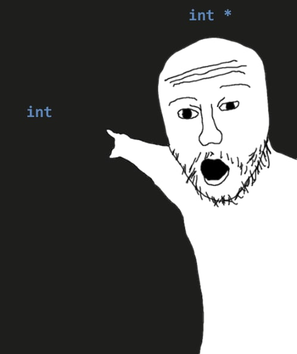

@andrejbauer Omega + 1 vs omega? :0

(Originally on Twitter: [Wed Sep 01 15:40:42 +0000 2021](https://twitter.com/ezyang/status/1433092458330607621))
----
"but what's really incredible is that we were spending 4GB of memory on storing filenames"

(Originally on Twitter: [Wed Sep 01 16:12:12 +0000 2021](https://twitter.com/ezyang/status/1433100384378228738))
----
@wilbowma clearly you should have written a design doc where you spent three pages detailing the constraints

(Originally on Twitter: [Wed Sep 01 18:45:17 +0000 2021](https://twitter.com/ezyang/status/1433138909207310342))
----
Is there a term of video games that can simultaneously be played at a macro as well as micro scale? A crappy example is SimCity+SimCopter where you could fly your helicopter (micro) in the city you built (macro)

(Originally on Twitter: [Wed Sep 01 19:27:45 +0000 2021](https://twitter.com/ezyang/status/1433149597317222406))
----
spiciest take: if code should be optimized for reading and not for writing, then you better be able to write it without running it!

(Originally on Twitter: [Wed Sep 01 20:14:30 +0000 2021](https://twitter.com/ezyang/status/1433161362352578561))
----
@sigkill_dk SPICY 🌶️🌶️🌶️

(Originally on Twitter: [Wed Sep 01 21:21:43 +0000 2021](https://twitter.com/ezyang/status/1433178278257467392))
----
RT @TaliaRinger: If you're looking at grad schools for computer science, and you like proof assistants and want to bring formal proof to ev…

(Originally on Twitter: [Fri Sep 03 16:15:06 +0000 2021](https://twitter.com/ezyang/status/1433825893995134980))
----
it seems rhetorically suboptimal to call out hypocrisy when you hold the reverse position for BOTH issues, since technically you're a hypocrite too (foolish consistency blah blah blah)

(Originally on Twitter: [Tue Sep 07 03:36:50 +0000 2021](https://twitter.com/ezyang/status/1435084620941471744))
----
my ontologies are

(Originally on Twitter: [Tue Sep 07 19:20:19 +0000 2021](https://twitter.com/ezyang/status/1435322056497934338))
----
sorry not sorry 

(Originally on Twitter: [Wed Sep 08 14:34:38 +0000 2021](https://twitter.com/ezyang/status/1435612548292915201))
----
Structured kernels and meta tensors in PyTorch, a status update: https://dev-discuss.pytorch.org/t/structured-kernels-and-meta-tensors-september-2021-status-report/325

(Originally on Twitter: [Wed Sep 08 17:00:07 +0000 2021](https://twitter.com/ezyang/status/1435649158656970753))
----
@roeschinc @ApacheTVM It's a fundamental GitHub limitation, however if you're willing to let PRs show up in a different repository you can have some sort of staging repo which you give people write access to

(Originally on Twitter: [Wed Sep 08 18:21:53 +0000 2021](https://twitter.com/ezyang/status/1435669737611083780))
----
I have a bunch of projects and I want to document pairwise connections between these projects (every project is related to a few others), what is a good interface for inputting the data and then visualizing it

(Originally on Twitter: [Wed Sep 08 18:34:28 +0000 2021](https://twitter.com/ezyang/status/1435672906122551296))
----
RT @vbhvsgr: It's the end of an era: https://discourse.haskell.org/t/new-horizons-for-spj/3099

(Originally on Twitter: [Thu Sep 09 12:53:16 +0000 2021](https://twitter.com/ezyang/status/1435949425935933444))
----
oh hey, now I know why subnormal numbers exist! (can you tell? I'm prepping a podcast episode!)

(Originally on Twitter: [Fri Sep 10 02:17:49 +0000 2021](https://twitter.com/ezyang/status/1436151898793517060))
----
being able to deal with information overload is like a superpower

(Originally on Twitter: [Fri Sep 10 02:29:09 +0000 2021](https://twitter.com/ezyang/status/1436154751729782791))
----
RT @simonpj0: After 23 years at Microsoft Research it is time for me to move on. I shall be leaving MSR at the end of November. 

I do not…

(Originally on Twitter: [Fri Sep 10 12:41:11 +0000 2021](https://twitter.com/ezyang/status/1436308773178679305))
----
A pathology of metrics driven work is some badness can happen only 0.01% of the time, but is super bad for the people it happens to. What are ways to counteract this?

(Originally on Twitter: [Fri Sep 10 14:04:09 +0000 2021](https://twitter.com/ezyang/status/1436329651111145478))
----
@CFHammill A meme in metrics is that you want very few top line metrics (like, two or three), and you want them to be stupidly simple (because if they're complicated chances are you'll measure it wrong). How to put in a better cost function then?

(Originally on Twitter: [Fri Sep 10 14:13:13 +0000 2021](https://twitter.com/ezyang/status/1436331935756963845))
----
@oxinabox_frames Polymorphism in C++ is pretty painful

(Originally on Twitter: [Sun Sep 12 16:43:04 +0000 2021](https://twitter.com/ezyang/status/1437094419480600583))
----
@oxinabox_frames If you want to do everything with vcalls you’ll get something reasonable, but traditional libraries like Eigen use templates so that everything inlines. That’s cool but templates are definitely not very nice.

(Originally on Twitter: [Sun Sep 12 22:37:23 +0000 2021](https://twitter.com/ezyang/status/1437183589418930181))
----
State of PyTorch core, September 2021 edition: https://dev-discuss.pytorch.org/t/state-of-pytorch-core-september-2021-edition/332

(Originally on Twitter: [Mon Sep 13 14:39:18 +0000 2021](https://twitter.com/ezyang/status/1437425663183659008))
----
@rasbt It's not at all clear what the right way to put this all together is yet! So I don't want us to go too fast, but at the same time there really is a lot of new and interesting stuff you can now build entirely in Python-land and it's too exciting not to tell people about

(Originally on Twitter: [Mon Sep 13 17:45:51 +0000 2021](https://twitter.com/ezyang/status/1437472610049269765))
----
@wightmanr Yes, this is definitely a goal; not quite merge, but PyTorch offering core lazy abstractions and XLA building off on it. API differences an orthogonal problem, also worth working on, though no one is right now :(

(Originally on Twitter: [Mon Sep 13 18:20:02 +0000 2021](https://twitter.com/ezyang/status/1437481211237130249))
----
@KAlexanderWang TBH we should bring back ragged tensors using the more lightweight extensibility mechanisms, they're just so much easier than nested tensors (which are more general)

(Originally on Twitter: [Mon Sep 13 19:38:04 +0000 2021](https://twitter.com/ezyang/status/1437500847945039884))
----
@KAlexanderWang Sorry, wasn't thinking of a specific implementation; though there are a few ad hoc ragged implementations floating around (e.g., pack indices)

(Originally on Twitter: [Mon Sep 13 20:30:45 +0000 2021](https://twitter.com/ezyang/status/1437514107243085834))
----
RT @ehashdn: This is a nuclear take, so wearing my FOSS foundation ex-board member hat, let me take a stab at interpreting what's going on…

(Originally on Twitter: [Mon Sep 13 23:23:30 +0000 2021](https://twitter.com/ezyang/status/1437557580046422018))
----
@codydroux Nuh uh, you gotta define vulnerability first

(Originally on Twitter: [Wed Sep 15 02:25:22 +0000 2021](https://twitter.com/ezyang/status/1437965737449164800))
----
@codydroux For that matter, you also gotta define web server

(Originally on Twitter: [Wed Sep 15 02:31:02 +0000 2021](https://twitter.com/ezyang/status/1437967162875031553))
----
So we're all about code synthesis from specifications but what about taking some existing code and then repeatedly ANDing sub-specifications of what it does together until you can synthesize the code from those specs eh eh eh?

(Originally on Twitter: [Wed Sep 15 19:01:24 +0000 2021](https://twitter.com/ezyang/status/1438216398728220673))
----
@dorchard Is that a thing?!

(Originally on Twitter: [Wed Sep 15 21:57:30 +0000 2021](https://twitter.com/ezyang/status/1438260712493748235))
----
Do you think you understand Liskov Substitution Principle

(Originally on Twitter: [Thu Sep 16 01:43:16 +0000 2021](https://twitter.com/ezyang/status/1438317528376299521))
----
libgcc y u no have debug symbols

(Originally on Twitter: [Tue Sep 21 03:20:12 +0000 2021](https://twitter.com/ezyang/status/1440153865601511424))
----
@bkmlep nuuuuuuuuu

(Originally on Twitter: [Tue Sep 21 03:23:37 +0000 2021](https://twitter.com/ezyang/status/1440154722799742979))
----
@codydroux You reshuffle the coloring of the graph every time you do a query, so each query gives you zero bits about the coloring

(Originally on Twitter: [Tue Sep 21 03:24:45 +0000 2021](https://twitter.com/ezyang/status/1440155006770958341))
----
@codydroux Try it: https://web.mit.edu/~ezyang/Public/graph/svg.html (no pattern emerges because the coloring itself is shuffled. Without precommitment I could just literally make up anything I like and it'd be indistinguishable)

(Originally on Twitter: [Tue Sep 21 03:34:38 +0000 2021](https://twitter.com/ezyang/status/1440157495310229504))
----
@codydroux Well, the prover is assumed to have a truly random way of generating color permutations. Then it doesn't matter if it actually commits to the same permutation since you can't tell (you only see two nodes at a time)

(Originally on Twitter: [Tue Sep 21 03:51:40 +0000 2021](https://twitter.com/ezyang/status/1440161784317427717))
----
@codydroux Oh, if you mean the random permutation is the nonce, sure.

(Originally on Twitter: [Tue Sep 21 12:58:14 +0000 2021](https://twitter.com/ezyang/status/1440299331148414990))
----
Puzzle: create an object file which, when linked in with a C++ program, causes try-catch blocks to stop working (but nothing else)

(Originally on Twitter: [Tue Sep 21 17:44:03 +0000 2021](https://twitter.com/ezyang/status/1440371259544522757))
----
@wightmanr Let's say Linux

(Originally on Twitter: [Tue Sep 21 20:00:10 +0000 2021](https://twitter.com/ezyang/status/1440405514970488839))
----
RT @shahidkamal: 1982: I wrote Alien Attack, my first game, on an Atari 400, in BASIC. It had a custom character set for the alien (one at…

(Originally on Twitter: [Tue Sep 21 22:12:44 +0000 2021](https://twitter.com/ezyang/status/1440438875021725702))
----
@koronkebitch @wilbowma @johnregehr AwA

(Originally on Twitter: [Tue Sep 21 23:35:44 +0000 2021](https://twitter.com/ezyang/status/1440459763897171977))
----
distributed system of a down

(Originally on Twitter: [Thu Sep 23 00:57:43 +0000 2021](https://twitter.com/ezyang/status/1440842781925077004))
----
Two hundred lines of code later... but boy, I sweated for those lines 💦💦💦

(Originally on Twitter: [Thu Sep 23 03:13:18 +0000 2021](https://twitter.com/ezyang/status/1440876903615930371))
----
@HeinrichKuttler Yup

(Originally on Twitter: [Thu Sep 23 13:03:53 +0000 2021](https://twitter.com/ezyang/status/1441025526194388993))
----
RT @TaliaRinger: Hi PL folks, knowing anyone willing to take on a remote student?

One PhD student in PL had his advisor quit, and he is at…

(Originally on Twitter: [Thu Sep 23 23:38:27 +0000 2021](https://twitter.com/ezyang/status/1441185221714448391))
----
@TaliaRinger I totally think editors should have a mode where they give you a buffer that cats all your files together

(Originally on Twitter: [Fri Sep 24 01:41:54 +0000 2021](https://twitter.com/ezyang/status/1441216288362168326))
----
@PatrickKidger Wondering if there's an idiomatic way to do module ensembling in Equinox. Need to stick "too big" parameters in the module and then vmap over it

(Originally on Twitter: [Fri Sep 24 02:52:14 +0000 2021](https://twitter.com/ezyang/status/1441233989897834498))
----
@PatrickKidger Oh vmap'ing over the module construction is pretty clever, and with omnistaging it'll work out. Nice!

(Originally on Twitter: [Fri Sep 24 13:26:47 +0000 2021](https://twitter.com/ezyang/status/1441393677293834240))
----
@PatrickKidger One annoying thing about this, pointed out by @cHHillee, is that "models" isn't really a true module; if you try to run its forward outside of a vmap context you'll get a bunch of size errors (since the parameters are too big)

(Originally on Twitter: [Fri Sep 24 17:00:53 +0000 2021](https://twitter.com/ezyang/status/1441447556911861762))
----
I'd like a terminal that keeps track of everything I do (input and output) and can do analytics on it.

(Originally on Twitter: [Sun Sep 26 23:01:55 +0000 2021](https://twitter.com/ezyang/status/1442263189798850563))
----
Like, bash history but on steroids

(Originally on Twitter: [Sun Sep 26 23:02:34 +0000 2021](https://twitter.com/ezyang/status/1442263353947136001))
----
If I ran a few experiments, I want the terminal to remember the full context of those experiments, removing the need to separately keep a lab notebook

(Originally on Twitter: [Sun Sep 26 23:03:47 +0000 2021](https://twitter.com/ezyang/status/1442263662018928640))
----
If I want to know how much time I spent in an editor versus compiling versus waiting, it would tell me. And maybe suggest when I should spend some time optimizing workflow

(Originally on Twitter: [Sun Sep 26 23:04:33 +0000 2021](https://twitter.com/ezyang/status/1442263855527194627))
----
I wouldn't need to remember to setup a screen cast to share with someone later, I could just pick up the last hour from the flight recorder after it happens (like Nintendo Switch's video recording feature)

(Originally on Twitter: [Sun Sep 26 23:05:44 +0000 2021](https://twitter.com/ezyang/status/1442264151192047617))
----
If I wanted to contribute telemetry to my favorite open source projects I could extract usage from my history

(Originally on Twitter: [Sun Sep 26 23:06:35 +0000 2021](https://twitter.com/ezyang/status/1442264365542084609))
----
reading through Rust Foundations bylaws and man it's such a SIPB throwback

(Originally on Twitter: [Mon Sep 27 01:03:07 +0000 2021](https://twitter.com/ezyang/status/1442293691255820288))
----
The best thing about regularly mopvacuuming the floors is I can walk around barefoot and not feel dirty afterwards

(Originally on Twitter: [Mon Sep 27 03:05:54 +0000 2021](https://twitter.com/ezyang/status/1442324593830621189))
----
RT @wezfurlong: @ezyang I've been thinking about this for wezterm; it has shell integration to know things about prompt, input and output,…

(Originally on Twitter: [Mon Sep 27 12:23:38 +0000 2021](https://twitter.com/ezyang/status/1442464948551131139))
----
RT @HeinrichKuttler: @ezyang Random side effect of using the @NetHack_LE:

pip install nle
nle-ttyrec record.ttyrec
# (Type in new shell.
#…

(Originally on Twitter: [Mon Sep 27 12:33:32 +0000 2021](https://twitter.com/ezyang/status/1442467443683725321))
----
Does anyone have a good standalone website they use for moderating Q&amp;A (e.g., for a livestream, people can submit and vote up questions)

(Originally on Twitter: [Mon Sep 27 13:40:16 +0000 2021](https://twitter.com/ezyang/status/1442484236427038725))
----
There's a lot of integrated solutions with many video conferencing apps but I'm looking for one that I can send a link out for independent of VC system

(Originally on Twitter: [Mon Sep 27 13:41:04 +0000 2021](https://twitter.com/ezyang/status/1442484435295752197))
----
RT @hannelita: @ezyang Something like http://sli.do?

(Originally on Twitter: [Mon Sep 27 14:17:14 +0000 2021](https://twitter.com/ezyang/status/1442493540232167425))
----
@hannelita Yes, exactly like this! Problem solved.

(Originally on Twitter: [Mon Sep 27 14:17:29 +0000 2021](https://twitter.com/ezyang/status/1442493600177143808))
----
@HeinrichKuttler @NetHack_LE Works best when your environment is deterministic!

(Originally on Twitter: [Mon Sep 27 15:48:15 +0000 2021](https://twitter.com/ezyang/status/1442516442008547328))
----
Is Google Docs really the only reasonable choice for WYSIWYG open source design doc sharing 😥

(Originally on Twitter: [Mon Sep 27 19:44:45 +0000 2021](https://twitter.com/ezyang/status/1442575962370097155))
----
@flippac For me, the WYSIWYG is mostly to get my brain to stop thinking about formatting and just write stuff. It helps when I don't have knobs for coloring and crap, just basic block level semantic formatting like "code" versus not

(Originally on Twitter: [Mon Sep 27 20:00:48 +0000 2021](https://twitter.com/ezyang/status/1442580001937924103))
----
@kamatsu8 @flippac My ideal WYSIWYG editor is pageless!

(Originally on Twitter: [Mon Sep 27 20:01:13 +0000 2021](https://twitter.com/ezyang/status/1442580104836788227))
----
@connerver Does HackMD handle inline comments?

(Originally on Twitter: [Mon Sep 27 20:04:24 +0000 2021](https://twitter.com/ezyang/status/1442580907395801088))
----
It would be a big help if you can point at an OSS project that is actually using your suggestion to handle design docs!

(Originally on Twitter: [Mon Sep 27 20:07:05 +0000 2021](https://twitter.com/ezyang/status/1442581580275335181))
----
@stephenroller YESSS

(Originally on Twitter: [Mon Sep 27 20:08:34 +0000 2021](https://twitter.com/ezyang/status/1442581953211998208))
----
@flippac Yeah! But I find most people like being able to do a teensy bit of formatting, like section headers, distinguishing between code and English

(Originally on Twitter: [Mon Sep 27 20:11:56 +0000 2021](https://twitter.com/ezyang/status/1442582802130669570))
----
@marksaroufim In an ideal world Markdown documents in GitHub repos would be WYSIWYG but... it just doesn't exist

(Originally on Twitter: [Mon Sep 27 20:28:11 +0000 2021](https://twitter.com/ezyang/status/1442586889324793856))
----
@typesanitizer I wasn't expecting a Dropbox project to be recommend here! What do you think is good about it?

(Originally on Twitter: [Mon Sep 27 20:41:21 +0000 2021](https://twitter.com/ezyang/status/1442590206503313411))
----
@x2plusy2 What's your experience with NextCloud been?

(Originally on Twitter: [Mon Sep 27 20:41:36 +0000 2021](https://twitter.com/ezyang/status/1442590268981747714))
----
@typesanitizer lol my sso won't let me see the doc 😂

(Originally on Twitter: [Mon Sep 27 20:49:23 +0000 2021](https://twitter.com/ezyang/status/1442592224529641473))
----
@typesanitizer That's cool! Seems like they use it for minutes and stuff

(Originally on Twitter: [Mon Sep 27 20:50:38 +0000 2021](https://twitter.com/ezyang/status/1442592543053471746))
----
@ihnorton What I've found is people hate GitHub based workflow for quick stuff (which sometimes includes first drafts of designs). I wish rust-style RFC process was good enough for everything

(Originally on Twitter: [Mon Sep 27 21:01:02 +0000 2021](https://twitter.com/ezyang/status/1442595157552029699))
----
@typesanitizer I guess they don't use paper for "durable" things

(Originally on Twitter: [Mon Sep 27 21:13:13 +0000 2021](https://twitter.com/ezyang/status/1442598222325764105))
----
OK different question. Is there any good resource for making Google Docs less painful for software deisgn writing

(Originally on Twitter: [Tue Sep 28 02:11:37 +0000 2021](https://twitter.com/ezyang/status/1442673319304704006))
----
Can I bind a keyboard shortcut to make a code block. Can I make '## blah' turn into a heading. Can I avoid smart quotes in code sections.

(Originally on Twitter: [Tue Sep 28 02:13:32 +0000 2021](https://twitter.com/ezyang/status/1442673800970133510))
----
@DrDeeGlaze Am I using this add-on wrong? The UX is soooo bad. Like do I seriously have to keep this sidebar permanently open so I can click the format button? Where's my keyboard shortcut

(Originally on Twitter: [Tue Sep 28 02:24:59 +0000 2021](https://twitter.com/ezyang/status/1442676681995599874))
----
@nkreeger https://twitter.com/ezyang/status/1442676681995599874

(Originally on Twitter: [Tue Sep 28 02:29:02 +0000 2021](https://twitter.com/ezyang/status/1442677701928751107))
----
@DrDeeGlaze why do I have to "start" this extension. why is the default theme so ugly. why is it putting the code block in a god forsaken table

(Originally on Twitter: [Tue Sep 28 02:46:06 +0000 2021](https://twitter.com/ezyang/status/1442681998141763586))
----
@jekbradbury GUESS

(Originally on Twitter: [Tue Sep 28 02:46:16 +0000 2021](https://twitter.com/ezyang/status/1442682040676147210))
----
HOT TAKE REAL TIME COLLABORATIVE EDITING DOESN'T MATTER

(Originally on Twitter: [Tue Sep 28 03:04:28 +0000 2021](https://twitter.com/ezyang/status/1442686617496559620))
----
just lock the god damn document

(Originally on Twitter: [Tue Sep 28 03:04:38 +0000 2021](https://twitter.com/ezyang/status/1442686659561152514))
----
@DrDeeGlaze I'm channeling my Twitter RAGE and then I will probably give up and use gdocs lol

(Originally on Twitter: [Tue Sep 28 03:14:45 +0000 2021](https://twitter.com/ezyang/status/1442689208511090689))
----
@soumithchintala This is legit. But my guess is most documents are written at a more leisurely pace. Even paragraph level locking probably is good enough (ala Quip)

(Originally on Twitter: [Tue Sep 28 03:32:55 +0000 2021](https://twitter.com/ezyang/status/1442693779685793794))
----
@sgraf1337 One big problem with hackmd: no full text search!

(Originally on Twitter: [Tue Sep 28 13:00:32 +0000 2021](https://twitter.com/ezyang/status/1442836625160028167))
----
Is there an idiom in mypy Python to do an equality check but require both arguments to equals to have same type

(Originally on Twitter: [Tue Sep 28 16:43:20 +0000 2021](https://twitter.com/ezyang/status/1442892692917157893))
----
python y u slo

(Originally on Twitter: [Tue Sep 28 16:56:51 +0000 2021](https://twitter.com/ezyang/status/1442896095466573829))
----
Is there a name for "do prolog inference but I want evidence for the inference and I want the evidence to be CSE'd as much as possible"

(Originally on Twitter: [Wed Sep 29 16:56:54 +0000 2021](https://twitter.com/ezyang/status/1443258496045178881))
----
Rewrote my Python program in the same style I'd write Haskell code and now it's slow and I'm like 

(Originally on Twitter: [Wed Sep 29 18:27:08 +0000 2021](https://twitter.com/ezyang/status/1443281204657131532))
----
@ScottWolchok don't you see, the slowness was inside you all along

(Originally on Twitter: [Wed Sep 29 19:07:39 +0000 2021](https://twitter.com/ezyang/status/1443291400968228866))
----
RT @mwillsey: @ezyang Prolog does backward inference, so idk. But for forward inference, Soufflé (datalog) [1] can provide evidence, and we…

(Originally on Twitter: [Wed Sep 29 19:07:51 +0000 2021](https://twitter.com/ezyang/status/1443291449039142912))
----
My wife tells me i told her i would cur the pineapple for breakfast and then i did not cut the pineapple for breakfast and now i am cutting the pineapple at 9pm

(Originally on Twitter: [Thu Sep 30 01:07:48 +0000 2021](https://twitter.com/ezyang/status/1443382034676822020))
----
RT @GNUxeava: posting it here to curse your timeline 

(Originally on Twitter: [Thu Sep 30 22:39:25 +0000 2021](https://twitter.com/ezyang/status/1443707079869571075))
----
RT @tqbf: Slack apparently tried to sign their zones with DNSSEC and failed. Slack, I love you. Don’t bother with this stuff. https://t.co/…

(Originally on Twitter: [Fri Oct 01 00:08:56 +0000 2021](https://twitter.com/ezyang/status/1443729609837535232))
----
