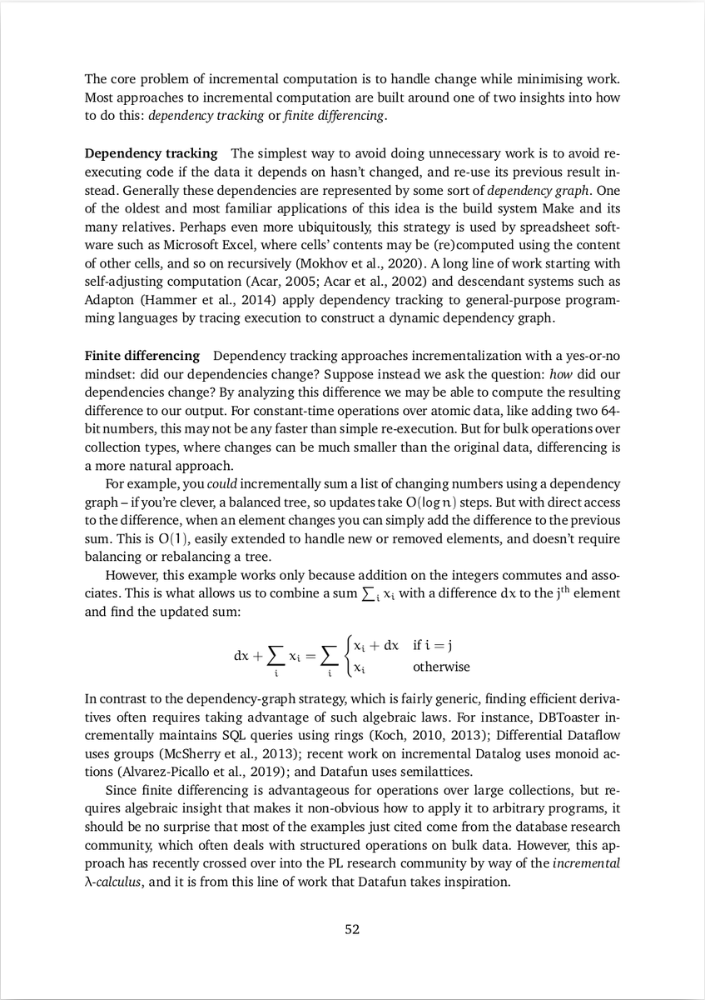
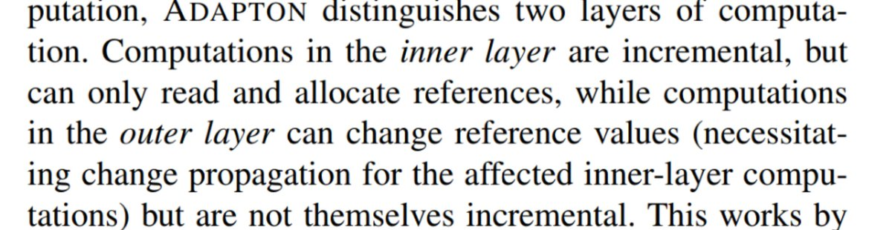

@turgon It’s like the thing where “it was one year of CI! Geez you do one of CI and...”

(Originally on Twitter: [Sat Oct 02 02:52:04 +0000 2021](https://twitter.com/ezyang/status/1444133050523262978))
----
last night i had a dream that skatebirb came with a tiny wireless skateboard which you used with your index and middle fingers to control the game i don't even own skatebirb don't at me

(Originally on Twitter: [Mon Oct 04 23:22:10 +0000 2021](https://twitter.com/ezyang/status/1445167389889466368))
----
@TaliaRinger @moyix I'm waiting for the official postmortem to come out and see

(Originally on Twitter: [Tue Oct 05 12:13:41 +0000 2021](https://twitter.com/ezyang/status/1445361548239769603))
----
that feeling when your yolo fix works first try

(Originally on Twitter: [Tue Oct 05 13:01:03 +0000 2021](https://twitter.com/ezyang/status/1445373469986787342))
----
@yminsky The flow here was directly based off of Phabricator! (which FB uses internally) One of the biggest pain points when developing on GitHub

(Originally on Twitter: [Tue Oct 05 13:35:16 +0000 2021](https://twitter.com/ezyang/status/1445382078258950151))
----
@yminsky ghstack also preserves history, by synthesizing merge commits (which are pushed to GitHub) from the rebased stack. Unfortunately, GitHub UI doesn't surface this all that well (half the time I just rereview from scratch), but it's there if people need it.

(Originally on Twitter: [Tue Oct 05 14:56:04 +0000 2021](https://twitter.com/ezyang/status/1445402413406560266))
----
@MarisaVeryMoe learn cooking

(Originally on Twitter: [Thu Oct 07 01:31:46 +0000 2021](https://twitter.com/ezyang/status/1445924783091224576))
----
We discovered this awesome corp gdocs trick for making docs public even when org policy doesn't allow it and... I have no idea how to spread the word

(Originally on Twitter: [Thu Oct 07 01:54:03 +0000 2021](https://twitter.com/ezyang/status/1445930390577979393))
----
@ReinH touche. i'll just stick it at the bottom of a filing cabinet in a disused lavatory with a sign on the door saying 'Beware of the Leopard.”

(Originally on Twitter: [Thu Oct 07 01:59:11 +0000 2021](https://twitter.com/ezyang/status/1445931682054422533))
----
@josephtlucas That's the problem!!

(Originally on Twitter: [Thu Oct 07 02:52:28 +0000 2021](https://twitter.com/ezyang/status/1445945092053811201))
----
tfw it is too hard for your engineers to not accidentally bump refcounts all the time so you go all in manual memory management in c++ 😱

(Originally on Twitter: [Fri Oct 08 02:57:41 +0000 2021](https://twitter.com/ezyang/status/1446308791033679882))
----
making code run fast is very easy just don't do dumb shit what's the problem

(Originally on Twitter: [Fri Oct 08 03:58:39 +0000 2021](https://twitter.com/ezyang/status/1446324131675394048))
----
@jackinlondon @danluu Based on the thread, the interviewer was probably looking for atomics or lock free algorithms

(Originally on Twitter: [Sun Oct 10 19:59:34 +0000 2021](https://twitter.com/ezyang/status/1447290731702464512))
----
When I do it it’s GRASSROOTS when you do it it’s ASTROTURFING

(Originally on Twitter: [Mon Oct 11 03:44:01 +0000 2021](https://twitter.com/ezyang/status/1447407612862111745))
----
@crdrost @jackinlondon @danluu When you say "virtual time" are you thinking along the lines of "transactional memory"? I don't think it was ignored... it just turned out to be very hard to implement efficiently.

(Originally on Twitter: [Mon Oct 11 17:52:35 +0000 2021](https://twitter.com/ezyang/status/1447621163237117959))
----
@chrisamaphone @wilbowma Personally, I feel like my students are entitled to X number of lectures, and if I don’t do that I haven’t held up my end of the bargain

(Originally on Twitter: [Mon Oct 11 23:37:20 +0000 2021](https://twitter.com/ezyang/status/1447707923929518090))
----
@chrisamaphone @wilbowma Well, I didn’t say this was a necessarily rational take XD

(Originally on Twitter: [Mon Oct 11 23:39:42 +0000 2021](https://twitter.com/ezyang/status/1447708517230579712))
----
@chrisamaphone @wilbowma As a proxy for your actual question: I used to feel “review” classes were just time fillers but students really like them so I have gotten over giving them

(Originally on Twitter: [Mon Oct 11 23:41:08 +0000 2021](https://twitter.com/ezyang/status/1447708880067256322))
----
@chrisamaphone @wilbowma And I nicely asked my uni to let me remote teach again this spring and... I feel a little guilty about it because it probably is a bit worse than in person and maybe I am letting my students down

(Originally on Twitter: [Mon Oct 11 23:43:13 +0000 2021](https://twitter.com/ezyang/status/1447709403193434113))
----
@chrisamaphone For me some of it is a matter of access. Some people I would love to catch up with aren’t on social media in a meaningful way (or if they are, are in a place I don’t know about)

(Originally on Twitter: [Tue Oct 12 12:58:03 +0000 2021](https://twitter.com/ezyang/status/1447909429962330123))
----
RT @johnregehr: ok here's a thorny little semantics problems for the peanut gallery:
for optimization purposes LLVM can assume that malloc…

(Originally on Twitter: [Wed Oct 13 01:57:51 +0000 2021](https://twitter.com/ezyang/status/1448105674517487619))
----
@gparker @johnregehr What if I call malloc to see if the allocation would succeed or not

(Originally on Twitter: [Wed Oct 13 02:00:26 +0000 2021](https://twitter.com/ezyang/status/1448106324781326337))
----
RT @ThomasViehmann: A GIL-less Python thread had me looking and... it is work from @colesbury who has been one of my coding heros in @PyTor…

(Originally on Twitter: [Wed Oct 13 14:39:22 +0000 2021](https://twitter.com/ezyang/status/1448297314989355013))
----
I really like the idea that "strategy" is just "things that your design docs have in common" (from @Lethain)

(Originally on Twitter: [Thu Oct 14 13:03:17 +0000 2021](https://twitter.com/ezyang/status/1448635522151329799))
----
One of the strange things about training performance in deep learning frameworks is that there is so much pipelining going on that latency matters way less than you'd naively expect

(Originally on Twitter: [Fri Oct 15 02:29:06 +0000 2021](https://twitter.com/ezyang/status/1448838314618937347))
----
@jjcarett2 Crosswords?  :o)

(Originally on Twitter: [Sat Oct 16 01:13:57 +0000 2021](https://twitter.com/ezyang/status/1449181787696025603))
----
RT @soumithchintala: PyTorch co-author Sam Gross (@colesbury) has been working on removing the GIL from Python.

Like...we can start using…

(Originally on Twitter: [Sat Oct 16 12:00:46 +0000 2021](https://twitter.com/ezyang/status/1449344565308235777))
----
I just realized that I can truthfully say "I haven't seen a friend in years"

(Originally on Twitter: [Sat Oct 16 23:50:17 +0000 2021](https://twitter.com/ezyang/status/1449523122026262531))
----
Ok OMBY is actually really clever. I wonder if someone has done something similar for Ulysses

(Originally on Twitter: [Sun Oct 17 01:24:48 +0000 2021](https://twitter.com/ezyang/status/1449546906544259074))
----
@TaliaRinger Go to the AD workshop

(Originally on Twitter: [Sun Oct 17 01:26:47 +0000 2021](https://twitter.com/ezyang/status/1449547405859377152))
----
why is moby dick completely unreadable

(Originally on Twitter: [Sun Oct 17 18:54:27 +0000 2021](https://twitter.com/ezyang/status/1449811059762769929))
----
Debug printf is ad hoc abstract interpretation CHANGE MY MIND

(Originally on Twitter: [Tue Oct 19 22:41:14 +0000 2021](https://twitter.com/ezyang/status/1450592908218880004))
----
@kev2d Thanks! We're on winter break right now but will start up again next year!

(Originally on Twitter: [Wed Oct 20 11:47:02 +0000 2021](https://twitter.com/ezyang/status/1450790658919305222))
----
@superdiscoholic Hi Emil! A few thoughts here; first, we are still hiring, so if you are able to, please apply! (I'll DM you on this topic). Second, PyTorch is an OSS project, so that means there are a lot more opportunities to get involved without being a full-timer.

(Originally on Twitter: [Thu Oct 21 01:46:18 +0000 2021](https://twitter.com/ezyang/status/1451001867765420040))
----
@superdiscoholic If you're looking for something easy to dip your toe in to start, the bootcamp label (https://github.com/pytorch/pytorch/issues?q=is%3Aopen+is%3Aissue+label%3A%22module%3A+bootcamp%22) has issues that people think are bite-sized. There isn't too much bandwidth for tutoring people from scratch, but we'll help if you make a convincing attempt

(Originally on Twitter: [Thu Oct 21 01:50:36 +0000 2021](https://twitter.com/ezyang/status/1451002950730539016))
----
@superdiscoholic For more involved projects, I keep a list of promising stuff at https://docs.google.com/document/d/13bBgMqsB34Xfh3qxbB7R_D3p_Wzq_9mI3TuY-Tdtlro/edit?pli=1 although I'll warn that many of the items here are design heavy, so you'll want to get sign off on a prospective design from a core dev before proceeding

(Originally on Twitter: [Thu Oct 21 01:51:38 +0000 2021](https://twitter.com/ezyang/status/1451003213080104962))
----
@superdiscoholic Like many OSS projects, attention from core maintainers is a limited resource, so we can't offer it freely, but many of us do dedicate a substantial portion of our time to helping facilitate contributions from the external community; see if you can plug into it!

(Originally on Twitter: [Thu Oct 21 01:54:19 +0000 2021](https://twitter.com/ezyang/status/1451003886479761410))
----
RT @superdiscoholic: Hey @ezyang I am following you for a while and appreciate the knowledge you share regarding PyTorch internals and desi…

(Originally on Twitter: [Thu Oct 21 01:56:03 +0000 2021](https://twitter.com/ezyang/status/1451004322603540480))
----
@superdiscoholic This is a tricky question! In general there isn't only one person; it depends on the topic, and it can vary over time (for example, I'm on parental leave right now, so no mentoring from me!)

(Originally on Twitter: [Fri Oct 22 01:11:23 +0000 2021](https://twitter.com/ezyang/status/1451355468769673216))
----
@superdiscoholic Because mentorship is also a finite resource, it helps to think in terms of exchanges. For example, say there is a bug and a maintainer says it is valid and would accept a fix. The maintainer exchanges mentorship and shepherding in return for someone actually fixing the bug.

(Originally on Twitter: [Fri Oct 22 01:16:21 +0000 2021](https://twitter.com/ezyang/status/1451356719871889410))
----
@superdiscoholic Similarly, a maintainer may have a divisible project (e.g., OpInfos or structured kernels) that they are in charge of, and have both onboarding docs, prior examples and code review bandwidth for people who want to work on this project.

(Originally on Twitter: [Fri Oct 22 01:17:51 +0000 2021](https://twitter.com/ezyang/status/1451357098235863051))
----
@superdiscoholic Since maintainers tend to busy people I suggest, at least at the start, trying to meet them where they are, and then going from there once there is some relationship

(Originally on Twitter: [Fri Oct 22 01:21:36 +0000 2021](https://twitter.com/ezyang/status/1451358041723621384))
----
@TaliaRinger do you think it is valid to evaluate cost-benefit tradeoff of mentoring an individual (treating mentorship as a means of affecting some positive externality on a group), or is this problematic, e.g. for URMs

(Originally on Twitter: [Fri Oct 22 01:24:22 +0000 2021](https://twitter.com/ezyang/status/1451358738162540550))
----
@TaliaRinger In my TL I had someone asking about how to get mentorship in an OSS project and I found myself writing things like "you need to find how to make the exchange worth it for your mentor" but thinking about it isn't this like super problematic

(Originally on Twitter: [Fri Oct 22 01:26:34 +0000 2021](https://twitter.com/ezyang/status/1451359290514681857))
----
@TaliaRinger Like, isn't this just going to mean that only people who are pushy and can get away with it will get mentoring, isn't that going to cause representation problems

(Originally on Twitter: [Fri Oct 22 01:27:36 +0000 2021](https://twitter.com/ezyang/status/1451359549441679362))
----
@TaliaRinger But what if there is no extrinsic motivation dispensing system 👀🤣

(Originally on Twitter: [Fri Oct 22 01:46:47 +0000 2021](https://twitter.com/ezyang/status/1451364378889031681))
----
RT @dalmaer: This is one of the most impactful things I read when I first saw it at Google: “How orgs are like slime moulds” by the platfor…

(Originally on Twitter: [Sat Oct 23 01:40:17 +0000 2021](https://twitter.com/ezyang/status/1451725130602778634))
----
I am a filthy incrementalist and https://komoroske.com/slime-mold/ explains really well why I feel this way

(Originally on Twitter: [Sat Oct 23 01:42:06 +0000 2021](https://twitter.com/ezyang/status/1451725586628583424))
----
It's like SPEED RUNNING but for the UNITED STATES TAX CODE

(Originally on Twitter: [Sat Oct 23 20:23:16 +0000 2021](https://twitter.com/ezyang/status/1452007736959455236))
----
why is there not a tool for simulating/doing counterfactual analyses of health insurance choices

(Originally on Twitter: [Sun Oct 24 01:48:06 +0000 2021](https://twitter.com/ezyang/status/1452089484472950789))
----
like i'm not asking for much, a literal spreadsheet with enough knobs would probably be good enough

(Originally on Twitter: [Sun Oct 24 01:50:26 +0000 2021](https://twitter.com/ezyang/status/1452090074036936704))
----
@kevinriggle For a quick and dirty number, you could probably simulate this

(Originally on Twitter: [Sun Oct 24 11:47:05 +0000 2021](https://twitter.com/ezyang/status/1452240223128145920))
----
@treetopian You wouldn't ask an ARTIST to work for free, why would you ask an ACTUARY 🧐

(Originally on Twitter: [Sun Oct 24 23:19:02 +0000 2021](https://twitter.com/ezyang/status/1452414358848479233))
----
What's the current state of PL research for incremental programming?

(Originally on Twitter: [Tue Oct 26 15:22:03 +0000 2021](https://twitter.com/ezyang/status/1453019099307679749))
----
@kumbunterland All of it.

(Originally on Twitter: [Tue Oct 26 15:33:42 +0000 2021](https://twitter.com/ezyang/status/1453022030186651651))
----
@MarisaVeryMoe It's also like AD in the sense that it's weird it isn't already everywhere

(Originally on Twitter: [Tue Oct 26 16:57:25 +0000 2021](https://twitter.com/ezyang/status/1453043100084056067))
----
RT @arntzenius: @ezyang I should write a blog post about this. Until I do, here's a list of some projects I'm watching in this area.

The A…

(Originally on Twitter: [Tue Oct 26 17:52:59 +0000 2021](https://twitter.com/ezyang/status/1453057082152964098))
----
@arntzenius Your thesis isn't done yet, right? :)

(Originally on Twitter: [Tue Oct 26 17:55:42 +0000 2021](https://twitter.com/ezyang/status/1453057766151557124))
----
RT @arntzenius: some pages on this topic from my thesis-in-progress 

(Originally on Twitter: [Tue Oct 26 18:18:31 +0000 2021](https://twitter.com/ezyang/status/1453063509290463236))
----
@arntzenius Naive question: you say dependency tracking is a special case of finite differencing. But can it be the other way too? E g. You write your algorithm specially so the dependency graph turns into something finite difference equivalent

(Originally on Twitter: [Tue Oct 26 20:18:13 +0000 2021](https://twitter.com/ezyang/status/1453093630726578176))
----
@matthew44266587 @arntzenius @DrDeeGlaze I'd I had to judge based on recent conf papers, it feels a lot like it's just application papers now

(Originally on Twitter: [Tue Oct 26 20:22:55 +0000 2021](https://twitter.com/ezyang/status/1453094812933148676))
----
@arntzenius Yeah, I guess I'm thinking of a structured way to embed such things, sort of like transactional boosting

(Originally on Twitter: [Tue Oct 26 21:19:29 +0000 2021](https://twitter.com/ezyang/status/1453109048186900487))
----
Hey @jeanqasaur I saw this paper at OOPSLA https://arxiv.org/pdf/2108.04783.pdf which sounds like the kind of thing Akita is doing. Have you seen it / what do you think about it?

(Originally on Twitter: [Tue Oct 26 21:52:42 +0000 2021](https://twitter.com/ezyang/status/1453117406986002432))
----
@TaliaRinger I'm also not a fan of options (PyTorch notably doesn't make any commitment here out of the box), but there doesn't seem to be an easy enough alternative for people to do

(Originally on Twitter: [Tue Oct 26 22:51:19 +0000 2021](https://twitter.com/ezyang/status/1453132161297563657))
----
@TaliaRinger At least one powerful idea is dynamically scoped variables, but honestly their just options 🤣

(Originally on Twitter: [Tue Oct 26 22:54:10 +0000 2021](https://twitter.com/ezyang/status/1453132875956641796))
----
@TaliaRinger A module system also is a big help but because you have to write your code differently there is no onramp, so you're stuck without it (even though Python can do module style abstraction without too much boilerplate)

(Originally on Twitter: [Tue Oct 26 22:58:18 +0000 2021](https://twitter.com/ezyang/status/1453133916840288263))
----
@TaliaRinger Instead of AdamOptimizer you could write adam.Optimizer and then parametrize by replacing adam.

(Originally on Twitter: [Wed Oct 27 00:08:18 +0000 2021](https://twitter.com/ezyang/status/1453151534171176961))
----
@TaliaRinger But you'd probably want first class modules and in Python it's kind of pointless cuz there is no type system so it's literally just dependency injection but no one wants to write their code that way

(Originally on Twitter: [Wed Oct 27 01:20:48 +0000 2021](https://twitter.com/ezyang/status/1453169780370952201))
----
The year is 2021, how long would it take one person full time to implement a reasonably performant SQLite clone from scratch with concurrency and persistence

(Originally on Twitter: [Wed Oct 27 01:28:24 +0000 2021](https://twitter.com/ezyang/status/1453171692994498562))
----
For correctness, it has to pass the proprietary SQLite test suite https://www.sqlite.org/prosupport.html ; for from scratchness, imagine you were going to sell it closed source afterwards

(Originally on Twitter: [Wed Oct 27 01:33:56 +0000 2021](https://twitter.com/ezyang/status/1453173083150458881))
----
@cbarrett You can use whatever language or libraries you want! But you gotta at least scale up to some unspecified number of concurrent connections :)

(Originally on Twitter: [Wed Oct 27 01:37:42 +0000 2021](https://twitter.com/ezyang/status/1453174032560447499))
----
By persistence, if the power on your box cuts out you are not to lose data for any transaction you reported committed

(Originally on Twitter: [Wed Oct 27 01:39:52 +0000 2021](https://twitter.com/ezyang/status/1453174576591032325))
----
@connerver @cbarrett Client server, like MySQL!

(Originally on Twitter: [Wed Oct 27 01:40:42 +0000 2021](https://twitter.com/ezyang/status/1453174788755701760))
----
@stephentyrone Yes!

(Originally on Twitter: [Wed Oct 27 01:41:56 +0000 2021](https://twitter.com/ezyang/status/1453175098094104578))
----
@DrDeeGlaze Should have asked for budget estimates 🤣. The idea here is that if it was one person you could imagine the project coming into existence like someone sufficiently motivayed's OSS hobby

(Originally on Twitter: [Wed Oct 27 01:43:19 +0000 2021](https://twitter.com/ezyang/status/1453175446313607173))
----
And then, my follow up question is: what could we, as academia or industry, do to make this lower?

(Originally on Twitter: [Wed Oct 27 01:45:02 +0000 2021](https://twitter.com/ezyang/status/1453175877995487236))
----
@chewedwire @jckarter @stephentyrone Yup, feature wise, I'm not asking for anything new. You can drop obscure features no one uses too! The point is in the reimplementing

(Originally on Twitter: [Wed Oct 27 01:46:53 +0000 2021](https://twitter.com/ezyang/status/1453176341105455106))
----
@DrDeeGlaze Ok, how about, someone was going to pay market rate for a database expert to work on this (but only one!) How many years would it take to ship. Could also imagine a small (1-3 person) team.

(Originally on Twitter: [Wed Oct 27 01:48:46 +0000 2021](https://twitter.com/ezyang/status/1453176815560822789))
----
@deech Yeah just pay SQLite the money for that 🤣

(Originally on Twitter: [Wed Oct 27 01:49:23 +0000 2021](https://twitter.com/ezyang/status/1453176971521839104))
----
@jeanqasaur @DrDeeGlaze Tomorrow I'm going to do it again but X = filesystem

(Originally on Twitter: [Wed Oct 27 01:50:04 +0000 2021](https://twitter.com/ezyang/status/1453177145791062019))
----
@d_feldman Sure! But the from scratchness requirement means you can't just copy paste SQLite. Also that probably wouldn't work anyway because SQLite isn't client server

(Originally on Twitter: [Wed Oct 27 01:51:30 +0000 2021](https://twitter.com/ezyang/status/1453177503695130629))
----
By concurrency, it should be a client server database like MySQL or PostgreSQL (this also means copy pasting SQLite wouldn't actually work)

(Originally on Twitter: [Wed Oct 27 01:53:42 +0000 2021](https://twitter.com/ezyang/status/1453178059981565953))
----
@jeanqasaur @DrDeeGlaze In fact I also want to ask it for X = IDE, operating system, executable format, display server, video game engine, web rendering engine, deep learning framework, cmake replacement.....

(Originally on Twitter: [Wed Oct 27 01:59:37 +0000 2021](https://twitter.com/ezyang/status/1453179547608834048))
----
@samth Do you think that would actually be enough? (Well ok if someone writes the database crate I guess that would work)

(Originally on Twitter: [Wed Oct 27 02:00:25 +0000 2021](https://twitter.com/ezyang/status/1453179750139236353))
----
@johnregehr Aww, you mean I can't just train a 10T parameter language model how to respond to SQL queries

(Originally on Twitter: [Wed Oct 27 02:02:36 +0000 2021](https://twitter.com/ezyang/status/1453180297919541250))
----
@samth Put differently, what would the relevant libraries be?

(Originally on Twitter: [Wed Oct 27 02:03:41 +0000 2021](https://twitter.com/ezyang/status/1453180571992088583))
----
@stephentyrone Well idk you're allowed to file bug reports to the test suite haha

(Originally on Twitter: [Wed Oct 27 02:05:28 +0000 2021](https://twitter.com/ezyang/status/1453181018618449924))
----
@samth The parser library would definitely help. But it's hard to think about what a good, high level concurrency/disk management library would do, without directly committing you to some particular strategy

(Originally on Twitter: [Wed Oct 27 02:08:25 +0000 2021](https://twitter.com/ezyang/status/1453181761714798592))
----
@arntzenius I'd agree with you that the software I'm describing doesn't exist in OSS. (Your Q does make sense! There are a lot of SQL dialects and for concreteness I had to pick one. SQLite's is relatively simple, as far as things go)

(Originally on Twitter: [Wed Oct 27 02:10:34 +0000 2021](https://twitter.com/ezyang/status/1453182302956175364))
----
@samth Maybe that's the point? But the strategy better be really good then!

(Originally on Twitter: [Wed Oct 27 02:12:14 +0000 2021](https://twitter.com/ezyang/status/1453182724110434313))
----
@sclv Whaddya mean there's tons of malloc replacements (I know that's not what you mean 😛)

(Originally on Twitter: [Wed Oct 27 02:13:31 +0000 2021](https://twitter.com/ezyang/status/1453183045822001152))
----
@danking00 @samth For runtime codegen, would access to an existing JIT style compiler suffice, or would you be looking for more?

(Originally on Twitter: [Wed Oct 27 02:17:36 +0000 2021](https://twitter.com/ezyang/status/1453184070863790082))
----
@sclv More seriously, how much of this could be done by libraries versus needing Rust core language to gain more features?

(Originally on Twitter: [Wed Oct 27 02:18:11 +0000 2021](https://twitter.com/ezyang/status/1453184220180983810))
----
@krismicinski Is there audio on this do I need to get my headphones

(Originally on Twitter: [Wed Oct 27 02:32:56 +0000 2021](https://twitter.com/ezyang/status/1453187933784223745))
----
@jtassarotti @samth @tchajed That's incredible! I've always thought filesystems were perfect for formal verification

(Originally on Twitter: [Wed Oct 27 02:33:44 +0000 2021](https://twitter.com/ezyang/status/1453188132304719873))
----
@bmastenbrook @johnregehr @jckarter @stephentyrone Hey it worked for Sam Gross (well, for N = 2 years anyway)

(Originally on Twitter: [Wed Oct 27 02:36:02 +0000 2021](https://twitter.com/ezyang/status/1453188711961829376))
----
@sclv For a brief period of time in my PhD I wanted to reimplement GHC's runtime system in Rust then I found out it wouldn't work. (Maybe there are some APIs that could be implemented unsafely that would work but RustBelt style APIs are so hard to design)

(Originally on Twitter: [Wed Oct 27 02:37:59 +0000 2021](https://twitter.com/ezyang/status/1453189202082947073))
----
@deech @connerver @cbarrett To be clear, I don't actually need a database 🤣 But I'm really interested in how time to reimplement X big system changes over time, since to me getting this time lower is what can make a lot of interesting reinvention possible

(Originally on Twitter: [Wed Oct 27 02:39:59 +0000 2021](https://twitter.com/ezyang/status/1453189707295305728))
----
@deech @connerver @cbarrett Wait, I missed this memo TELL ME MORE

(Originally on Twitter: [Wed Oct 27 02:42:52 +0000 2021](https://twitter.com/ezyang/status/1453190433434177537))
----
@deech @connerver @cbarrett WAIT STOP THIS IS A JOKE ISN'T IT 🧐

(Originally on Twitter: [Wed Oct 27 02:48:06 +0000 2021](https://twitter.com/ezyang/status/1453191748629454848))
----
@connerver @deech @cbarrett Let X = compiler framework

(Originally on Twitter: [Wed Oct 27 02:48:26 +0000 2021](https://twitter.com/ezyang/status/1453191833924874247))
----
@johnregehr I feel like this is easier to explain via the Java memory model, which doesn't look like hardware memory model and thus is harder to confuse in that way

(Originally on Twitter: [Wed Oct 27 13:37:53 +0000 2021](https://twitter.com/ezyang/status/1453355272047677443))
----
@deech @connerver @cbarrett IMO, though, it hasn't gotten any easier to break past the trough of death that most languages die in

(Originally on Twitter: [Wed Oct 27 14:55:38 +0000 2021](https://twitter.com/ezyang/status/1453374836366061573))
----
@deguerre @connerver Soooo a textbook on MVCC?

(Originally on Twitter: [Wed Oct 27 15:38:06 +0000 2021](https://twitter.com/ezyang/status/1453385524627001352))
----
@boarders__ @sclv I think I started off trying to do the block manager in Rust and immediately ran into the "I can't do the same data structure layout GHC does because it's not borrow checker OK" (I could have gone unsafe but at the time it felt like missing the point)

(Originally on Twitter: [Wed Oct 27 18:43:08 +0000 2021](https://twitter.com/ezyang/status/1453432088917643266))
----
@deguerre @connerver Isn't the problem, though, that old school locking is ruinously complicated to do

(Originally on Twitter: [Wed Oct 27 22:22:18 +0000 2021](https://twitter.com/ezyang/status/1453487245709750274))
----
RT @deguerre: @ezyang @connerver Now that I think about it, the #1 thing that OS vendors could do to help is disk cache sequencing primitiv…

(Originally on Twitter: [Thu Oct 28 02:48:56 +0000 2021](https://twitter.com/ezyang/status/1453554347246239748))
----
@deguerre @connerver I heard you liked databases, so I implemented a database in your kernel

(Originally on Twitter: [Thu Oct 28 02:49:22 +0000 2021](https://twitter.com/ezyang/status/1453554455199223809))
----
@ndm_haskell Did you ever end up exploring the connection between self-adjusting (aka incremental) computation and build systems any more? I was reading the Adapton paper and struck by the fact it was not monadic in the way Shake is

(Originally on Twitter: [Sat Oct 30 03:11:31 +0000 2021](https://twitter.com/ezyang/status/1454284803604365314))
----
Sigh... The secret to adapton (and therefore skiplang) is a god forsaken bidirectional dependency graph 😱

(Originally on Twitter: [Sat Oct 30 03:39:02 +0000 2021](https://twitter.com/ezyang/status/1454291728127696897))
----
@antonycourtney Literal representation, you can find both what any given value uses and what values use it. Latter is the crazy part.

(Originally on Twitter: [Sat Oct 30 12:06:38 +0000 2021](https://twitter.com/ezyang/status/1454419470760480768))
----
@andreymokhov @ndm_haskell Hmm, clearly I don't understand Adapton enough! I was specifically pattern matching off of their statement that the inner language cannot allocate new cells

(Originally on Twitter: [Sat Oct 30 12:55:27 +0000 2021](https://twitter.com/ezyang/status/1454431757021982723))
----
RT @andreymokhov: @ndm_haskell @ezyang Speaking of connections:

I'm now working on an incremental computation library that powers the Dune…

(Originally on Twitter: [Sat Oct 30 12:55:31 +0000 2021](https://twitter.com/ezyang/status/1454431774596112390))
----
@andreymokhov @ndm_haskell That is a good way to put it. It seems to me that if you can do the transitive dirty bit trick that Excel does, it's much more efficient than having to do traces. Makes me wonder about the implications for an inotify based build system!

(Originally on Twitter: [Sat Oct 30 12:56:59 +0000 2021](https://twitter.com/ezyang/status/1454432144617582603))
----
@andreymokhov @ndm_haskell OK. Then would you characterize what Adapton does (which verifies arguments are not the same before recomputing) as trace based? But IIUC they *also* do the transitive dirty bit trick, as a sort of conservative approximation.

(Originally on Twitter: [Sat Oct 30 13:14:37 +0000 2021](https://twitter.com/ezyang/status/1454436579443892225))
----
RT @andreymokhov: @ezyang @ndm_haskell Yes, I'd call Adapton trace based. In fact, I think they use the term "trace" too (?).

It's been a…

(Originally on Twitter: [Sat Oct 30 13:25:51 +0000 2021](https://twitter.com/ezyang/status/1454439408661409796))
----
@andreymokhov @ndm_haskell They do, though it's not totally clear the same thing is meant in both settings

(Originally on Twitter: [Sat Oct 30 13:28:24 +0000 2021](https://twitter.com/ezyang/status/1454440050838618116))
----
@andreymokhov @ndm_haskell Well, I thought the idea in Shake is that you can be monadic in the inner layer. I wonder if nominal Adapton fixed this, haven't read the paper yet. Maybe @matthew44266587 knows

(Originally on Twitter: [Sat Oct 30 13:36:36 +0000 2021](https://twitter.com/ezyang/status/1454442113438031876))
----
@andreymokhov @ndm_haskell @matthew44266587 You know what haha it looks like somewhere in between the original Adapton and nominal Adapton papers they changed their minds and allocations in inner are OK XD 

(Originally on Twitter: [Sat Oct 30 14:09:05 +0000 2021](https://twitter.com/ezyang/status/1454450286819479558))
----
I've always thought Skip http://skiplang.com/ was pretty cool and I have wondered how their incremental computation engine was implemented internally to get such good performance. Thread.

(Originally on Twitter: [Sat Oct 30 15:09:13 +0000 2021](https://twitter.com/ezyang/status/1454465420900159495))
----
But then, they also stick MVCC (https://en.wikipedia.org/wiki/Multiversion_concurrency_control) on top, so that readers can access memoized results while writers are concurrently updating them. That's pretty cool, and not in the academic literature.

(Originally on Twitter: [Sat Oct 30 15:09:14 +0000 2021](https://twitter.com/ezyang/status/1454465425534865414))
----
It turns out that Skip's reactivity is built in two parts: first, they use the Adapton dependency graph algorithm (https://www.cs.umd.edu/~hammer/adapton/adapton-pldi2014.pdf) to keep track of dependencies and invalidate memoized results when their inputs change.

(Originally on Twitter: [Sat Oct 30 15:09:14 +0000 2021](https://twitter.com/ezyang/status/1454465424108699648))
----
Fortunately, Skip is entirely open source. So we can just read the code! But it can sometimes be hard to get into the code without knowing what to expect. Fortunately, Mat Hotstetter wrote a great blog post about how Skip's reactivity works in general http://skiplang.com/blog/2017/01/04/how-memoization-works.html

(Originally on Twitter: [Sat Oct 30 15:09:14 +0000 2021](https://twitter.com/ezyang/status/1454465422577836043))
----
And indeed, the most important data structures for reactivity live here: https://github.com/skiplang/skip/blob/master/src/runtime/native/include/skip/memoize.h There is a lot of interesting stuff in this file.

(Originally on Twitter: [Sat Oct 30 15:09:15 +0000 2021](https://twitter.com/ezyang/status/1454465430236585993))
----
...prelude sounds like Haskell prelude? Probably too high level; native sounds better. And let's look at the C++ headers in include/ for the high level. Now which file should we look at? Memoize sounds relevant...

(Originally on Twitter: [Sat Oct 30 15:09:15 +0000 2021](https://twitter.com/ezyang/status/1454465428894400522))
----
With this high level description in hand, we can try to find where this code actually lives. What I literally did was go to the Skip source code and think "What folder would this be in". src/ seems like a good step; and sure, this would be part of the runtime/ system...

(Originally on Twitter: [Sat Oct 30 15:09:15 +0000 2021](https://twitter.com/ezyang/status/1454465427489316870))
----
There is also careful attention to how locking should be implemented (Skip is concurrent! It's all about MVCC) that I haven't completely internalized yet; and transaction IDs for handling MVCC.

(Originally on Twitter: [Sat Oct 30 15:09:16 +0000 2021](https://twitter.com/ezyang/status/1454465434611240964))
----
So Skip goes through considerable effort to make sure this case can be handled, but is also reasonably fast (no dynamic allocations) when there's only one use of a value: https://github.com/skiplang/skip/blob/d55305b13d3c49322fc70c083a75dde3f1faf7d1/src/runtime/native/include/skip/memoize.h#L119-L140

(Originally on Twitter: [Sat Oct 30 15:09:16 +0000 2021](https://twitter.com/ezyang/status/1454465433181073413))
----
For one, Skip maintains dependency edges both to and from uses of memoized computations. A dependency edge from consumer to producer is pretty normal and easy to encode, but vice versa? There may be arbitrarily many uses of a memoized value!

(Originally on Twitter: [Sat Oct 30 15:09:16 +0000 2021](https://twitter.com/ezyang/status/1454465431784329222))
----
Overall, these headers are well documented. It would be pretty cool if someone could extract out the algorithm here and package it up for general use! It is probably one of the fastest incremental computation engines in open source right now. FIN.

(Originally on Twitter: [Sat Oct 30 15:09:17 +0000 2021](https://twitter.com/ezyang/status/1454465436024774665))
----
@ndm_haskell @antonycourtney But surely not for every object on your heap?!

(Originally on Twitter: [Sat Oct 30 17:21:47 +0000 2021](https://twitter.com/ezyang/status/1454498782121496582))
----
RT @en_JS: @yminsky @ezyang IIRC updates create a new txn and mark entries as stale only. Subsequent reads do a depth-first recheck, re-eva…

(Originally on Twitter: [Sat Oct 30 20:01:58 +0000 2021](https://twitter.com/ezyang/status/1454539095040987141))
----
