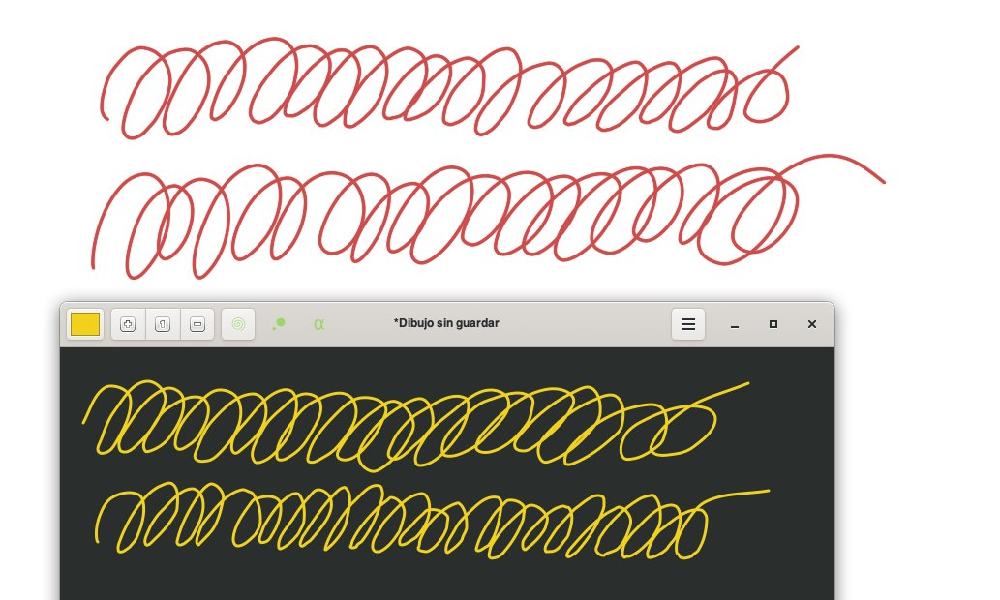
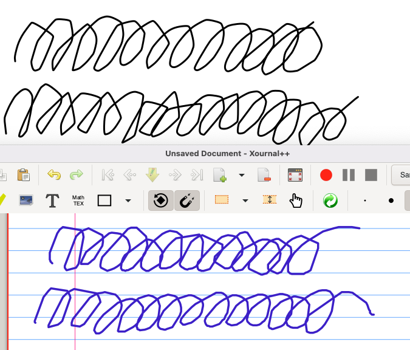
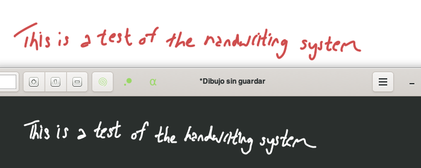
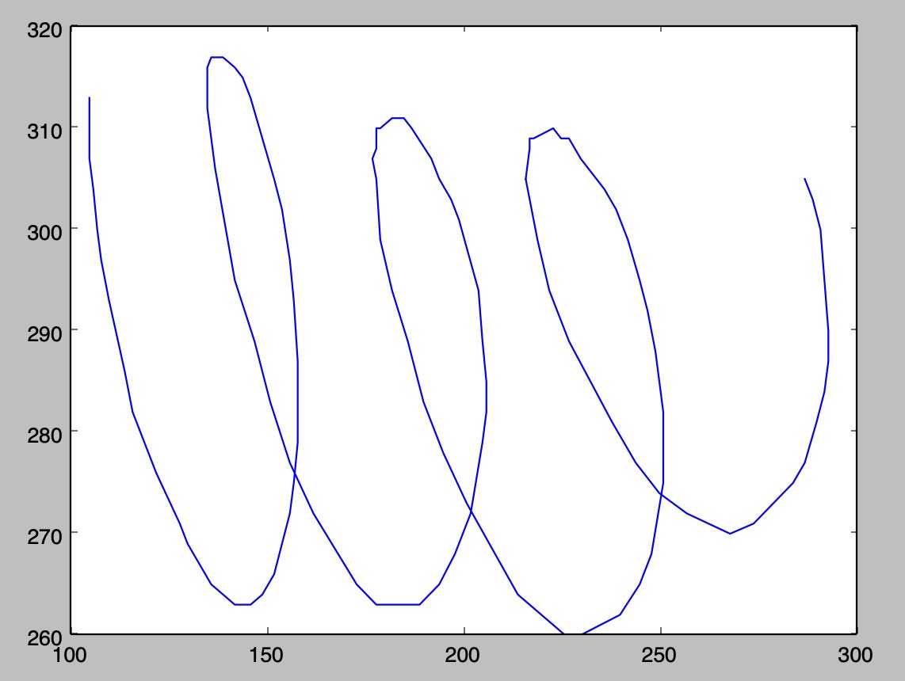
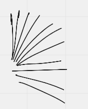

Tfw self-centered actually means “has different values”

(Originally on Twitter: [Thu Dec 02 03:12:08 +0000 2021](https://twitter.com/ezyang/status/1466243761575546886))
----
Mmm chinese idiom stories are fun

(Originally on Twitter: [Fri Dec 03 16:37:09 +0000 2021](https://twitter.com/ezyang/status/1466808738526937091))
----
My CalDigit TS3's headphone port doesn't support the Apple volume controls and this make me sad

(Originally on Twitter: [Sun Dec 05 02:45:34 +0000 2021](https://twitter.com/ezyang/status/1467324238625443845))
----
I think, hypothetically, if I had a 3.5mm Y splitter to wire up both the headphone and microphone ports, maaaaybe this would work? But I don't want to spend $10 to test this out

(Originally on Twitter: [Sun Dec 05 02:53:38 +0000 2021](https://twitter.com/ezyang/status/1467326267666141192))
----
All you online whiteboards who autosmooth pen input WRYYYY (Miro, Figma, I'm looking at you. Excalidraw, good job.)

(Originally on Twitter: [Sun Dec 05 03:15:22 +0000 2021](https://twitter.com/ezyang/status/1467331735784460290))
----
apparently using the old driver and not the new ui one fixes it

(Originally on Twitter: [Sun Dec 05 16:29:13 +0000 2021](https://twitter.com/ezyang/status/1467531515290550273))
----
RT @UrsulaV: So this weekend, armed with a couple of AI art programs, I started noodling around to see what I could do, and if I could put…

(Originally on Twitter: [Mon Dec 06 04:23:39 +0000 2021](https://twitter.com/ezyang/status/1467711309940678658))
----
@deech @ttuegel @hdgarrood You just have to ensure you actually evaluate the exception (in IO). Gotta be clear about when the compute happens

(Originally on Twitter: [Mon Dec 06 13:52:22 +0000 2021](https://twitter.com/ezyang/status/1467854430942998538))
----
figuring out how to get rid of the reverb in my podcast recording room is gonna kill me. only the blanket trick works 😂

(Originally on Twitter: [Tue Dec 07 01:56:59 +0000 2021](https://twitter.com/ezyang/status/1468036787981455360))
----
It’s verry close and I can’t decide if i want to bother with blanket or not

(Originally on Twitter: [Tue Dec 07 02:07:36 +0000 2021](https://twitter.com/ezyang/status/1468039460814307329))
----
@flippac You’d need the true input signal then…

(Originally on Twitter: [Tue Dec 07 02:09:44 +0000 2021](https://twitter.com/ezyang/status/1468039997668352003))
----
@cbarrett @flippac Yeah, unfortunately, reverb from my voice is the thing that I’m trying to kill

(Originally on Twitter: [Tue Dec 07 02:18:40 +0000 2021](https://twitter.com/ezyang/status/1468042242543792136))
----
Boosted

(Originally on Twitter: [Wed Dec 08 21:49:55 +0000 2021](https://twitter.com/ezyang/status/1468699385521397761))
----
@neuralflux That’s cuz I was using a blanket 😂

(Originally on Twitter: [Wed Dec 08 22:58:14 +0000 2021](https://twitter.com/ezyang/status/1468716577562447875))
----
bruh why is this so bad https://programming-idioms.org/idiom/120/read-integer-from-stdin/1906/rust

(Originally on Twitter: [Thu Dec 09 02:19:16 +0000 2021](https://twitter.com/ezyang/status/1468767170582794247))
----
Hmm doing advent of code in rust is kind of pointless isn’t it……

(Originally on Twitter: [Thu Dec 09 03:23:07 +0000 2021](https://twitter.com/ezyang/status/1468783238399373315))
----
@EmmettNeyman None of the code I am writing seems to be exercising the borrow checker in any interesting way

(Originally on Twitter: [Thu Dec 09 03:29:33 +0000 2021](https://twitter.com/ezyang/status/1468784859091025924))
----
@MarisaVeryMoe I’ve only done one day but on the request of my wife I dashed out the Haskell one liner

(Originally on Twitter: [Thu Dec 09 03:30:01 +0000 2021](https://twitter.com/ezyang/status/1468784974610456584))
----
@MarisaVeryMoe It’s ok i never do advent code i just got asked to do some after the baby sleeps

(Originally on Twitter: [Thu Dec 09 03:32:36 +0000 2021](https://twitter.com/ezyang/status/1468785623649726464))
----
@tom_a_r_johnson @EmmettNeyman Oh yea, sorry, this is from the perspective of someone who has written a lot of C++ and Haskell haha

(Originally on Twitter: [Thu Dec 09 13:16:08 +0000 2021](https://twitter.com/ezyang/status/1468932478081683462))
----
So like can you setup a compiler so it only inlines if it exposes a profitable optimization and don't otherwise. Kind like unfold/fold pairs in Coq

(Originally on Twitter: [Thu Dec 09 23:03:59 +0000 2021](https://twitter.com/ezyang/status/1469080415281504258))
----
@pkhuong Well the dream is to build a production grade compiler on top of equality saturation right :)

(Originally on Twitter: [Thu Dec 09 23:26:41 +0000 2021](https://twitter.com/ezyang/status/1469086125713154052))
----
@wilbowma Undecidability undeshmidability

(Originally on Twitter: [Thu Dec 09 23:51:45 +0000 2021](https://twitter.com/ezyang/status/1469092435154382858))
----
@wilbowma That papers an oldie but goodie. But I don’t want heuristics: I want the compiler to actually do the counterfactual analysis on the inlining!

(Originally on Twitter: [Fri Dec 10 00:06:03 +0000 2021](https://twitter.com/ezyang/status/1469096031828774912))
----
@ericson2314_ Totally different!!!

(Originally on Twitter: [Fri Dec 10 01:00:23 +0000 2021](https://twitter.com/ezyang/status/1469109707734405122))
----
Stack graphs reminds me a lot of https://www.cs.utah.edu/plt/scope-sets/

(Originally on Twitter: [Fri Dec 10 02:32:12 +0000 2021](https://twitter.com/ezyang/status/1469132814033604611))
----
@samth Scope graphs get cited from scope sets here! https://www.cs.utah.edu/plt/scope-sets/related.html Though idk if anyone ever did the "further work"

(Originally on Twitter: [Fri Dec 10 02:52:02 +0000 2021](https://twitter.com/ezyang/status/1469137802587738117))
----
@samth Macros seem like they'd be pretty hard for scope graphs to handle. Would doing scope graphs in Racket require running the macros? :/

(Originally on Twitter: [Fri Dec 10 02:56:43 +0000 2021](https://twitter.com/ezyang/status/1469138982676086786))
----
Oh that’s cool the second half of Abbey Road actually does have a name

(Originally on Twitter: [Fri Dec 10 21:23:07 +0000 2021](https://twitter.com/ezyang/status/1469417418007191557))
----
It’s like KICKSTARTER but for PATREON

(Originally on Twitter: [Sat Dec 11 16:44:57 +0000 2021](https://twitter.com/ezyang/status/1469709803350016011))
----
Dependencies are a negative externality and therefore they should be subject to a pigovian tax

(Originally on Twitter: [Sun Dec 12 00:11:19 +0000 2021](https://twitter.com/ezyang/status/1469822134922973184))
----
am i doing this rite

(Originally on Twitter: [Sun Dec 12 00:11:36 +0000 2021](https://twitter.com/ezyang/status/1469822203814457344))
----
Language Foundations have a responsibility to act as regulators for their ecosystems ✊✊✊

(Originally on Twitter: [Sun Dec 12 00:18:21 +0000 2021](https://twitter.com/ezyang/status/1469823905959329796))
----
Realizing I could use anki to memorize passwords..........

(Originally on Twitter: [Sun Dec 12 02:22:36 +0000 2021](https://twitter.com/ezyang/status/1469855174231474180))
----
I should probably actually do this for a few of my important autogenerated ones

(Originally on Twitter: [Sun Dec 12 02:22:57 +0000 2021](https://twitter.com/ezyang/status/1469855261124931584))
----
@jamesr66a This march is how I calculate 120

(Originally on Twitter: [Sun Dec 12 03:50:25 +0000 2021](https://twitter.com/ezyang/status/1469877273201414149))
----
RT @mbravenboer: I had a wonderful time reading https://arxiv.org/abs/2108.02290 (POPL 2022) by @yihongz_bot  et al from UW. It reformulates pattern…

(Originally on Twitter: [Sun Dec 12 04:18:40 +0000 2021](https://twitter.com/ezyang/status/1469884384257921024))
----
@mbravenboer @yihongz_bot Thanks for the tip, I enjoyed it too! What I find interesting is that the encoding involves storing trees in databases and then doing tons of joins but industry mostly decided storing trees relationally was too hard and went NoSQL. Maybe DBs should learn something from egraphs

(Originally on Twitter: [Sun Dec 12 04:22:17 +0000 2021](https://twitter.com/ezyang/status/1469885293541085184))
----
@ClarissaAdjoint We also stopped playing but happy to friend you

(Originally on Twitter: [Sun Dec 12 04:23:15 +0000 2021](https://twitter.com/ezyang/status/1469885534545846280))
----
@mbravenboer @yihongz_bot Also getting huge datalog vibes now

(Originally on Twitter: [Sun Dec 12 04:27:44 +0000 2021](https://twitter.com/ezyang/status/1469886663673491459))
----
How much easier is it to write a relational database if you don’t care about persistence

(Originally on Twitter: [Sun Dec 12 21:54:28 +0000 2021](https://twitter.com/ezyang/status/1470150082934755329))
----
(Is this even useful?)

(Originally on Twitter: [Sun Dec 12 22:14:16 +0000 2021](https://twitter.com/ezyang/status/1470155065788878850))
----
@artiegold You could imagine loading up an externally stored dataset to perform some queries on (amortizing the cost if constructing the database). It could serve as the basis for a datalog or equality saturation implementation. It could be used to speed up programs in interpreted language

(Originally on Twitter: [Sun Dec 12 22:26:36 +0000 2021](https://twitter.com/ezyang/status/1470158168953139209))
----
@ekzhang1 This is definitely what I’m vibing!

(Originally on Twitter: [Sun Dec 12 23:37:33 +0000 2021](https://twitter.com/ezyang/status/1470176025187397635))
----
RT @ekzhang1: @ezyang Probably this isn't exactly what you were thinking about, but:

"What if creating a database would be as cheap as cre…

(Originally on Twitter: [Sun Dec 12 23:54:19 +0000 2021](https://twitter.com/ezyang/status/1470180242484609027))
----
@mihaimaruseac I guess!

(Originally on Twitter: [Mon Dec 13 00:54:50 +0000 2021](https://twitter.com/ezyang/status/1470195474871296000))
----
@mihaimaruseac Though seeing acid in it’s name seems to imply durability which, as I said, I don’t care about

(Originally on Twitter: [Mon Dec 13 00:55:38 +0000 2021](https://twitter.com/ezyang/status/1470195673286991873))
----
I want to do some HCI research on myself with something similar to a keylogger but I'm too scared to actually try any software because of the other very malicious use case for keyloggers :(

(Originally on Twitter: [Mon Dec 13 04:56:55 +0000 2021](https://twitter.com/ezyang/status/1470256394980974593))
----
@pavpanchekha Cool! Not an emacs user but doing something per app is probably the right thing. OOC what did you use your data for? (I’m learning steno and I want to find out what words to prioritize learning)

(Originally on Twitter: [Mon Dec 13 16:20:30 +0000 2021](https://twitter.com/ezyang/status/1470428424036659206))
----
@mathonwy That’s right.

(Originally on Twitter: [Mon Dec 13 22:03:50 +0000 2021](https://twitter.com/ezyang/status/1470514828724908036))
----
Can't order lunch cuz aws is down

(Originally on Twitter: [Wed Dec 15 16:19:27 +0000 2021](https://twitter.com/ezyang/status/1471152937606995971))
----
All I want is a free drawing program on OS X that doesn't record jagged lines, how hard could it be

(Originally on Twitter: [Wed Dec 15 21:40:42 +0000 2021](https://twitter.com/ezyang/status/1471233780589420545))
----
@sigfpe no

(Originally on Twitter: [Fri Dec 17 04:12:15 +0000 2021](https://twitter.com/ezyang/status/1471694708137250825))
----
Big brain: use an animation program to write your slides

(Originally on Twitter: [Sun Dec 19 02:50:30 +0000 2021](https://twitter.com/ezyang/status/1472398907401461764))
----
Someone should implement a drawing program in Rust

(Originally on Twitter: [Sun Dec 19 04:34:40 +0000 2021](https://twitter.com/ezyang/status/1472425125689671681))
----
Twitter tf did you do

(Originally on Twitter: [Sun Dec 19 22:46:07 +0000 2021](https://twitter.com/ezyang/status/1472699798075674627))
----
@miguelraz_ @categulario Is using GTK allowed 😂

(Originally on Twitter: [Mon Dec 20 01:56:13 +0000 2021](https://twitter.com/ezyang/status/1472747637971603464))
----
@categulario Most drawing apps have some basic smoothing for old crappy tablets that gave bad input, but the OS X jaggies seem to stem from event loops that run too slow so OS X drops events cf https://krita.org/en/item/krita-developers-sprint-long-fight-with-jaggy-lines-on-osx/

(Originally on Twitter: [Mon Dec 20 02:00:36 +0000 2021](https://twitter.com/ezyang/status/1472748738368221191))
----
@categulario @miguelraz_ Are you going to add undo 😜

(Originally on Twitter: [Mon Dec 20 02:01:32 +0000 2021](https://twitter.com/ezyang/status/1472748973802860545))
----
@categulario @miguelraz_ Hmm so I built the most recent version, drew a stroke and then did ctrl-z; is there another way to trigger undo?

(Originally on Twitter: [Mon Dec 20 02:13:57 +0000 2021](https://twitter.com/ezyang/status/1472752097410039814))
----
@categulario @miguelraz_ Oh! It's using the GTK convention on Mac, not the Mac convention. Carry on...

(Originally on Twitter: [Mon Dec 20 02:17:58 +0000 2021](https://twitter.com/ezyang/status/1472753111362150404))
----
@categulario I'm happy to report that Pizarra does NOT suffer from the OS X jaggies problem https://gitlab.com/categulario/pizarra-gtk LOL

(Originally on Twitter: [Mon Dec 20 02:21:52 +0000 2021](https://twitter.com/ezyang/status/1472754089557729285))
----
@categulario Well, it looks like you are still paying a little GTK tax. Above are swirlies in Autodesk Sketchbook and below are the swirlies in Pizzara. 

(Originally on Twitter: [Mon Dec 20 02:34:46 +0000 2021](https://twitter.com/ezyang/status/1472757339170254851))
----
@categulario However, it's much better than OpenBoard (top) and Xournal (bottom) 

(Originally on Twitter: [Mon Dec 20 02:36:28 +0000 2021](https://twitter.com/ezyang/status/1472757764539785217))
----
@ihnorton Uhhh how do I use this

(Originally on Twitter: [Mon Dec 20 02:38:15 +0000 2021](https://twitter.com/ezyang/status/1472758213355446280))
----
@categulario It's not very noticeable 

(Originally on Twitter: [Mon Dec 20 02:43:50 +0000 2021](https://twitter.com/ezyang/status/1472759619101544450))
----
@categulario Just gotta watch out if you start adding new features 😂 I wonder if Sketchbook is accepting input events in a separate thread and then asynchronously updating the canvas, they don't seem to drop any events ever

(Originally on Twitter: [Mon Dec 20 02:46:46 +0000 2021](https://twitter.com/ezyang/status/1472760359563968515))
----
so am i dumb or is xcode literally refusing to build my code unless i get a developer signing key 

(Originally on Twitter: [Mon Dec 20 02:56:32 +0000 2021](https://twitter.com/ezyang/status/1472762813785513990))
----
i just want to run the g-d example code from apple's official website is this too much to ask

(Originally on Twitter: [Mon Dec 20 02:57:07 +0000 2021](https://twitter.com/ezyang/status/1472762960602935298))
----
It looks like the xcode project had a malformed developer team and overriding it manually fixed the problem???

(Originally on Twitter: [Mon Dec 20 03:06:15 +0000 2021](https://twitter.com/ezyang/status/1472765262504026112))
----
Interestingly, when I use winit to record mouse position change events, events from my tablet only ever report integral positions, which might be what is causing the jaggies. Is there some other way I'm supposed to capture these inputs... 

(Originally on Twitter: [Mon Dec 20 04:19:59 +0000 2021](https://twitter.com/ezyang/status/1472783814971867136))
----
I wonder if the difference is literally testing for mouse events versus testing for NSTabletPoint events. Guess I'll need to write some actual AppKit code to find out!

(Originally on Twitter: [Mon Dec 20 04:42:29 +0000 2021](https://twitter.com/ezyang/status/1472789478632738818))
----
Macos ecosystem breaks my brain

(Originally on Twitter: [Mon Dec 20 04:50:40 +0000 2021](https://twitter.com/ezyang/status/1472791538396708865))
----
@Idearim Should have paid more attention to my Smalltalk(ahem) Objective C lectures

(Originally on Twitter: [Mon Dec 20 05:13:14 +0000 2021](https://twitter.com/ezyang/status/1472797215764668420))
----
come for the functional programming and borrow checking, stay for the package manager

(Originally on Twitter: [Mon Dec 20 15:32:58 +0000 2021](https://twitter.com/ezyang/status/1472953178295517191))
----
So it turns out the version of the driver I was using only reported integer positions (and the absolute positions were garbage), and upgrading to the newer (but also buggy, in different ways) driver fixed it

(Originally on Twitter: [Mon Dec 20 22:09:31 +0000 2021](https://twitter.com/ezyang/status/1473052973525655556))
----
It continually perplexes me how Sketchbook managed to make things work out, even with the bad driver though :/ :/

(Originally on Twitter: [Mon Dec 20 22:10:07 +0000 2021](https://twitter.com/ezyang/status/1473053122960498701))
----
Native GUI development for command line programmers

(Originally on Twitter: [Tue Dec 21 02:01:14 +0000 2021](https://twitter.com/ezyang/status/1473111288301694978))
----
@dralmaember @nadavrot You say it like it’s a bad thing 😂

(Originally on Twitter: [Tue Dec 21 03:00:31 +0000 2021](https://twitter.com/ezyang/status/1473126206648238081))
----
@hillelogram I felt the “are software engineers engineers” series could have been profitably more verbose, with transcripts/deep dives etc. idk if you feel the same way

(Originally on Twitter: [Tue Dec 21 03:04:08 +0000 2021](https://twitter.com/ezyang/status/1473127116317278210))
----
@hillelogram Like, it felt like it wanted to be a book, not just a few posts

(Originally on Twitter: [Tue Dec 21 03:04:31 +0000 2021](https://twitter.com/ezyang/status/1473127213147037703))
----
So what I've basically done is create a mini Cocoa utility app that just dumps out NSEvents when they happen and now I wonder why nobody has already published this as a thing

(Originally on Twitter: [Wed Dec 22 02:42:52 +0000 2021](https://twitter.com/ezyang/status/1473484152959819776))
----
Oh wait, I know why! I'd have to pay Apple money to distribute this app 🧐

(Originally on Twitter: [Wed Dec 22 02:43:13 +0000 2021](https://twitter.com/ezyang/status/1473484239299559435))
----
Miro y u no antialias correctly 

(Originally on Twitter: [Wed Dec 22 03:07:45 +0000 2021](https://twitter.com/ezyang/status/1473490412832804867))
----
The Miro autosmoothing is not so bad once I fixed my tablet driver 😂 Figma autosmoothing is just bad though, like Inkscape level bad.

(Originally on Twitter: [Wed Dec 22 03:16:42 +0000 2021](https://twitter.com/ezyang/status/1473492664616206336))
----
From Excalidraw. I wonder if this just happens when you don't have convenient GPU acceleration 

(Originally on Twitter: [Wed Dec 22 03:19:57 +0000 2021](https://twitter.com/ezyang/status/1473493483738603520))
----
@Vjeux Mac OS and Chrome on an XP-Pen 15.6 Artist Pro

(Originally on Twitter: [Wed Dec 22 13:26:17 +0000 2021](https://twitter.com/ezyang/status/1473646071524044816))
----
@austinvhuang @christopherdone IMO, there are situations where the best memory management pattern for some pattern is just GC. Whether or not that means you should just not write Rust is unclear, but globally it’s a tool I want to be able to have

(Originally on Twitter: [Wed Dec 22 16:27:04 +0000 2021](https://twitter.com/ezyang/status/1473691569052073984))
----
@tscholak @austinvhuang @christopherdone Things like GC, Perceus or biased reference counting are difficult to introduce as library level concepts and one always wonders how to make these buildable post facto

(Originally on Twitter: [Wed Dec 22 16:56:52 +0000 2021](https://twitter.com/ezyang/status/1473699068010446860))
----
@dluzar @Vjeux Yup the antialiasing. But it’s probably not a tradeoff worth making unless you are rendering in wasm?

(Originally on Twitter: [Wed Dec 22 18:15:40 +0000 2021](https://twitter.com/ezyang/status/1473718898948194307))
----
Should open source libraries have feature flags to prevent experimental functionality being developed on trunk from being accessible by default

(Originally on Twitter: [Wed Dec 22 21:32:46 +0000 2021](https://twitter.com/ezyang/status/1473768500137275399))
----
@dluzar @Vjeux Yup, reproduces here too (tablet is low dpi and it looks bad; regular monitor is high dpi and it's fine)

(Originally on Twitter: [Wed Dec 22 21:39:26 +0000 2021](https://twitter.com/ezyang/status/1473770179859521546))
----
@Vjeux @dluzar Editing in DOM inspector, pixelated doesn't seem to change anything and the other options are not recognized by Chrome

(Originally on Twitter: [Wed Dec 22 22:06:02 +0000 2021](https://twitter.com/ezyang/status/1473776873410867208))
----
@chewxy Should have included an option "trunk based development on libraries with timed release cadence is wrong" lol

(Originally on Twitter: [Wed Dec 22 22:06:30 +0000 2021](https://twitter.com/ezyang/status/1473776990083768325))
----
Was reading http://rachelbythebay.com/w/2021/12/18/log/ and thinking to myself hypothetically if you could have a model checker enforce security policy as you toggle flags that might help in this case

(Originally on Twitter: [Thu Dec 23 02:20:46 +0000 2021](https://twitter.com/ezyang/status/1473840977920110593))
----
@pkhuong Yeah absolutely. And guess who recently published a boolean only flag library 👹

(Originally on Twitter: [Thu Dec 23 02:43:19 +0000 2021](https://twitter.com/ezyang/status/1473846653228662794))
----
@brionv NaN-boxing 🥸

(Originally on Twitter: [Thu Dec 23 23:30:59 +0000 2021](https://twitter.com/ezyang/status/1474160636754022402))
----
@lindsey Sometimes I wonder if I shouldn't just record a lecture series and then save it forever...

(Originally on Twitter: [Fri Dec 24 02:20:23 +0000 2021](https://twitter.com/ezyang/status/1474203268846952451))
----
@lindsey Agreed with you on all counts. I guess another benefit of "giving a lecture" is you automatically refresh the content every year (maybe not much, but the patter is easy enough to change!)

(Originally on Twitter: [Fri Dec 24 02:31:50 +0000 2021](https://twitter.com/ezyang/status/1474206151327850497))
----
How much nerd cred do you get for maintaining an OSS project for over a decade

(Originally on Twitter: [Sat Dec 25 01:31:48 +0000 2021](https://twitter.com/ezyang/status/1474553430270164993))
----
@intractable oh my god i'm old

(Originally on Twitter: [Sat Dec 25 01:45:28 +0000 2021](https://twitter.com/ezyang/status/1474556871163928580))
----
how refreshing it is to have a monitor that isn't high dpi lol

(Originally on Twitter: [Sat Dec 25 03:09:49 +0000 2021](https://twitter.com/ezyang/status/1474578097471115265))
----
kekekeke got Xournal running in VMWare Fusion getting smooth pen input directly from tablet WE ARE IN BUSINESS

(Originally on Twitter: [Sat Dec 25 04:14:29 +0000 2021](https://twitter.com/ezyang/status/1474594370108235778))
----
I was moaning to myself about how Xournal is dead but actually Denis has been plugging away at it a handful of commits every year he just doesn’t bother doing releases anymore 👹

(Originally on Twitter: [Sat Dec 25 05:19:02 +0000 2021](https://twitter.com/ezyang/status/1474610615004155905))
----
sometimes it feels like the trickiest thing about rerunning a course is working out the schedule

(Originally on Twitter: [Sat Dec 25 16:14:16 +0000 2021](https://twitter.com/ezyang/status/1474775512157499404))
----
i was like "why do i not have enough lectures for all the days of class" turns out off by one error THANK GOD

(Originally on Twitter: [Sat Dec 25 19:04:08 +0000 2021](https://twitter.com/ezyang/status/1474818259094581257))
----
The worst thing is when they move you from TR to MW and then you hit a holiday and then everything is slightly offset but you want to ask homework to be due on a consistent day of the week so you have to rejigger everything rrrrrrr

(Originally on Twitter: [Sat Dec 25 19:24:43 +0000 2021](https://twitter.com/ezyang/status/1474823439307481088))
----
Schedule is NAILED

(Originally on Twitter: [Sat Dec 25 19:39:37 +0000 2021](https://twitter.com/ezyang/status/1474827191053688836))
----
Is the future of online university lectures Twitch Livestreams? Discuss 👹

(Originally on Twitter: [Sat Dec 25 20:52:19 +0000 2021](https://twitter.com/ezyang/status/1474845483461976064))
----
@krismicinski @samth OOC what’s your ratio of time spent : published video

(Originally on Twitter: [Sat Dec 25 21:58:38 +0000 2021](https://twitter.com/ezyang/status/1474862174594027525))
----
@lindsey Would you say streaming your lectures on Twitch worth it? (Also, did you ask for permission from the department or just went for it?)

(Originally on Twitter: [Sun Dec 26 01:54:38 +0000 2021](https://twitter.com/ezyang/status/1474921565452177416))
----
RT @lindsey: @ezyang It definitely made teaching more fun! I didn't ask permission in any official way. I asked a couple of people if they…

(Originally on Twitter: [Sun Dec 26 02:23:32 +0000 2021](https://twitter.com/ezyang/status/1474928839608475649))
----
Is there even such a thing as a 3.5mm female to 2 male headphone audio Y splitter adapter that is Apple earbuds compatible 🤔

(Originally on Twitter: [Sun Dec 26 02:41:36 +0000 2021](https://twitter.com/ezyang/status/1474933384912809991))
----
You know how libraries like numpy let you use interpreted languages but run fast because you have compiled implementations of the data structures and kernels I wonder if you can do the same thing with general purpose data structures (like a NoSQL database but more about compute?)

(Originally on Twitter: [Mon Dec 27 17:42:33 +0000 2021](https://twitter.com/ezyang/status/1475522506098368512))
----
@alcides I feel if I am in the business of compiling my interpreted language I have lost the game! (Might as well just use a compiled language then)

(Originally on Twitter: [Mon Dec 27 17:51:11 +0000 2021](https://twitter.com/ezyang/status/1475524675774160902))
----
@alcides Maybe that is the point: to do general computation need an expressive language (numba, SQL) and not just a few library calls (numpy), therefore the task is impossible. But maybe you don’t need a full sublanguage? (SQL)

(Originally on Twitter: [Mon Dec 27 17:53:15 +0000 2021](https://twitter.com/ezyang/status/1475525195540615168))
----
@MDavidHansen @alcides @JuliaLanguage I think the hesitation here is Numpy/SQL are portable in some sense; you could (hypothetically, in the case if Numpy) use them from whatever interpreted language you like, and maybe you have other reasons to prefer one over another. Modularity to ease adoption

(Originally on Twitter: [Mon Dec 27 18:09:53 +0000 2021](https://twitter.com/ezyang/status/1475529383586717701))
----
@alcides Ya. A niche here I’m particularly interested in is immutable data structures (and therefore safe multithreaded access), lots of intermediate allocations, pure computation that can profitably be lazy / incrementalized,

(Originally on Twitter: [Mon Dec 27 18:14:44 +0000 2021](https://twitter.com/ezyang/status/1475530604234035200))
----
@alcides The vibe here is like the IO/pure separation like in Haskell but Bring-You-Own-Language for the IO bits

(Originally on Twitter: [Mon Dec 27 18:16:37 +0000 2021](https://twitter.com/ezyang/status/1475531075770322948))
----
@alcides Yes. Stuff like Perceus, though, can’t be done “just as a library” in typical PLs

(Originally on Twitter: [Mon Dec 27 18:19:43 +0000 2021](https://twitter.com/ezyang/status/1475531855747334150))
----
@SMT_Solvers Yeah arrow is a great example. I used to not really understand the point of it, but I feel it a lot more now

(Originally on Twitter: [Mon Dec 27 18:21:08 +0000 2021](https://twitter.com/ezyang/status/1475532211860480006))
----
@SMT_Solvers @richgel999 Do they have to all target SQL though 😭

(Originally on Twitter: [Mon Dec 27 18:22:23 +0000 2021](https://twitter.com/ezyang/status/1475532528551354372))
----
A SQL engine where SQL queries are just rows in some table. Homoiconicity all over again

(Originally on Twitter: [Mon Dec 27 18:28:03 +0000 2021](https://twitter.com/ezyang/status/1475533954623148038))
----
@alcides Sorry you’re right. Tractable to embed Koka as the sublanguage inside Python; Python-to-Koka references are just the managed references. Too many such refs and the magic is lost though

(Originally on Twitter: [Mon Dec 27 18:31:01 +0000 2021](https://twitter.com/ezyang/status/1475534701003689986))
----
@SMT_Solvers @richgel999 As far as I can tell there aren’t others, besides the researchy direction of dataloggy/functionalish languages

(Originally on Twitter: [Mon Dec 27 18:32:20 +0000 2021](https://twitter.com/ezyang/status/1475535033578438656))
----
@sergueyz Parallelization is another great use case!

(Originally on Twitter: [Mon Dec 27 21:27:43 +0000 2021](https://twitter.com/ezyang/status/1475579168800788488))
----
You want to stop solo maintaining an OSS project which others refer to by name. What should happen to the name when you are done? Should you keep the name and encourage forks to find a new name, or roll the dice on a new maintainer (suppose there is no obvious choice)?

(Originally on Twitter: [Mon Dec 27 21:39:35 +0000 2021](https://twitter.com/ezyang/status/1475582155824812032))
----
RT @pcwalton: Wanted: A survey paper comparing all the memory safety techniques (MTE, software memory tagging, HWASAN, Type-After-Type, Boe…

(Originally on Twitter: [Mon Dec 27 23:28:20 +0000 2021](https://twitter.com/ezyang/status/1475609521783558148))
----
@fnedrik Hmm... No? A direct library style analogy would suggest native C extensions manipulating user defined data structures directly, but such APIs tend to be quite limited

(Originally on Twitter: [Mon Dec 27 23:43:12 +0000 2021](https://twitter.com/ezyang/status/1475613263283073032))
----
@samth @hillelogram Sam, would it be right to say that in your opinion, communicating the imagination is merit worthy

(Originally on Twitter: [Tue Dec 28 18:14:49 +0000 2021](https://twitter.com/ezyang/status/1475893014044282885))
----
Wordle 193 3/6

⬜🟨⬜🟩⬜
🟩🟨🟨🟩⬜
🟩🟩🟩🟩🟩

(Originally on Twitter: [Wed Dec 29 16:10:45 +0000 2021](https://twitter.com/ezyang/status/1476224178038747140))
----
Oh my god the enhanced Qiang text to speech is so worth it.

(Originally on Twitter: [Thu Dec 30 03:45:41 +0000 2021](https://twitter.com/ezyang/status/1476399061892620294))
----
That new language smell when all the ecosystem libraries are less than five years old

(Originally on Twitter: [Thu Dec 30 13:40:31 +0000 2021](https://twitter.com/ezyang/status/1476548759416881165))
----
Reupping this on open source https://apenwarr.ca/log/20211229 h/t @nelhage (though honestly I should just subscribe to apenwarr's blog)

(Originally on Twitter: [Thu Dec 30 16:39:08 +0000 2021](https://twitter.com/ezyang/status/1476593710389469191))
----
@CosmicCatPower @doitwithalambda Shhh enjoy the youthful optimism while it lasts

(Originally on Twitter: [Fri Dec 31 14:45:36 +0000 2021](https://twitter.com/ezyang/status/1476927524341002242))
----
When to stop exploring and start exploiting 😏😏

(Originally on Twitter: [Fri Dec 31 19:09:56 +0000 2021](https://twitter.com/ezyang/status/1476994045411045382))
----
