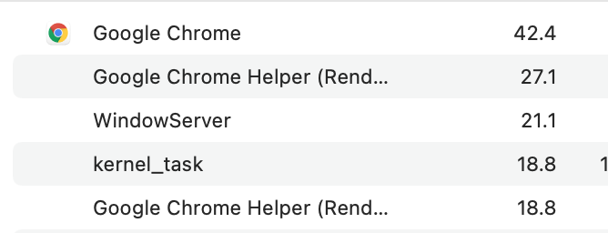

Wordle 196 2/6

⬜🟩⬜🟨⬜
🟩🟩🟩🟩🟩

(Originally on Twitter: [Sat Jan 01 16:19:53 +0000 2022](https://twitter.com/ezyang/status/1477313637689839618))
----
@bubblingbeebles Can u do it optimally 👹

(Originally on Twitter: [Mon Jan 03 01:05:44 +0000 2022](https://twitter.com/ezyang/status/1477808361001435137))
----
@bubblingbeebles Dynamic programming solves it in principle but with a state space of at least 2^26 you gonna have a bad time

(Originally on Twitter: [Mon Jan 03 01:19:06 +0000 2022](https://twitter.com/ezyang/status/1477811725584023555))
----
@bubblingbeebles Greedy optimality might be easier, simply choose the word that maximally reduces entropy no matter what the true word is. This is some gigantic probability expression but it’s probably just quadratic or something

(Originally on Twitter: [Mon Jan 03 01:22:36 +0000 2022](https://twitter.com/ezyang/status/1477812605221806083))
----
@bppcomplete @bubblingbeebles Ok 2^26 is a wild underestimate. The DP table needs to correspond to the game state that effects what words are valid where.

(Originally on Twitter: [Mon Jan 03 04:49:34 +0000 2022](https://twitter.com/ezyang/status/1477864692311891976))
----
@bppcomplete @bubblingbeebles An extremely bad game state would be “which words in dictionary are still possible”. This directly gives entropy but requires 2^(dict size) states

(Originally on Twitter: [Mon Jan 03 04:51:32 +0000 2022](https://twitter.com/ezyang/status/1477865188221243393))
----
@bppcomplete @bubblingbeebles An approximate game state is the coloring of letters. Four colors (unknown, grey, yellow, green) so 4^(alphabet = 26) but this doesn’t account for positional knowledge on the table so it is not optimal. I agree this variant is feasible.

(Originally on Twitter: [Mon Jan 03 04:53:55 +0000 2022](https://twitter.com/ezyang/status/1477865784164638726))
----
@bppcomplete @bubblingbeebles An exact but still naive state is to track the set of possible letters at each square. (2^26)^5. This is too big and it also ignores compression when letters are dead

(Originally on Twitter: [Mon Jan 03 04:56:58 +0000 2022](https://twitter.com/ezyang/status/1477866553974558720))
----
Where is the snow I was promised 😤

(Originally on Twitter: [Mon Jan 03 21:22:12 +0000 2022](https://twitter.com/ezyang/status/1478114494660362241))
----
@NicholasLYang Do you want a history course or a CS course 🙃

(Originally on Twitter: [Tue Jan 04 03:18:29 +0000 2022](https://twitter.com/ezyang/status/1478204157949620230))
----
@NicholasLYang I took some classes in the Dept of History and Philosophy of Science and I really liked the format and wished there was a version for CS, but to do it properly you have to treat it as primarily a history/philosophy course (so, e.g., your HWs are all essays)

(Originally on Twitter: [Tue Jan 04 03:30:57 +0000 2022](https://twitter.com/ezyang/status/1478207295121154048))
----
I was going to eat a chocolate. But then I changed my mind and ate an orange instead

(Originally on Twitter: [Wed Jan 05 02:04:45 +0000 2022](https://twitter.com/ezyang/status/1478547990658826243))
----
UPDATE I HAD THE CHOCO ANYWAY

(Originally on Twitter: [Wed Jan 05 02:09:01 +0000 2022](https://twitter.com/ezyang/status/1478549063100469253))
----
I wonder if for some PRs it would be profitable to attach a screencast to then and if so what should the format be

(Originally on Twitter: [Wed Jan 05 02:46:37 +0000 2022](https://twitter.com/ezyang/status/1478558526322745344))
----
GitHub new style notifications never got an API for itself hisssss

(Originally on Twitter: [Wed Jan 05 03:37:14 +0000 2022](https://twitter.com/ezyang/status/1478571264969252865))
----
@karetnikovn hey at least it segfaulted

(Originally on Twitter: [Wed Jan 05 03:43:29 +0000 2022](https://twitter.com/ezyang/status/1478572835245338624))
----
RT @rakamaric: Is there a good online course on the basics of (software) verification?
Ideally covering things such as SMT solving, weakest…

(Originally on Twitter: [Thu Jan 06 22:16:02 +0000 2022](https://twitter.com/ezyang/status/1479215204969988104))
----
I wish Google wasn't so bad at searching GitHub issues

(Originally on Twitter: [Fri Jan 07 03:00:03 +0000 2022](https://twitter.com/ezyang/status/1479286681190678528))
----
Wordle 202 2/6

🟩⬜⬜⬜⬜
🟩🟩🟩🟩🟩

(Originally on Twitter: [Fri Jan 07 13:25:58 +0000 2022](https://twitter.com/ezyang/status/1479444198088757250))
----
A hobby OSS maintainer, a bigco comes to you and offers a deal: you can get market rate sweng salary to work on your project full time, but (1) you have to stop coding and (2) your project is now ultimately beholden to the company's business interests. Do you take the deal?

(Originally on Twitter: [Fri Jan 07 18:55:26 +0000 2022](https://twitter.com/ezyang/status/1479527110712692736))
----
This is a funny question because I cannot remember the last time I actually wrote a unit test 😂 https://twitter.com/hillelogram/status/1479517994602610692

(Originally on Twitter: [Fri Jan 07 19:27:51 +0000 2022](https://twitter.com/ezyang/status/1479535271389585411))
----
@kristiandotdk You will ostensibly be too busy TLing the team that is actually coding the project

(Originally on Twitter: [Fri Jan 07 21:24:55 +0000 2022](https://twitter.com/ezyang/status/1479564732889812996))
----
@flippac Well let's suppose that they're still going to release all the code open source. So you can take your ball and go home later if you want (assuming the project hasn't grown to be too big for one maintainer at that point)

(Originally on Twitter: [Fri Jan 07 22:17:51 +0000 2022](https://twitter.com/ezyang/status/1479578050014720007))
----
@nathanewest @_seemethere @mdlockyer I get paid to maintain one OSS project and tbh that’s all I have in me

(Originally on Twitter: [Sat Jan 08 00:14:52 +0000 2022](https://twitter.com/ezyang/status/1479607500236369920))
----
@easoncxz But it’s open source they can abuse it anyway 🧐

(Originally on Twitter: [Sat Jan 08 00:25:19 +0000 2022](https://twitter.com/ezyang/status/1479610130756943879))
----
Why is photo postprocessing so horrible

(Originally on Twitter: [Sat Jan 08 01:56:27 +0000 2022](https://twitter.com/ezyang/status/1479633065102225410))
----
@bubblingbeebles @dmvaldman @bppcomplete Yeah the dictionary with a single word AAAAA ;)

(Originally on Twitter: [Sat Jan 08 04:31:04 +0000 2022](https://twitter.com/ezyang/status/1479671975576576004))
----
@plantpollinator I heard everyone is switching to mirrorless so you can used DSLRs on the cheap 😂

(Originally on Twitter: [Sat Jan 08 13:21:11 +0000 2022](https://twitter.com/ezyang/status/1479805383241781249))
----
@TaliaRinger you could have invented ____ (math)

(Originally on Twitter: [Mon Jan 10 01:59:56 +0000 2022](https://twitter.com/ezyang/status/1480358717006749700))
----
Nap or play 🤔

(Originally on Twitter: [Mon Jan 10 19:34:07 +0000 2022](https://twitter.com/ezyang/status/1480624012267073544))
----
@wilbowma It’s a condenser, so have it close to your face and talk at an angle so you don’t get plosives.

(Originally on Twitter: [Tue Jan 11 18:14:38 +0000 2022](https://twitter.com/ezyang/status/1480966396557340676))
----
My work macbook is so sluggish and I hate it and I have no idea how to start debugging it

(Originally on Twitter: [Tue Jan 11 19:58:18 +0000 2022](https://twitter.com/ezyang/status/1480992486352986114))
----
@_saagarjha It's continuous. I notice it most when switching tabs in Chrome, where there is noticeable lag

(Originally on Twitter: [Tue Jan 11 21:38:14 +0000 2022](https://twitter.com/ezyang/status/1481017633835204608))
----
@pl_pierce @krismicinski Luckily for me I'm due for a hardware refresh in a month 😂

(Originally on Twitter: [Tue Jan 11 21:38:47 +0000 2022](https://twitter.com/ezyang/status/1481017770556936192))
----
@mactsouk MBP 16" 2019, with Monterey. I basically only use my browser + terminals on it

(Originally on Twitter: [Tue Jan 11 21:39:26 +0000 2022](https://twitter.com/ezyang/status/1481017933673508872))
----
@_saagarjha It usually looks like this. Not... helpful? 

(Originally on Twitter: [Tue Jan 11 21:40:50 +0000 2022](https://twitter.com/ezyang/status/1481018289211985923))
----
@_saagarjha They're always chugging away at that level of CPU.

(Originally on Twitter: [Tue Jan 11 21:46:06 +0000 2022](https://twitter.com/ezyang/status/1481019613337075715))
----
@_saagarjha I've got some samples but I'm not sure what to do with them lol

(Originally on Twitter: [Tue Jan 11 21:46:34 +0000 2022](https://twitter.com/ezyang/status/1481019730475556866))
----
@_saagarjha This bit seems pretty harmless publicly: https://gist.github.com/ezyang/bb46c9caa54de2e3efda7ee184aceebf IDK if you want the actual traces

(Originally on Twitter: [Tue Jan 11 21:50:40 +0000 2022](https://twitter.com/ezyang/status/1481020761091489795))
----
@kit1980 Ya

(Originally on Twitter: [Wed Jan 12 00:22:23 +0000 2022](https://twitter.com/ezyang/status/1481058943875039236))
----
@elfprince13 @_saagarjha Well I'm not really close to swapping either 

(Originally on Twitter: [Wed Jan 12 00:53:18 +0000 2022](https://twitter.com/ezyang/status/1481066722123726849))
----
@elfprince13 @_saagarjha Isn't this just the OS preemptively paging out memory that isn't used. I have plenty free...

(Originally on Twitter: [Wed Jan 12 01:01:41 +0000 2022](https://twitter.com/ezyang/status/1481068834920574977))
----
@kit1980 This is like a total non-starter 😂

(Originally on Twitter: [Wed Jan 12 01:08:03 +0000 2022](https://twitter.com/ezyang/status/1481070434837843975))
----
@kit1980 It's hard to say but it doesn't feel like switching to laptop only actually helps. I also know I *used* to get acceptable performance with an external monitor (checks notes) a year ago

(Originally on Twitter: [Wed Jan 12 01:11:32 +0000 2022](https://twitter.com/ezyang/status/1481071310939869187))
----
I wonder if I can solve my reverb problem by switching from a condenser mic to a dynamic mic. But what to get 🤔 (for some reason, the only currently approved dynamic mic on Amazon is the Shure MV7B. Uhhhhhh)

(Originally on Twitter: [Wed Jan 12 03:54:47 +0000 2022](https://twitter.com/ezyang/status/1481112394168426500))
----
@pganssle @mkennedy Yeah this one seems legit, in fact I had already put in a request to have this mic added to the approved list.

(Originally on Twitter: [Wed Jan 12 04:37:09 +0000 2022](https://twitter.com/ezyang/status/1481123055556562946))
----
Wordle 207 3/6

⬜⬜🟨⬜⬜
⬜🟨⬜⬜⬜
🟩🟩🟩🟩🟩

(Originally on Twitter: [Wed Jan 12 05:05:00 +0000 2022](https://twitter.com/ezyang/status/1481130066944102400))
----
@kmett Pack it up y’all, time to go home

(Originally on Twitter: [Wed Jan 12 12:39:04 +0000 2022](https://twitter.com/ezyang/status/1481244335404421121))
----
Great, now my MacBook is randomly losing Internet even though ping works and I restarted mdns and changed the DNS server

(Originally on Twitter: [Wed Jan 12 23:11:37 +0000 2022](https://twitter.com/ezyang/status/1481403523568914434))
----
RT @szha_: @ezyang If you are on Monterey and using Cisco's VPN client, it could be the known issue with its system extension that the used…

(Originally on Twitter: [Thu Jan 13 00:32:16 +0000 2022](https://twitter.com/ezyang/status/1481423818338013191))
----
Playing around with postprocessing raw files. Being able to change white balance is so bizonkers. But ouch my mouse hand...

(Originally on Twitter: [Thu Jan 13 03:48:26 +0000 2022](https://twitter.com/ezyang/status/1481473184578916353))
----
@tenderizacion It looks so bad when I do it to jpegs though!

(Originally on Twitter: [Thu Jan 13 05:13:09 +0000 2022](https://twitter.com/ezyang/status/1481494506964979712))
----
Wordle 208 6/6

⬜⬜⬜⬜⬜
🟨⬜🟨🟨⬜
⬜⬜⬜⬜⬜
⬜🟨🟩⬜🟨
⬜🟨⬜🟩⬜
🟩🟩🟩🟩🟩

(Originally on Twitter: [Thu Jan 13 12:34:05 +0000 2022](https://twitter.com/ezyang/status/1481605467625463813))
----
You have an actuarial table that says an activity is 1000 micromorts. You do it a hundred times and on the last time you die. Should the actuarial table be updated.

(Originally on Twitter: [Thu Jan 13 14:22:23 +0000 2022](https://twitter.com/ezyang/status/1481632722598739975))
----
@samth Yeah; I’m supposing you can do the change of unit from EV to probability

(Originally on Twitter: [Thu Jan 13 14:27:22 +0000 2022](https://twitter.com/ezyang/status/1481633979459641345))
----
Did you ss Elon's deleted tweet lol @cHHillee

(Originally on Twitter: [Thu Jan 13 23:26:30 +0000 2022](https://twitter.com/ezyang/status/1481769654284693504))
----
@cHHillee Oh lol it's prolly that one

(Originally on Twitter: [Thu Jan 13 23:38:44 +0000 2022](https://twitter.com/ezyang/status/1481772732513673217))
----
@YassineAlouini @PyTorch It’s already out of date 😂

(Originally on Twitter: [Fri Jan 14 00:23:43 +0000 2022](https://twitter.com/ezyang/status/1481784054139789316))
----
testing streaming setup for classes that are starting soon......

(Originally on Twitter: [Fri Jan 14 02:04:09 +0000 2022](https://twitter.com/ezyang/status/1481809327690338306))
----
I wonder if it really is still worth teaching untyped lambda calculus lol

(Originally on Twitter: [Fri Jan 14 03:32:57 +0000 2022](https://twitter.com/ezyang/status/1481831674811985924))
----
Whelp, looks like my camera can't actually get enough power draw from the usb c cable T.T

(Originally on Twitter: [Fri Jan 14 03:43:06 +0000 2022](https://twitter.com/ezyang/status/1481834231693205505))
----
@samth livestream WHERE

(Originally on Twitter: [Fri Jan 14 03:49:29 +0000 2022](https://twitter.com/ezyang/status/1481835836035547139))
----
RT @adiastra99: The long-awaited Wordle solver post is here! I talk through the surprisingly straightforward idea and implementation that l…

(Originally on Twitter: [Fri Jan 14 05:29:07 +0000 2022](https://twitter.com/ezyang/status/1481860908980879363))
----
Wordle 210 3/6

⬜⬜🟨🟨⬜
⬜⬜⬜🟨⬜
🟩🟩🟩🟩🟩

(Originally on Twitter: [Sat Jan 15 15:44:26 +0000 2022](https://twitter.com/ezyang/status/1482378149702901764))
----
Wordle 211 3/6

⬜⬜⬜⬜🟨
🟩🟩⬜⬜⬜
🟩🟩🟩🟩🟩

(Originally on Twitter: [Sun Jan 16 05:06:33 +0000 2022](https://twitter.com/ezyang/status/1482580006232539139))
----
@TaliaRinger I intentionally pick a different word every day for fun

(Originally on Twitter: [Mon Jan 17 19:24:53 +0000 2022](https://twitter.com/ezyang/status/1483158404248002564))
----
ugh why can't somebody just tell me what the right RAW photo organization strategy is lol

(Originally on Twitter: [Mon Jan 17 20:16:23 +0000 2022](https://twitter.com/ezyang/status/1483171363175256075))
----
As much as everyone hates subscriptions as opposed to permanent licenses, it is a much better proxy for the rivalrous good (ongoing development team support) compared to the non-rivalrous good (the digital bits of the software itself)

(Originally on Twitter: [Tue Jan 18 00:48:09 +0000 2022](https://twitter.com/ezyang/status/1483239757006127104))
----
Maybe free software people would feel better about subscriptions if it was framed in this way? At least, it seems to work pretty well for Krita!

(Originally on Twitter: [Tue Jan 18 00:48:57 +0000 2022](https://twitter.com/ezyang/status/1483239957854572547))
----
Wordle 213 6/6

🟩⬜⬜⬜⬜
⬜🟨🟨⬜⬜
🟩🟩🟩⬜⬜
🟩🟩🟩⬜⬜
🟩🟩🟩⬜⬜
🟩🟩🟩🟩🟩

(Originally on Twitter: [Tue Jan 18 12:25:47 +0000 2022](https://twitter.com/ezyang/status/1483415322195636226))
----
@TaliaRinger Me toooooi

(Originally on Twitter: [Tue Jan 18 12:54:00 +0000 2022](https://twitter.com/ezyang/status/1483422421600321543))
----
Wordle 214 3/6

🟩⬜⬜⬜⬜
⬜🟩⬜🟩🟩
🟩🟩🟩🟩🟩

(Originally on Twitter: [Wed Jan 19 12:40:42 +0000 2022](https://twitter.com/ezyang/status/1483781461660549121))
----
RT @soumithchintala: It’s been 5 years since we launched @pytorch. It’s much bigger than we expected -- usage, contributors, funding. We’re…

(Originally on Twitter: [Wed Jan 19 21:06:37 +0000 2022](https://twitter.com/ezyang/status/1483908781230727173))
----
Wordle 215 4/6

🟨⬜🟨⬜⬜
⬜⬜⬜⬜⬜
🟨🟨🟨🟩⬜
🟩🟩🟩🟩🟩

(Originally on Twitter: [Thu Jan 20 13:20:34 +0000 2022](https://twitter.com/ezyang/status/1484153881730985987))
----
Looks like the word 😂

(Originally on Twitter: [Thu Jan 20 13:20:59 +0000 2022](https://twitter.com/ezyang/status/1484153989067415552))
----
@AChourdia Yeah but it’s… idk kind if boring? It’s like choose your own adventure haha

(Originally on Twitter: [Thu Jan 20 14:53:26 +0000 2022](https://twitter.com/ezyang/status/1484177254355722240))
----
@ev_maus @johnregehr No you misunderstand: the outcome of the grading process is predetermined, but you still have to do it 😂

(Originally on Twitter: [Thu Jan 20 19:24:24 +0000 2022](https://twitter.com/ezyang/status/1484245442225446915))
----
Wordle 216 3/6

⬜⬜⬜⬜⬜
⬜⬜🟩🟨⬜
🟩🟩🟩🟩🟩

(Originally on Twitter: [Fri Jan 21 14:19:23 +0000 2022](https://twitter.com/ezyang/status/1484531072436260865))
----
@knayawp Ikr!

(Originally on Twitter: [Fri Jan 21 16:11:09 +0000 2022](https://twitter.com/ezyang/status/1484559200730718217))
----
Assuming I don't mess it up, I'll be streaming my undergrad NYU class on programming languages at https://www.twitch.tv/edwardzyang The first class is mostly logics and then a trip through JavaScript history, as a way to frame many of the things that will be discussed in the class

(Originally on Twitter: [Sat Jan 22 01:37:32 +0000 2022](https://twitter.com/ezyang/status/1484701736069644288))
----
*logistics. If you want to know what the class will be about, here is the syllabus for this year: https://gist.github.com/ezyang/2fe72ebb73a2c4c348bbe2cac1cbcd32 (short ver: a lot of intro Haskell, and then a bunch of studies on PL concepts in various widely used languages)

(Originally on Twitter: [Sat Jan 22 01:39:40 +0000 2022](https://twitter.com/ezyang/status/1484702272198266885))
----
The class is targeted at CS juniors and seniors; while I assume some level of maturity in programming and computer science, the class tries not to assume too much background knowledge.

(Originally on Twitter: [Sat Jan 22 01:41:05 +0000 2022](https://twitter.com/ezyang/status/1484702628441374723))
----
If you're curious about what NYU students thought about the class, there are some discussions about it which you can find here: https://www.google.com/search?q=site%3Areddit.com%2Fr%2Fnyu+edward+yang&rlz=1C5GCEM_enUS920US920&ei=auzgYaqpB8yt0PEPo5Sz0AQ&ved=0ahUKEwiqhpn7pLD1AhXMFjQIHSPKDEoQ4dUDCA4&uact=5&oq=site%3Areddit.com%2Fr%2Fnyu+edward+yang&gs_lcp=Cgdnd3Mtd2l6EANKBAhBGAFKBAhGGABQWFiYDWCODmgBcAB4AYABlAKIAcQOkgEFMS42LjSYAQCgAQHAAQE&sclient=gws-wiz

(Originally on Twitter: [Sat Jan 22 01:43:32 +0000 2022](https://twitter.com/ezyang/status/1484703245549424642))
----
The labs in the class are pretty interesting and I'll try to figure out a way to publish them for external folks who are following the class. No grading support though: you're on your own ;)

(Originally on Twitter: [Sat Jan 22 01:45:11 +0000 2022](https://twitter.com/ezyang/status/1484703658788933635))
----
@karetnikovn I hope my poor little laptop can handle it XD

(Originally on Twitter: [Sat Jan 22 01:47:37 +0000 2022](https://twitter.com/ezyang/status/1484704270062690304))
----
Many thanks to @lindsey, whose adventures in Twitch streaming emboldened me to try it out on my own class

(Originally on Twitter: [Sat Jan 22 01:51:31 +0000 2022](https://twitter.com/ezyang/status/1484705251592749062))
----
@ccshan MW 4:55pm-6:10pm EST (yes I know it's dumb, I don't make the schedules)

(Originally on Twitter: [Sat Jan 22 02:24:56 +0000 2022](https://twitter.com/ezyang/status/1484713664204746752))
----
ah shoot i need to make sure obs to zoom works correctly haha

(Originally on Twitter: [Sat Jan 22 03:21:42 +0000 2022](https://twitter.com/ezyang/status/1484727948171165696))
----
hmm, it seems like the best thing to do is just have zoom not use obs virtual camera lol

(Originally on Twitter: [Sat Jan 22 03:51:30 +0000 2022](https://twitter.com/ezyang/status/1484735449663000580))
----
@lindsey @karetnikovn I don't see why it shouldn't be possible...

(Originally on Twitter: [Sat Jan 22 04:42:32 +0000 2022](https://twitter.com/ezyang/status/1484748289165643777))
----
@connerver I’ve been thinking about where to go with the podcast when it comes back from break, and streaming is one thought

(Originally on Twitter: [Sat Jan 22 05:00:49 +0000 2022](https://twitter.com/ezyang/status/1484752891156090880))
----
@NeerajPrad No it was just a test haha, forgot I turned on video saving. First lecture on Monday

(Originally on Twitter: [Sat Jan 22 14:20:18 +0000 2022](https://twitter.com/ezyang/status/1484893690061537282))
----
Wordle 218 3/6

⬜⬜🟨🟨⬜
🟨⬜⬜⬜⬜
🟩🟩🟩🟩🟩

(Originally on Twitter: [Sun Jan 23 14:29:44 +0000 2022](https://twitter.com/ezyang/status/1485258451064348678))
----
Wordle 219 4/6 (apparently this one was hard?)

⬜🟨⬜🟨⬜
⬜⬜⬜⬜⬜
🟩🟩🟩⬜⬜
🟩🟩🟩🟩🟩

(Originally on Twitter: [Mon Jan 24 20:59:12 +0000 2022](https://twitter.com/ezyang/status/1485718854613483521))
----
Streaming in less than half an hour! https://twitter.com/ezyang/status/1484701736069644288

(Originally on Twitter: [Mon Jan 24 21:28:04 +0000 2022](https://twitter.com/ezyang/status/1485726118162358274))
----
If you missed it, you can view the VOD here https://www.twitch.tv/videos/1274811806 (lucky too, since technical difficulties meant Zoom didn't get recorded). See you on Wednesday!

(Originally on Twitter: [Tue Jan 25 01:10:27 +0000 2022](https://twitter.com/ezyang/status/1485782080797782019))
----
@sudomaze @marksaroufim And now on YouTube! https://www.youtube.com/watch?v=rEezX1l5V4c

(Originally on Twitter: [Tue Jan 25 01:51:44 +0000 2022](https://twitter.com/ezyang/status/1485792472987021312))
----
Wordle 220 3/6

⬜⬜⬜🟨⬜
⬜🟩⬜🟩⬜
🟩🟩🟩🟩🟩 yes please

(Originally on Twitter: [Tue Jan 25 14:31:58 +0000 2022](https://twitter.com/ezyang/status/1485983792334610432))
----
@TaliaRinger Do you think the 360 is useful?

(Originally on Twitter: [Tue Jan 25 21:22:07 +0000 2022](https://twitter.com/ezyang/status/1486087007600361473))
----
@pcwalton Why was it shot down?

(Originally on Twitter: [Wed Jan 26 14:08:20 +0000 2022](https://twitter.com/ezyang/status/1486340229883740162))
----
@MarisaVeryMoe Seems a bit excessive. Is this including the vendored compiler toolchain lol

(Originally on Twitter: [Wed Jan 26 20:35:17 +0000 2022](https://twitter.com/ezyang/status/1486437609509462021))
----
In just over an hour (4:55PM EST), lecture 2 for my PL class will be streaming at https://www.twitch.tv/edwardzyang ! We'll be doing a crash course in basic Haskell, enough to do this homework: https://github.com/ezyang/pl-class-public/blob/main/projects/01-Basic.hs

(Originally on Twitter: [Wed Jan 26 20:51:27 +0000 2022](https://twitter.com/ezyang/status/1486441679771086858))
----
@michalwols Yup

(Originally on Twitter: [Wed Jan 26 21:08:47 +0000 2022](https://twitter.com/ezyang/status/1486446040073089029))
----
RT @nelhage: Just published a quick newsletter post outlining two reasons (as I understand it) that Kubernetes is such a complex beast. htt…

(Originally on Twitter: [Thu Jan 27 12:56:14 +0000 2022](https://twitter.com/ezyang/status/1486684473903259648))
----
RT @johnregehr: learned inlining policy makes code size ~5% smaller than LLVM's -Oz, over what looks like a pretty sizeable test suite http…

(Originally on Twitter: [Thu Jan 27 14:09:24 +0000 2022](https://twitter.com/ezyang/status/1486702888588128256))
----
Apparently, ghcup is still kind of hard to use on Windows

(Originally on Twitter: [Fri Jan 28 01:39:52 +0000 2022](https://twitter.com/ezyang/status/1486876650411335686))
----
@ericson2314_ Wouldn't it be easier to just tell students to use WSL instead :P

(Originally on Twitter: [Fri Jan 28 02:22:31 +0000 2022](https://twitter.com/ezyang/status/1486887383706578947))
----
Wordle 223 5/6

⬜🟩⬜⬜⬜
🟩⬜⬜⬜🟩
🟩🟩⬜⬜🟩
🟩🟩⬜⬜🟩
🟩🟩🟩🟩🟩

(Originally on Twitter: [Fri Jan 28 12:35:30 +0000 2022](https://twitter.com/ezyang/status/1487041644360867841))
----
Suppose you are transferring data over USB. How many GBs would you expect to have to transfer before some sort of corruption occurs.

(Originally on Twitter: [Sat Jan 29 01:06:30 +0000 2022](https://twitter.com/ezyang/status/1487230639753596933))
----
@mangopdf I mean this is basically what happens when an OSS project silently dies

(Originally on Twitter: [Sun Jan 30 20:30:12 +0000 2022](https://twitter.com/ezyang/status/1487885883667845129))
----
Watching Chinese dramas contort their plots to satisfy the censors is kind of fun

(Originally on Twitter: [Sun Jan 30 23:02:06 +0000 2022](https://twitter.com/ezyang/status/1487924110642581509))
----
@samth @DLeonhardt I wonder what the car crash probability is once you condition on these factors

(Originally on Twitter: [Mon Jan 31 18:11:26 +0000 2022](https://twitter.com/ezyang/status/1488213346218299404))
----
Streaming more Haskell in 10 minutes! https://www.twitch.tv/edwardzyang

(Originally on Twitter: [Mon Jan 31 21:47:08 +0000 2022](https://twitter.com/ezyang/status/1488267631480422400))
----
