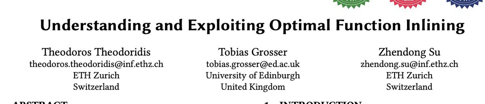

It took reading https://github.com/metareflection/poof for me to understand why calling super() in a class with no parents might actually be a useful thing to do

(Originally on Twitter: [Wed Mar 02 01:50:45 +0000 2022](https://twitter.com/ezyang/status/1498838188865069056))
----
there is too much gd code to write

(Originally on Twitter: [Thu Mar 03 04:14:39 +0000 2022](https://twitter.com/ezyang/status/1499236790531727368))
----
centrifugal pineapple

(Originally on Twitter: [Thu Mar 03 13:51:26 +0000 2022](https://twitter.com/ezyang/status/1499381938980892673))
----
I don't know if it's the new hardware or having to setup everything from scratch but my new macbook is sooooo fast

(Originally on Twitter: [Wed Mar 09 19:03:18 +0000 2022](https://twitter.com/ezyang/status/1501634751270109189))
----
@srmsoumya yes it is

(Originally on Twitter: [Wed Mar 09 19:11:08 +0000 2022](https://twitter.com/ezyang/status/1501636721930346499))
----
@srmsoumya jokes on you, I only use my macbook to browse the web and ssh into machines 😂

(Originally on Twitter: [Wed Mar 09 19:17:52 +0000 2022](https://twitter.com/ezyang/status/1501638419641995272))
----
Vibing “program transformations by symbolically executing an interpreter” (send me papers!)

(Originally on Twitter: [Sat Mar 12 05:27:54 +0000 2022](https://twitter.com/ezyang/status/1502516712675188740))
----
@sigfpe It took me longer than I'd like to admit to realize that Jax is a stack of interpreters haha

(Originally on Twitter: [Sat Mar 12 12:43:01 +0000 2022](https://twitter.com/ezyang/status/1502626213684301824))
----
@francoisfleuret @PyTorch Vmap transform can be done locally so we do it on the fly as we eagerly execute. Actually, JAX does the same thing too!

(Originally on Twitter: [Sat Mar 12 14:43:33 +0000 2022](https://twitter.com/ezyang/status/1502656548404871175))
----
RT @sigfpe: @ezyang I don't know if this fits what you're looking for but it's an example of transforming an effect interpreter into an eff…

(Originally on Twitter: [Sat Mar 12 18:35:38 +0000 2022](https://twitter.com/ezyang/status/1502714953698009091))
----
@sigfpe Yup, this is exactly the kind of thing I'm thinking about

(Originally on Twitter: [Sat Mar 12 18:36:10 +0000 2022](https://twitter.com/ezyang/status/1502715085617307659))
----
@francoisfleuret @PyTorch Probably adding a higher order "if" combinator 🤣 We are still dithering on this point

(Originally on Twitter: [Sat Mar 12 18:36:56 +0000 2022](https://twitter.com/ezyang/status/1502715281063530502))
----
RT @ccshan: @ezyang Of course from Futamura to Lawall &amp; Danvy LFP 1994

(Originally on Twitter: [Sat Mar 12 18:43:59 +0000 2022](https://twitter.com/ezyang/status/1502717052821426177))
----
@ccshan Futamura projections and Continuation based partial evaluation, do I get you right? There seems to be some recent stuff with people revisiting these ideas with algebraic effects

(Originally on Twitter: [Sat Mar 12 18:50:59 +0000 2022](https://twitter.com/ezyang/status/1502718817407021067))
----
@sigfpe One thing I've noticed while we worked on functorch is that you often can get away with not reifying the AST, sort of tagless interpreter style, which is good if you're trying to also support reasonably efficient eager mode

(Originally on Twitter: [Sat Mar 12 18:55:33 +0000 2022](https://twitter.com/ezyang/status/1502719965652213779))
----
@francoisfleuret @PyTorch Could always do it with thermometer continuations instead @jimmykoppel

(Originally on Twitter: [Sat Mar 12 18:56:24 +0000 2022](https://twitter.com/ezyang/status/1502720176902529028))
----
@froystig @sigfpe It seems to me that if you can, you should always prefer the latter style!

(Originally on Twitter: [Sat Mar 12 19:22:51 +0000 2022](https://twitter.com/ezyang/status/1502726837318918150))
----
@froystig @sigfpe I find this is one of the most interesting differences between PyTorch and JAX autograd. JAX stages out while PyTorch manually implements the tape. No diff if you trace through; it's an implementation complexity vs efficiency tradeoff.

(Originally on Twitter: [Sat Mar 12 19:40:37 +0000 2022](https://twitter.com/ezyang/status/1502731307532668931))
----
@froystig @sigfpe PyTorch double backwards also occupies a weird alternative design niche, where instead of stacking AD transforms you shove everything on the same tape and it works out (sort of like macros which expand to more occurrences of themselves)

(Originally on Twitter: [Sat Mar 12 19:42:44 +0000 2022](https://twitter.com/ezyang/status/1502731838510534656))
----
@froystig @sigfpe Separately, it makes me wonder if you can take the compiler (JAX style stage out), and automatically transform it into an efficient interpreter

(Originally on Twitter: [Sat Mar 12 19:44:14 +0000 2022](https://twitter.com/ezyang/status/1502732215041597453))
----
JAX transforms done with Python mixins is awkward: (1) self.add(x,y) is footgun (typically want Class.add(self,x,y)), (2) base dedupe means you need to clone classes; encapsulating clones from each other is awkward

(Originally on Twitter: [Sun Mar 13 16:45:51 +0000 2022](https://twitter.com/ezyang/status/1503049712806604805))
----
Is there a way to write Python in a traditional text editor and then convert it into a Colab notebook?

(Originally on Twitter: [Mon Mar 14 01:23:39 +0000 2022](https://twitter.com/ezyang/status/1503180019836891136))
----
Interested in how functorch works? Check out Simple Functorch https://github.com/albanD/subclass_zoo/blob/main/simple_functorch.ipynb an implementation of functorch entirely in Python. (With a lot of inspiration from https://jax.readthedocs.io/en/latest/autodidax.html)

(Originally on Twitter: [Tue Mar 15 20:30:03 +0000 2022](https://twitter.com/ezyang/status/1503830910646509571))
----
Gotten to the point where 1:1s are not scaling for me anymore. Need to find another way to do this lol.

(Originally on Twitter: [Tue Mar 15 21:22:57 +0000 2022](https://twitter.com/ezyang/status/1503844221106667539))
----
@SingularMattrix @froystig @sigfpe It’s gone into detail in Simple Functorch, but the short version is traditional PyTorch AD only ever has one tape no matter how many backwards you run, and I /think/ JAX ends up with multiple tapes (at least functorch does)

(Originally on Twitter: [Wed Mar 16 03:38:41 +0000 2022](https://twitter.com/ezyang/status/1503938780327301124))
----
@SingularMattrix @froystig @sigfpe It’s possible this is a misunderstanding though, because jaxprs are an initial representation that can get transformed over, whereas PyTorch tape are finally tagless callables; higher order still breaks my brain

(Originally on Twitter: [Wed Mar 16 03:43:36 +0000 2022](https://twitter.com/ezyang/status/1503940018670391296))
----
black black black is the color of my true formatter's hair

(Originally on Twitter: [Wed Mar 16 19:32:39 +0000 2022](https://twitter.com/ezyang/status/1504178852993642502))
----
I guess one problem with juniors doing glue work is if the overall project succeeds credit doesn’t accrue to you; but if you are senior it does. So seniors can do glue work with worrying about accounting for every little influence because they are already on the hook for overall

(Originally on Twitter: [Wed Mar 16 22:27:52 +0000 2022](https://twitter.com/ezyang/status/1504222947212500997))
----
RT @johnregehr: Understanding and Exploiting Optimal Function Inlining
https://dl.acm.org/doi/pdf/10.1145/3503222.3507744 

(Originally on Twitter: [Thu Mar 17 18:59:56 +0000 2022](https://twitter.com/ezyang/status/1504533007574745090))
----
@johnregehr Alright time for someone to train a model on it :3

(Originally on Twitter: [Thu Mar 17 19:00:09 +0000 2022](https://twitter.com/ezyang/status/1504533060355862533))
----
"It's easy when you know what to do"

(Originally on Twitter: [Thu Mar 17 22:21:47 +0000 2022](https://twitter.com/ezyang/status/1504583802919993345))
----
YESSS dynamic mic solved my reverb problems (bye bye condensor, you had a good run)

(Originally on Twitter: [Sat Mar 19 01:47:07 +0000 2022](https://twitter.com/ezyang/status/1504997866548436998))
----
In Haskell, given a function you can have the type checker infer the most general type signature for it, or you can explicitly give a polymorphic signature and check if you assumed more constraints. Is there a fancier name for this second process than just "checking"?

(Originally on Twitter: [Sat Mar 19 02:04:16 +0000 2022](https://twitter.com/ezyang/status/1505002183972069376))
----
I guess, another way to put it is, what vocabulary distinguishes an assert that says "this should be provable from the context" versus an assert that's "I have some external knowledge that this is true and you should rely on it"

(Originally on Twitter: [Sat Mar 19 02:40:46 +0000 2022](https://twitter.com/ezyang/status/1505011368411467780))
----
RT @flippac: @ezyang In concurrent constraint systems those are ~ask and tell constraints?

(except making it fail at all takes a tell)

Th…

(Originally on Twitter: [Sat Mar 19 12:31:18 +0000 2022](https://twitter.com/ezyang/status/1505159978604240903))
----
It is incredible the depths of subtyping people will go through to avoid defining a quantifier or variable

(Originally on Twitter: [Sat Mar 19 20:47:38 +0000 2022](https://twitter.com/ezyang/status/1505284884952137743))
----
@pavpanchekha Do you think Herbie would make sense for people working in low precision like float16 or bfloat16

(Originally on Twitter: [Sun Mar 20 18:21:45 +0000 2022](https://twitter.com/ezyang/status/1505610561941544962))
----
Cc @cHHillee who was asking about this

(Originally on Twitter: [Sun Mar 20 18:22:09 +0000 2022](https://twitter.com/ezyang/status/1505610662613065732))
----
So I tried two versions of Ubuntu in VMWare Fusion on M1 and neither of them worked. So what's a good Linux distro for running on M1?

(Originally on Twitter: [Mon Mar 21 02:11:23 +0000 2022](https://twitter.com/ezyang/status/1505728747873439744))
----
@crcrpar They seem targeted at bare metal install, which is too much commitment for me right now haha

(Originally on Twitter: [Mon Mar 21 02:17:59 +0000 2022](https://twitter.com/ezyang/status/1505730408390008834))
----
@TaliaRinger Idk language implementors seem pretty scared of polymorphism too

(Originally on Twitter: [Mon Mar 21 12:50:43 +0000 2022](https://twitter.com/ezyang/status/1505889641731395588))
----
@donsbot This worked!

(Originally on Twitter: [Mon Mar 21 14:47:56 +0000 2022](https://twitter.com/ezyang/status/1505919141101936645))
----
I just realized notebooks are literally literate programming but with outputs too 😂

(Originally on Twitter: [Tue Mar 22 02:46:42 +0000 2022](https://twitter.com/ezyang/status/1506100022676529155))
----
@ccshan In the sense that notebooks are typically not programs? But they can be, and usually end up in a literal style if they are

(Originally on Twitter: [Tue Mar 22 11:19:55 +0000 2022](https://twitter.com/ezyang/status/1506229178709991430))
----
Recording for PyTorch Dev Podcast season 2 has begun!!!

(Originally on Twitter: [Wed Mar 23 02:36:37 +0000 2022](https://twitter.com/ezyang/status/1506459875244716034))
----
Incorrectness logic is fun, it’s like a weird funhouse mirror version of Hoare Logic

(Originally on Twitter: [Wed Mar 23 13:15:41 +0000 2022](https://twitter.com/ezyang/status/1506620700735545347))
----
Twitch streaming lecture on the environment model for scope in JavaScript in an hour! https://www.twitch.tv/edwardzyang

(Originally on Twitter: [Wed Mar 23 20:12:23 +0000 2022](https://twitter.com/ezyang/status/1506725567168749569))
----
could it be that project management is about surfacing both the stated and revealed preferences for goals and reconciling when they differ in an important way

(Originally on Twitter: [Fri Mar 25 15:23:05 +0000 2022](https://twitter.com/ezyang/status/1507377537848156160))
----
RT @hgoldstein95: Do you or someone you know do property-based testing in Python?

I'm looking for folks who have used Hypothesis in an ind…

(Originally on Twitter: [Wed Mar 30 12:17:59 +0000 2022](https://twitter.com/ezyang/status/1509142896930398214))
----
